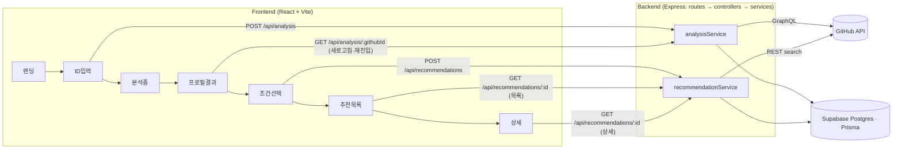

# 아키텍처

> 백엔드 개발 시작 시 작성 예정

## 전체 구조
화면(FE) → API 라우트 → 서비스 레이어 → GitHub API / Supabase(Prisma)까지의 전체 연결과 API 경로를 한 장으로 표현.



> DB 테이블(`analyses`/`repo_cache`/`issue_cache`/`recommendations`/`recommendation_items`/`api_usage`) 세부 역할은 아래 "데이터 흐름" 참고.

## 프론트엔드

### 폴더 구조 및 레이어링
```
frontend/src/
  App.jsx               # 라우트 정의 (react-router-dom)
  api/index.js           # axios 클라이언트 — analysis/recommendations 호출 함수
  components/
    Landing.jsx           # 화면 1: 랜딩 (레이아웃 밖, 스텝퍼 없음)
    AppFlowLayout.jsx      # 공통 레이아웃 — 스텝퍼, 뒤로가기, 화면 간 공유 상태
    IdInput.jsx            # 화면 2: GitHub ID 입력
    Analyze.jsx             # 화면 3: 분석중 (analysis useMutation)
    Profile.jsx              # 화면 4: 프로필 결과 + 선호조건 칩
    IssueSearch.jsx           # 화면 5: 조건 확인 + 추천 생성(recommendation useMutation)
    Result.jsx                 # 화면 6: 추천 목록
    Detail.jsx                  # 화면 7: 상세 (+ 이슈 LLM 분석 지연 조회)
    icons.jsx                   # 아이콘 컬렉션 (named export)
  utils/
    format.js               # 별표 수 등 표시값 포맷팅
    preferences.js           # 선호조건 기본값/정규화(buildDefaultPreferences)
```
- 화면 1개 = 컴포넌트 파일 1개, `components/`에 평면 배치 (하위 폴더 분리는 아직 불필요할 만큼 규모가 작음)
- 라우팅: `/`(Landing) + `AppFlowLayout` 하위에 `/input`·`/analyze`·`/profile`·`/search`·`/result`·`/detail` (`App.jsx`)

### 상태 관리 방식
- **화면 간 공유 상태**: 별도 전역 스토어(Redux 등) 없이 `AppFlowLayout`의 `useState` 5개(`githubId`/`analysis`/`preferences`/`recommendation`/`selectedItem`)를 `<Outlet context={...}>`로 하위 라우트에 전달, 각 화면은 `useOutletContext()`로 읽고 쓴다.
- **서버 상태(API 호출)**: `@tanstack/react-query`의 `useMutation`으로 관리 (`Analyze`의 분석 요청, `IssueSearch`의 추천 생성 요청) — 로딩/에러 상태를 훅이 제공해 수동 `useEffect`+`cancelled` 패턴을 대체.

## 백엔드

### 폴더 구조 및 레이어링
```
backend/
  app.js                  # 앱 조립: helmet/cors/express.json, 라우트 마운트, openapi swagger-ui(/api-docs), errorHandler
  server.js                # 부팅 (app.listen)
  prisma/
    schema.prisma           # 테이블 정의 (아래 "데이터베이스 구조" 참고)
    migrations/              # prisma migrate dev 로 생성된 마이그레이션 히스토리
  src/
    config/                   # Prisma Client 싱글턴, GitHub 클라이언트, 환경 상수
    routes/                    # 경로 + 미들웨어 연결 (xxxRoutes.js)
    controllers/                # req/res 처리, 입력 검증, HTTP 응답 포맷팅
    services/                    # 비즈니스 로직 + DB/GitHub 접근 (analysisService/recommendationService/githubService/llmService/apiUsageService)
    middlewares/                  # errorHandler (notFound + 공통 에러 응답)
    utils/                         # logger(winston), validators
```
- `routes → controllers → services` 레이어드 아키텍처. Route에는 로직 없음, Controller는 `req`/`res`만 다루고 비즈니스 로직은 Service에 위임.

### 데이터베이스 구조
Supabase Postgres + Prisma, 모델 6개:
- **`Analysis`**(`analyses`) — `githubId` unique. `languages`/`activitySummary`/`recentRepos`/`contributionHistory`는 Json. `analyzedAt`으로 캐시 신선도 판단(POST 시 24h, GET 재조회 시 7일).
- **`RepoCache`**(`repo_cache`) / **`IssueCache`**(`issue_cache`) — GitHub 레포·이슈 메타 캐시(rate limit 대응). `IssueCache`는 LLM 이슈 분석 필드(`issueSummary`/`requiredSkills`/`guide`/`analyzedAt`)를 별도로 갖고, 이 필드들은 TTL 없이 **성공한 분석 결과만** 영구 저장(실패는 저장하지 않고 다음 조회 시 재시도).
- **`Recommendation`**(`recommendations`) — 요청 시점 `preferences` 스냅샷 저장, `RecommendationItem`(`recommendation_items`)과 1:N.
- **`RecommendationItem`**(`recommendation_items`) — 목록/상세 응답 필드를 통째로 스냅샷 저장(캐시 만료와 무관하게 재조회 가능해야 하므로), `position`으로 정렬 순서 고정.
- **`ApiUsage`**(`api_usage`) — GitHub 토큰별 일별 호출량 집계 (`tokenKey` + `date` unique).
- **`Favorite`**(`favorites`) — 즐겨찾기(`githubId`+`repoFullName`+`issueNumber` unique). 로그인 없이 기존 설계와 동일하게 githubId 문자열 기준.

## 인프라 / 배포
- **프론트**: GitHub Pages, `kimsunho2000.github.io/hub/` (`npm run deploy` → `gh-pages`). `vite.config.js`의 `base: '/hub/'` + `HashRouter`로 하위 경로·새로고침 404 문제 회피(`main.jsx` 참고).
- **백엔드**: Render, 루트 `render.yaml` 블루프린트로 정의(`rootDir: backend`, 헬스체크 `/health`). `DATABASE_URL`/`GITHUB_TOKEN`/`GEMINI_API_KEY`는 Render 대시보드에서 직접 입력하는 시크릿(레포에 값 없음), `CORS_ORIGIN`은 프론트 origin(`https://kimsunho2000.github.io`)으로 고정. 빌드 커맨드(`npm install && npx prisma generate && npm test`)에 백엔드 테스트를 끼워 넣어 **테스트 게이트** 역할을 함 — `.github/workflows`(대회 운영용 auto-merge 봇, 손대지 않음)를 안 건드리고도 "테스트 실패 시 배포 안 나감"을 만족시키는 방법.
- **자동 배포**: 백엔드는 Render의 Auto-Deploy(대시보드 설정)로 `N034_김선호` 브랜치 push 시 자동 재배포됨. 프론트(GitHub Pages)는 자동화하려면 GitHub Actions가 필요한데 `.github/workflows`를 건드릴 수 없어 수동(`npm run deploy`)으로 유지.
- **DB**: 로컬 개발과 배포 환경이 같은 Supabase Postgres 인스턴스를 공유한다(별도 프로덕션 DB 없음) — 마이그레이션은 로컬에서 `prisma migrate dev`로 적용된 상태 그대로 사용, 배포 빌드에서 별도 migrate 스텝을 돌리지 않는다.
- **프론트↔백엔드 연결**: Vite 환경변수는 빌드 시점에 번들에 박히므로, 백엔드 배포 URL이 정해진 뒤 `frontend/.env.production`에 `VITE_API_BASE_URL`을 채우고 프론트를 재배포해야 한다.
- **CI**: 없음 — `.github/workflows/`는 대회 운영용 auto-merge 봇뿐이라 별도로 건드리지 않음(`docs/testing.md` 참고). 테스트는 로컬/수동 실행(`npm run test:backend`, `npm run test:e2e`).

## API 명세 (확정 2026-07-13)

> 전체 명세(필드·타입·에러·example)는 **[openapi.yaml](openapi.yaml)** 이 단일 진실 소스.
> 서버 착수 후 `swagger-ui-express`로 `/api-docs`에 서빙 예정. FE mock JSON은 openapi.yaml의 example에서 복사한다.

| 메서드 | 경로 | 설명 | 주요 응답 |
| --- | --- | --- | --- |
| POST | `/api/analysis` | 프로필 분석 실행(동기) + 캐시 저장. 신선한 캐시(24h 이내)면 재사용 | `200` Analysis |
| GET | `/api/analysis/:githubId` | 분석 캐시 조회 (프로필 화면 새로고침/재진입). 7일 이내면 그대로, 7일 초과면 재분석 후 갱신 | `200` Analysis / `404 ANALYSIS_NOT_FOUND` |
| POST | `/api/recommendations` | 추천 생성+저장. 재조회/필터링은 조건 바꿔 재 POST | `200` Recommendation (빈 결과는 `items: []`) |
| GET | `/api/recommendations/:id` | 저장된 추천 재조회 (목록·상세 새로고침 공용) | `200` Recommendation / `404` |
| GET | `/health` | 서버 상태 확인 | `200 { status: "ok" }` |

### 공통 에러 형식
```json
{ "error": { "code": "VALIDATION_ERROR", "message": "githubId는 필수 입력값입니다." } }
```
- `400 VALIDATION_ERROR` — 필수값 누락·형식 오류
- `404 USER_NOT_FOUND` — 존재하지 않는 GitHub 사용자 (GitHub 404 매핑)
- `404 ANALYSIS_NOT_FOUND` / `404 RECOMMENDATION_NOT_FOUND` — 선행 리소스 없음
- `429 RATE_LIMITED` — GitHub rate limit 초과 매핑
- `500 INTERNAL_ERROR` — 서버 오류
- GitHub API 스펙은 백엔드 내부 구현으로 이 명세에 포함하지 않음 ([decisions.md](decisions.md) 참조)

## 데이터 흐름
(위 "전체 구조" 다이어그램 참조)
- 화면 → API: 각 화면 전환 시점에 대응하는 REST 호출이 정확히 1개씩 매핑됨 (ID입력→분석, 프로필 새로고침→분석 재조회, 조건선택→추천 생성, 목록/상세→추천 재조회)
- API → GitHub: `analysisService`는 GraphQL로 언어·활동 집계, `recommendationService`는 REST 검색으로 레포/이슈 후보 수집 (용도별 분담, [decisions.md](decisions.md))
- API → DB: 분석 결과는 `analyses`에 저장 — 신규 요청(POST)은 24h 이내 캐시면 재사용, 재조회(GET)는 7일 이내면 그대로·7일 초과면 재분석 후 갱신(두 기준이 다른 이유: 24h는 짧은 시간 내 중복 요청 방지용, 7일은 오래된 프로필 방치 방지용). 레포/이슈 메타는 `repo_cache`/`issue_cache`에 캐시, 추천 결과는 `recommendations`+`recommendation_items`에 스냅샷 저장(재조회용), GitHub 호출량은 `api_usage`에 집계
