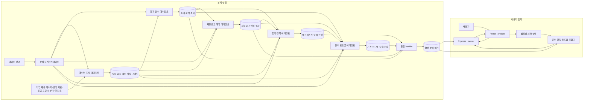
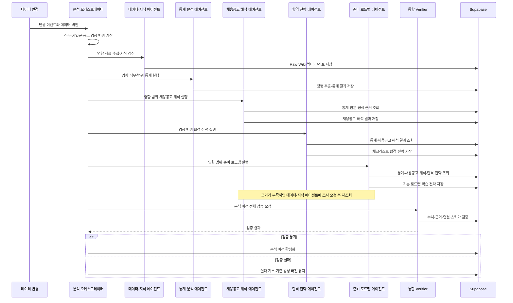
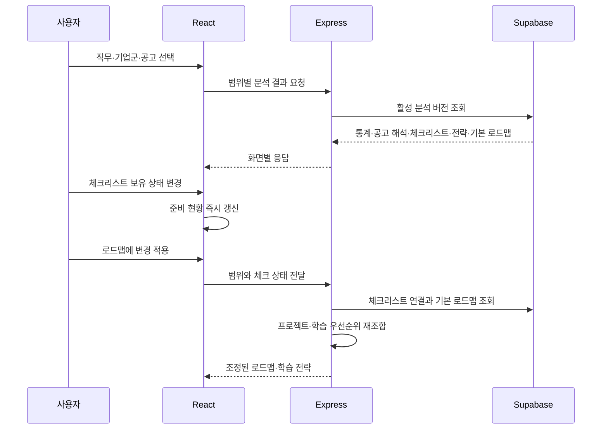
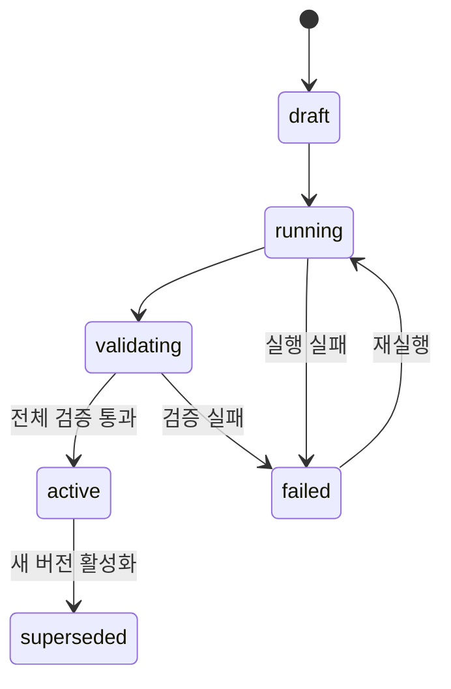

# CareerSignal 아키텍처

## 1. 문서 목적

이 문서는 CareerSignal의 실행 구조, 구성요소 책임, 데이터 갱신과 분석 결과 제공 방식을 정의한다. 제품 목적과 사용자 흐름은 [기획서](plan.md), 자료 정책은 [데이터 전략](data-strategy.md), 에이전트의 입출력과 내부 제어 흐름은 [에이전트 설계](agent-design.md), 진행 상태는 [개발 백로그](backlog.md)에서 관리한다.

### 1.1 발표용 다이어그램

| 관점 | 설명 | 위치 |
| --- | --- | --- |
| 전체 서비스 구조 | 자료 수집부터 저장 결과 조회까지의 구성요소와 경계 | 이 문서 3장 |
| 데이터·에이전트 실행 흐름 | 데이터 변경, 영향 범위 계산, 다섯 에이전트 실행과 버전 활성화 | 이 문서 5장 |
| 에이전트 내부 구조 | 각 에이전트의 검색·생성·검증 단계와 산출물 의존성 | [에이전트 설계](agent-design.md) 5~11장 |

## 2. 시스템 범위

CareerSignal은 채용공고와 근거 자료를 직무 단위로 분석해 통계, 채용공고 해석, 합격 전략, 준비 로드맵을 생성하는 배치형 리서치 에이전트 서비스다. 분석 범위는 다음 세 단계로 구성한다.

| 범위 | 식별자 | 의미 |
| --- | --- | --- |
| 직무 전체 | `job_role_id` | 동일 직무 공고 전체의 공통 요구와 통계 |
| 기업군 | `company_cluster_id` | 동일 직무 안에서 기업군이 보이는 편차 |
| 개별 공고 | `posting_id` | 특정 공고의 요구사항과 회사 맥락 |

백엔드는 최초 검증 직무이며, 화면·데이터·DB·에이전트 계약은 다른 직무를 같은 구조로 추가할 수 있도록 직무 식별자를 입력으로 사용한다. 기업군 분류도 직무별 구성을 허용한다.

정적 프로토타입은 `prototype/`, 실제 React 화면은 `product/`, Express API는 `server/`, Python·FastAPI·LangGraph 에이전트는 `agent/`, 저장소는 Supabase(Postgres + pgvector)가 담당한다.

## 3. 전체 시스템 구성



분석 에이전트는 자료와 앞 단계 산출물을 조회해 결과와 검증된 관계를 버전별로 저장한다. 데이터·지식 에이전트는 원문 기반 노드·관계를 구축하고, 통계 분석·채용공고 해석·합격 전략·준비 로드맵 에이전트는 자기 산출물에서 파생된 관계를 같은 분석 버전에 기록한다. 일반 사용자 조회와 체크 상태 조합은 검증을 통과한 활성 분석 버전만 사용한다.

## 4. 구성요소와 책임

| 구성요소 | 책임 | LLM | 실행 시점 | 위치 |
| --- | --- | --- | --- | --- |
| React UI | 직무·기업군·공고 선택, 분석 결과와 체크 상태 표시 | 미사용 | 사용자 요청 | `product/` |
| Express API | 활성 결과 조회, 응답 조립, 체크 상태 반영, 캐싱, 오류 처리 | 미사용 | 사용자 요청 | `server/` |
| 데이터·지식 에이전트 | 자료 발견·수집·평가, Wiki·벡터 인덱스·그래프 구축 | 사용 | 데이터 갱신 | `agent/` |
| 통계 분석 에이전트 | 공고 요구사항 추출·정규화, 규칙 집계, 통계 해석 | 일부 사용 | 데이터 갱신 | `agent/` |
| 채용공고 해석 에이전트 | 직무 기준선, 기업군·공고 편차, 숨은 요구, 근거와 신뢰도 생성 | 사용 | 데이터 갱신 | `agent/` |
| 합격 전략 에이전트 | 체크리스트와 포트폴리오·자소서·면접 전략 생성 | 사용 | 데이터 갱신 | `agent/` |
| 준비 로드맵 에이전트 | 기본 프로젝트 로드맵, 학습 전략, 선수 관계 생성 | 사용 | 데이터 갱신 | `agent/` |
| 분석 오케스트레이터 | 변경 영향 범위 계산, 실행 순서 제어, 검증과 버전 활성화 | 미사용 | 데이터 갱신 | `agent/` |
| 준비 현황·로드맵 조합기 | 체크 상태에 따른 집계와 프로젝트·학습 순서 재조합 | 미사용 | 사용자 요청 | `server/` |
| 단계별·통합 Verifier | 에이전트별 입력·출력과 분석 버전 전체의 수치·근거·연결 일관성 검사 | 규칙 중심, 필요 시 LLM | 에이전트 실행·버전 활성화 전 | `agent/` |

에이전트는 목표를 달성하기 위해 검색 도구와 DB 조회를 선택하고 결과가 부족하면 재검색한다. 분석 오케스트레이터와 Express 조합기는 사전에 정의된 의존성과 규칙을 결정적으로 실행한다.

## 5. 데이터 갱신과 에이전트 실행



이 다이어그램은 채용공고 변경으로 다섯 에이전트가 모두 필요한 전체 실행을 나타낸다. 분석 오케스트레이터는 변경 유형에 따라 영향이 없는 단계를 생략한다.

채용공고 해석·합격 전략·준비 로드맵 에이전트는 필요한 근거가 부족하면 데이터·지식 에이전트에 조사 요청을 전달한다. 새 자료가 저장되면 요청한 에이전트가 동일 실행 안에서 검색과 생성을 반복한다. 반복 횟수와 검색 비용은 실행 정책으로 제한한다.

## 6. 분석 오케스트레이터

분석 오케스트레이터는 데이터 변경 이벤트를 분류하고 영향받는 직무·기업군·개별 공고 범위를 계산한다. 의존 관계에 따라 필요한 에이전트를 실행하며, 검증을 통과한 산출물 집합만 활성화한다.

### 6.1 데이터 변경별 재실행 범위

| 변경 데이터 | 데이터·지식 | 통계 분석 | 채용공고 해석 | 합격 전략 | 준비 로드맵 |
| --- | --- | --- | --- | --- | --- |
| 신규·수정·삭제 채용공고 | 실행 | 해당 직무·기업군·기간 | 영향 직무·기업군·공고 | 영향 범위 | 영향 범위 |
| 공고의 직무 분류 변경 | 실행 | 이전 직무와 새 직무 | 두 직무의 영향 범위 | 두 직무의 영향 범위 | 두 직무의 영향 범위 |
| 공고의 기업군 분류 변경 | 실행 | 직무 전체와 이전·새 기업군 | 직무 전체와 이전·새 기업군 | 동일 범위 | 동일 범위 |
| 회사 공식 자료 | 실행 | 미실행 | 연결된 직무·기업군·공고 | 영향 범위 | 영향 범위 |
| NCS·직무사전 | 실행 | 용어 정규화 영향 직무 | 영향 직무 | 영향 직무 | 영향 직무 |
| 포트폴리오·자소서·면접 자료 | 실행 | 미실행 | 원칙적으로 미실행 | 연결된 직무·범위 | 연결된 직무·범위 |
| 학습 자료·선수 관계 | 실행 | 미실행 | 미실행 | 필요 시 | 연결된 직무·범위 |
| 출처 URL·메타데이터 정정 | 참조·인덱스 갱신 | 집계 필드 영향 시 | 근거 참조 영향 시 | 근거 참조 영향 시 | 근거 참조 영향 시 |
| 사용자 체크 상태 | 미실행 | 미실행 | 미실행 | 재생성 없음 | Express에서 재조합 |

공고의 내용이나 집계 필드가 바뀌면 해당 공고가 속한 직무의 전체 통계부터 다시 계산한다. 다른 직무의 통계와 분석 결과는 재사용한다.

## 7. 일반 사용자 요청 흐름



### 7.1 체크 상태 영향 범위

| 화면 결과 | 직무·기업군·공고 변경 | 체크 변경 |
| --- | --- | --- |
| 준비 현황 카드 | 범위에 맞게 변경 | 즉시 변경 |
| 체크리스트 내용 | 범위에 맞게 변경 | 내용 유지, 보유 상태만 변경 |
| 포트폴리오 전략 | 범위에 맞게 변경 | 변경 없음 |
| 자소서 전략 | 범위에 맞게 변경 | 변경 없음 |
| 면접 전략 | 범위에 맞게 변경 | 변경 없음 |
| 프로젝트 로드맵 | 범위에 맞게 변경 | 적용 동작으로 재조합 |
| 학습 전략 | 범위에 맞게 변경 | 적용 동작으로 재조합 |

체크 상태는 `(job_role_id, scope_level, scope_id, checklist_item_id)` 단위로 구분한다. 비로그인 사용자는 브라우저에 저장하고, 로그인 기능이 도입되면 같은 키 구조를 사용자별 저장소에 적용한다.

## 8. 분석 버전 생명주기



| 상태 | 의미 |
| --- | --- |
| `draft` | 데이터 변경과 영향 범위가 등록된 분석 버전 |
| `running` | 에이전트 산출물을 생성하는 버전 |
| `validating` | 수치·근거·연결·스키마를 검증하는 버전 |
| `active` | 일반 사용자 조회에 제공되는 버전 |
| `failed` | 실행 또는 검증에 실패해 공개되지 않는 버전 |
| `superseded` | 새 활성 버전으로 교체된 이전 버전 |

활성 버전 전환은 직무 단위로 원자적으로 수행한다. 한 화면만 새 버전이고 다른 화면은 이전 버전인 상태를 허용하지 않는다.

## 9. 저장소 구조

Supabase는 다음 논리 영역을 저장한다.

| 영역 | 주요 데이터 |
| --- | --- |
| 원천 자료 | `raw_sources`, 공고 원문, URL, 작성자·게시일·수집일, 신뢰도, 원문 해시 |
| 정형 공고 | 직무·기업·기업군·요구사항·기술·라벨·근거 문장 |
| 검색 지식 | `source_chunks`, 임베딩, Wiki 페이지, 엔티티·관계 |
| 분석 실행 | 데이터·모델·프롬프트 버전, 실행 범위, 상태, 비용, 오류 |
| 분석 산출물 | 통계, 공고 해석, 합격 전략, 기본 준비 로드맵 |
| 근거 연결 | 산출물 주장과 원문 청크·통계 항목·그래프 노드의 연결 |

지식 그래프는 Postgres의 노드·엣지 테이블로 구성하고 pgvector의 의미 검색과 함께 사용한다. 그래프 저장소 접근 계층은 구현과 분리해 별도 그래프 DB로 교체할 수 있게 한다.

분석 산출물은 기존 화면 API 응답 형태를 JSONB로 저장한다. 검색·조인·무결성 검사가 필요한 식별자와 연결은 별도 컬럼이나 관계 테이블로 관리한다.

## 10. API와 데이터 계약

프론트는 Express만 호출하고 Express가 활성 버전과 범위에 맞는 결과를 조립한다. FastAPI 엔드포인트는 배치 실행과 사용자 공고 직접 입력에 사용한다.

### 10.1 공통 분석 식별자

```text
job_role_id
scope_level: overall | cluster | posting
scope_id
dataset_version
analysis_version
model_version
prompt_version
verification_status
generated_at
```

### 10.2 분석 산출물

`analysis_outputs`는 공통 식별자와 `output_type`, `payload`, 생성·검증 메타데이터를 저장한다. `output_type`은 `stats`, `posting_interpretation`, `success_strategy`, `roadmap_base`를 사용한다.

### 10.3 화면 API

| API | 책임 |
| --- | --- |
| 통계 조회 | 활성 버전의 직무·기업군 통계 반환 |
| 채용공고 해석 조회 | 활성 버전의 직무·기업군·개별 공고 해석 반환 |
| 합격 전략 조회 | 체크리스트와 포트폴리오·자소서·면접 전략 반환 |
| 로드맵 조회·조합 | 기본 로드맵을 읽고 체크 상태를 적용한 프로젝트·학습 순서 반환 |

수직 슬라이스의 기존 JSON 키는 화면 계약으로 유지하고, 직무 일반화를 위한 식별자와 버전 메타데이터를 추가한다. 에이전트 내부 입력은 이전 HTTP 응답 전체를 전달하는 대신 공통 식별자를 받고 필요한 자료와 앞 단계 산출물을 DB에서 조회한다.

## 11. 사용자 공고 직접 입력

사용자가 입력한 공고는 통계와 직무 기준선에 포함하지 않는다. Express는 입력 길이와 요청 빈도를 제한하고 개인정보 패턴을 제거한 뒤 원문 해시와 데이터·모델·프롬프트 버전으로 동일 분석 캐시를 조회한다. 캐시가 없으면 FastAPI의 온디맨드 개별 분석을 호출한다.

로그인과 사용자별 영구 저장은 이 경로의 필수 조건이 아니다. 비로그인 사용자는 브라우저 세션과 저장 범위에서 결과와 체크 상태를 사용한다.

온디맨드 개별 분석 체인은 공고 추출·채용공고 해석·합격 전략·준비 로드맵을 실행한다. 공통 직무 통계와 지식 자산은 활성 분석 버전에서 조회하고, 사용자 입력 공고에서 생성한 결과는 서비스 통계와 공통 기준선에 반영하지 않는다.

## 12. 검증과 관측

검증은 다음 세 층으로 구성한다.

1. 규칙 검증: 스키마, 수치, 분모, 근거 존재, 식별자 연결, 선수 관계 순환을 검사한다.
2. LLM 평가: 해석의 타당성, 근거 충실도, 직무 적합성을 루브릭으로 평가한다.
3. 사람 점검: 평가 세트와 베타 결과를 표본 검토한다.

각 실행은 입력 데이터 버전, 모델·프롬프트 버전, 도구 호출, 검색 출처, 토큰·비용, 재시도, 검증 결과를 기록한다. 평가 세트와 품질 기준은 [데이터 전략](data-strategy.md)과 [에이전트 설계](agent-design.md)를 따른다.

## 13. 관련 문서

- [기획서](plan.md)
- [데이터 전략](data-strategy.md)
- [에이전트 설계](agent-design.md)
- [디자인 컨셉](design-concept.md)
- [개발 백로그](backlog.md)
- [검증 체크리스트](checklist.md)
