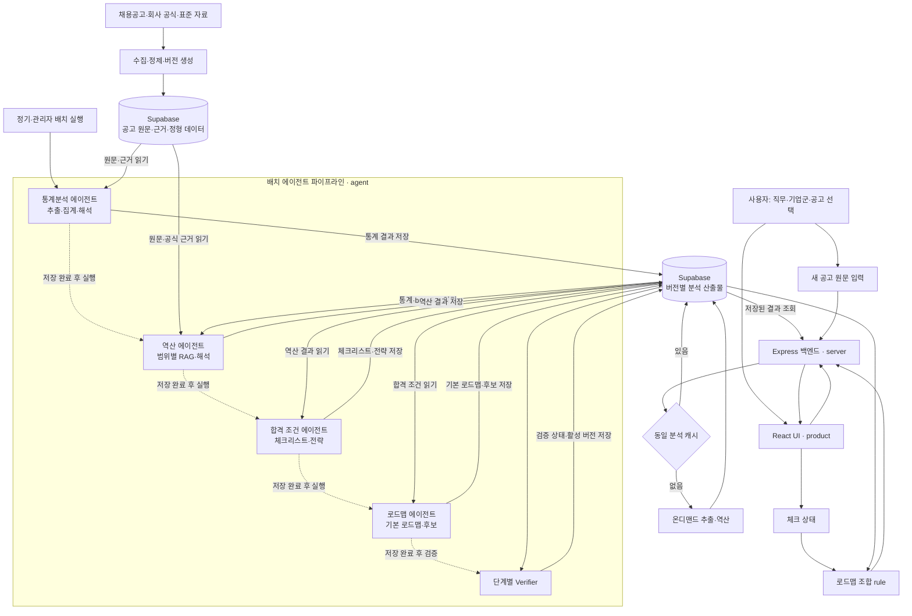
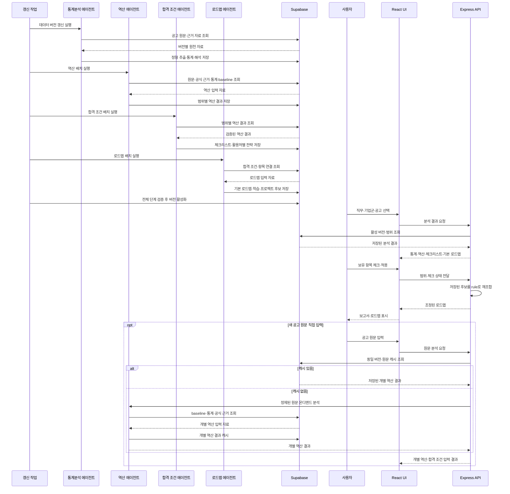

# CareerSignal 설계 문서

## 1. 문서 목적

이 문서는 프로토타입과 MVP의 기술 구조, 그리고 데이터 설계를 기록합니다. 문제 정의와 화면 목적은 [기획서](plan.md)에서, 시각 구조는 [디자인 컨셉](design-concept.md)에서 확인합니다. 기획서가 "무엇을·누구에게·왜"라면, 이 문서는 "어떻게 만드나"를 다룹니다.

## 2. 프로토타입

`prototype/`은 사용자 흐름과 정보 구조를 시연하기 위한 HTML/CSS 프로토타입입니다.

- 페이지: 직무 선택 · 통계 분석 · 인재상 역산 · 합격 조건 · 준비 로드맵
- 공통 스타일: `style.css`
- 배포: [Vercel 데모](https://careersignal-prototype.vercel.app/)
- 데이터: 백엔드 직무 mock

프로토타입에는 JavaScript, 데이터 조회, rule 분석, LLM 에이전트, Express API가 없습니다. 예시 직무 버튼과 분석 결과는 화면 흐름을 보여 주는 표현입니다.

## 3. MVP

`product/`의 React UI, `server/`의 Express 백엔드, `agent/`의 AI 에이전트 서비스를 운영합니다. 에이전트는 Python·FastAPI 위에서 LangChain·LangGraph로 오케스트레이션합니다. 채용공고와 근거 자료가 갱신되면 각 에이전트가 Supabase에서 원천 자료와 앞 단계 산출물을 읽고, 직무 전체·기업군·개별 공고 범위의 다음 산출물을 생성·검증해 다시 Supabase에 저장합니다. 일반 사용자 요청은 에이전트를 호출하지 않고 활성 데이터 버전의 저장 결과를 조회합니다.

**데이터 갱신 시 생성·저장하는 것**: 공고 원문과 정형 추출 결과, baseline 기준표, 회사 공식·표준 자료, 통계, 역산 해석, 합격 조건 체크리스트, 활용처별 전략, 기본 로드맵과 학습·프로젝트 후보. **사용자 요청 시 계산하는 것**: 범위에 맞는 저장 결과 조회, 체크 상태에 따른 완료·미완료 집계와 로드맵 우선순위 조합. 체크 상태의 모든 경우의 수를 생성하지 않고 항목별 전략과 연결 정보를 rule로 조합합니다.

AI 에이전트는 네 개입니다.

| 에이전트 | 내부 단계 |
| --- | --- |
| 통계분석 | 수집(agentic) → 추출(LLM: 공고 원문 → 정형 데이터) → 집계(rule) → 해석(LLM) |
| 역산 | baseline·통계 대비 편차 탐지, 근거 추출, 해석 생성(LLM·RAG) |
| 합격 조건 | 활용처 배정(rule) → 활용처별 내용 생성(LLM) → 범위별 산출물 저장 |
| 로드맵 | 기본 우선순위·후보 생성(LLM+rule) → 항목 연결 저장 → 체크 상태별 조합(rule) |

역산의 전체·기업군·개별은 같은 역산 에이전트의 범위 입력이고, 결과 검증(Verifier)은 각 에이전트의 내부 단계입니다.

에이전트의 LLM·agentic·집계 단계는 `agent/`(Python·FastAPI)의 배치 파이프라인에서 실행합니다. 통계분석·역산·합격 조건·로드맵 에이전트는 각자 필요한 입력을 Supabase에서 조회하고 결과를 버전별 분석 산출물로 저장합니다. `server/`(Express)는 활성 데이터 버전 조회, 데이터 계약 관리, 응답 조립, 체크 상태 조합, 캐싱, 오류 처리를 맡습니다. 사용자가 새 공고 원문을 직접 입력하는 경로만 Express가 FastAPI를 온디맨드로 호출합니다. 프론트는 Express 하나만 호출합니다.

| 구성 | 책임 | 유형 | 위치 |
| --- | --- | --- | --- |
| React UI | 입력, 결과, 로딩·오류 상태 표시 | 화면 | `product/` |
| Express | 활성 버전 조회·데이터 계약·응답 조립·체크 상태 조합·온디맨드 입력 중계·캐싱·오류 처리 | 백엔드 | `server/` |
| 통계분석 에이전트 | 원문 조회, 수집(agentic)·추출(LLM)·집계(rule)·해석(LLM), 통계 산출물 저장 | 배치 에이전트 | `agent/` |
| 역산 에이전트 | 원문·공식 근거·통계·baseline을 조회하고 범위별 편차·근거·해석을 저장 | 배치·온디맨드 에이전트(LLM+RAG) | `agent/` |
| 합격 조건 에이전트 | 저장된 역산 결과를 조회하고 요구 항목의 활용처 배정과 활용처별 내용을 범위별로 저장 | 배치 에이전트 | `agent/` |
| 로드맵 에이전트 | 저장된 합격 조건을 조회하고 항목별 학습·프로젝트 후보와 기본 순서를 저장 | 배치 에이전트 | `agent/` |
| 로드맵 조합기 | 체크 상태를 적용해 완료·미완료 집계와 추천 우선순위를 계산 | rule | `server/` |
| Baseline 기준표 | 직무 공통 기대치(1·2차로 구축) | 데이터 | 저장소 |
| Verifier | 각 에이전트 출력의 일관성 자기검증 | 에이전트 내부 단계 | `agent/` |

## 4. 목표 데이터 흐름

API 엔드포인트와 데이터 스키마는 11장(데이터 계약)을 따르고, LLM 프롬프트는 각 에이전트를 구현하는 슬라이스에서 정의합니다.

## 5. 데이터 자산과 베이스라인

### 5.1 데이터 자산 구분

- **베이스라인 자료**(`baseline/backend-baseline.md` 등): 직무 단위 기준표입니다. 회사·공고와 무관하게 유지되며, 아래 5.2 절차로 만듭니다.
- **샘플 채용공고 자료**(`server/data/backend-postings.sample.json`): 추출이 끝난 정형 형태의 표본 공고 집합입니다. 통계 분석과 편차 탐지의 입력으로 쓰며, 시계열을 위해 두 시점 스냅샷(최근 1년 / 이전 1년)으로 구성합니다. 실데이터는 공고 **원문(raw_text)을 함께 보관**합니다. 원문은 추출 재실행, 역산 근거 인용 검증, RAG(pgvector 임베딩)의 입력입니다.
- **분석 산출물**: 데이터 버전별 통계·역산·체크리스트·활용처별 전략·기본 로드맵 JSON입니다. 직무 전체·기업군·개별 공고 범위마다 생성하며, 모델·프롬프트·생성 시점·검증 상태를 함께 저장합니다.

### 5.2 베이스라인 구축

베이스라인은 직무 공통 기대치이며, 두 갈래로 만듭니다.

1. **통계 기반 후보 추출**: 통계 분석 결과(1차 공고 원문 집계)에서 다수 공고에 공통으로 등장하는 항목을 자동으로 베이스라인 후보로 뽑습니다.
2. **회사 공식 자료로 검증·보완**: 여러 회사의 채용·기술 자료(2차)를 참고해 후보를 다듬습니다. 같은 요구가 회사마다 크게 다르게 해석되지 않으므로 공통 기대치를 다지는 데 활용합니다.

3차 표준 자료(NCS·직무데이터사전)는 용어 정규화와 직무 공통 기준 검증에 사용합니다. 현직자 특강·트렌드 리포트·커뮤니티 같은 비공식 외부 자료는 보조 신호로만 사용합니다. 베이스라인은 고정 자료가 아니라 주기적으로(예: 분기 1회) 갱신하는 것을 원칙으로 합니다.

## 6. 자료 계층

역산의 근거는 신뢰도가 다른 세 계층으로 나눕니다.

| 계층 | 자료 | 용도 |
| --- | --- | --- |
| 1차 | 채용공고 원문 | 통계 집계, baseline 후보, 역산 편차 파싱 |
| 2차 | 회사 공식 자료(채용 페이지, 기술 블로그) | baseline 검증·보완, 편차 근거·해석 |
| 3차 | 공공·표준 자료(NCS·직무데이터사전·공공데이터포털 자료) | baseline 검증, 용어 정규화, 직무 공통 기준 |
| 보조 | 출처가 확인되는 현직자·산업 자료 | 교차 검증, 직접 요구사항으로 사용하지 않음 |

통계는 1차만 씁니다. baseline과 역산(전체·기업군·개별)은 1·2차를 직접 근거로 사용하고, 3차는 용어 정규화와 직무 공통 기준 검증에 사용합니다. 보조 자료는 직접 요구사항을 만들지 않으며, 근거가 약하면 신뢰도를 낮춰 표시합니다.

계층별 확보 소스는 다음과 같습니다.

| 계층 | 소스 | 확보 범위 |
| --- | --- | --- |
| 1차 (메타·라벨·시계열 축) | 사람인 오픈 API, 이용 자격을 충족한 고용24 API | 공고 메타데이터, 경력·학력 라벨, 게시일 |
| 1차 (본문 문장) | 화이트리스트 기업 공식 채용 페이지, 이용 자격을 충족한 고용24 상세 API | 자격요건·우대사항 원문 |
| 2차 | 화이트리스트 기업의 기술 블로그·채용 사이트 | baseline 검증, 역산 근거 |
| 3차 | NCS·SW 직무 표준 역량, 워크넷 직무데이터사전 | baseline 검증, 용어 정규화 사전 |

수집 정책: 포털 사이트(사람인·잡코리아 등)는 크롤링하지 않고, 기업이 자기 사이트에 공개한 자료는 robots.txt·약관 준수 하에 수집합니다. 고용24 Open API는 기업회원 이용 자격을 충족한 경우에만 사용합니다. 시계열은 수집 시점 기록으로 축적하며, MVP의 이전 스냅샷은 샘플·큐레이션으로 구성하고 출처를 화면에 표기합니다. 사용자가 직접 입력한 공고는 비로그인 세션에서 개별 역산으로 처리하고 통계 baseline에 넣지 않습니다. 동일 원문은 원문 해시·데이터·모델·프롬프트 버전이 일치하는 저장 결과를 재사용합니다.

## 7. 데이터 정의와 사용 시기

**fixture**: 검증을 위해 미리 준비해 두는 고정 데이터·응답. mock 데이터, 샘플 데이터, 에이전트의 고정 응답이 fixture로 쓰인다.

| 데이터 | 진짜/가짜 | 생성 주체 | 출처 | 규모 | 저장 위치 | 용도 |
| --- | --- | --- | --- | --- | --- | --- |
| mock | 가짜 | 개발 시 작성 | 창작 | 화면 표시분 | 화면 코드 하드코딩(`product/src/data/mock.js`, 프로토타입 HTML) | 화면·정보 구조 검증. 서버 불필요 |
| 샘플 | 가짜(데이터 계약 준수) | 생성 스크립트(시드 고정) | 현실을 모사한 창작 | 54건(최근 30 / 이전 24) | Supabase. 원본 fixture는 `server/data/backend-postings.sample.json` | 연결성 검증 — 집계·API·화면이 계약대로 동작 |
| 평가 세트 | 진짜 | 수동 큐레이션, 기대 정답은 사람이 작성 | 기업 공식 채용 페이지·고용24 공개 공고의 실제 원문 | 18~30건(기업군 6종 × 각 3~5건 커버리지) | `agent/eval/` | 성능 검증 — 에이전트 추출·해석 채점과 프롬프트 개선 |
| 실데이터 | 진짜 | 수집 에이전트(자동) | 사람인 API, 이용 자격을 충족한 고용24 API, 화이트리스트 기업 사이트 | 수백 건 이상, 지속 증가 | Supabase | 규모 확보 — 실서비스 |
| 분석 산출물 | 진짜 데이터 기반 생성물 | 에이전트·rule·Verifier | 활성 데이터 버전의 공고·근거 자료 | 직무 전체·기업군·개별 공고 범위별 | Supabase JSONB | 일반 사용자 요청에 제공하는 통계·역산·체크리스트·전략·기본 로드맵 |

개발 단계별 사용 데이터:

| 단계 | 사용 데이터 |
| --- | --- |
| 프로토타입, 프론트 화면 검증 | mock |
| 수직 슬라이스(프론트·계약·백·DB·에이전트 경로) | 샘플 + 에이전트 fixture 응답 |
| 에이전트 내부 구현·테스팅 | 평가 세트(입력·채점 기준) + 범위별 분석 산출물 |
| 배포·확장 | 실데이터와 활성 분석 산출물 버전 |

연결성(fixture) · 성능(평가 세트) · 규모(실데이터)는 별도 축으로 검증한다. 평가 세트는 통계적 균일 표본이 아니라 기업군별 패턴 커버리지를 기준으로 구성하며, 추출 파이프라인을 거쳐 베타의 서비스 데이터로도 적재한다. 평가는 rule 검증(근거 인용 대조·수치 일치) · LLM 판정(루브릭 채점) · 사람 스팟 체크의 3층으로 하고, rule 검증은 Verifier로 재사용한다. 분석 산출물은 전체 파이프라인 검증이 끝난 데이터 버전만 활성화하며, 일반 조회는 하나의 활성 버전 안에서 일관된 결과를 반환한다. 스냅샷은 최근 1년 / 이전 1년 두 시점으로 두고, 실데이터 전환 시 연도별 추이로 확장한다.

## 8. 기업군 태그

회사는 사람이 정한 태그로 묶습니다.

| 태그 | 특성(백엔드 기준 강조점) |
| --- | --- |
| 빅테크·플랫폼 | 대규모 트래픽·동시성, CS 기본기, 코드 품질·리뷰 문화 |
| 스타트업 | 넓은 범위·빠른 실행, 오너십, 풀스택 성향 |
| B2B SaaS | 도메인 이해, API 설계·안정성, 데이터 모델링 |
| 핀테크·금융 | 보안·정합성, 트랜잭션 정확성, 규제 대응 |
| SI·대기업 IT계열 | B2B 프로젝트, 프로세스·문서, 규모 |
| 게임사 | 실시간 처리·성능 최적화, 대용량 동시 접속, 클라이언트·서버 협업 |

## 9. 개발 순서

기획 → 디자인·프로토타입(mock) → **프론트(`product`, React·mock)** → **샘플 데이터(데이터 모델·계약 정형화)** → **백+DB(`server`, Express·Supabase, 조회·API·조합 rule)** → **배치 에이전트(통계·역산·합격 조건·로드맵 산출물 생성·검증·저장)** → MVP 배포 → 실데이터 수집·직군 확장 → 사용자 공고 직접 입력.

프론트는 가짜(mock) 데이터로 화면과 흐름을 먼저 검증한다. '샘플 데이터'는 프론트가 기대하고 백엔드가 돌려줄 **응답 데이터 모양**을 정형화하는 단계로, 프론트와 백엔드가 만나는 접점이다. 백+DB부터는 계층을 한꺼번에 완성하기보다 기능 하나를 화면→서버→DB→화면으로 잇는 **수직 슬라이스**로 진행한다. rule 뼈대를 먼저 만들고 그 위에 LLM 에이전트를 얹으며, LLM 도입과 실데이터 수집은 분리해 에이전트는 샘플 데이터 위에서 먼저 검증한다.

저장소는 Supabase(Postgres + pgvector)다. 공고와 근거 문서, RAG 청크·임베딩, 데이터 버전, 범위별 분석 산출물, 에이전트 실행 기록을 저장합니다. 분석 산출물은 기존 API 응답 형태를 JSONB로 보관하고 활성 버전 포인터로 공개합니다. pgvector 테이블은 역산 RAG에서 사용합니다. 데이터 계약이 고정돼 있으므로 저장소·에이전트 실행 시점이 바뀌어도 화면·API 응답 모양은 바뀌지 않습니다. 슬라이스 단위와 진행 상태는 [백로그](backlog.md)에서 관리합니다.

## 10. 기능별 구현 세부

기획서 6장의 사용자 기준 설명에 대응하는 출력·데이터·분석 방법입니다. 각 화면의 정보 구성은 기획서 9장, 시각 규칙은 [디자인 컨셉](design-concept.md)에서 다룹니다.

### 10.1 통계 분석

- **출력**: 10블록(기획서 9.2) — KPI·직무 외 요구·필수 인플레이션·숨은 난이도·기술 빈도·조합·추이·라벨 vs 현실·기업군 히트맵·요구 항목 전체표. 전체·기업군.
- **데이터**: 정형 샘플 공고(두 시점 스냅샷, `server/data/`). 실데이터 전환 시 원문(raw_text) 포함.
- **분석**: 데이터 갱신 파이프라인에서 수집(agentic) → 추출(LLM) → 집계(rule) → 해석(LLM)을 실행하고 결과를 데이터 버전별로 저장합니다. 집계 규칙과 계약은 11장을 따릅니다.

### 10.2 인재상 역산

- **출력**: 항목별 [항목명 | baseline 수준 | 편차 여부 | 근거 문장 | 해석 | 신뢰도 | 같은 직군 내 등장 비율]. 전체·기업군·개별 공고(원문+해석).
- **데이터**: 샘플 공고 + 회사 공식 자료(있는 경우) + 통계 결과.
- **분석**: LLM 에이전트가 데이터 갱신 시 baseline 비교, 근거 추출, 자연어 해석을 생성하고 범위별 결과를 저장합니다.

### 10.3 합격 조건 정의

- **출력**: 체크리스트 [요구 항목 | 필요 산출물/활동 | 활용처 | 보유 여부]와 활용처별 내용(자소서 소재·포트폴리오 강조점·예상 면접 질문). 목표 기업군·회사 맞춤 조정.
- **데이터**: 역산 출력만 사용(추가 수집 불필요).
- **분석**: 활용처 배정은 rule 기반(항목 성격 태그), 예상 면접 질문 문구 생성은 LLM이며 범위별 결과를 저장합니다. 사용자의 체크 상태는 생성 결과를 바꾸지 않습니다.

### 10.4 준비 로드맵

- **출력**: 단계별 [목표 미체크 항목 | 기간 | 권장 구현 범위·산출물 | 우선순위 | 추천 이유], 완료 항목 표시, 목표 기업군 토글. 각 추천은 채워지는 체크리스트 항목과 연결.
- **데이터**: 합격 조건 출력만 사용.
- **분석**: 에이전트가 항목별 학습·프로젝트 후보와 기본 순서를 생성해 저장합니다. Express는 체크 상태에서 필수 미보유 항목, 선행 관계, 여러 항목을 함께 채우는 후보를 계산해 저장된 로드맵을 재조합합니다. 체크 상태 조합에는 LLM을 호출하지 않습니다.

## 11. 데이터 계약

프론트↔백↔에이전트가 주고받는 JSON의 접점 약속. 원칙: **계약 우선(contract-first), 확장은 키 추가만**(기존 키는 바꾸지 않음).

- **정형 공고 스키마**(`server/data/*.sample.json`, 추출이 끝난 형태 기준): posting_id · title · company · cluster_tag(기업군 6종) · snapshot(recent/prev) · posted_at · source · **raw_text(원문 — 실데이터 전환 시 필수)** · entry/edu/career_label · skills[{name, slug, requirement}] · out_of_role_tags[] · advanced_spans[{type, text}] · impl_level_signals[] · axis_mentions[] · reality_tags[]
- **통계 API 응답**(`GET /api/stats?job=…`): meta(스냅샷·출처·표본 수·disclaimer) · kpi · scope_expansion · inflation(이동 없으면 stable) · trend3(증가/유지/감소, 개수 동적) · labels · advanced · combos · reality · cluster_axes(히트맵) · tech_freq · **items**(요구 항목 전체) · error(UNSUPPORTED_JOB 등)
- **역산 입력 통계값**: items 배열이 그대로 역산 에이전트의 입력이다(블록 ⑩과 동일 데이터). 항목별: item_id(안정 slug) · name · aliases(용어 정규화) · category · scope(직무 내/외) · is_advanced · freq_overall · required_ratio(등장 공고 중 필수 표기 비율 %) · freq_by_cluster · trend{prev_pct(표본 없으면 null), recent_pct, direction, requirement_shift} · impl_level · evidence[{text, posting_id, source_url}] · support(표본 수) · confidence
- **추출 에이전트 계약**(`POST /extract`, FastAPI): 입력 { posting_id, raw_text } → 출력은 정형 공고 스키마의 추출 필드(skills, out_of_role_tags, advanced_spans, reality_tags, axis_mentions, impl_level_signals)와 confidence.
- **분석 산출물 계약**: analysis_outputs는 job · scope_level(overall|cluster|posting) · scope_id · output_type(stats|reverse|conditions|roadmap_base) · dataset_version · payload(JSONB) · model_version · prompt_version · generated_at · verification_status를 저장합니다. 하나의 dataset_version에 필요한 범위별 산출물이 모두 검증된 뒤 해당 버전을 활성화합니다.
- **역산 계약**(`POST /api/reverse`): 요청 { job, scope{level: overall|cluster|posting, cluster_tag?, posting_id?} }. Express는 활성 데이터 버전의 저장된 역산 산출물을 조회하고 공고 목록(postings_in_cluster[{posting_id, company, title, posted_at}])을 합성합니다. 응답: { job, scope, baseline[{item_id, title, desc, freq_pct, required_ratio}], deviations[{item_id, topic, baseline, deviation, evidence, explanation, confidence, ratio, related_stat}], unchanged[{item_id, title, note}], posting|null, agent_version, source, dataset_version, generated_at, model_version, prompt_version }. posting의 원문 각 줄은 세 종류 주석 중 하나를 가집니다 — mark_n(회사 특징, 편차 해설 interpretations와 짝) · base_n(직무 공통, baseline_notes와 짝, base_ref 라벨 병기) · note_n(숨은 의미, signal_notes와 짝). posting = { posting_id, company, title, summary, raw_sections[{section, lines[{text, mark_n, base_n, base_ref, note_n}]}], interpretations[{n, title, body, confidence, ratio, sources[{type: posting|company_blog|official, url}]}], baseline_notes[{n, base_ref, body}], signal_notes[{n, title, body}], unchanged_note }.
- **합격 조건 계약**(`POST /api/conditions`): 요청 { job, scope }. Express는 활성 데이터 버전의 저장된 합격 조건 산출물을 조회합니다. 응답: { job, scope, checklist[{item_id, title, subtitle, reason, evidence_needed, channels[essay|portfolio|interview], kind(project|story|study), is_deviation, dev_n, required, have}], portfolio{highlights[{title, body, tips[], linked_item_ids[]}], intro_orders[{cluster, steps[]}]}, essay[{kind, title, body, narrative{problem, solve, growth}|null, sample_sentence, tips[], linked_item_ids[]}], interview[{kicker, question, followups[], point, linked_item_ids[]}], agent_version, source, dataset_version, generated_at, model_version, prompt_version }. checklist는 학습형 항목(kind=study, 면접 검증)을 포함합니다. intro_orders는 overall 범위면 전 기업군, cluster·posting 범위면 해당 기업군만 담습니다. 준비 현황 집계는 화면이 체크 상태에서 계산합니다.
- **준비 로드맵 계약**(`POST /api/roadmap`): 요청 { job, scope, checks{item_id: bool} }. Express는 활성 데이터 버전의 roadmap_base 산출물을 조회하고 체크 상태를 rule 조합기에 적용합니다. 응답: { job, scope, project_steps[{n, phase, weeks, priority, title, body, deliverable, fills[{item_id, label, kind}], reason_title, reason, tags[]}], study_tracks[{phase, priority, title, depth, reason_title, reason, fills[]}], check_rows[{item_id, title, kind, is_deviation, dev_n, required, source_step}], agent_version, source, dataset_version, generated_at, model_version, prompt_version }. 조합기는 필수 미보유 항목, 선행 관계, 후보별 fills 범위를 기준으로 순서를 계산하며 LLM을 호출하지 않습니다. 로드맵은 프로젝트 트랙(순서형)과 학습 트랙(병행형)으로 나뉩니다.
- **사용자 공고 입력 계약**: 입력 { raw_text }. Express는 입력 길이·요청 빈도를 제한하고 개인정보 패턴을 제거한 뒤 content_hash · dataset_version · model_version · prompt_version으로 동일 분석을 조회합니다. 저장 결과가 없으면 FastAPI의 추출·역산 경로를 호출하고 보존 기간이 정해진 캐시에 결과를 저장합니다. 비로그인 사용자는 현재 세션의 결과만 조회하며, 사용자 입력 공고는 통계와 baseline에 포함하지 않습니다.
- **화면 간 공유 상태**: 범위(scope)와 체크 상태(checks)는 앱 최상위에서 소유해 합격 조건·로드맵 화면이 공유합니다. 비로그인 사용자의 체크 상태는 브라우저에 저장하고 현황 숫자는 바로 갱신합니다. 로드맵 재구성은 명시적 적용 동작으로만 반영합니다.

집계 규칙: 모든 %의 분모는 recent 스냅샷, 우대→필수 이동은 prev 필수율 <40%이고 델타 ≥+20%p(양쪽 표본 n≥3), 추이 방향은 |델타| ≥8%p일 때만 판정, prev 표본 없음은 0이 아니라 null.

## 12. 제외 및 확장

확장 범위는 백엔드 외 직군 데이터, 실제 채용공고 수집·갱신, 연도별 추이, 비로그인 사용자 공고 직접 입력입니다. 직접 입력 결과는 세션에서 제공하고 동일 원문 분석을 캐시합니다. 로그인·사용자별 영구 저장, 개인화 Gap 분석, 자동 클러스터링, 비공식 외부 자료 연동, 권고/선택 구분, 직무 자유 입력은 별도 확장 범위입니다. 이 기능들은 정적 프로토타입이나 MVP 범위로 표현하지 않습니다.
