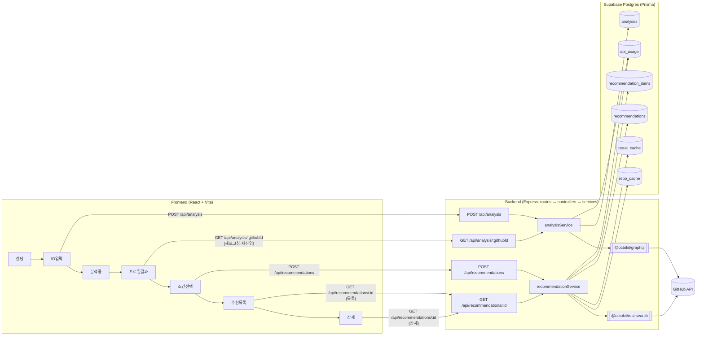

# 아키텍처

> 백엔드 개발 시작 시 작성 예정

## 전체 구조
화면(FE) → API 라우트 → 서비스 레이어 → GitHub API / Supabase(Prisma)까지의 전체 연결과 API 경로를 한 장으로 표현.



## 프론트엔드
- 폴더 구조 및 레이어링
- 상태 관리 방식

## 백엔드
- 폴더 구조 및 레이어링
- 데이터베이스 구조

## API 명세 (확정 2026-07-13)

> 전체 명세(필드·타입·에러·example)는 **[openapi.yaml](openapi.yaml)** 이 단일 진실 소스.
> 서버 착수 후 `swagger-ui-express`로 `/api-docs`에 서빙 예정. FE mock JSON은 openapi.yaml의 example에서 복사한다.

| 메서드 | 경로 | 설명 | 주요 응답 |
| --- | --- | --- | --- |
| POST | `/api/analysis` | 프로필 분석 실행(동기) + 캐시 저장. 신선한 캐시(24h)면 재사용 | `200` Analysis |
| GET | `/api/analysis/:githubId` | 분석 캐시 조회 (프로필 화면 새로고침/재진입) | `200` Analysis / `404 ANALYSIS_NOT_FOUND` |
| POST | `/api/recommendations` | 추천 생성+저장. 재조회/필터링은 조건 바꿔 재 POST | `200` Recommendation (빈 결과는 `items: []`) |
| GET | `/api/recommendations/:id` | 저장된 추천 재조회 (목록·상세 새로고침 공용) | `200` Recommendation / `404` |
| GET | `/health` | 서버 상태 확인 | `200 { status: "ok" }` |

### 공통 에러 형식
```json
{ "error": { "code": "VALIDATION_ERROR", "message": "githubId는 필수 입력값입니다." } }
```
- `400 VALIDATION_ERROR` — 필수값 누락·형식 오류
- `404 USER_NOT_FOUND` — 존재하지 않는 GitHub 사용자 (GitHub 404 매핑)
- `404 ANALYSIS_NOT_FOUND` / `404 RECOMMENDATION_NOT_FOUND` — 선행 리소스 없음
- `429 RATE_LIMITED` — GitHub rate limit 초과 매핑
- `500 INTERNAL_ERROR` — 서버 오류
- GitHub API 스펙은 백엔드 내부 구현으로 이 명세에 포함하지 않음 ([decisions.md](decisions.md) 참조)

## 데이터 흐름
(위 "전체 구조" 다이어그램 참조)
- 화면 → API: 각 화면 전환 시점에 대응하는 REST 호출이 정확히 1개씩 매핑됨 (ID입력→분석, 프로필 새로고침→분석 재조회, 조건선택→추천 생성, 목록/상세→추천 재조회)
- API → GitHub: `analysisService`는 GraphQL로 언어·활동 집계, `recommendationService`는 REST 검색으로 레포/이슈 후보 수집 (용도별 분담, [decisions.md](decisions.md))
- API → DB: 분석 결과는 `analyses`에 24h 캐시, 레포/이슈 메타는 `repo_cache`/`issue_cache`에 캐시, 추천 결과는 `recommendations`+`recommendation_items`에 스냅샷 저장(재조회용), GitHub 호출량은 `api_usage`에 집계

## 인프라 / 배포
- 배포 환경, CI/CD
