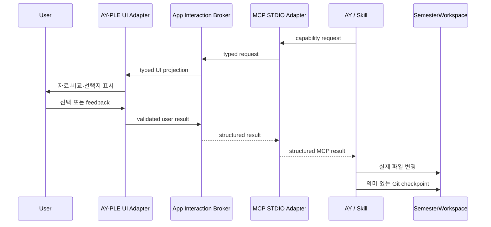

# AY–App Interaction Capability 아키텍처

작성일: 2026-07-27

분류: 활성

성숙도: 채택

관련 문서: [CONTEXT.md](../../CONTEXT.md), [InteractionCapability ADR](../adr/0019-use-mcp-interaction-capabilities-as-the-ay-app-seam.md), [User-owned Git SemesterWorkspace ADR](../adr/0018-adopt-user-owned-git-semester-workspaces.md), [Codex Chat 구현 지도](codex-chat-implementation-map.md), [개발 백로그](../product/ay-ple-development-backlog.md)

## 목적

이 문서는 AY의 MCP 요청을 AY-PLE의 typed UI로 바꾸고, 사용자의 structured result를 같은 Codex Turn에 반환하는 long-lived seam을 설명한다. 제품 가치와 MVP 범위는 Product Brief, 결정의 이유는 ADR 0019, 현재 코드의 강결합 topology와 gap은 구현 지도가 소유한다.

Interaction MCP Module은 Codex-facing STDIO Adapter와 App-side Broker를 합친 deep Module이다. Bootstrap이 설치한 project MCP declaration으로 Adapter를 native discovery하고, App Runtime이 environment로 현재 Broker binding을 공급한다.

- Tracked `.codex/config.toml`과 process-local environment binding의 분리
- Runtime·Thread·Turn과 MCP tool server의 결합
- Browser projection과 capability별 UI lifecycle
- 한 번만 응답하기, 취소, disconnect와 terminal 정산
- 내부 correlation과 native request identity
- 사용자 result의 검증과 같은 MCP call로의 반환

Skill과 AY는 이 복잡성을 알지 않고 capability의 typed request와 result만 사용한다.

## 핵심 흐름



App은 STDIO Adapter에서 Broker·UI·사용자를 거쳐 같은 MCP call로 결과를 돌려주는 interaction round trip을 소유한다. 그 결과의 해석과 이후 workspace mutation은 AY와 Skill이 소유한다. 이 선은 App이 풍부한 UI를 제공하면서도 학업 workflow와 file format에 불필요하게 결합되지 않게 한다.

## 모듈 경계

| Module | Interface | 숨기는 것 |
| --- | --- | --- |
| Skill·AY workflow | MCP capability request와 result | 작업 순서, 재질문 여부, file mutation 전략 |
| Workspace MCP declaration | STDIO entrypoint, forwarded env 이름과 capability allowlist | App endpoint·token value와 host identity |
| Interaction MCP STDIO Adapter | Capability별 typed MCP request/result와 Broker transport | Project config loading, MCP wire와 process environment |
| App-side Interaction Broker | Typed capability request/result | Runtime binding, correlation, pending lifecycle, cancellation, Browser transport |
| UI Adapter | UI projection과 user result | 화면 state, 입력 validation, focus와 view composition |
| Codex Runtime Adapter | App binding env를 공급하고 native project MCP를 시작 | Native protocol, `threadId`·`turnId`·`requestId` |
| SemesterWorkspace | 일반 file·Git interface | 실제 학기 자료와 선택적인 구조화 snapshot의 형식 |

Production Browser Adapter와 in-memory test Adapter는 Interaction MCP Module의 같은 Interface를 구현한다. 이 seam의 핵심 contract test는 다음 한 문장으로 표현한다.

> 유효한 capability request가 UI에 정확히 투영되고, 한 번의 user result 또는 cancel이 같은 MCP call의 정확한 result로 돌아간다.

## MCP discovery와 Runtime binding

Bootstrap은 SemesterWorkspace의 Git-tracked `.codex/config.toml`에 정적인 MCP declaration을 설치한다.

```toml
[mcp_servers.ay_ple_interaction]
command = "<hub-owned-stdio-entrypoint>"
env_vars = ["<endpoint-env>", "<token-env>", "<runtime-binding-env>"]
enabled_tools = ["propose_state_patch"]
required = true
```

이 예시는 ownership을 보여주며 exact path·env 이름은 implementation spec이 소유한다. Config에는 secret이나 process-local 값을 넣지 않는다. AY-PLE이 Codex child를 시작할 때 current App endpoint·token·Runtime binding을 environment로 주입하고, Codex가 `env_vars` allowlist에 따라 STDIO Adapter로 전달한다.

따라서 native config precedence와 user/project MCP가 그대로 작동한다. App은 `--config`, thread-start override 또는 process-wide Skill root로 전체 context를 대체하지 않는다. Project `.codex/config.toml`은 trusted project에서만 load된다. Bootstrap은 global trust를 수정하지 않고, exact Git root와 `workspace-write`를 요청하는 정상 thread start가 current pinned App Server의 native trust write와 same-start config reload를 사용한다. 명시적 `untrusted`는 보존한다.

`required = true`는 단순히 STDIO process가 spawn됐다는 뜻이 아니다. Adapter는 current Broker endpoint·token·Runtime binding을 검증하고 authenticated handshake를 완료한 뒤 MCP initialize에 성공한다. App activation은 effective MCP status에서 expected server와 handshake도 확인하므로 explicit `untrusted` 때문에 project declaration 전체가 무시된 경우까지 실패한다. App은 MCP 없는 degraded mode로 계속하지 않는다.

## Capability 설계 규칙

각 capability는 사용자에게 하나의 응집된 결정을 요청한다.

| 규칙 | 의미 |
| --- | --- |
| 구체적인 이름 | `propose_state_patch`처럼 사용자 경험 하나를 표현한다. `emit_event` 같은 범용 이름을 쓰지 않는다. |
| Self-contained request | UI에 필요한 표시 정보와 허용 응답을 요청 하나에 담는다. App-owned workflow ID를 caller에게 요구하지 않는다. |
| Closed result | `accept | revise | reject`처럼 Skill이 exhaustively 해석할 수 있는 result union을 반환한다. |
| Host-owned binding | Workspace·Turn·Browser correlation은 caller field가 아니라 host가 process environment와 Broker session에서 주입한다. |
| Required connection | Adapter와 current App Broker의 authenticated handshake가 완료되지 않으면 Workspace Runtime을 정상 상태로 열지 않는다. |
| Transient lifecycle | Pending request와 user result는 interaction 수명 동안만 존재한다. Durable 학기 이력을 만들지 않는다. |
| Explicit cancellation | User cancel, Browser disconnect, Runtime terminal을 서로 구분된 result 또는 error로 정산한다. |
| Capability-specific UI | 자료 preview, diff, evidence처럼 해당 결정에 필요한 UI를 제공한다. Arbitrary schema renderer를 만들지 않는다. |

App 자체가 소유하는 state를 바꾸는 capability는 예외가 아니라 같은 규칙의 별도 tool이다. 예를 들어 workspace 선택 tool은 App의 `WorkspaceRegistry` mutation을 수행할 수 있지만, 학기 파일을 어떻게 정리할지는 AY에 돌려준다.

## 첫 capability: `propose_state_patch`

`propose_state_patch`는 이름을 유지하되 App-owned academic transaction이 아니라 Review UI round trip으로 축소한다.

### AY가 보내는 의미

| 입력 | 의미 |
| --- | --- |
| `summary` | 사용자가 판단할 변경의 짧은 설명 |
| `changes` | 순서가 있는 semantic change. 각 항목은 사람이 이해할 label·설명과 before/after를 가지며, 추가·삭제에서는 한쪽을 생략할 수 있다. |
| `evidence` | 필요한 경우 change와 연결하는 workspace-relative file, content digest와 locator |
| `question` | 사용자가 무엇을 결정하는지 설명하는 문구 |

이 모델은 Assignment·Course 같은 학업 entity schema에 종속되지 않으며 raw Git diff나 file mutation command를 운반하지 않는다. File diff가 유용한 capability는 나중에 별도 Interface로 설계할 수 있지만, `propose_state_patch`의 semantic change를 임의 diff payload로 대체하지 않는다.

Exact JSON field name, cardinality와 길이 제한은 implementation spec이 소유한다. 공개 입력에 `requestKey`, `workspaceId`, `courseId`, `baseRevision`, native identity 또는 App store revision을 넣지 않는다.

### AY가 받는 의미

| result | 의미 |
| --- | --- |
| `accept` | 제안한 방향으로 AY가 실제 file mutation을 진행할 수 있다. |
| `revise` | feedback을 반영해 AY가 내용을 다시 검토하고 필요하면 새 capability request를 보낸다. |
| `reject` | 제안을 적용하지 않고 workflow를 계속하거나 끝낸다. |
| cancel/error | 사용자 취소 또는 interaction continuity loss다. 학기 파일을 적용했다는 뜻이 아니다. |

App은 `accept`를 받은 뒤 `workspace-state.json`을 대신 수정하지 않는다. AY가 요청 전 이미 파일을 바꿔 놓고 승인 뒤 되돌리는 방식도 기본 contract가 아니다. Skill은 Review가 필요한 변경을 먼저 제안하고 result를 받은 뒤 실제 파일을 변경한다.

## 다른 Codex interaction과의 경계

| 상호작용 | 소유자 | InteractionCapability와의 관계 |
| --- | --- | --- |
| 일반 clarification | Codex built-in `request_user_input` | Rich AY-PLE UI가 필요 없으면 그대로 사용한다. |
| command·file·network approval | Codex Runtime과 client | 실행 권한이다. 학업 Review result와 합치지 않는다. |
| 대화 입력·steer·interrupt | Codex conversation surface | Turn 제어다. Capability-specific decision payload가 아니다. |
| AY-PLE rich Review | Interaction MCP Module | Custom MCP 한 번으로 UI round trip과 result 반환을 끝낸다. |

하나의 사용자 결정을 custom MCP와 built-in `request_user_input`에 동시에 걸치지 않는다. 반대로 모든 Codex 질문을 custom MCP로 재구현하지도 않는다.

## 상태 소유권

| 상태 | Durable owner | App의 역할 |
| --- | --- | --- |
| 실제 학기 파일 | SemesterWorkspace Git repository | 선택한 root를 exact `cwd`로 연결한다. |
| 정적 Interaction MCP declaration | SemesterWorkspace의 tracked `.codex/config.toml` | 직접 rewrite하지 않고 native project loading을 사용한다. |
| MCP endpoint·token·Runtime binding | App Runtime environment | Workspace나 global config에 persist하지 않는다. |
| 구조화된 학기 snapshot | SemesterWorkspace의 tracked file | Capability UI에 필요한 경우 읽어 표시할 수 있지만 mutation authority를 소유하지 않는다. |
| 장기 변경 이력 | Git history | 별도 academic event ledger를 만들지 않는다. |
| Known·active workspace | `../.ay-ple/`의 `WorkspaceRegistry` | App이 직접 소유한다. |
| Pending interaction | App-side Interaction Broker memory | Turn 수명을 넘는 academic record로 승격하지 않는다. |
| Native conversation | Codex Runtime | Browser-safe projection만 제공한다. |

`RawMaterial`, `ModelingRun`, durable `StatePatch`와 durable `UserConfirmation`은 target App domain model에 포함하지 않는다. Workspace file, native Turn, transient capability request/result가 각각 그 책임을 맡는다.

## 현재 구현과 채택한 목표

| 영역 | 현재 구현 | 채택한 목표 |
| --- | --- | --- |
| MCP discovery | Thread start가 private URL·token을 config override로 주입한다. | Tracked project config가 required hub-owned STDIO Adapter를 선언하고 Runtime은 dynamic env만 공급한다. Adapter의 Broker handshake 뒤에만 initialize가 성공한다. |
| Review 시작 | `propose_state_patch`가 Server-private key와 academic binding을 요구한다. | 표시할 proposal만 보내며 host binding은 Module 내부다. |
| 사용자 응답 | 별도 `/reviews/:interactionId`와 built-in `request_user_input`을 함께 사용한다. | MCP call 하나가 UI 응답을 기다렸다가 closed result를 반환한다. |
| Apply | Server가 durable patch·confirmation transaction으로 `SemesterModel`을 갱신한다. | AY가 result를 해석해 실제 workspace file을 변경한다. |
| 실행 기록 | App-owned `ModelingRun` receipt를 저장한다. | Native Turn과 일반 Codex history를 재사용한다. |
| 자료 | App-owned `RawMaterial` registry·snapshot을 사용한다. | AY가 SemesterWorkspace의 실제 파일을 직접 다룬다. |
| 테스트 | Store revision·private correlation·Browser workflow 전체에 결합된다. | Capability contract와 UI Adapter를 독립적으로 검증한다. |

Current implementation을 target처럼 기술하지 않는다. Exact current package와 endpoint topology는 [Codex Chat 구현 지도](codex-chat-implementation-map.md)가, 전환 순서와 완료 조건은 [개발 백로그](../product/ay-ple-development-backlog.md)가 소유한다.

## 의도적으로 만들지 않는 것

- AY-PLE 전용 학업 workflow engine
- 모든 App·Browser event를 운반하는 generic event bus
- Arbitrary JSON schema를 자동으로 제품 UI로 바꾸는 renderer
- Assignment·Course schema 또는 raw Git diff에 결합된 `propose_state_patch`
- App-owned academic event sourcing 또는 duplicate Codex Turn ledger
- MCP caller가 host correlation과 store revision을 조립하는 protocol
- Endpoint·token을 담은 tracked MCP config 또는 App의 broad config override
- Interaction MCP 없이 정상으로 보이는 degraded AY-PLE Workspace Runtime
- Rich Review와 built-in `request_user_input`의 이중 confirmation
