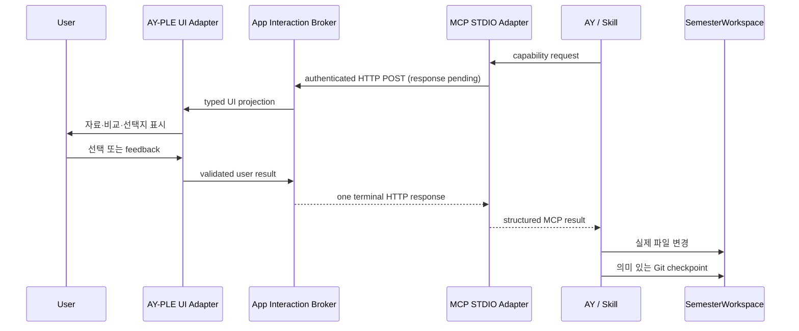

# AY-originated InteractionCapability 아키텍처

작성일: 2026-07-27

최근 갱신: 2026-07-29

분류: 활성

성숙도: 구현됨

관련 문서: [CONTEXT.md](../../CONTEXT.md), [Protocol-driven AY–App Interaction Layer ADR](../adr/0021-adopt-a-protocol-driven-ay-app-interaction-layer.md), [AY–App Interaction Layer 아키텍처](ay-app-interaction-layer.md), [InteractionCapability ADR](../adr/0019-use-mcp-interaction-capabilities-as-the-ay-app-seam.md), [User-owned Git SemesterWorkspace ADR](../adr/0018-adopt-user-owned-git-semester-workspaces.md), [pre-App native Bootstrap ADR](../adr/0020-bootstrap-semester-workspaces-before-app-startup.md), [Codex Chat 구현 지도](codex-chat-implementation-map.md), [개발 백로그](../product/ay-ple-development-backlog.md)

## 목적

이 문서는 AY의 MCP 요청을 AY-PLE의 typed UI로 바꾸고, 사용자의 structured result를 같은 Codex Turn에 반환하는 **AY-originated InteractionCapability Interface**의 구현된 상세 mapping을 설명한다. 양방향 AY–App Interaction Layer와 App-originated ActionInvocation은 umbrella 아키텍처, 제품 가치와 범위는 Product Brief, 이 Interface 결정의 이유는 ADR 0019, exact current package·endpoint topology와 검증 표면은 구현 지도가 소유한다.

Interaction MCP Module은 Codex-facing STDIO Adapter와 App-side Broker를 합친 deep Module이다. Physical code boundary는 private workspace package `@ay-ple/interaction-mcp`와 `apps/server`에 걸친다. Package는 stable executable·typed capability contract·private transport를, Server는 Broker runtime과 Browser projection을 소유한다. App 실행 전 native Bootstrap이 설치한 project MCP declaration으로 Adapter를 native discovery하고, App Runtime이 environment로 현재 Broker binding을 공급한다.

- Tracked `.codex/config.toml`과 process-local environment binding의 분리
- Runtime·Thread·Turn과 MCP tool server의 결합
- Browser projection과 capability별 UI lifecycle
- 한 번만 응답하기, Turn interrupt·disconnect와 MCP failure 정산
- Runtime generation별 pending slot 하나와 명시적인 `busy` rejection
- 내부 correlation과 native request identity
- 사용자 result의 검증과 같은 MCP call로의 반환

Skill과 AY는 이 복잡성을 알지 않고 capability의 typed request와 result만 사용한다.

## 핵심 흐름



App은 STDIO Adapter에서 Broker·UI·사용자를 거쳐 같은 MCP call로 결과를 돌려주는 interaction round trip을 소유한다. 그 결과의 해석과 이후 workspace mutation은 AY와 Skill이 소유한다. 이 선은 App이 풍부한 UI를 제공하면서도 학업 workflow와 file format에 불필요하게 결합되지 않게 한다.

## 모듈 경계

| Module | Tracked owner | Interface | 숨기는 것 |
| --- | --- | --- | --- |
| Skill·AY workflow | `<SemesterWorkspace>/.agents/skills/` | MCP capability request와 result | 작업 순서, 재질문 여부, file mutation 전략 |
| Workspace MCP declaration | `<SemesterWorkspace>/.codex/config.toml` | Workspace-root-relative STDIO entrypoint, forwarded env 이름과 capability allowlist | App endpoint·token value와 host identity |
| Capability contract·STDIO Adapter | `packages/interaction-mcp` | Built executable, capability별 typed MCP request/result와 authenticated Broker transport | Project config loading, MCP wire와 process environment |
| App-side Interaction Broker | `apps/server` | Package의 server-side Interface와 capability별 Browser-safe projection | Endpoint·token value, Runtime binding, correlation, pending lifecycle, exact evidence resolution과 failure settlement |
| Read-only SourceProjection | `apps/server` | Active root의 bounded source list·text/PDF preview | Root containment, regular-file identity, read admission과 scan/content bound |
| Browser wire | `packages/product-contract` | Capability별 Browser-safe request·result projection | Raw MCP와 private Broker transport |
| UI Adapter | `apps/chat-shell` | Capability UI projection·user result와 read-only source explorer·preview | 화면 state, transient source selection, 입력 validation, focus와 view composition |
| Codex Runtime Adapter | `packages/codex-chat-runtime` | Generic child environment 전달과 effective native config의 bounded projection | Capability schema, Broker protocol, live Adapter health, `threadId`·`turnId`·`requestId` |
| SemesterWorkspace | User-owned Git repository | 일반 file·Git interface | 실제 학기 자료와 `SemesterModel` snapshot의 형식 |

Dependency direction은 `apps/server`가 `@ay-ple/interaction-mcp`, `@ay-ple/codex-chat-runtime`과 `@ay-ple/product-contract`를 조합하는 형태다. `@ay-ple/interaction-mcp`와 Runtime package는 서로 import하지 않고, Chat Shell은 계속 `@ay-ple/product-contract`만 사용한다. 이 경계는 raw MCP shape가 Browser contract로 새거나 product-specific capability가 native Runtime adapter로 내려가는 것을 막는다.

Production Browser Adapter와 in-memory test Adapter는 Interaction MCP Module의 같은 Interface를 구현한다. 이 seam의 핵심 contract test는 다음 한 문장으로 표현한다.

> 빈 slot에 들어온 유효한 capability request가 AY Chat의 inline card에 정확히 투영되고 한 번의 `accept | revise | reject`가 같은 MCP call의 정확한 정상 result로 돌아가며, Turn interrupt·continuity loss와 slot이 찬 동안의 후속 request는 정상 result 없이 MCP failure로 끝난다.

## MCP discovery와 Runtime binding

App 실행 전 native Bootstrap은 SemesterWorkspace의 Git-tracked `.codex/config.toml`에 정적인 MCP declaration을 설치한다.

```toml
[mcp_servers.ay_ple_interaction]
command = "../../hub/packages/interaction-mcp/dist/<stdio-entrypoint>"
env_vars = ["<endpoint-env>", "<token-env>", "<runtime-binding-env>"]
enabled_tools = ["propose_state_patch"]
required = true
```

Bootstrap output은 `tool_timeout_sec`을 의도적으로 생략하고 current pinned Codex의 native MCP tool timeout 300초를 초기 제품 동작으로 사용한다. App은 별도 countdown·연장·keepalive·자동 retry 상태를 만들지 않으며, timeout은 정상 result 없이 현재 interaction을 MCP failure로 정산한다.

이 예시의 `../../hub/`는 canonical sibling layout에서 Bootstrap이 **exact SemesterWorkspace root를 기준으로** 계산한 값이다. `.codex/` directory 기준의 고정 문자열이 아니며, 다른 위치의 existing repository를 채택하면 실제 두 root 사이의 상대경로를 계산한다. Current pinned local STDIO launcher는 MCP server `cwd`가 없을 때 Runtime fallback `cwd`에서 relative `command`를 resolve하므로 declaration에는 `cwd`를 쓰지 않고 Workspace Runtime의 exact Git root를 그대로 사용한다.

`packages/interaction-mcp`까지의 package location은 채택됐고 exact executable filename과 env 이름은 implementation spec이 소유한다. Config에는 absolute machine path, `npx`·global install, appData에 복제한 Adapter, secret이나 process-local 값을 넣지 않는다. `apps/server`가 current Broker endpoint·token·Runtime binding을 만들고, `@ay-ple/codex-chat-runtime`은 그 이름이나 의미를 해석하지 않는 generic child environment로 Codex에 전달한다. Codex는 `env_vars` allowlist에 따라 STDIO Adapter로 전달한다. `hub/` 또는 SemesterWorkspace root가 독립적으로 이동해 상대경로가 바뀌면 Bootstrap Update가 declaration을 다시 계산하고 review 가능한 workspace Git checkpoint를 남긴다.

따라서 native config precedence와 user/project MCP가 그대로 작동한다. App은 `--config`, thread-start override 또는 process-wide Skill root로 전체 context를 대체하지 않는다. Project `.codex/config.toml`은 trusted project에서만 load된다. Bootstrap은 global trust를 수정하지 않고, exact Git root와 `workspace-write`를 요청하는 정상 thread start가 current pinned App Server의 native trust write와 same-start config reload를 사용한다. 명시적 `untrusted`는 보존한다.

`required = true`는 단순히 STDIO process가 spawn됐다는 뜻이 아니다. Adapter는 current Broker endpoint·token·Runtime binding을 검증하고 authenticated handshake 직후 persistent `lifecycle_open` request를 연다. Broker가 `lifecycle_accepted` prefix를 쓰고 response를 generation 수명 동안 유지해야 Adapter가 MCP initialize에 성공한다. Adapter의 private HTTP client는 이 held response에 body timeout을 두지 않으며 explicit abort, Broker EOF 또는 process termination만 lifecycle을 닫는다. App은 MCP 없는 degraded mode로 계속하지 않는다.

Prepared-workspace startup은 정적 declaration honesty와 live Adapter continuity를 서로 다른 authority로 검증한다.

1. Shared listener와 Broker generation을 준비하고 exact Git root Runtime을 시작한다.
2. Exact root native thread를 먼저 시작해 current pinned App Server의 trust write와 same-start project config reload를 일으킨다. 이 thread start가 built Adapter의 handshake와 lifecycle open도 시작한다.
3. Runtime의 effective config projection에서 `ay_ple_interaction`의 exact workspace-relative `command`, empty `args`, source 없는 exact 세 `env_vars`, `cwd = null`, `tool_timeout_sec = null`, empty static `env`, `enabled = true`, `required = true`, exact `enabled_tools = ["propose_state_patch"]`와 empty `disabled_tools = []`를 검증한다. 다른 user MCP의 valid `local | remote` env-var source는 보존하되 이 declaration 판정에는 관여시키지 않는다.
4. Broker-owned `adapterStatus.ready`를 기다려 그 generation의 persistent lifecycle channel이 실제로 승인됐는지 확인한다.
5. Thread root와 workspace identity를 확인한 뒤 registry active pointer를 commit한다. Commit 직전까지 `adapterStatus.isLost()`를 동기적으로 확인해 channel loss race를 닫는다.
6. 이 startup-approved native thread를 Product Turns에 그대로 넘긴다. 별도의 Product thread나 health-authority thread를 만들지 않는다.

Runtime은 이 과정에서 capability 이름이나 Broker lifecycle을 해석하지 않는다. `childEnvironment`와 effective config projection만 제공하며 `waitForMcpServerReady` 같은 port를 노출하거나 official MCP status를 poll하지 않는다. Complete static declaration은 “무엇을 실행하도록 구성했는가”를, Broker lifecycle은 “그 exact App binding에 연결된 Adapter가 지금 살아 있는가”를 각각 증명한다. Explicit `untrusted`로 project config가 무시되면 declaration projection 또는 live lifecycle gate가 닫히고 startup은 실패한다.

## Adapter↔Broker HTTP transport

Adapter는 Browser API와 같은 App HTTP listener의 Server-private route로 Broker를 호출한다. 이 route는 `@ay-ple/product-contract`나 Browser route catalog에 포함되지 않으며 token·Runtime binding도 Browser에 투영하지 않는다.

| 항목 | 계약 |
| --- | --- |
| Listener | App이 `127.0.0.1`에 pre-bind한 shared HTTP listener 하나다. Broker만을 위한 listener·port·daemon을 만들지 않는다. |
| Runtime credential | Workspace Runtime generation마다 fresh high-entropy token과 opaque binding을 만들고 Server memory와 child environment에만 둔다. |
| Admission | Raw peer가 loopback인지, token이 constant-time exact match인지, binding이 현재 active generation인지 모두 확인한다. Origin이나 route secrecy는 authentication이 아니다. |
| Startup channel | Listener bind → Broker route·binding 준비 → Workspace Runtime과 exact-root thread start로 authenticated handshake·held `lifecycle_open` 시작 → complete effective declaration과 lifecycle acceptance 확인 → root·identity 확인 → active workspace commit 순서다. |
| Live Adapter status | Broker는 `adapterStatus { ready, lost, isLost() }`를 소유한다. `lifecycle_accepted`를 response prefix로 쓴 뒤 `ready`를 settle하고, Adapter의 body-timeout 없는 private HTTP reader가 unexpected channel close를 관찰하면 이를 동기적으로 latch한 뒤 `lost`를 settle한다. Expected Broker close·Runtime close·App shutdown은 loss로 보고하지 않는다. |
| Capability call | MCP call 하나마다 private HTTP POST 하나를 보내고 Broker가 Browser projection을 만든 뒤 terminal result까지 response를 유지한다. 중간 `202`, poll cursor, callback과 separate result fetch를 두지 않는다. |
| Concurrency | Runtime generation마다 pending slot은 하나다. Slot이 찼을 때의 후속 authenticated request는 Browser projection 없이 즉시 `busy` error로 끝내며 queue·priority·preemption을 만들지 않는다. `busy`를 fresh call로 재시도할지는 AY가 판단한다. |
| Browser correlation | Browser에는 opaque App interaction identity만 보낸다. Answer는 현재 pending response 하나를 once-only settle하며 MCP caller가 이 identity를 조립하거나 되돌려 보내지 않는다. |
| Outcome boundary | 정상 result는 `accept | revise | reject`뿐이다. `busy`는 MCP error로 반환하고, Turn interrupt에 따른 caller cancellation·STDIO EOF·HTTP abort·Browser disconnect·Runtime terminal처럼 response continuity가 없는 경우도 MCP failure path로 끝낸다. |
| Continuity loss | MCP cancellation·STDIO EOF·capability HTTP abort·unexpected lifecycle channel close, Browser disconnect와 Runtime terminal은 정상 result를 만들지 않고 pending call을 terminal 정산한다. Duplicate·late answer는 result를 다시 만들지 않는다. |
| Teardown | Runtime replacement·close와 App shutdown은 새 Broker intake를 닫고 pending interaction을 terminal 정산한 뒤 held lifecycle response를 expected close하고 token·binding을 폐기한다. 이 expected close는 Adapter loss를 합성하지 않으며 stale request는 새 generation으로 재결합하지 않는다. |
| Replay | Terminal response 전달 여부가 불명확하면 성공으로 추정하거나 replay하지 않는다. Fresh MCP call만 새 interaction을 만들며 App은 lost result를 근거로 workspace를 apply하지 않는다. |
| Native timeout | Project declaration은 `tool_timeout_sec`을 생략하고 current pin의 native default 300초를 사용한다. Timeout은 정상 result 없이 pending call을 MCP failure로 정산하며 retry는 fresh capability call이다. Codex pin upgrade 때 default를 재검증하고 실제 5분 초과 요구가 확인될 때만 override를 검토한다. |
| Private surface | Exact route, header, env 이름과 HTTP codec은 `@ay-ple/interaction-mcp` implementation contract이며 workspace config나 Browser wire contract가 아니다. |

WebSocket, Unix domain socket, inherited extra file descriptor, 별도 private HTTP server, poll·callback과 durable response journal은 현재 contract에 포함하지 않는다.

## Capability 설계 규칙

각 capability는 사용자에게 하나의 응집된 결정을 요청한다.

| 규칙 | 의미 |
| --- | --- |
| 구체적인 이름 | `propose_state_patch`처럼 사용자 경험 하나를 표현한다. `emit_event` 같은 범용 이름을 쓰지 않는다. |
| Self-contained request | UI에 필요한 표시 정보와 허용 응답을 요청 하나에 담는다. App-owned workflow ID를 caller에게 요구하지 않는다. |
| Closed result | `accept | revise | reject`처럼 Skill이 exhaustively 해석할 수 있는 result union을 반환한다. |
| Host-owned binding | Workspace·Turn·Browser correlation은 caller field가 아니라 host가 process environment와 Broker session에서 주입한다. |
| Required connection | Adapter와 current App Broker의 authenticated handshake 뒤 persistent lifecycle channel까지 승인되지 않으면 Workspace Runtime을 정상 상태로 열지 않는다. |
| One call, one outcome | Capability request 하나는 held Broker POST 하나와 terminal MCP result 또는 failure 하나다. Intermediate acknowledgement나 external result lookup으로 나누지 않는다. |
| One pending decision | Runtime generation마다 사용자 결정을 하나만 열고 후속 request는 `busy` error로 반환한다. App queue나 여러 동시 Review 화면을 만들지 않는다. |
| Transient lifecycle | Pending request와 user result는 interaction 수명 동안만 존재한다. Durable 학기 이력을 만들지 않는다. |
| Failure is not a result | Turn interrupt, `busy`, timeout, disconnect와 Runtime terminal은 `accept | revise | reject` union에 들어가지 않고 MCP failure path로 정산한다. |
| Capability-specific UI | 자료 preview, diff, evidence처럼 해당 결정에 필요한 UI를 제공한다. Arbitrary schema renderer를 만들지 않는다. |

App 자체가 소유하는 state를 바꾸는 future capability도 같은 규칙의 별도 tool이어야 한다. 다만 ADR 0020의 initial workspace 선택·Bootstrap은 App interaction이 아니라 pre-App native flow이므로 current capability catalog에 workspace selection tool을 두지 않는다.

## Review UI composition

| 항목 | 계약 |
| --- | --- |
| Placement | Pending Review는 AY Chat transcript 안의 inline card 하나다. Modal, drawer나 별도 approval page를 만들지 않는다. |
| Normal actions | Card는 capability가 정의한 `accept | revise | reject`와 필요한 feedback 입력만 제공한다. |
| Conversation lock | Card가 pending인 동안 free-form composer, 새 Turn 시작과 steer를 disable한다. 입력을 queue하거나 pending Review 뒤에 예약하지 않는다. |
| Escape hatch | 전체 Turn interrupt만 계속 제공한다. Interrupt는 Review action이나 `cancel` result가 아니라 native conversation control이며 pending MCP call을 failure path로 끝낸다. |
| Dismissal | Card 자체의 close·dismiss·`cancel` control은 두지 않는다. Browser disconnect나 Runtime terminal 같은 surface loss는 continuity failure로 처리한다. |
| Settlement | 정상 result나 failure가 정산되면 해당 card의 control을 제거하고 read-only outcome으로 남긴다. Settled card는 pending slot을 점유하거나 late answer를 받지 않는다. |
| Revision chain | `revise` 뒤 AY가 다시 `propose_state_patch`를 호출하면 fresh call을 새 card로 transcript 아래에 append한다. 이전 card를 replacement payload로 바꾸거나 reopen하지 않는다. |
| Durability | Settled card는 conversation presentation이다. 별도 App Review ledger·settled-card store를 만들지 않으며, 향후 재표시가 필요하면 native conversation history가 제공하는 call/result를 투영한다. |

## Evidence resolution

`EvidenceRef`는 App이 미리 등록한 material ID가 아니라 현재 Review가 가리키는 workspace content version이다. Optional evidence가 하나라도 있으면 Broker가 Browser projection 전에 다음 preflight를 모두 수행한다.

| 단계 | 계약 |
| --- | --- |
| Workspace binding | 현재 authenticated Runtime binding의 exact SemesterWorkspace root만 authority로 사용한다. Caller는 workspace ID나 absolute path를 보내지 않는다. |
| Path safety | Workspace-relative path를 normalize·resolve하고 실제 target이 root 안에 남는 regular file인지 확인한다. Root 밖으로 향하는 traversal이나 symlink target은 실패한다. |
| Bounded read | File size와 읽기·projection 크기를 implementation bound 안으로 제한하고 한 번만 읽는다. Exact byte·locator limit과 지원 preview codec은 implementation spec이 고정한다. |
| Integrity | 읽은 content의 exact digest와 locator가 request의 `EvidenceRef`와 일치해야 한다. Latest file을 암묵적으로 새 기준으로 채택하지 않는다. |
| Atomic projection | 모든 evidence를 검증한 뒤에만 하나의 Browser card를 publish한다. 하나라도 missing, out-of-root, oversized, stale 또는 malformed이면 card를 전혀 만들지 않고 call 전체를 MCP failure로 끝낸다. |
| Lifetime | 검증한 bounded preview는 현재 pending/settled transcript card의 transient Browser-safe projection으로만 전달한다. Server-side registry·reusable cache·snapshot이나 durable evidence history를 만들지 않는다. |

따라서 **Evidence resolution 경로에서는** Browser가 filesystem path를 직접 읽거나 App이 SemesterWorkspace 전체를 scan·register하지 않는다. Broker는 요청에 포함된 exact ref만 검증한다. Evidence가 필요 없는 proposal은 ref를 생략할 수 있지만, 첨부한 ref를 자동으로 버리고 evidence 없는 partial Review로 낮추지는 않는다.

## Read-only source projection

Source explorer·preview는 InteractionCapability 요청에 딸린 evidence resolver가 아니라 active SemesterWorkspace를 사용자가 직접 살펴보는 sibling product surface다. App은 이 표면을 위해 exact active root를 bounded scan하고 안전한 일반 file을 on-demand read할 수 있다.

| 항목 | 계약 |
| --- | --- |
| Authority | 현재 active lifecycle이 가리키는 exact SemesterWorkspace root 하나다. Browser는 absolute path나 다른 root를 선택하지 않는다. |
| Listing | Server가 hidden·managed·secret-like tree와 symlink를 제외한 regular file을 bounded recursive scan하고 folder-relative path·size·지원 preview kind만 Browser에 투영한다. |
| Preview | Text는 bounded UTF-8 content와 exact-byte digest를, PDF는 bounded raw bytes와 정확한 content metadata를 current filesystem에서 on-demand read한다. Unsupported file은 목록에는 남기되 content를 해석하지 않는다. |
| Safety | 매 list·preview에서 root containment, regular-file identity와 size·depth·entry bound를 다시 확인한다. Traversal, root escape, symlink, missing·changed·oversized target와 read failure는 fail closed하고 stale preview를 현재 content로 가장하지 않는다. |
| State | 목록·preview와 선택은 Browser-local 또는 request-local presentation state다. App은 source watcher, `Course`·`RawMaterial` registry, copy·snapshot, reusable preview cache, durable selection이나 file·Git mutation을 만들지 않는다. |
| Interaction boundary | Source selection은 Chat request, MCP payload나 AY의 file authority를 암묵적으로 바꾸지 않는다. 명시적 ActionInvocation만 선택을 request-scoped input으로 동결할 수 있으며, Review evidence는 계속 caller가 보낸 exact path·digest·locator를 별도로 preflight한다. |

즉 App은 actual file을 읽기 쉽게 **투영**하지만 학기 자료를 소유·등록·복사하거나 변경하지 않는다. AY는 같은 user-owned working tree에서 일반 file·Git 도구로 작업하고, evidence resolver는 explorer 목록을 신뢰 source registry로 재사용하지 않는다.

## 첫 capability: `propose_state_patch`

`propose_state_patch`는 이름을 유지하되 App-owned academic transaction이 아니라 Review UI round trip으로 축소한다.

### AY가 보내는 의미

| 입력 | 의미 |
| --- | --- |
| `summary` | 사용자가 판단할 변경의 짧은 설명 |
| `changes` | 순서가 있는 semantic change. 각 항목은 사람이 이해할 label·설명과 before/after를 가지며, 추가·삭제에서는 한쪽을 생략할 수 있다. |
| `evidence` | 필요한 경우 change와 연결하는 workspace-relative file, content digest와 locator |
| `question` | 사용자가 무엇을 결정하는지 설명하는 문구 |

이 모델은 Assignment·Course 같은 학업 entity schema에 종속되지 않으며 raw Git diff나 file mutation command를 운반하지 않는다. File diff가 유용한 capability는 나중에 별도 Interface로 설계할 수 있지만, `propose_state_patch`의 semantic change를 임의 diff payload로 대체하지 않는다.

Exact JSON field name, cardinality와 길이 제한은 implementation spec이 소유한다. 공개 입력에 `requestKey`, `workspaceId`, `courseId`, `baseRevision`, native identity 또는 App store revision을 넣지 않는다.

### AY가 받는 의미

| outcome | 의미 |
| --- | --- |
| `accept` | 제안한 방향으로 AY가 실제 file mutation을 진행할 수 있다. |
| `revise` | 현재 card를 `수정 요청됨` read-only outcome으로 정산한다. AY가 다시 검토해 새 capability request를 보내면 새 card가 append된다. |
| `reject` | 제안을 적용하지 않고 workflow를 계속하거나 끝낸다. |
| Turn interrupt MCP failure | 사용자가 전체 Turn을 중단했다. Review result나 `reject`가 아니며 학기 파일을 적용했다는 뜻도 아니다. |
| `busy` MCP error | 같은 Runtime generation에 이미 사용자 결정 하나가 pending이다. 기존 call을 바꾸거나 queue하지 않는다. |
| Continuity MCP failure | Timeout, disconnect, Runtime terminal 등으로 정상 result를 전달할 수 없다. 성공으로 추정하거나 `cancel` result로 바꾸지 않는다. |

App은 `accept`를 받은 뒤 `workspace-state.json`을 대신 수정하지 않는다. AY가 요청 전 이미 파일을 바꿔 놓고 승인 뒤 되돌리는 방식도 기본 contract가 아니다. Skill은 Review가 필요한 변경을 먼저 제안하고 result를 받은 뒤 실제 파일을 변경한다.

## 다른 Codex interaction과의 경계

| 상호작용 | 소유자 | InteractionCapability와의 관계 |
| --- | --- | --- |
| 일반 clarification | Normal Chat의 후속 Turn | Canonical Product Turn은 Default collaboration mode를 사용한다. Same-Turn structured clarification이 실제로 필요해질 때 native capability를 별도로 평가한다. |
| command·file·network approval | Codex Runtime과 client | 실행 권한이다. 학업 Review result와 합치지 않는다. |
| 대화 입력·steer·interrupt | Codex conversation surface | Turn 제어다. Pending Review 중에는 input·steer를 닫고 전체 Turn interrupt만 유지하며, interrupt를 capability result로 바꾸지 않는다. |
| AY-PLE rich Review | Interaction MCP Module | Custom MCP 한 번으로 UI round trip과 result 반환을 끝낸다. |

하나의 사용자 결정을 custom MCP와 다른 native interaction에 동시에 걸치지 않는다. 반대로 모든 Codex 질문을 custom MCP로 재구현하지도 않는다.

## 상태 소유권

| 상태 | Durable owner | App의 역할 |
| --- | --- | --- |
| 실제 학기 파일 | SemesterWorkspace Git repository | 선택한 root를 exact `cwd`로 연결한다. |
| 정적 Interaction MCP declaration | SemesterWorkspace의 tracked `.codex/config.toml` | Pre-App native Bootstrap·Update가 설치하며 App Runtime은 직접 rewrite하지 않고 native project loading을 사용한다. |
| MCP endpoint·token·Runtime binding | App Runtime environment | Workspace나 global config에 persist하지 않는다. |
| Live Adapter lifecycle | App-side Interaction Broker memory | Persistent held response의 승인·unexpected loss를 generation-local `adapterStatus`로 관리하고 expected shutdown과 구분한다. |
| 구조화된 학기 snapshot | SemesterWorkspace의 tracked file | Capability UI에 필요한 경우 읽어 표시할 수 있지만 mutation authority를 소유하지 않는다. |
| 장기 변경 이력 | Git history | 별도 academic event ledger를 만들지 않는다. |
| Known·active workspace | `../.ay-ple/`의 `WorkspaceRegistry` | App이 직접 소유한다. |
| Pending interaction | App-side Interaction Broker memory의 Runtime generation별 단일 slot | Queue나 Turn 수명을 넘는 academic record로 승격하지 않는다. |
| Validated evidence preview | 별도 durable owner 없음 | Active workspace에서 on-demand로 검증해 current card에만 투영하고 registry·cache·snapshot으로 재사용하지 않는다. |
| Source explorer 목록·preview와 선택 | 별도 durable owner 없음 | Exact active root를 bounded read-only projection하고 Browser-local presentation state로만 유지한다. Registry·copy·watcher·reusable cache나 file mutation을 만들지 않는다. |
| Settled Review card | 별도 App durable owner 없음 | 현재 transcript에서 read-only projection으로만 유지한다. Native conversation history 없이 App ledger로 복원하지 않는다. |
| Native conversation | Codex Runtime | Browser-safe projection만 제공한다. |

`RawMaterial`, `ModelingRun`, durable `StatePatch`와 durable `UserConfirmation`은 current App domain model에 포함하지 않는다. Workspace file, native Turn, transient capability request/result가 각각 그 책임을 맡는다.

## 구현된 mapping

| 영역 | 현재 구현 | 유지하는 경계 |
| --- | --- | --- |
| MCP discovery·liveness | Tracked project config가 Workspace root에서 `@ay-ple/interaction-mcp` built STDIO Adapter까지의 relative command를 `cwd` 없이 선언한다. Server가 dynamic binding을 만들고 capability-neutral Runtime이 env와 effective config projection만 제공한다. Startup은 native thread를 먼저 시작한 뒤 complete static declaration과 Broker-owned persistent lifecycle을 검증하고 그 thread를 Product Turn에 넘긴다. | Secret·process binding은 Git config에 쓰지 않고 Runtime package는 capability schema나 live Adapter health를 알지 않는다. |
| Review 시작 | `propose_state_patch`는 표시할 semantic proposal과 optional `EvidenceRef`만 보내며 host binding은 Module 내부에서 결합한다. | Caller에게 workspace·revision·native correlation을 요구하지 않는다. |
| 사용자 응답 | AY Chat inline card 하나가 composer·steer를 잠그고 MCP call의 closed result를 반환한다. Settled card는 read-only로 남고 fresh proposal은 새 card로 append하며 전체 Turn interrupt만 별도 control로 유지한다. | Built-in `request_user_input` 이중 confirmation, replacement card와 App Review ledger를 만들지 않는다. |
| Apply | AY가 result를 해석해 실제 workspace file을 변경하고 Git checkpoint를 남긴다. | App은 수락 결과를 대신 적용하지 않는다. |
| 실행 기록 | Native Turn과 일반 Codex history를 재사용한다. | App-owned `ModelingRun` receipt를 저장하지 않는다. |
| 자료 | App의 SourceProjection이 exact active root의 안전한 일반 file을 bounded list·text/PDF preview로 투영한다. AY는 같은 actual file을 직접 다루고 Broker evidence resolver는 요청에 포함된 ref만 별도로 on-demand 검증한다. | `Course`·`RawMaterial` registry, source copy·reusable snapshot·cache, durable selection과 App-owned file mutation을 만들지 않는다. |
| 테스트 | In-memory capability contract, deterministic Browser E2E와 exact actual-child trace가 정상 result·failure settlement·evidence atomicity를 검증한다. | Store revision이나 private correlation을 공개 Interface에 넣지 않는다. |

초기 First Assignment의 app-owned `RawMaterial → ModelingRun → StatePatch → UserConfirmation → apply` graph는 이 Interface를 채택하게 한 historical 동기이며 canonical product graph에서 제거됐다. GUI action에서 native Skill Turn을 시작하는 새 target은 [AY–App Interaction Layer 아키텍처](ay-app-interaction-layer.md)가, exact current package와 endpoint topology는 [Codex Chat 구현 지도](codex-chat-implementation-map.md)가, 후속 순서와 완료 조건은 [개발 백로그](../product/ay-ple-development-backlog.md)가 소유한다.

## 의도적으로 만들지 않는 것

- AY-PLE 전용 학업 workflow engine
- 모든 App·Browser event를 운반하는 generic event bus
- Arbitrary JSON schema를 자동으로 제품 UI로 바꾸는 renderer
- Assignment·Course schema 또는 raw Git diff에 결합된 `propose_state_patch`
- App-owned academic event sourcing 또는 duplicate Codex Turn ledger
- MCP caller가 host correlation과 store revision을 조립하는 protocol
- Endpoint·token을 담은 tracked MCP config 또는 App의 broad config override
- Absolute machine path, `npx`·global install 또는 appData copy에 의존하는 Interaction MCP launcher
- `apps/server` 내부 build path나 `@ay-ple/codex-chat-runtime`의 product-specific branch로 구현한 STDIO Adapter
- Interaction MCP 없이 정상으로 보이는 degraded AY-PLE Workspace Runtime
- Rich Review와 built-in `request_user_input`의 이중 confirmation
- Broker-managed interaction queue, priority·preemption 또는 여러 동시 Review 화면
- Review modal·별도 approval page와 pending 중 composer·steer
- Fresh proposal로 기존 settled card를 교체·reopen하는 replacement lifecycle
- App-owned settled Review ledger와 별도 card hydration store
- Workspace file registry·source copy·reusable preview cache·durable source selection. 이는 exact active root의 bounded read-only source projection을 금지하지 않는다.
- Invalid evidence를 숨기는 partial Review나 explorer selection을 evidence authority로 재사용하는 결합
- `accept | revise | reject`와 Turn interrupt·continuity failure를 섞는 네 번째 `cancel` result
