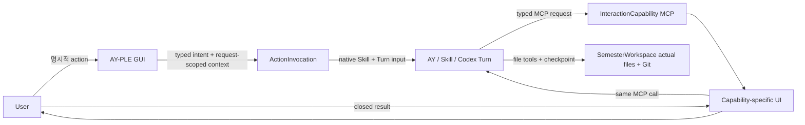
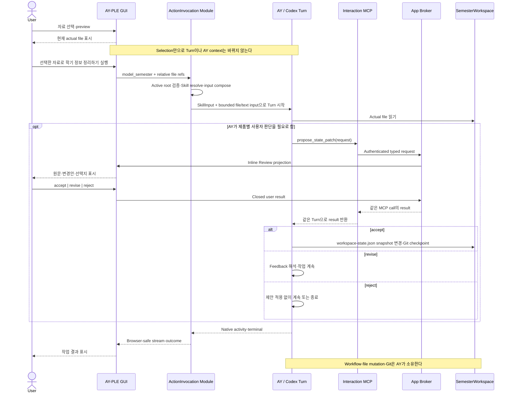

# AY–App Interaction Layer 아키텍처

작성일: 2026-07-28

최근 갱신: 2026-07-29

분류: 활성

성숙도: 구현됨

관련 문서: [CONTEXT.md](../../CONTEXT.md), [Protocol-driven AY–App Interaction Layer ADR](../adr/0021-adopt-a-protocol-driven-ay-app-interaction-layer.md), [MCP InteractionCapability ADR](../adr/0019-use-mcp-interaction-capabilities-as-the-ay-app-seam.md), [InteractionCapability 상세 아키텍처](ay-app-interaction-capabilities.md), [User-owned Git SemesterWorkspace ADR](../adr/0018-adopt-user-owned-git-semester-workspaces.md), [Codex Chat 구현 지도](codex-chat-implementation-map.md), [개발 백로그](../product/ay-ple-development-backlog.md)

## 목적

이 문서는 App GUI와 AY가 양방향으로 협력하는 장기 기술 mapping을 소유한다. 제품 가치와 범위는 Product Brief, 결정의 이유는 ADR 0021, 구현된 MCP transport·Broker 상세는 InteractionCapability 아키텍처, exact current package·endpoint topology와 gap은 Codex Chat 구현 지도가 소유한다.

AY-PLE의 seam은 특정 `ModelingRun`이나 MCP tool이 아니다. App이 이미 알고 있는 GUI 맥락을 AY 작업으로 전달하고, AY가 필요한 사용자 판단을 App-native UI로 다시 요청할 수 있게 하는 두 Interface의 조합이다.

| 방향 | Interface | Codex-native protocol | 현재 상태 |
| --- | --- | --- | --- |
| App → AY | `ActionInvocation` | Project-discovered Skill과 bounded Turn input | 구현됨 |
| AY → App → User → AY | `InteractionCapability` | Project-discovered custom MCP tool과 같은 call의 closed result | 구현됨 |

두 Interface는 시작 방향, 정상 결과와 failure lifecycle이 다르므로 하나의 generic envelope로 합치지 않는다. ActionInvocation은 Product Turn admission을 사용하고 InteractionCapability는 그 Turn 안에 nested된다. Active SemesterWorkspace·thread binding, activity projection과 interrupt·terminal coordination처럼 실제로 맞닿는 implementation만 재사용한다.

### SemesterModeling 용어와 식별자

| 층위 | 이름 | 상태와 의미 |
| --- | --- | --- |
| Domain work | `SemesterModeling` | 학업 사실을 `SemesterModel`로 정리하는 canonical 작업명 |
| Built-in Skill | `ay-ple-semester-modeling` | `SemesterModeling` workflow와 harness를 소유하는 현재 Skill identity |
| App command | `model_semester` | 선택한 `WorkspaceFileRef`를 작업 맥락으로 전달해 `SemesterModeling`을 시작하는 현재 ActionInvocation identity |
| Historical receipt | `ModelingRun` | 제거된 App-owned durable 실행 기록; 작업이나 capability의 이름으로 사용하지 않음 |

`model_semester`는 명령형이고 `SemesterModeling`은 작업명이므로 같은 개념을 다른 별칭으로 부르는 것이 아니다. 선택 자료는 invocation context일 뿐 capability의 identity가 아니며, command는 한 번에 전체 학기가 완성된다는 completeness를 약속하지 않는다. Exact current package topology는 [Codex Chat 구현 지도](codex-chat-implementation-map.md), 후속 범위는 [개발 백로그](../product/ay-ple-development-backlog.md)가 소유한다.

## 기록하는 아키텍처 관점

터미널이나 일반 Codex client도 SemesterWorkspace의 파일을 읽고 수정할 수 있다. AY-PLE이 별도로 존재하는 이유는 그 file capability를 다시 구현하기 위해서가 아니라, **App GUI에서 이미 표현된 사용자 의도와 맥락을 AY가 native하게 이해하고, AY가 필요한 사용자 판단을 다시 App-native UI로 요청할 수 있게 하기 위해서**다.

이 관점에서 Skill과 MCP는 개별 기능에 묶인 편의 도구가 아니라 AY–App Interaction을 확장하는 protocol이다.

| Protocol 역할 | 전달하는 의미 | App이 얻는 leverage |
| --- | --- | --- |
| Skill을 사용하는 `ActionInvocation` | 명시적 GUI action과 검증된 request-scoped context를 AY 작업으로 전달한다. | 사용자가 App에서 이미 고른 자료·옵션을 긴 prompt로 다시 설명하지 않는다. |
| MCP를 사용하는 `InteractionCapability` | AY가 작업 중 필요한 사용자 판단을 capability-specific UI에 요청하고 closed result를 같은 Turn에 돌려받는다. | 일반 텍스트 질문보다 원문·비교·선택지에 맞는 UX를 제공한다. |
| 두 protocol의 조합 | App action으로 시작한 AY 작업이 필요할 때 App UI round trip을 nested한다. | 기능별 App workflow engine 없이도 양방향 interaction을 구성한다. |

따라서 AY-PLE의 확장 seam은 `ModelingRun`, 특정 버튼이나 단일 MCP tool이 아니다. App과 AY 사이의 두 typed Interface가 seam이고, Skill·MCP·native Turn은 그 Interface 뒤에 숨기는 implementation이다.

## 제품 seam



App이 제공하는 leverage는 사용자가 GUI에서 이미 표현한 의도와 맥락을 다시 prompt로 번역하지 않아도 되고, AY가 필요한 판단을 일반 텍스트가 아니라 기능에 맞는 UI로 요청할 수 있다는 점이다. App은 이 interaction을 소유하지만 작업 절차와 실제 file mutation을 대신 소유하지 않는다.

### 대표 양방향 sequence

아래 sequence는 현재 구현된 `model_semester` ActionInvocation과 `propose_state_patch` InteractionCapability가 한 Turn에서 조합되는 대표 흐름이다.



이 sequence에서 App은 action 의미, file reference 검증과 사용자 UI round trip을 소유한다. AY는 Skill을 해석해 작업 순서를 정하고, MCP를 호출할지 판단하며, 결과를 실제 file에 적용한다. InteractionCapability는 별도 Product operation이 아니라 ActionInvocation이 시작한 Turn 안의 nested call이다.

## Protocol 중심 확장 모델

새 기능은 공통 Runtime에 기능별 분기를 계속 추가하는 방식이 아니라, 필요한 방향의 typed interaction을 더하는 방식으로 확장한다.

| 추가하려는 경험 | 추가하는 것 | 그대로 재사용하는 것 |
| --- | --- | --- |
| App의 명시적 조작으로 AY 작업 시작 | Typed GUI action, action definition, workspace-local Skill | Active workspace binding, Product Turn admission, activity·interrupt·terminal projection |
| AY가 새로운 형태의 사용자 판단 요청 | Typed MCP tool, closed result, capability-specific UI Adapter | Authenticated Broker binding, same-call settlement, failure lifecycle |
| 시작과 판단 왕복이 모두 필요한 기능 | 위 두 조합 | 같은 native Turn과 existing Interaction MCP lifecycle |

이 모델은 기능 추가를 “App interaction + Skill 또는 MCP”로 작게 유지하지만 arbitrary action registry나 generic event bus를 뜻하지 않는다. 각 action과 capability는 사용자 의미가 닫힌 typed Interface를 가지며, 공통 Module은 실제 두 번째 variation에서 확인된 mechanics만 숨긴다. Codex Runtime Adapter는 어떤 학업 기능인지 알지 않는 capability-neutral implementation으로 남는다.

### Skill-first Capability Expansion

새 학업 workflow는 기존 file·Git·native tool과 현재 AY–App Interaction Interface만으로 완결할 수 있으면 AY-PLE built-in Skill로 먼저 제공한다. 새 typed Interface는 Skill이 App에서 이미 표현한 맥락을 받을 수 없거나 작업 중 필요한 사용자 판단을 알맞은 UI로 왕복할 수 없다는 실제 gap이 확인될 때 추가한다.

| Capability shape | 추가하는 것 | App 변경 |
| --- | --- | --- |
| Skill-only | Built-in Skill의 workflow·reference·선택적 script | 없음 |
| Skill + existing interaction | Built-in Skill과 기존 ActionInvocation·InteractionCapability의 조합 | 기존 Interface 재사용 |
| New App interaction | Built-in Skill과 새 typed action 또는 MCP capability·UI Adapter | Gap에 필요한 좁은 Interface만 추가 |

이 구조의 leverage는 양방향이다. Built-in Skill 하나는 이미 구현된 App context·typed UI를 재사용하고, InteractionCapability 하나는 여러 현재·후속 Skill에서 사용할 수 있다. 따라서 catalog source의 갱신은 AY-PLE이 제공할 수 있는 capability set의 진화지만, 각 SemesterWorkspace의 실제 capability는 fresh Bootstrap과 Git checkpoint를 거친 installed Skill copy가 소유한다. Current development는 source 변경 뒤 disposable workspace를 재생성하며 long-lived workspace update lifecycle은 아직 제공하지 않는다.

### Model invocation과 explicit action

`ay-ple-semester-modeling`은 model-invoked Skill이면서 `model_semester` ActionInvocation이 명시적으로 선택하는 Skill이다. 두 invocation path는 같은 `SemesterModeling` workflow를 사용하고 input precondition을 Skill body에 중복하지 않는다.

| Invocation context | Skill의 해석 |
| --- | --- |
| `model_semester` ActionInvocation | App이 검증해 전달한 ordered `WorkspaceFileRef`를 현재 작업의 명시적인 자료 맥락으로 사용한다. |
| File reference나 구체적인 범위가 있는 normal Chat | 사용자가 대화에서 지정한 자료와 목적을 따라 관련 학업 사실을 모델링한다. |
| Broad normal Chat | 대화와 SemesterWorkspace에서 관련 문맥을 파악해 자연스럽게 범위를 정한다. 정확한 작업을 결정할 수 없는 실질적인 ambiguity가 남을 때만 일반 clarification을 사용한다. |

Explicit file reference가 없다는 사실 자체는 failure나 clarification trigger가 아니다. Skill은 `ActionInvocation: model_semester` marker를 required argument처럼 parse하지 않고, App action의 cardinality·path safety는 Action definition에 남긴다. 이 분리는 Skill의 workflow를 normal Chat에서도 재사용하면서 GUI invocation의 deterministic validation을 약화하지 않는다.

`SemesterModeling`의 source context는 여러 actual workspace file일 수 있지만 accepted canonical write target은 root `workspace-state.json`의 `snapshot`이다. Skill은 `SemesterWorkspaceState` envelope의 format·workspace·semester identity를 보존하고 학업 사실만 snapshot에 반영한다. Exact Course·Assignment·Exam·ScheduleEvent field schema와 lint는 아직 후속 contract이며, 이 storage placement 결정만으로 Skill body가 임의 field roster를 정본으로 만들지는 않는다.

Snapshot update는 deterministic merge engine이 아니라 AY가 수행하는 incremental reconciliation이다. Skill은 기존 snapshot을 먼저 읽고 현재 작업과 무관한 학업 사실을 보존하며, 새 evidence와 기존 사실의 충돌을 숨은 overwrite로 처리하지 않는 frame을 제공한다. `known | unknown | ambiguous`, 설명·근거와 Review는 정직성을 위한 guardrail이고, 어떤 source가 더 최신·신뢰할 만한지, conflict가 실제 모순인지와 어떤 질문이 필요한지는 AY가 대화와 workspace 문맥에서 판단한다. 사용자가 전체 재구성을 명시하지 않은 작업을 자동 full rebuild로 번역하지 않는다.

### Review-before-write harness

`SemesterModeling`의 mutation policy는 현재 runtime enforcement가 아니라 instruction-led harness다.

| Owner | 책임 |
| --- | --- |
| `ay-ple-semester-modeling` Skill | Snapshot change를 draft하고 `propose_state_patch`를 호출하며 `accept | revise | reject` 결과에 따라 다음 행동을 정한다. |
| Interaction MCP tool description | 한 semantic state change를 적용하기 전에 사용자 Review를 받는 tool이라는 의미를 AY에게 제공한다. |
| InteractionCapability Module·App | Valid request를 UI로 왕복하고 closed result 또는 failure를 정확히 한 번 반환한다. Tool 호출을 file permission으로 바꾸거나 accepted result를 대신 적용하지 않는다. |
| SemesterWorkspace `AGENTS.md` | 일반 workspace·Git 원칙만 제공한다. SemesterModeling 전용 Review 순서를 중복하지 않는다. |
| Conformance | 대표 ActionInvocation과 model-invoked path가 Review 전 snapshot을 바꾸지 않고 수락 뒤 의도한 write만 수행하는지 관찰한다. |

App Hook이 이 정책을 실질적으로 강제하려면 native write를 intercept하는 것만으로는 부족하고 accepted semantic proposal을 exact snapshot diff와 결합해야 한다. 이는 App-owned apply ledger와 workflow 의미를 다시 도입하는 별도 Module이다. Current dogfood에서는 instruction과 actual trace가 graceful하게 동작하는지 먼저 관찰하고, 반복된 bypass나 여러 workflow에 공통된 enforcement 요구가 생길 때만 그 seam을 다시 연다.

## `ActionInvocation`: App이 시작하는 작업

`ActionInvocation`은 명시적인 GUI action과 그 시점의 검증된 App 맥락을 한 번의 AY 작업으로 전달한다. 첫 채택 사례의 current 구현은 source explorer에서 선택한 ordered relative file ref 목록을 `model_semester` action request로 동결하고 workspace-local `ay-ple-semester-modeling` Skill과 함께 native Turn에 전달한다.

### Interface 규칙

| 규칙 | 의미 |
| --- | --- |
| Explicit invocation | Preview, tab 이동, checkbox와 selection 변화만으로 AY 입력을 바꾸지 않는다. 사용자가 목적이 분명한 action을 실행해야 invocation이 생긴다. |
| Typed intent | Browser는 raw click이나 arbitrary payload가 아니라 `model_semester`처럼 closed action contract를 보낸다. |
| Request-scoped context | Invocation 시작 시 선택한 relative path 목록을 동결하고 active SemesterWorkspace 안의 current safe path인지 fresh 검증한다. File bytes나 content version, durable selection과 source registry는 만들지 않는다. |
| Host-owned binding | Browser는 workspace root, absolute path, Skill path, `threadId`·`turnId`와 native input type을 보내지 않는다. |
| One invocation, one Turn | 유효한 invocation 하나는 startup-approved thread에 fresh native Turn 하나를 시작한다. Retry는 fresh invocation과 Turn이다. |
| Fail closed | Unknown action, invalid·stale·out-of-root file, missing expected Skill, busy operation과 Runtime failure는 Turn을 부분 시작하거나 다른 action으로 낮추지 않는다. |
| Capability-specific semantics | Action definition은 입력 cardinality, 필요한 UI와 Skill 의미를 소유한다. 공통 Module은 학업 workflow나 prompt sequence를 해석하지 않는다. |
| Transient operation | Invocation과 native correlation은 current process의 Product operation으로 관측한다. App-owned durable run이나 duplicate Turn ledger를 만들지 않는다. |

### Native composition

App-facing contract와 Codex-native input 사이에는 Adapter seam을 둔다.

| 제품 입력 | Adapter가 숨기는 native mapping |
| --- | --- |
| Action identity | Active workspace의 effective Skill catalog에서 action이 요구하는 workspace-local Skill을 resolve한다. |
| `WorkspaceFileRef` | Exact active root containment, regular-file identity와 action bound를 검증한 뒤 Skill이 읽을 수 있는 file reference로 렌더링한다. |
| Action arguments | Skill contract에 필요한 bounded `TextInput`으로 렌더링한다. |
| Action settings | Current advertised model·reasoning·service tier와 action permission policy를 native Turn 설정으로 번역한다. |
| Product operation | Native thread·turn identity와 activity stream을 Browser-safe frame, interrupt와 terminal 상태로 투영한다. |

`WorkspaceFileRef`는 한 invocation이 active SemesterWorkspace의 실제 사용자 file을 가리키는 request-scoped relative reference다. Path 목록은 invocation에 고정되지만 content version은 고정되지 않으므로 같은 safe path의 bytes가 바뀌면 AY는 actual read 시점의 current file을 만난다. Exact version을 Review 근거로 묶는 `EvidenceRef`, `RawMaterial`, source copy나 filesystem permission이 아니다.

Initial native mapping은 official SDK가 이미 제공하는 `SkillInput`과 bounded `TextInput`을 순서대로 사용한다. App action definition은 effective catalog에서 확인한 workspace-local Skill의 host-only name·path를 `SkillInput`으로 전달하고, 선택한 actual file은 basename label·workspace-relative destination의 Codex-style Markdown file-reference text로 bounded `TextInput`에 렌더링한다. 여기서 escaping은 general CommonMark URL encoding이 아니라 Desktop composer의 lossless file-path serializer를 따른다. Absolute path를 사용하는 Desktop composer와 달리 AY-PLE은 exact workspace root를 Runtime `cwd`로 고정하고 Browser에 root를 노출하지 않으므로 POSIX relative path를 link destination으로 사용한다.

Official Codex source에서 Desktop rich composer의 local-file link와 terminal file search 결과는 모두 generic user text로 Turn에 전달되고 local file bytes나 `MentionInput`으로 변환되지 않는다. `MentionInput`은 generic local file이 아닌 Codex resource identity를 운반하는 별도 입력이다. 격리 prototype `prototype/action-invocation-native-mapping@b7c1fcd45`은 current pinned Runtime에서 `[SkillInput, TextInput]` 순서가 workspace-local Skill body를 주입하고 선택 file을 실제 root에서 읽게 하며, project-discovered Interaction MCP를 같은 Turn에 유지한다는 것을 확인했다. 따라서 initial mapping은 `MentionInput`이나 SDK patch를 추가하지 않는다.

### Action 확장

새 App-originated 기능은 다음 세 부분을 추가한다.

1. 목적이 분명한 GUI action과 exact Browser input codec
2. Action input을 검증하고 workspace-local Skill·native input으로 compose하는 typed action definition
3. Capability-specific progress·terminal UI와 Interface-level contract test

Current single action은 `model-semester-action` definition이 required `ay-ple-semester-modeling` identity, input validation과 native composition을 한곳에서 소유한다. 이를 위해 별도 generic Skill registry나 공용 action→Skill mapping Module을 만들지 않는다. Action이 늘어나면 App source의 closed typed roster에 definition을 명시적으로 등록하되 Workspace에 arbitrary action manifest나 UI schema를 두어 동적으로 렌더링하지 않는다. 두 번째 실제 action에서 composition variation이 확인되면 공통 primitive를 내부 Module로 추출하고 raw native input builder는 Browser에 공개하지 않는다.

## `InteractionCapability`: AY가 시작하는 사용자 interaction

`InteractionCapability`는 AY가 작업 중 MCP tool을 호출하면 App이 기능별 UI를 보여주고 closed result를 같은 MCP call과 Turn에 반환하는 Interface다. `propose_state_patch`와 Semantic Review는 첫 구현 사례다.

Typed MCP request/result, App Broker의 authenticated Runtime binding, pending slot, once-only settlement, capability-specific UI, evidence resolution과 continuity failure의 상세 contract는 [InteractionCapability 아키텍처](ay-app-interaction-capabilities.md)가 소유한다.

새 AY-originated 기능은 다음 세 부분을 추가한다.

1. 목적이 분명한 MCP tool의 typed request와 closed result
2. App Broker의 Browser-safe projection과 capability-specific UI Adapter
3. 정상 result와 `busy`·interrupt·timeout·disconnect를 구분하는 Interface-level contract test

한 기능은 ActionInvocation만, InteractionCapability만 또는 둘 다 사용할 수 있다. 예를 들어 `model_semester`는 App action으로 Skill Turn을 시작하고, 같은 Turn의 Skill은 필요할 때 기존 `propose_state_patch`를 호출해 Review를 받을 수 있다. App은 두 호출 사이의 학업 workflow 순서를 소유하지 않는다.

## 공유 execution infrastructure

두 Interface는 하나의 중앙 workflow engine이나 동등한 두 Product operation이 아니다. ActionInvocation은 normal Chat과 같은 Product Turn admission을 사용하고, InteractionCapability는 이미 실행 중인 Chat 또는 ActionInvocation Turn 안에 nested된다. 아래 mechanics만 현재 graph에서 재사용하거나 실제 variation이 확인될 때 깊은 Module로 추출한다.

| 공통 책임 | 현재 owner 또는 재사용 방향 | 공유하지 않는 의미 |
| --- | --- | --- |
| Active root·Runtime·thread binding | Prepared workspace startup과 `CodexChatService` | Action payload와 Skill workflow |
| Product operation admission | Process-local product Turn coordinator가 Chat·ActionInvocation만 admission | InteractionCapability의 별도 operation·Turn, durable run, queue와 retry policy |
| Native Turn start·activity | `@ay-ple/codex-chat-runtime`의 capability-neutral Adapter가 Chat·ActionInvocation Turn을 실행 | GUI action과 MCP capability schema |
| Browser stream·terminal projection | Server operation coordinator와 product contract | Raw native identity와 protocol frame |
| Interrupt·disconnect settlement | Existing Product operation lifecycle | 사용자 Review result와 file apply |
| MCP same-Turn round trip | Interaction Broker | ActionInvocation의 input validation |
| Workspace file validation | Active-root source safety 규칙을 재사용하는 invocation-local resolver | Source registry, copy와 durable selection |

Normal Chat은 existing free-form Turn input으로 유지한다. Chat에 현재 explorer selection을 암묵적으로 붙이지 않으며, typed ActionInvocation을 Chat request의 optional `materials` field로 축약하지 않는다. Chat과 ActionInvocation은 같은 product operation lifecycle과 native thread를 재사용하되 서로 다른 Browser contract를 가진다.

ActionInvocation으로 시작한 Turn도 project-discovered Interaction MCP를 그대로 사용할 수 있어야 한다. 따라서 `model_semester`의 end-to-end 흐름은 아래와 같다.

```text
명시적 source selection + action
→ ActionInvocation input freeze·validation
→ workspace-local Skill resolve
→ native SkillInput + bounded file/text input
→ existing Product Turn stream
→ optional InteractionCapability request
→ App-native UI와 same-call result
→ AY-owned actual-file mutation·Git checkpoint
```

## 소유권과 상태

| 주체 | 소유하는 것 | 소유하지 않는 것 |
| --- | --- | --- |
| 사용자 | 명시적 GUI action, capability UI의 최종 선택, 학기 자료의 의미 | Native protocol과 correlation |
| AY·Skill | Workflow, 자료 해석, InteractionCapability 호출 시점과 result 해석, 실제 file mutation·Git checkpoint | App UI lifecycle과 Browser transport |
| App SourceProjection | Current filesystem의 bounded on-demand read-only list·preview와 request-boundary safety validation | Actual file authority, reusable snapshot·cache, file mutation·Git |
| App action definition | GUI intent 의미, request-scoped path 목록과 freshness semantics, Turn 전 안전 검증, workspace Skill 요구와 native composition 요청 | Exact content snapshot, AY reader identity, Skill prompt sequence, file apply와 Git |
| Interaction MCP Module | AY-originated typed request/result와 App UI round trip | ActionInvocation과 학업 workflow |
| Product operation infrastructure | Active Runtime·thread admission, stream, interrupt와 terminal settlement | Durable run history와 기능 payload 의미 |
| Codex Runtime Adapter | Capability-neutral native input·Turn 실행과 activity projection | App action·MCP UI의 제품 의미 |
| SemesterWorkspace | 실제 학기 file, `workspace-state.json.snapshot`의 `SemesterModel`, workspace-local Skill·config와 Git history | Pending invocation·interaction과 Runtime identity |

Durable state는 actual workspace file, tracked Skill·config, Git history, `WorkspaceRegistry`와 native conversation에 둔다. Browser selection, ActionInvocation의 frozen path 목록, Product operation, pending InteractionCapability, validated evidence preview와 settled inline presentation은 transient다. `WorkspaceFileRef`의 current-path semantics와 `EvidenceRef`의 exact content-version semantics를 서로 대신 사용하지 않는다.

## 현재 구현과 확장 target

| 영역 | 현재 구현 | 채택 target |
| --- | --- | --- |
| App-originated Turn | Normal Chat의 bounded text·settings와 Chat과 별도인 typed `model_semester` ActionInvocation | 같은 closed contract로 action별 정의를 추가할 수 있음 |
| Source interaction | Preview와 독립적인 safe regular-file transient multi-file selection을 명시적 action에서만 동결. `text | pdf | unsupported`는 preview capability일 뿐 action 적격성을 제한하지 않음 | 유지. Source registry·durable selection은 만들지 않음 |
| Native input | Normal Chat은 `[TextInput]`, action은 workspace-local `[SkillInput, TextInput]` | Local file carrier 변경은 actual case와 official contract 검증 뒤 별도 채택 |
| Product contract | Chat·source projection·interaction result와 별도 closed ActionInvocation request·shared stream | Unknown action·native input·absolute path를 계속 거절 |
| Server operation | `sendChat`과 validated action이 같은 admission·stream·interaction lifecycle을 사용 | 기능별 validation만 action definition에 추가 |
| AY-originated UI | `propose_state_patch` MCP와 general native clarification | 기존 Interface 유지, 새 typed MCP capability 추가 가능 |
| 실행 기록 | Native Turn과 process-local operation | 유지. Durable `ModelingRun`을 복원하지 않음 |

현재 구현은 reverse InteractionCapability와 normal Chat에 더해 GUI의 explicit source selection을 `model_semester` Product Turn으로 연결한다. First Assignment 대표 vertical은 이 양방향 seam과 `SemesterModel` snapshot write까지 완료됐다. 현재 package topology와 검증 표면은 [Codex Chat 구현 지도](codex-chat-implementation-map.md), 후속 범위는 [개발 백로그](../product/ay-ple-development-backlog.md)가 소유한다.

## 검증 seam

| Surface | 증명할 것 |
| --- | --- |
| Product contract | Unknown action, arbitrary native fields, absolute path와 implicit Chat material을 거절한다. |
| ActionInvocation Module | Exact action→Skill 요구, fresh file validation, input order·bound와 failure-before-Turn을 검증한다. |
| Runtime Adapter | Official SDK로 exact Skill+text/file input을 전달하고 existing patch stack을 늘리지 않는다. |
| Server operation | Chat과 action이 같은 admission·interrupt·terminal 규칙을 따르고 MCP request가 같은 action-started Turn에 결합된다. |
| Browser E2E | Preview·selection만으로 Turn이 시작되지 않고 명시적 action에서만 선택 file이 전달된다. |
| Actual workspace trace | Workspace-local Skill이 actual file을 읽고 InteractionCapability round trip 뒤 AY가 `workspace-state.json.snapshot`과 Git checkpoint를 소유한다. |

Production Browser→Server Adapter와 deterministic Browser fixture는 같은 ActionInvocation contract와 Product operation frame decoder를 검증한다. Production Broker와 in-memory UI Adapter는 같은 InteractionCapability Interface를 검증한다. Raw SDK·MCP identity를 테스트 편의를 위해 제품 Interface에 추가하지 않는다.

## 의도적으로 만들지 않는 것

- 모든 Browser·App·MCP event를 운반하는 generic event bus
- Arbitrary JSON schema에서 action이나 UI를 자동 생성하는 renderer
- Workspace가 선언한 임의 native input을 App이 무검증 실행하는 dynamic action registry
- App-owned 학업 workflow engine과 prompt sequence
- App-owned `RawMaterial`, source copy·snapshot·durable selection
- Durable `ModelingRun`, duplicate Turn ledger와 academic event sourcing
- ActionInvocation과 InteractionCapability를 하나의 success/failure union으로 합치는 protocol
- MCP result를 native execution approval이나 file mutation authority로 사용하는 결합
- 첫 action만으로 미래 모든 composition primitive와 concurrency policy를 선제 고정하는 framework
