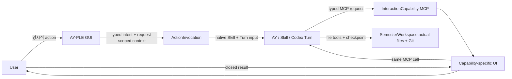

# AY–App Interaction Layer 아키텍처

작성일: 2026-07-28

분류: 활성

성숙도: 채택

관련 문서: [CONTEXT.md](../../CONTEXT.md), [Protocol-driven AY–App Interaction Layer ADR](../adr/0021-adopt-a-protocol-driven-ay-app-interaction-layer.md), [MCP InteractionCapability ADR](../adr/0019-use-mcp-interaction-capabilities-as-the-ay-app-seam.md), [InteractionCapability 상세 아키텍처](ay-app-interaction-capabilities.md), [User-owned Git SemesterWorkspace ADR](../adr/0018-adopt-user-owned-git-semester-workspaces.md), [Codex Chat 구현 지도](codex-chat-implementation-map.md), [개발 백로그](../product/ay-ple-development-backlog.md)

## 목적

이 문서는 App GUI와 AY가 양방향으로 협력하는 장기 기술 mapping을 소유한다. 제품 가치와 범위는 Product Brief, 결정의 이유는 ADR 0021, 구현된 MCP transport·Broker 상세는 InteractionCapability 아키텍처, exact current package·endpoint topology와 gap은 Codex Chat 구현 지도가 소유한다.

AY-PLE의 seam은 특정 `ModelingRun`이나 MCP tool이 아니다. App이 이미 알고 있는 GUI 맥락을 AY 작업으로 전달하고, AY가 필요한 사용자 판단을 App-native UI로 다시 요청할 수 있게 하는 두 Interface의 조합이다.

| 방향 | Interface | Codex-native protocol | 현재 상태 |
| --- | --- | --- | --- |
| App → AY | `ActionInvocation` | Project-discovered Skill과 bounded Turn input | 채택·미구현 |
| AY → App → User → AY | `InteractionCapability` | Project-discovered custom MCP tool과 같은 call의 closed result | 구현됨 |

두 Interface는 시작 방향, 정상 결과와 failure lifecycle이 다르므로 하나의 generic envelope로 합치지 않는다. ActionInvocation은 Product Turn admission을 사용하고 InteractionCapability는 그 Turn 안에 nested된다. Active SemesterWorkspace·thread binding, activity projection과 interrupt·terminal coordination처럼 실제로 맞닿는 implementation만 재사용한다.

## 제품 seam



App이 제공하는 leverage는 사용자가 GUI에서 이미 표현한 의도와 맥락을 다시 prompt로 번역하지 않아도 되고, AY가 필요한 판단을 일반 텍스트가 아니라 기능에 맞는 UI로 요청할 수 있다는 점이다. App은 이 interaction을 소유하지만 작업 절차와 실제 file mutation을 대신 소유하지 않는다.

## `ActionInvocation`: App이 시작하는 작업

`ActionInvocation`은 명시적인 GUI action과 그 시점의 검증된 App 맥락을 한 번의 AY 작업으로 전달한다. 첫 채택 사례는 source explorer에서 선택한 실제 workspace file을 `organize_sources` action으로 동결하고 workspace-local Skill과 함께 native Turn에 전달하는 흐름이다.

### Interface 규칙

| 규칙 | 의미 |
| --- | --- |
| Explicit invocation | Preview, tab 이동, checkbox와 selection 변화만으로 AY 입력을 바꾸지 않는다. 사용자가 목적이 분명한 action을 실행해야 invocation이 생긴다. |
| Typed intent | Browser는 raw click이나 arbitrary payload가 아니라 `organize_sources`처럼 closed action contract를 보낸다. |
| Request-scoped context | 선택 file은 invocation 시작 시점에 동결하고 active SemesterWorkspace 안의 relative reference로 fresh 검증한다. Durable selection이나 source registry를 만들지 않는다. |
| Host-owned binding | Browser는 workspace root, absolute path, Skill path, `threadId`·`turnId`와 native input type을 보내지 않는다. |
| One invocation, one Turn | 유효한 invocation 하나는 startup-approved thread에 fresh native Turn 하나를 시작한다. Retry는 fresh invocation과 Turn이다. |
| Fail closed | Unknown action, invalid·stale·out-of-root file, missing expected Skill, busy operation과 Runtime failure는 Turn을 부분 시작하거나 다른 action으로 낮추지 않는다. |
| Capability-specific semantics | Action definition은 입력 cardinality, 필요한 UI와 Skill 의미를 소유한다. 공통 Module은 학업 workflow나 prompt sequence를 해석하지 않는다. |
| Transient operation | Invocation과 native correlation은 current process의 Product operation으로 관측한다. App-owned durable run이나 duplicate Turn ledger를 만들지 않는다. |

### Native composition

App-facing contract와 Codex-native input 사이에는 Adapter seam을 둔다.

| 제품 입력 | Adapter가 숨기는 native mapping |
| --- | --- |
| Action identity | Active workspace의 effective Skill catalog에서 action이 요구하는 workspace-local Skill을 resolve한다. |
| `WorkspaceFileRef` | Exact active root containment, regular-file identity와 action bound를 검증한 뒤 Skill이 읽을 수 있는 file reference로 렌더링한다. |
| Action arguments | Skill contract에 필요한 bounded `TextInput`으로 렌더링한다. |
| Action settings | Current advertised model·reasoning·service tier와 action permission policy를 native Turn 설정으로 번역한다. |
| Product operation | Native thread·turn identity와 activity stream을 Browser-safe frame, interrupt와 terminal 상태로 투영한다. |

`WorkspaceFileRef`는 한 invocation이 active SemesterWorkspace의 실제 사용자 file을 가리키는 request-scoped relative reference다. `RawMaterial`, source copy, `EvidenceRef`나 filesystem permission이 아니다.

Initial native mapping은 official SDK가 이미 제공하는 `SkillInput`과 bounded `TextInput`을 우선 재사용한다. Local file carrier를 native `MentionInput`, rendered Markdown path 또는 다른 official input으로 표현할지는 actual probe로 의미를 확인한 Adapter implementation 결정이다. 이 선택은 Browser contract나 action definition을 바꾸지 않아야 하며 새 SDK patch를 기본 전제로 삼지 않는다.

### Action 확장

새 App-originated 기능은 다음 세 부분을 추가한다.

1. 목적이 분명한 GUI action과 exact Browser input codec
2. Action input을 검증하고 workspace-local Skill·native input으로 compose하는 typed action definition
3. Capability-specific progress·terminal UI와 Interface-level contract test

Action definition은 App source가 소유하는 typed catalog에 명시적으로 등록한다. Workspace에 arbitrary action manifest나 UI schema를 두어 동적으로 렌더링하지 않는다. 두 번째 실제 action에서 composition variation이 확인되면 공통 primitive를 내부 Module로 추출하되, raw native input builder를 Browser에 공개하지 않는다.

## `InteractionCapability`: AY가 시작하는 사용자 interaction

`InteractionCapability`는 AY가 작업 중 MCP tool을 호출하면 App이 기능별 UI를 보여주고 closed result를 같은 MCP call과 Turn에 반환하는 Interface다. `propose_state_patch`와 Semantic Review는 첫 구현 사례다.

Typed MCP request/result, App Broker의 authenticated Runtime binding, pending slot, once-only settlement, capability-specific UI, evidence resolution과 continuity failure의 상세 contract는 [InteractionCapability 아키텍처](ay-app-interaction-capabilities.md)가 소유한다.

새 AY-originated 기능은 다음 세 부분을 추가한다.

1. 목적이 분명한 MCP tool의 typed request와 closed result
2. App Broker의 Browser-safe projection과 capability-specific UI Adapter
3. 정상 result와 `busy`·interrupt·timeout·disconnect를 구분하는 Interface-level contract test

한 기능은 ActionInvocation만, InteractionCapability만 또는 둘 다 사용할 수 있다. 예를 들어 `organize_sources`는 App action으로 Skill Turn을 시작하고, 같은 Turn의 Skill은 필요할 때 기존 `propose_state_patch`를 호출해 Review를 받을 수 있다. App은 두 호출 사이의 학업 workflow 순서를 소유하지 않는다.

## 공유 execution infrastructure

두 Interface는 하나의 중앙 workflow engine이나 동등한 두 Product operation이 아니다. ActionInvocation은 normal Chat과 같은 Product Turn admission을 사용하고, InteractionCapability는 이미 실행 중인 Chat 또는 ActionInvocation Turn 안에 nested된다. 아래 mechanics만 현재 graph에서 재사용하거나 실제 variation이 확인될 때 깊은 Module로 추출한다.

| 공통 책임 | 현재 owner 또는 재사용 방향 | 공유하지 않는 의미 |
| --- | --- | --- |
| Active root·Runtime·thread binding | Prepared workspace startup과 `CodexChatService` | Action payload와 Skill workflow |
| Product operation admission | Process-local product Turn coordinator가 Chat·ActionInvocation만 admission | InteractionCapability의 별도 operation·Turn, durable run, queue와 retry policy |
| Native Turn start·activity | `@ay-ple/codex-chat-runtime`의 capability-neutral Adapter가 Chat·ActionInvocation Turn을 실행 | GUI action과 MCP capability schema |
| Browser stream·terminal projection | Server operation coordinator와 product contract | Raw native identity와 protocol frame |
| Interrupt·disconnect settlement | Existing Product operation lifecycle | 사용자 Review result와 file apply |
| MCP same-Turn round trip | Interaction Broker | ActionInvocation의 input validation |
| Workspace file validation | Active-root source safety 규칙을 재사용하는 invocation-local resolver | Source registry, copy와 durable selection |

Normal Chat은 existing free-form Turn input으로 유지한다. Chat에 현재 explorer selection을 암묵적으로 붙이지 않으며, typed ActionInvocation을 Chat request의 optional `materials` field로 축약하지 않는다. Chat과 ActionInvocation은 같은 product operation lifecycle과 native thread를 재사용하되 서로 다른 Browser contract를 가진다.

ActionInvocation으로 시작한 Turn도 project-discovered Interaction MCP를 그대로 사용할 수 있어야 한다. 따라서 `organize_sources`의 end-to-end 흐름은 아래와 같다.

```text
명시적 source selection + action
→ ActionInvocation input freeze·validation
→ workspace-local Skill resolve
→ native SkillInput + bounded file/text input
→ existing Product Turn stream
→ optional InteractionCapability request
→ App-native UI와 same-call result
→ AY-owned actual-file mutation·Git checkpoint
```

## 소유권과 상태

| 주체 | 소유하는 것 | 소유하지 않는 것 |
| --- | --- | --- |
| 사용자 | 명시적 GUI action, capability UI의 최종 선택, 학기 자료의 의미 | Native protocol과 correlation |
| AY·Skill | Workflow, 자료 해석, InteractionCapability 호출 시점과 result 해석, 실제 file mutation·Git checkpoint | App UI lifecycle과 Browser transport |
| App action definition | GUI intent 의미, request-scoped context validation, workspace Skill 요구와 native composition 요청 | Skill prompt sequence, file apply와 Git |
| Interaction MCP Module | AY-originated typed request/result와 App UI round trip | ActionInvocation과 학업 workflow |
| Product operation infrastructure | Active Runtime·thread admission, stream, interrupt와 terminal settlement | Durable run history와 기능 payload 의미 |
| Codex Runtime Adapter | Capability-neutral native input·Turn 실행과 activity projection | App action·MCP UI의 제품 의미 |
| SemesterWorkspace | 실제 학기 file, workspace-local Skill·config와 Git history | Pending invocation·interaction과 Runtime identity |

Durable state는 actual workspace file, tracked Skill·config, Git history, `WorkspaceRegistry`와 native conversation에 둔다. Browser selection, ActionInvocation input snapshot, Product operation, pending InteractionCapability, validated evidence preview와 settled inline presentation은 transient다.

## 채택 target과 현재 구현

| 영역 | 현재 구현 | 채택 target |
| --- | --- | --- |
| App-originated Turn | Normal Chat의 bounded text·settings | Chat과 별도인 typed ActionInvocation |
| Source interaction | 단일 preview selection, AY input과 독립 | 명시적 multi-file action에서만 request-scoped input 동결 |
| Native input | `TextInput` 하나 | Action별 workspace-local `SkillInput`과 bounded file/text composition |
| Product contract | Chat·source projection·interaction result | 별도 closed ActionInvocation request·stream |
| Server operation | `sendChat`과 shared interaction lifecycle | 같은 admission·stream 위의 typed action invocation |
| AY-originated UI | `propose_state_patch` MCP와 general native clarification | 기존 Interface 유지, 새 typed MCP capability 추가 가능 |
| 실행 기록 | Native Turn과 process-local operation | 유지. Durable `ModelingRun`을 복원하지 않음 |

현재 구현은 reverse InteractionCapability와 normal Chat을 end-to-end 검증했지만, GUI source selection에서 workspace Skill과 file reference를 native Turn으로 전달하는 ActionInvocation은 제거된 상태다. 구현 지도와 테스트는 이 gap을 완료된 First Assignment로 표현하지 않는다.

## 검증 seam

| Surface | 증명할 것 |
| --- | --- |
| Product contract | Unknown action, arbitrary native fields, absolute path와 implicit Chat material을 거절한다. |
| ActionInvocation Module | Exact action→Skill 요구, fresh file validation, input order·bound와 failure-before-Turn을 검증한다. |
| Runtime Adapter | Official SDK로 exact Skill+text/file input을 전달하고 existing patch stack을 늘리지 않는다. |
| Server operation | Chat과 action이 같은 admission·interrupt·terminal 규칙을 따르고 MCP request가 같은 action-started Turn에 결합된다. |
| Browser E2E | Preview·selection만으로 Turn이 시작되지 않고 명시적 action에서만 선택 file이 전달된다. |
| Actual workspace trace | Workspace-local Skill이 actual file을 읽고 InteractionCapability round trip 뒤 AY가 실제 file과 Git checkpoint를 소유한다. |

ActionInvocation 구현 시 production Browser→Server Adapter와 deterministic in-memory Adapter는 같은 ActionInvocation contract를 검증해야 한다. 현재 production Broker와 in-memory UI Adapter는 같은 InteractionCapability Interface를 검증한다. Raw SDK·MCP identity를 테스트 편의를 위해 제품 Interface에 추가하지 않는다.

## 의도적으로 만들지 않는 것

- 모든 Browser·App·MCP event를 운반하는 generic event bus
- Arbitrary JSON schema에서 action이나 UI를 자동 생성하는 renderer
- Workspace가 선언한 임의 native input을 App이 무검증 실행하는 dynamic action registry
- App-owned 학업 workflow engine과 prompt sequence
- App-owned `RawMaterial`, source copy·snapshot·durable selection
- Durable `ModelingRun`, duplicate Turn ledger와 academic event sourcing
- ActionInvocation과 InteractionCapability를 하나의 success/failure union으로 합치는 protocol
- MCP result를 native execution approval이나 file mutation authority로 사용하는 결합
- 첫 action만으로 미래 모든 composition primitive와 concurrency policy를 선제 고정하는 framework
