# Codex Chat 구현 지도

작성일: 2026-07-17

최근 검증: 2026-07-20

분류: 활성

성숙도: 구현됨

관련 문서: [Codex Chat-only cutover ADR](../adr/0012-adopt-codex-chat-only-and-remove-legacy-runtime-surfaces.md), [Official Codex Python SDK 재사용 ADR](../adr/0011-reuse-official-codex-python-sdk-for-chat-shell.md), [Codex Runtime 격리](codex-runtime-isolation.md), [Codex-native 제품 작업 조합](codex-native-product-composition.md), [first-vertical runtime sufficiency Wayfinder](../wayfinding/codex-chat-application-foundation/map.md), [runtime package README](../../packages/codex-chat-runtime/README.md), [product contract README](../../packages/product-contract/README.md), [server README](../../apps/server/README.md), [Chat Shell README](../../apps/chat-shell/README.md)

## 목적

Tracked repository에 남은 Codex Chat runtime의 현재 module, HTTP·Browser 경계, process lifecycle과 검증 표면을 한눈에 설명한다. 채택 이유와 삭제·복구 원칙은 ADR 0012, package별 사용법과 세부 명령은 각 README, 제품 작업 순서는 Development Backlog가 소유한다.

Runtime Harness, Runtime Inspector, `HeadlessCodexClientHost`와 generated legacy protocol inventory는 current topology가 아니다. 이들의 당시 구현과 교훈은 Git history와 완료·역사 문서에 남지만 executable fallback이나 compatibility surface로 해석하지 않는다.

## 현재 결론

| 질문 | 현재 답 |
| --- | --- |
| Maintained runtime은 무엇인가? | Official Python SDK를 재사용하는 `@ay-ple/codex-chat-runtime` 하나다. Generic engine Interface나 두 번째 runtime adapter는 없다. |
| Browser가 App Server와 직접 통신하는가? | 아니다. `@ay-ple/chat-shell`의 mounted product workbench는 `@ay-ple/product-contract`와 local Express Server의 `/api/product/*`만 사용한다. `/api/codex-chat/*`와 browser-safe native contract는 Chat-only conformance 표면으로 남지만 product transcript에 혼합하지 않는다. |
| Native identity를 제품 ID로 다시 만드는가? | 아니다. Product path는 Server가 발급한 opaque public operation·interaction·patch·decision binding만 Browser에 투영하고 exact response에 echo한다. Native `threadId`, `turnId`, request identity와 private bridge correlation은 Browser로 나가지 않는다. Chat-only tracer는 native identity를 관계적으로 보존한다. |
| Persistent child lifecycle은 누가 소유하는가? | `createServerApplication()`이 listener와 `CodexChatService`를 함께 소유하고, runtime close와 process-tree disappearance까지 같은 shutdown promise로 정산한다. |
| Runtime과 workspace는 어떻게 선택하는가? | 현재 Chat은 여섯 explicit absolute `CODEX_CHAT_*` path를 검증한다. Root `npm run dev -- --app-data-root <absolute-path>`는 explicit `packageRoot`·`appDataRoot`와 materialize한 초기 workspace를 Server에 주입하고, Browser의 workspace activation은 macOS chooser 결과를 같은 root들과 교차 검증한다. 어느 경로도 legacy env, 저장소의 `.ay-ple` 또는 `process.cwd()`로 fallback하지 않는다. |
| Current clone의 local legacy residue는 남아 있는가? | 아니다. Current-clone deletion handoff는 [Ticket 004](../tickets/2026-07-17-codex-chat-only-cutover/004-delete-legacy-residue-and-handoff.md)에서 완료했다. Current topology에는 legacy fallback이나 자동 cleanup command가 없으며 다른 clone·external path 상태를 추론하지 않는다. |
| 제품의 `ModelingRun`까지 구현됐는가? | Server의 First Assignment action은 exact admission 뒤 native call 전에 requested Skill path·version과 source digest를 포함한 durable `ModelingRun(starting)`을 current v2 product store에 기록하고 acceptance·terminal·validation·unknown outcome을 같은 receipt에 정산한다. Pre-006 v2 shape를 자동 migration하거나 rewrite하지 않는다. Public bootstrap은 terminal Run의 safe receipt만 반환하고 Browser는 transient action 단계와 학생용 activity를 cumulative transcript에 표시한다. 실제 provider conformance는 후속 ticket이 소유한다. |
| Native Plan interaction은 어디까지 열렸는가? | Exact official SDK와 production wheel, private bridge와 Node `CodexProductCapableRuntime`이 first-party advertised default model로 native Plan `collaborationMode`, typed `request_user_input`, opaque answer/cancel과 curated activity를 제공한다. Server는 일반 clarification을 ephemeral binding으로 answer/cancel하고, private hosted `propose_state_patch` MCP의 exact same-Turn Review는 product commit 뒤 native answer를 보낸다. Browser는 둘을 별도 UI·route로 연결했으며 nominal Review에는 working accept만 제공한다. 수정 요청·거절은 후속 slice다. |
| 이 tracer가 제품 runtime으로 충분한가? | Deterministic Chromium→Vite→Express→product store/runtime trace가 explicit workspace, exact Skill+Text, private MCP proposal, Review commit·answer, authoritative terminal과 reload를 증명한다. Actual-child·local/live-provider conformance와 continuity-loss recovery는 후속 gate가 소유한다. |

## Tracked 구성

| 위치 | 책임 | 공개 경계 |
| --- | --- | --- |
| `packages/product-contract` | Product bootstrap·workspace·settled history·material preview, current mutation request·response와 closed operation frame의 dependency-free exact type·decoder | Browser-safe `.` 하나. HTTP framing, Server domain/store, React state와 native Runtime protocol은 포함하지 않음 |
| `packages/codex-chat-runtime` | Exact bundle verification, private Node↔Python bridge, official SDK conversation, native event projection, deadline·bound·fatal settlement와 process-group reap | Node-only `.`, browser-safe `./contract`, test-only `./testing` |
| `apps/server` | Chat configuration·runtime lease와 별도로 주입 가능한 SemesterWorkspace activation, current-only v2 workspace store의 `Course`·`RawMaterial`·Assignment/StatePatch/UserConfirmation/ModelingRun aggregate와 registered-material execution guard, non-current bytes-preserving incompatible 경계, selected-source snapshot·lease, private `propose_state_patch` MCP host, First Assignment/Chat action coordinator, ephemeral Plan clarification과 exact Review binding·accept/reject transaction, bounded text scan·digest-bound preview, loopback·Origin guarded HTTP/NDJSON, listener/runtime close ordering과 signal handling | `createServerApplication()`, `SemesterWorkspaceController`, Assignment action/Review coordinator, `/api/product/*`와 `/api/codex-chat/*` |
| `apps/chat-shell` | SourceSelection·자료 preview·workspace activation과 full product bootstrap을 소유하는 source-centered 3-pane workbench, cumulative Assignment/Chat activity, evidence-linked Review accept, 일반 clarification answer/cancel, interrupt와 settled-only reload를 유지하는 오른쪽 companion | Mounted product surface는 `@ay-ple/product-contract`를 strict decode하는 fetch/NDJSON adapter와 cross-frame reducer. Chat-only conformance source는 `@ay-ple/codex-chat-runtime/contract` |
| `artifacts/camp-demo` | Runtime과 독립적인 정적 발표 artifact | Artifact-local serve, export, unit, typecheck와 Playwright |
| `references/openai-codex` | Exact official source review와 pin upgrade diff를 위한 dev-only oracle | Production dependency가 아닌 fixed Git submodule |

`apps/inspector`, `packages/runtime-core`, `packages/runtime-fake`, `packages/runtime-codex`와 tracked `spikes/codex-runtime-ownership`은 source·workspace·install graph에 없다. 삭제한 package alias, redirect와 compatibility export도 없다.

## 실행 흐름

```mermaid
flowchart LR
  Shell["apps/chat-shell"]
  Http["apps/server /api/codex-chat/*"]
  Service["CodexChatService"]
  Verifier["Canonical manifest + bundle verifier"]
  Node["CodexChatRuntime Node supervisor"]
  Python["Persistent Python bridge"]
  SDK["Official openai-codex AsyncCodex"]
  Native["Exact 0.144.4 App Server"]

  Shell -->|"status + JSON/NDJSON"| Http
  Http --> Service
  Service --> Verifier
  Verifier --> Node
  Node -->|"private correlated NDJSON"| Python
  Python --> SDK
  SDK --> Native
```

Server는 complete configuration을 spawn 전에 검증하되 runtime process는 첫 Chat mutation 또는 product Account readiness read까지 lazy하게 시작한다. Canonical product bootstrap은 readiness를 읽으므로 product mount와 tracer status read가 겹치면 `starting`을 관측할 수 있고, Chat Shell은 이를 bounded refresh해 `ready | failed`로 수렴시킨다. Python worker가 SDK initialize를 마치고 private `ready` frame을 보낸 뒤에만 public runtime factory가 resolve한다. Native acceptance가 확인된 turn만 HTTP NDJSON을 commit하며 `turn.accepted`가 첫 frame이다.

## HTTP와 Browser contract

| 표면 | 현재 동작 |
| --- | --- |
| `GET /api/codex-chat/status` | `unavailable | configured | starting | ready | failed` closed union, tracer 고정값인 `deny_all + read_only`, configured 이후 exact source/runtime evidence를 반환한다. 이 값은 장기 제품 permission profile이 아니다. |
| `POST /api/codex-chat/threads` | Active turn이 없을 때 idle current handle을 release하고 새 native thread를 만든다. Native thread를 archive/delete하지 않는다. |
| `POST /api/codex-chat/threads/:threadId/turns` | Exact text body를 검증하고 native acceptance 뒤 AgentMessage와 terminal을 acceptance-first NDJSON으로 보낸다. |
| `POST /api/codex-chat/threads/:threadId/turns/:turnId/interrupt` | Matching active turn의 native interrupt acknowledgement 뒤 `202`를 반환한다. Stream terminal이 authoritative하다. |
| `GET /api/product/bootstrap` | Account readiness와 활성 workspace의 root 비노출 product snapshot, `Course`, `RawMaterial` registry, confirmed revision·settled product history를 `no-store`로 반환한다. Readiness 조회 실패는 safe `unavailable`로 격리하고 pending patch·active Run, Skill path·native correlation, persistence version과 내부 진단값은 Browser에 노출하지 않는다. |
| `POST /api/product/workspaces/activate` | macOS chooser로 선택한 root를 정규화·검증하고 첫 bounded scan·store update가 성공한 뒤에만 active authority를 교체한다. 선택한 workspace가 실패하면 기존 workspace를 유지한다. |
| `POST /api/product/courses` | 활성 workspace에 opaque `Course` 하나를 생성하거나 기존 값을 다시 연다. |
| `POST /api/product/materials/refresh` | Bounded scan으로 지원 text 자료 registry와 digest를 갱신하며 app-owned subtree·symlink·escape·과대·비텍스트 파일을 제외한다. |
| `GET /api/product/materials/:materialId/preview?digest=...` | Registry의 stable ID와 digest를 다시 검증한 bounded text preview만 반환하고 stale·escape·원본 drift는 fail closed 처리한다. |
| `POST /api/product/actions/first-assignment` | Exact Recipe·arguments·두 selected source를 검증하고 durable Run, native Skill Turn과 curated NDJSON activity를 조정한다. |
| `POST /api/product/chat/messages` | Optional current material selection과 text로 같은 product thread의 no-Run Chat Turn을 시작한다. |
| `POST /api/product/operations/:operationId/interactions/:interactionId/answer` | Active 일반 interaction과 public question ID를 same-Turn native ID로 번역해 한 번 answer하고 `202`를 반환한다. |
| `POST /api/product/operations/:operationId/interactions/:interactionId/cancel` | Active 일반 interaction을 한 번 cancel하고 `202`를 반환한다. |
| `POST /api/product/reviews/:interactionId` | Exact active patch binding과 accept/reject decision을 검증하고 product transaction 뒤 native same-Turn answer를 전달한다. |
| `POST /api/product/operations/:operationId/interrupt` | Active action/Chat Turn의 native interrupt acknowledgement 뒤 `202`를 반환하며 stream terminal을 최종 상태로 유지한다. |

Mutation은 loopback socket과 absent 또는 exact configured local Origin에서만 허용한다. Runtime은 process-global current thread 하나와 active turn 하나를 소유한다. Browser transcript는 tab memory에만 있고 reload resume, multi-thread persistence나 client별 isolation을 암시하지 않는다.

`@ay-ple/product-contract`가 위 `/api/product/*`의 JSON request·response와 NDJSON `ProductOperationFrame` field roster를 단독 소유한다. Server는 shared request decoder로 admission하고 domain object를 shared public type으로 투영하며, Chat Shell adapter는 JSON response와 각 NDJSON line을 같은 exact decoder로 읽는다. HTTP fetch·byte framing, Express status·Origin guard, cross-frame lifecycle와 React state는 각 app에 남고 store version·absolute path·credential·private native/MCP/request identity는 contract에 없다.

`agent_message.delta`는 exact item에 append하고 `agent_message.completed` text로 reconcile한다. `turn.error`는 nonterminal observation이며 matching `turn.completed` 또는 process-wide `runtime.failed`만 terminal이다. Raw protocol, hidden reasoning, traceback, path, credential과 private correlation은 Browser contract를 넘지 않는다.

## Runtime과 lifecycle

`@ay-ple/codex-chat-runtime`은 official source commit `8c68d4c87dc54d38861f5114e920c3de2efa5876`, exact native runtime `0.144.4`, standalone CPython, patched SDK와 dependency closure를 canonical manifest로 검증한다. Ordered 0006 patch의 Plan·pending request seam을 private bridge와 additive Node product contract가 raw App Server request ID 없이 projection한다. Answer/cancel은 native resolution 뒤 nonterminal same-Turn continuation까지 확인된 경우에만 성공하며, Bridge는 one resolved activity를 그 continuation보다 먼저 내보낸다. 같은 native resolution이 lifecycle cleanup에서 왔고 terminal이 이어지면 synthetic success 없이 `interaction_not_pending`으로 끝난다. Package-private routing과 bound의 상세는 [runtime README](../../packages/codex-chat-runtime/README.md)와 [patch ledger](../../packages/codex-chat-runtime/upstream/PATCHES.md)가 소유한다. `readAccountReadiness`는 native work를 시작하지 않고, structured Turn은 acceptance-first identity와 authoritative terminal을 보존한다. Production factory는 complete verified bundle만 시작하고 system Python, source checkout, ambient environment나 network repair를 사용하지 않는다.

Node는 detached Python worker와 native child를 explicit controlled environment에서 supervise한다. Existing text path는 `deny_all + read_only`를 유지하고, additive product Turn은 bounded `TextInput`, optional exact `SkillInput`, first-party catalog의 unique advertised default에서 해석한 Plan mode와 `auto_review + workspace_write`를 사용한다. Product caller는 model·reasoning override를 전달하지 않는다. Product activity는 requested Skill, Plan, allowlisted `propose_state_patch` MCP lifecycle, opaque user-input, Agent message와 terminal만 projection한다. Operation·stream·queue·stderr bound와 deadline을 적용하며 fatal·disconnect·shutdown은 pending operation, interaction과 stream을 한 번 정산한 뒤 process group disappearance까지 확인한다.

Server shutdown은 다음 순서를 유지한다.

1. 새 Chat work와 listener restart를 막는다.
2. Listener close를 시작해 새 TCP intake를 거부한다.
3. Active disconnect drain과 runtime `close()`를 한 promise로 수렴한다.
4. Python/native process와 pipe가 사라진 뒤 application close를 resolve한다.

Caller environment는 local `.env`보다 우선하고 `PORT` 미지정 시 `3000`을 사용한다. Root `npm run dev -- --app-data-root <absolute-path>`는 explicit product root를 검증·materialize한 뒤 `CODEX_CHAT_ORIGIN=http://127.0.0.1:4173`과 함께 Server와 Chat Shell을 시작한다. Chat-only entrypoint 검증은 `npm run dev:chat-only`가 소유한다. Origin만 있고 여섯 Chat path가 없으면 Chat exact status는 `unavailable/invalid_configuration`이지만 product source workbench는 계속 동작한다.

## 검증 표면

| 명령 | 증명하는 것 |
| --- | --- |
| `npm test` | Workspace materializer, Runtime, Server, Chat Shell과 static camp unit contract |
| `npm run typecheck` | Product contract와 세 runtime survivor workspace, root tooling과 artifact-local camp TypeScript graph |
| `npm run build` | 네 workspace `dist`를 literal-path clean한 뒤 product contract → runtime → Server → Shell 순서의 build graph |
| `npm run test -w @ay-ple/product-contract` | Public product JSON·NDJSON valid table과 store metadata·path·private identity·unsettled variant의 fail-closed decoder |
| `npm run lint -w @ay-ple/chat-shell` | Maintained Browser production source와 Playwright harness lint |
| `npm run test:e2e` | 실제 Vite·Express·product store·hosted MCP와 deterministic product-capable runtime을 통과하는 Chat Shell nominal Assignment/Chat desktop behavior와 static camp browser flow |
| `npm run test:dev-entrypoint` | Exact seven-process graph를 직접 소유하는 Chat-only `dev:chat-only`의 origin-only/configured 상태, local `.env`·`PORT`와 bounded reap. Product workspace activation은 Server bootstrap tests와 Browser E2E가 증명한다. |
| `npm run check:docs-links` | Active/current Markdown의 relative link와 삭제된 owner reference |
| `npm run verify:production-runtime -w @ay-ple/codex-chat-runtime` | Canonical manifest와 complete ignored bundle을 mutation 없이 검증 |
| `npm run test:node-actual -w @ay-ple/codex-chat-runtime` | Provider-free actual bridge의 text tracer와 Account·structured product Turn·Plan/MCP·user-input answer/cancel, fault, queue/deadline, unknown outcome와 process-group reap |
| `npm run test:local-provider -w @ay-ple/codex-chat-runtime` | Official local Responses harness를 통한 exact native identity/FIFO, terminal, interrupt, follow-up와 policy |
| `npm run test:codex-chat-actual -w @ay-ple/server` | 실제 listener와 Python/native child의 shutdown ordering·disappearance |

Deterministic runtime과 Browser green만으로 native identity, exact bundle·policy와 process-tree cleanup을 주장하지 않는다. 반대로 exact local-provider gate는 Browser reducer와 HTTP fail-closed behavior를 대체하지 않는다.

## 현재 미지원 경계

아래 항목은 current topology의 gap을 기록하며 모두가 채택된 선행 backlog라는 뜻이 아니다. 제품 작업 조합은 첫 Assignment vertical의 핵심 gap이고, 나머지 Chat·layout·approval capability는 [first-vertical runtime sufficiency Wayfinder](../wayfinding/codex-chat-application-foundation/map.md)와 실제 product need가 admission한 범위만 구현한다.

| Gap | 현재 사실 | 정본 |
| --- | --- | --- |
| 제품 작업 조합 | Server authority와 Browser product companion이 nominal Assignment action, activity, 일반 clarification, evidence-linked Review accept와 settled-only reload까지 shared contract로 연결됐다. 수정 요청·거절 replacement, 더 넓은 continuity-loss recovery와 final actual-child/live-provider conformance는 아직 없다. | [Codex-native 제품 작업 조합](codex-native-product-composition.md) |
| Conversation persistence | Browser transcript는 transient이고 `thread/read`·`thread/resume`, reload recovery, multi-thread sidebar와 client별 isolation은 없다. | [Chat Shell README](../../apps/chat-shell/README.md) |
| 제품 layout | Explicit `appDataRoot`를 받는 canonical product development bootstrap, Browser activation, workspace 내부 versioned `Course`·`RawMaterial` registry, source-centered 3-pane workbench와 product Turn의 active `SemesterWorkspace` cwd binding이 구현됐다. 최근 workspace registry와 macOS app data 기본 경로는 아직 정하지 않았다. | [Codex Runtime 격리](codex-runtime-isolation.md) |
| Codex 실행 권한과 interaction projection | Existing text tracer는 `deny_all + read_only`를 유지하고 product Turn은 `auto_review + workspace_write`와 opaque pending interaction을 제공한다. Browser는 일반 clarification response와 bound Review accept를 별도 UI·route로 표현하고, Server는 Review product commit과 native answer 순서를 보존한다. Codex permission은 AY-PLE `UserConfirmation`과 계속 별도이며 interactive Codex approval UI는 채택하지 않았다. | [ADR 0011](../adr/0011-reuse-official-codex-python-sdk-for-chat-shell.md) |
| Packaging | macOS arm64 verified runtime은 있으나 Desktop signing·notarization, distribution과 다른 platform은 지원하지 않는다. | [macOS-first ADR](../adr/0009-use-a-macos-first-local-web-app-product-path.md) |
