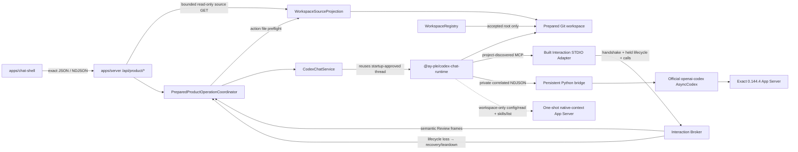

# Codex Chat 구현 지도

작성일: 2026-07-17

최근 검증: 2026-07-29

분류: 활성

성숙도: 구현됨

관련 문서: [Product-only cutover·durable v2 ADR](../adr/0013-adopt-product-only-public-surface-and-v2-store-compatibility-baseline.md), [User-owned Git SemesterWorkspace ADR](../adr/0018-adopt-user-owned-git-semester-workspaces.md), [pre-App native Bootstrap ADR](../adr/0020-bootstrap-semester-workspaces-before-app-startup.md), [Protocol-driven AY–App Interaction Layer ADR](../adr/0021-adopt-a-protocol-driven-ay-app-interaction-layer.md), [InteractionCapability ADR](../adr/0019-use-mcp-interaction-capabilities-as-the-ay-app-seam.md), [Codex Chat-only graph ADR](../adr/0012-adopt-codex-chat-only-and-remove-legacy-runtime-surfaces.md), [Official Codex Python SDK 재사용 ADR](../adr/0011-reuse-official-codex-python-sdk-for-chat-shell.md), [Codex Runtime 격리](codex-runtime-isolation.md), [AY–App Interaction Layer 아키텍처](ay-app-interaction-layer.md), [InteractionCapability 상세 아키텍처](ay-app-interaction-capabilities.md), [historical app-owned SemesterWorkspace ADR](../adr/0014-create-app-owned-normalized-semester-workspaces.md), [runtime package README](../../packages/codex-chat-runtime/README.md), [product contract README](../../packages/product-contract/README.md), [server README](../../apps/server/README.md), [Chat Shell README](../../apps/chat-shell/README.md)

## 목적

Tracked repository의 canonical product caller, official SDK 기반 Runtime, Server·Browser 경계, workspace-local state와 검증 표면을 한눈에 설명한다. 이 문서는 **현재 구현**을 소유하며 ADR 0018·0019·0021의 채택 목표를 이미 구현된 것처럼 쓰지 않는다. 채택 이유는 각 ADR, package별 사용법과 exact 명령은 각 README, 제품 작업 순서는 Development Backlog가 소유한다.

Runtime Harness, Runtime Inspector, `HeadlessCodexClientHost`, `/api/codex-chat/*`와 legacy Browser Chat owner는 current topology가 아니다. Historical ADR·spec·ticket은 당시 증거를 보존하지만 executable fallback이나 compatibility surface로 해석하지 않는다.

Canonical lifecycle의 `active`는 exact prepared Git root에서 listener·Broker, Runtime thread, exact effective project MCP declaration, Adapter의 authenticated held lifecycle channel과 fresh thread context가 모두 확인되고 registry transaction이 acceptance됐다는 뜻이다. Broker의 synchronous Adapter-loss latch는 transaction acceptance에도 참여한다. 제거한 public-preview Server graph의 `Semester Ready` envelope·attestation과 current-v2 controller의 internal `ready`는 current public topology가 아니다.

## 현재 결론

| 질문 | 현재 답 |
| --- | --- |
| Maintained Runtime은 무엇인가? | Official Python SDK를 재사용하는 `@ay-ple/codex-chat-runtime` 하나다. Generic engine Interface와 두 번째 adapter는 없다. |
| Browser가 App Server와 직접 통신하는가? | 아니다. `@ay-ple/chat-shell`은 `@ay-ple/product-contract`를 통해 local Express Server의 `/api/product/*`만 사용한다. Native protocol·bridge·credential은 Browser bundle에 없다. |
| In-app Browser OAuth가 구현됐는가? | 아니다. Public-preview Server route·account coordinator·Browser UI와 shared contract를 제거했다. Current dev·dogfood는 workspace-only Runtime에서 전역 `CODEX_HOME`의 기존 account readiness만 읽으며 Node package surface에는 login·logout capability가 없다. |
| Native identity를 제품 ID로 다시 만드는가? | 아니다. Server가 발급한 opaque public operation·interaction binding만 Browser에 투영하고 native `threadId`·`turnId`·request identity는 통합 내부에 남는다. |
| Runtime와 workspace는 어떻게 선택하는가? | Startup은 sibling `../.ay-ple/`의 verified Runtime과 canonical root contract를 사용한다. 첫 open·학기 변경은 explicit `--workspace` prepared Git root, 이후 인자 없는 실행은 registry active pointer를 fresh reopen한다. |
| Durable product state는 어디에 있는가? | External `WorkspaceRegistry`는 canonical root와 active pointer만 보존하고 workspace의 tracked v4 identity가 일치할 때만 사용한다. `workspace-state.json.snapshot`이 opaque `SemesterModel` serialization slot이고 AY-owned checkpoint가 변경 이력과 rollback을 맡는다. 기존 current-v2/v3 bytes는 자동 변환하지 않는 지원 외 역사 데이터다. |
| First Assignment vertical은 닫혔는가? | 그렇다. Prepared Git workspace의 normal AY Chat과 explicit `model_semester`가 같은 Product operation·thread lifecycle을 사용하고, exact local-provider trace가 selected-only source read와 기존 snapshot read→Interaction MCP proposal→inline Semantic Review→revise·accept·reject→AY-owned `workspace-state.json.snapshot` mutation/checkpoint와 full teardown을 닫는다. |
| 채택된 public workflow는 무엇인가? | 현재 구현은 ADR 0018·0019·0020의 prepared Git workspace, read-only source explorer·preview, normal Chat, transient Interaction request/result, AY-owned file apply와 ADR 0021의 명시적 `model_semester` ActionInvocation이다. Browser action selection·operation transcript도 transient이며 old app-owned source registry·durable Run·patch·confirmation·apply는 복원하지 않는다. |
| Built-in Skill은 어떻게 준비하는가? | Native Bootstrap이 `hub/skills/`의 direct complete Skill roots를 stable order로 발견하고 workspace mutation 전에 catalog validation과 destination conflict planning을 모두 끝낸다. Invalid root나 divergent installed destination이 하나라도 있으면 valid subset과 다른 managed file을 쓰지 않고 fail closed하며, 모두 valid하면 각 complete tree를 fresh SemesterWorkspace의 `.agents/skills/`에 복사한다. |

## Tracked 구성

| 위치 | 책임 | 공개 경계 |
| --- | --- | --- |
| `packages/interaction-mcp` | Domain-neutral `propose_state_patch` codec, strict private Broker wire와 authenticated handshake·held lifecycle channel·capability call별 한 held POST를 수행하는 built STDIO Adapter | Server가 소비할 package root와 executable `dist/stdio.js`. Runtime package·Browser contract·active workspace 선택은 포함하지 않음 |
| `packages/product-contract` | Prepared-workspace lifecycle, bounded source list·text preview, normal Chat, closed `model_semester` ActionInvocation, Browser-safe semantic Review·interaction·interrupt request/response와 target operation frame을 위한 dependency-free exact type·decoder | Browser-safe `.` 하나. Action request는 ordered relative file ref와 optional settings만 받고 Chat request는 action·files·material field를 거절한다. Course·RawMaterial registry·academic history, PDF byte transport, raw Skill·native input, private credential·binding, HTTP framing, persistence, Server domain과 native Runtime protocol은 포함하지 않음 |
| `packages/codex-chat-runtime` | Exact bundle verification, official SDK, private Node↔Python bridge, workspace-only `CodexWorkspaceRuntime`, fresh Account Readiness, bounded effective MCP·Skill observation, optional Skill-backed Product Turn, exact native conversation·Default collaboration·user-input projection, one-shot native-context probe·atomic coordinator, deadline·bound·fatal settlement과 process-group reap | Package root, Server·Runtime regression용 `./contract`, test-only `./testing`. Production과 lower-level verified factory는 exact workspace 하나만 받고 Node account command family는 `read_account`로 닫힘. Action discovery policy, live MCP health와 Broker lifecycle은 소유하지 않음 |
| `packages/semester-workspace` | User-owned Git root v4 identity codec·classification과 shared identity validators | V4 envelope의 opaque snapshot을 academic schema로 해석하지 않는다. V2/v3 payload decoder, admission·setup·bundle·context authority와 package-managed workspace resource는 없음 |
| `apps/server` | Prepared launch·registry·startup coordinator, read-only active-root SourceProjection, target Product Router, Interaction Broker, generic Chat와 validated `model_semester` Product Turn, neutral NDJSON writer와 listener·Runtime close ordering | Canonical entrypoint의 `/api/product/*`는 lifecycle·settings·source list/text/PDF preview·normal Chat·closed ActionInvocation·semantic Review·general interaction·interrupt를 제공. Action은 preview kind와 독립적인 current safe regular-file refs와 exact workspace-local Skill을 fresh 검증한다. Private Broker Router는 same listener loopback+credential 경계이며 academic persistence·apply는 없음 |
| `apps/chat-shell` | Candidate-free lifecycle, 3-pane source explorer·preview·AY Chat, explicit `model_semester` selection·action transcript, inline semantic Review card·settlement reducer와 recovery | `@ay-ple/product-contract`를 strict decode하는 fetch/NDJSON adapter와 shared cross-frame reducer. Preview focus와 extension-neutral ordered action selection은 독립적인 transient state이고 action 시작 시 refs·settings를 동결한다. Semantic `204`는 delivery ACK이며 resolved frame만 settlement authority |
| `references/openai-codex` | Exact official source review와 pin upgrade diff를 위한 dev-only oracle | Production dependency가 아닌 fixed Git submodule |

`apps/inspector`, legacy runtime packages, `/api/runtime/*`, `/api/codex-chat/*`, `dev:chat-only`, `useChatShell`과 Browser compatibility consumer는 tracked product graph에 없다. Runtime의 internal text contract·regression export는 product lifecycle 검증을 위해 유지된다.

`@ay-ple/interaction-mcp`의 built Adapter·exact codecs와 `apps/server`의 held Interaction Broker·SourceCitation projection이 canonical graph에 있다. Runtime은 bounded generic child environment와 bounded effective MCP declaration projection만 제공한다. Server는 exact root-relative `command`, 빈 `args`, source 없는 exact `env_vars`, 생략된 `cwd`·`tool_timeout_sec`, 빈 static `env`, `enabled`·`required`·`enabled_tools`와 empty `disabled_tools`를 검증한다. Projection은 다른 user MCP server의 valid `local | remote` env-var source도 보존하므로 Required Interaction declaration만 좁게 판정한다. 실제 Adapter는 authenticated handshake 뒤 Broker가 accept한 lifecycle channel을 body timeout 없이 열어야 initialize를 성공시키며, Broker status가 startup readiness와 이후 continuity loss의 authority다. Startup에서 이 gate를 통과한 native thread를 Product Turn에도 재사용하므로 별도 health thread와 `mcpServerStatus/list` polling은 없다. Broker는 citation의 active-root containment와 regular non-symlink file 존재만 검증하고 AY가 제시한 excerpt·location hint를 Browser에 전달하며 content를 parse·인증하지 않는다. Broker Router, normal Product Turn NDJSON, Browser inline card, bodyless result와 continuity failure가 한 public composition으로 이어진다. `/api/product-mcp`, academic Review/apply path와 thread-start private MCP override는 mount하지 않는다.

## 실행 흐름

Canonical root `npm run dev`는 current `hub/`, sibling `../.ay-ple/`, caller의 전역 `CODEX_HOME` 또는 `~/.codex`와 prepared workspace를 한 canonical contract로 검증한 뒤 Server와 Chat Shell을 exact local Origin으로 시작한다. Runtime payload와 cache는 external app data, controlled `HOME`과 temp만 app-owned state에 두며 separate SQLite home은 만들지 않는다. `CODEX_CHAT_WORKSPACE`와 ambient `cwd`는 selection authority가 아니다. Explicit `--workspace`는 첫 open·학기 변경을 선택하고 인자 없는 실행은 registry active pointer를 fresh reopen한다.

Persistent bridge와 workspace native-context sidecar는 모두 exact SemesterWorkspace Git root를 `cwd`로 사용하고 native `.git` project boundary를 따른다. Sidecar는 verified native executable과 controlled environment에서 `initialize(capabilities.experimentalApi=true) → initialized → config/read → skills/list`를 실행하고 완전히 reap된 뒤 high-level `CodexNativeContextPort` 결과만 반환한다. Config projection은 root marker·global instruction과 bounded MCP 이름·`command`·`args`·name 및 nullable `local | remote` source를 가진 `env_vars`·`cwd`·`tool_timeout_sec`·static `env`·`enabled`·`required`·`enabled_tools`·`disabled_tools`로 닫힌다. Runtime coordinator는 같은 caller `AbortSignal`의 Config·Skill read를 한 atomic snapshot으로 결합하고 서로 다른 concurrent caller를 독립 generation으로 격리한다. Server boundary는 두 read를 첫 `await` 전에 같은 signal로 claim하고 exact Interaction declaration을 확인한다. Raw JSON-RPC와 generated payload는 Runtime package 밖으로 나오지 않는다. Process-wide managed Skill root, package-owned workspace bundle/context guard와 `skills/extraRoots/set` injection은 사용하지 않는다.

## HTTP와 Browser contract

| 표면 | 현재 동작 |
| --- | --- |
| `GET /api/product/bootstrap` | Path-free `starting | active | recovery_required` prepared-workspace lifecycle와 coarse `operationStatus`를 `no-store`로 반환한다. |
| `GET /api/product/codex-settings` | Active workspace에서만 전역 Codex account가 광고한 visible model, reasoning effort 순서와 Fast availability를 Browser-safe하게 반환한다. Non-active lifecycle은 Runtime을 시작하지 않고 `503 workspace_unavailable`로 닫는다. |
| `GET /api/product/sources` | Active exact root를 bounded recursive scan해 hidden·managed·secret-like path와 symlink를 제외한 relative source list를 `no-store`로 반환한다. |
| `GET /api/product/sources/text?relativePath=...` | Fresh root containment·regular-file·size·fatal UTF-8 검증 뒤 bounded text, full-file SHA-256과 truncation 상태를 반환한다. |
| `GET /api/product/sources/pdf?relativePath=...` | Fresh 검증한 bounded PDF bytes를 exact MIME·`nosniff`·same-origin inline preview header로 반환한다. |
| `POST /api/product/chat/messages` | Prepared Git root에서 text-only normal AY Chat을 `workspace_write`로 실행한다. Project config가 Skill·MCP를 발견하지만 App은 selected source나 managed `SkillInput`을 이 request에 주입하지 않는다. |
| `POST /api/product/actions` | Closed `model_semester` request의 current safe regular-file refs와 enabled exact workspace-local `ay-ple-semester-modeling` Skill을 initial preflight하고, `operation.preparing` 뒤 dispatch 직전에 current refs·effective Skill·prepared input을 각각 한 번 final validation한 다음 `workspace_write`, optional settings, Skill 하나와 Markdown file references를 담은 bounded action text로 shared Product operation NDJSON을 시작한다. |
| `POST /api/product/operations/:operationId/interactions/:interactionId/answer|cancel` | Native user-input request가 투영된 경우 same-Turn response로 번역한다. Current Default-mode Product Turn의 일반 clarification 기능으로 가정하지 않으며 academic state는 바꾸지 않는다. |
| `POST /api/product/reviews/:interactionId` | Exact Semantic Review binding의 `accept | revise | reject`를 held MCP call에 전달한다. Bodyless `204`는 전달 ACK이고 resolved NDJSON frame이 settlement authority다. |
| `POST /api/product/operations/:operationId/interrupt` | Matching Turn의 interrupt acknowledgement를 반환하고 stream terminal을 authoritative outcome으로 유지한다. |

Mutation은 loopback socket과 absent 또는 exact configured local Origin에서만 허용한다. Source GET은 여기에 loopback `Host`와 non-cross-site Fetch Metadata admission을 더해 DNS rebinding·cross-site read를 거절한다. `@ay-ple/product-contract`가 field roster를 단독 소유하고 Server는 request decoder와 public projection, Chat Shell은 JSON·NDJSON decoder를 사용한다. Raw protocol, hidden reasoning, traceback, absolute path, credential과 private correlation은 공개 경계를 넘지 않는다. Source projection은 App-owned registry·copy·watcher·durable selection·mutation을 만들지 않는다. Old app-owned chooser/Course/material mutation/First Assignment/retry route, `/api/product-mcp`와 patch/revision Review alias는 canonical Router에서 `404`다. 이는 ADR 0021의 새 typed ActionInvocation을 영구 거절한다는 뜻이 아니다.

## Runtime과 lifecycle

Runtime package는 official source commit `8c68d4c87dc54d38861f5114e920c3de2efa5876`, native `0.144.4`, standalone CPython, 일곱 단계 patched SDK와 dependency closure를 canonical manifest로 검증한다. Runtime은 bounded generic child environment를 persistent bridge와 같은 native child에 전달하고 effective native config를 bounded high-level shape로 투영하지만 live MCP health API는 제공하지 않는다. Native-context read는 private SDK state에 의존하지 않고 official native App Server method를 AY-PLE-owned supervisor에서 strict decode한다. Canonical normal Product Turn은 bounded `TextInput`, native effective 또는 사용자가 고른 advertised model·reasoning, `workspace_write`, Default collaboration mode와 `default | fast` service tier를 사용한다. Normal Chat은 `[TextInput]`, validated action은 exact workspace 안의 optional `[SkillInput, TextInput]`을 사용한다. Runtime은 startup workspace identity를 고정하고 모든 Product Turn dispatch에서 같은 root를 요구하며 Skill dispatch 때 exact root부터 leaf까지 path identity를 추가 검증하지만 action catalog나 discovery policy를 소유하지 않는다. Thread-start MCP·Skill override, candidate root와 additional writable root는 사용하지 않는다.

Workspace Runtime의 sidecar와 persistent worker는 같은 verified bundle·controlled roots·application identity를 사용하며 Runtime `close()`는 둘의 complete reap을 함께 기다린다. Sidecar query·protocol failure는 persistent conversation Runtime을 곧바로 poison하지 않지만 cleanup ambiguity는 Runtime terminal로 latch된다. Public-preview 전용 `AccountRuntimeCoordinator`, auth-only→workspace transition과 Browser command drain은 Server에서 제거됐다.

`CodexChatService`는 Account Readiness, current product thread·active Turn, interaction·interrupt, Runtime terminal observation·recycle와 bounded close를 한 deep Module에 캡슐화한다. Internal text methods·native identity regression은 exact Runtime oracle로 남을 수 있지만 HTTP·Browser public surface가 아니다. Shared NDJSON line writer와 process-control test support는 product HTTP·canonical shutdown gate가 소유한다.

Server shutdown은 다음 순서를 유지한다.

1. 새 product work와 listener restart를 막는다.
2. Broker를 expected shutdown으로 닫아 held lifecycle channel과 pending interaction을 정산한다.
3. Runtime과 listener close를 bounded하게 수행한다.
4. Python·native process와 pipe가 사라진 뒤 application close를 resolve한다.

## Store compatibility

[ADR 0013](../adr/0013-adopt-product-only-public-surface-and-v2-store-compatibility-baseline.md)의 workspace-local v2 store는 cutover 전 durable baseline이었다. Server의 app-owned academic store와 physical I/O source, package의 current-v2 decoder와 v3 admission·setup·bundle·context kernel은 제거됐다. 이 contraction은 기존 v2/v3 bytes를 읽거나 변환·rewrite·삭제하지 않았고, survivor root classifier도 legacy payload를 academic schema로 decode하지 않는다.

[ADR 0014](../adr/0014-create-app-owned-normalized-semester-workspaces.md)의 v3 admission·recovery, durable setup envelope·journey와 lease-bound Ready relaunch는 historical artifact에만 남는다. V2와 v3 모두 canonical public authority가 아니며 original filesystem bytes는 explicit user action 전까지 보존한다.

ADR 0018 target의 root v4 identity codec, external `WorkspaceRegistry` v1 codec·CAS store, prepared-workspace launch resolver, candidate-free Browser lifecycle codec과 process-local product Turn coordinator가 canonical graph다. Resolver는 explicit prepared root를 우선하고 no-argument start에서 active pointer를 fresh reopen하며 canonical exact Git root와 strict v4 identity만 선택한다. No-argument authoritative reopen은 registry read 전에 dead `pending` writer를 reconcile하여 acceptance 전 first-open target을 제거하거나 switch 이전 pointer를 복원한다. Registry는 canonical root와 active pointer만 보존하고 fresh root identity가 matching할 때만 available로 판정하며 malformed·future bytes를 reset하지 않는다. Explicit selection이 full readiness를 통과하면 CAS commit이 같은 canonical root의 stale `workspaceId` entry를 새 verified identity로 교체하고 다른 workspace entry를 보존하지만, no-argument identity mismatch는 repair하지 않고 unavailable로 닫는다. Server startup coordinator는 shared listener·Broker generation을 Runtime보다 먼저 준비하고 exact-root thread start·effective MCP declaration·authenticated held Adapter lifecycle·fresh context 뒤에만 verified `workspaceId` CAS와 active projection을 연다. Registry transaction acceptance보다 Runtime terminal이나 Broker의 synchronous Adapter-loss latch가 먼저 오면 같은 writer lease가 prior pointer를 exact 복원하고 normal active projection을 열지 않는다. Startup thread는 acceptance 뒤 Product Turn에도 그대로 전달된다. Missing/moved/reused active root는 Runtime spawn 없는 path-free `workspace_unavailable`, malformed/future registry는 bytes-preserving `registry_incompatible`, startup readiness failure·active Runtime terminal·자동 감지한 Adapter continuity loss는 listener가 유지된 `runtime_unavailable` Browser recovery로 구분한다. Failed explicit relaunch 뒤 no-argument run은 previous pointer의 root를 fresh Runtime·thread·Broker generation으로 reopen한다. App shutdown은 Broker expected close → Runtime → listener cleanup을 수행한다. Chat Shell은 `starting | active | recovery_required`를 polling해 desktop Browser에 투영하고 candidate/change control을 두지 않는다.

## 검증 표면

| 명령 | 증명하는 것 |
| --- | --- |
| `npm test` | Product contract, Runtime, Server, Chat Shell과 repository-owned tooling의 unit·integration contract |
| `npm run test:e2e` | Default Browser route의 prepared lifecycle, 3-pane source list·text/PDF/unsupported preview, preview kind와 독립적인 ordered `model_semester` selection·frozen transcript, operation lock·retry, SourceCitation 표시·file 열기, normal Chat 격리, native user-input compatibility·interrupt와 inline Semantic Review accept·revise·reject를 검증 |
| `npm run typecheck` / `npm run build` | Product contract→Runtime→Server→Shell TypeScript graph |
| `npm run lint -w @ay-ple/chat-shell` | Browser production source와 Playwright harness lint |
| `npm run check:docs-links` | Active/current Markdown link와 삭제된 owner reference |
| `npm run validate:exact-sdk -w @ay-ple/codex-chat-runtime` | Exact source·generated SDK·ordered patch·provenance |
| `npm run validate:production-runtime -w @ay-ple/codex-chat-runtime` | Canonical bundle·bundled bridge·post-run non-mutation |
| `npm run validate:node-runtime -w @ay-ple/codex-chat-runtime` | Hardened Node actual-child, native-context fake·exact native, exact local-provider와 process-group reap |
| `npm run test:native-context-actual -w @ay-ple/codex-chat-runtime` | One-shot App Server의 strict protocol·cleanup matrix와 exact native provider-free config·Skill projection |
| `npm run test:prepared-workspace-product-actual` | Native Bootstrap output의 exact Git root와 installed `ay-ple-semester-modeling` Skill을 public `model_semester` route, exact verified Runtime·First Assignment local provider, real built Adapter·shared listener/Broker에 공급한다. `[SkillInput, TextInput]`, selected-only source read와 기존 snapshot read, same-Turn revise·accept·reject Review, accept 전 no-mutation, `workspace-state.json.snapshot` checkpoint, unrelated state 보존과 credential·listener·process-group cleanup을 함께 검증한다. |
| `npm run test:product-entrypoint` | Root canonical product command의 explicit root 계산, product API·Browser owner, legacy path 무시와 SIGINT 뒤 OS process graph·port cleanup |

Deterministic Browser green은 exact native identity·bundle·process cleanup을 대신하지 않고 exact local-provider도 Browser reducer·HTTP fail-closed behavior를 대신하지 않는다.

## 현재 미지원·채택 경계

| 경계 | 현재 사실 | 정본 |
| --- | --- | --- |
| Rollback boundary | Cutover 전 rollback은 current Browser·Server·v2 store·private Runtime/MCP graph 전체, cutover 뒤 rollback은 prepared lifecycle Browser·target Router·Broker·generic Runtime environment·project Skill/MCP graph 전체다. Target Server/old Browser 또는 target Browser/old academic Runtime 같은 half-state는 지원하지 않는다. | [pre-App native Bootstrap ADR](../adr/0020-bootstrap-semester-workspaces-before-app-startup.md) |
| Conversation persistence | Browser transcript는 transient이고 `thread/read`·`thread/resume`, multi-thread catalog와 client별 isolation은 없다. 반영된 학업 결과의 durability는 user-owned Git workspace와 checkpoint가 소유한다. | [Chat Shell README](../../apps/chat-shell/README.md) |
| Interactive Codex approval | Default-mode Product Turn과 native user-input transport는 각각 검증됐지만 generic command·file·network approval center나 same-Turn clarification UX는 채택하지 않았다. | [ADR 0011](../adr/0011-reuse-official-codex-python-sdk-for-chat-shell.md) |
| Current-path carrier boundary (채택한 한계) | Source ref와 workspace-local Skill은 dispatch 전 current safe path로 검증되지만 carrier는 path만 운반하고 native reader는 이후 workspace의 current file·Skill copy를 연다. Same-inode 또는 content-version binding은 보장하지 않으며 이는 current actual-file semantics의 미완료 hardening task가 아니다. Exact-version 처리가 구체적인 제품 요구가 될 때만 별도 carrier 결정을 다시 연다. | [ADR 0018](../adr/0018-adopt-user-owned-git-semester-workspaces.md), [ADR 0021](../adr/0021-adopt-a-protocol-driven-ay-app-interaction-layer.md), [AY–App Interaction Layer](ay-app-interaction-layer.md) |
| Packaged Desktop | `.app`·`.dmg`, Developer ID signing·notarization, automatic updater와 다른 platform은 지원하지 않는다. | [macOS-first ADR](../adr/0009-use-a-macos-first-local-web-app-product-path.md) |

중단한 public npx release lane의 `@ay-ple/runtime-release`, `apps/ay-ple` production host와 public-preview Server·Browser graph는 tracked graph에서 제거했다. 이는 현재 gap이나 후속 목표가 아니며 당시 결정과 구현 증거만 historical ADR 0016·0017과 완료 ticket에 남는다. Runtime의 managed account·`auth-only` surface와 AY-PLE-owned Python login/logout bridge command, managed-login 전용 patch는 제거됐다. Current Runtime은 workspace-only contract, fresh Account Readiness와 exact seven-patch stack만 유지한다.
