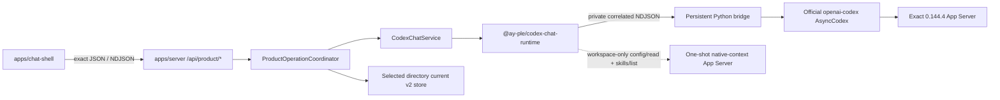

# Codex Chat 구현 지도

작성일: 2026-07-17

최근 검증: 2026-07-27

분류: 활성

성숙도: 구현됨

관련 문서: [Product-only cutover·durable v2 ADR](../adr/0013-adopt-product-only-public-surface-and-v2-store-compatibility-baseline.md), [User-owned Git SemesterWorkspace ADR](../adr/0018-adopt-user-owned-git-semester-workspaces.md), [pre-App native Bootstrap ADR](../adr/0020-bootstrap-semester-workspaces-before-app-startup.md), [InteractionCapability ADR](../adr/0019-use-mcp-interaction-capabilities-as-the-ay-app-seam.md), [Codex Chat-only graph ADR](../adr/0012-adopt-codex-chat-only-and-remove-legacy-runtime-surfaces.md), [Official Codex Python SDK 재사용 ADR](../adr/0011-reuse-official-codex-python-sdk-for-chat-shell.md), [Codex Runtime 격리](codex-runtime-isolation.md), [AY–App Interaction Capability 아키텍처](ay-app-interaction-capabilities.md), [historical app-owned SemesterWorkspace ADR](../adr/0014-create-app-owned-normalized-semester-workspaces.md), [runtime package README](../../packages/codex-chat-runtime/README.md), [product contract README](../../packages/product-contract/README.md), [server README](../../apps/server/README.md), [Chat Shell README](../../apps/chat-shell/README.md)

## 목적

Tracked repository의 canonical product caller, official SDK 기반 Runtime, Server·Browser 경계, workspace-local state와 검증 표면을 한눈에 설명한다. 이 문서는 **현재 구현**을 소유하며 ADR 0018·0019의 채택 목표를 이미 구현된 것처럼 쓰지 않는다. 채택 이유는 각 ADR, package별 사용법과 exact 명령은 각 README, 제품 작업 순서는 Development Backlog가 소유한다.

Runtime Harness, Runtime Inspector, `HeadlessCodexClientHost`, `/api/codex-chat/*`와 legacy Browser Chat owner는 current topology가 아니다. Historical ADR·spec·ticket은 당시 증거를 보존하지만 executable fallback이나 compatibility surface로 해석하지 않는다.

이 지도에서 development controller·wire type의 `ready`는 chooser/current-v2 directory가 mutation 가능한 내부 상태라는 뜻이다. 제거한 public-preview Server graph의 `Semester Ready` envelope·attestation은 current topology가 아니며 current dogfood의 `ready`와 같은 상태로 해석하지 않는다.

## 현재 결론

| 질문 | 현재 답 |
| --- | --- |
| Maintained Runtime은 무엇인가? | Official Python SDK를 재사용하는 `@ay-ple/codex-chat-runtime` 하나다. Generic engine Interface와 두 번째 adapter는 없다. |
| Browser가 App Server와 직접 통신하는가? | 아니다. `@ay-ple/chat-shell`은 `@ay-ple/product-contract`를 통해 local Express Server의 `/api/product/*`만 사용한다. Native protocol·bridge·credential은 Browser bundle에 없다. |
| In-app Browser OAuth가 구현됐는가? | 아니다. Public-preview Server route·account coordinator·Browser UI와 shared contract를 제거했다. Current dev·dogfood는 workspace-only Runtime에서 전역 `CODEX_HOME`의 기존 account readiness만 읽으며 Node package surface에는 login·logout capability가 없다. |
| Native identity를 제품 ID로 다시 만드는가? | 아니다. Server가 발급한 opaque public operation·interaction·patch·decision binding만 Browser에 투영하고 native `threadId`·`turnId`·request identity는 통합 내부에 남는다. |
| Runtime와 workspace는 어떻게 선택하는가? | Startup은 sibling `../.ay-ple/`의 verified Runtime과 canonical root contract를 사용한다. Default는 workspace를 자동 선택하지 않으며 explicit `--workspace`만 transitional current-v2 개발 input이다. |
| Durable product state는 어디에 있는가? | Workspace-local current canonical v2 store가 stable workspace ID·한 `Course`, confirmed revision, `RawMaterial`·Assignment, settled `ModelingRun`·`StatePatch`·`UserConfirmation`, apply outcome와 recovery guard를 보존한다. ADR 0013의 첫 durable compatibility baseline이며 Server restart 후 같은 directory에서 다시 연다. `WorkspaceManifest` authority로 자동 승격하지 않는다. |
| First Assignment vertical은 닫혔는가? | Deterministic Chromium→Vite→Express→product store·Runtime, exact actual-child/local-provider와 isolated live-provider가 선택→proposal→Review→confirmed outcome, revision·reject·loss·guard·isolation과 bounded shutdown을 검증했다. |
| 이 current workflow가 채택한 target인가? | 아니다. ADR 0018·0019는 actual Git workspace, transient MCP request/result와 AY-owned file apply를 채택했다. Current app-owned source·Run·patch·confirmation·apply는 interaction round trip의 구현 증거이자 contraction 대상이다. |

## Tracked 구성

| 위치 | 책임 | 공개 경계 |
| --- | --- | --- |
| `packages/interaction-mcp` | Domain-neutral `propose_state_patch` codec, strict private Broker wire와 authenticated handshake·one-held-POST를 수행하는 built STDIO Adapter | Server가 소비할 package root와 executable `dist/stdio.js`. Runtime package·Browser contract·active workspace 선택은 포함하지 않음 |
| `packages/product-contract` | Current Product bootstrap·workspace recovery·settled history·material preview, Assignment·retry·Chat·old Review 옆의 Browser-safe semantic Review·interaction·interrupt request/response와 closed operation frame, user-owned Git lifecycle로 만들었던 dependency-free exact type·decoder | Browser-safe `.` 하나. `TargetProductBootstrap`의 candidate/bootstrap union은 current route를 교체하지 않은 internal expansion이며 ADR 0020 이후 adopted target이 아니라 correction residue다. Raw MCP, private credential·binding, HTTP framing, persistence, Server domain과 native Runtime protocol은 포함하지 않음 |
| `packages/codex-chat-runtime` | Exact bundle verification, official SDK, private Node↔Python bridge, workspace-only `CodexWorkspaceRuntime`, fresh Account Readiness, native conversation·Plan·MCP·interaction projection, one-shot native-context probe·atomic coordinator, deadline·bound·fatal settlement과 process-group reap | Package root, Server·Runtime regression용 `./contract`, test-only `./testing`. Production과 lower-level verified factory는 exact workspace 하나만 받고 Node account command family는 `read_account`로 닫힘 |
| `packages/semester-workspace` | Current v2 compatibility decoder, user-owned Git target의 root v4 identity codec과 consumer 없는 v3 admission·setup kernel | Current Server는 test-only v2 parity와 decoder만 product composition에서 소비한다. V4는 internal target registry가 fresh identity 확인에 사용하고 v3 setup은 composition하지 않음 |
| `apps/server` | Current-v2 product graph, Account Readiness, Course·material·Assignment·Chat·Review HTTP, private MCP, neutral NDJSON writer와 listener·Runtime close ordering | Side-effect-free `@ay-ple/server` root의 `createServerApplication()`, `listenToServerApplication()`, `bindServerApplicationListener()`와 `/api/product/*` |
| `apps/chat-shell` | Source-centered 3-pane workbench, cumulative Assignment·Chat activity, evidence-linked Review·replacement, explicit retry·workspace recovery, clarification·interrupt와 settled-only hydration | `@ay-ple/product-contract`를 strict decode하는 fetch/NDJSON adapter와 cross-frame reducer |
| `references/openai-codex` | Exact official source review와 pin upgrade diff를 위한 dev-only oracle | Production dependency가 아닌 fixed Git submodule |

`apps/inspector`, legacy runtime packages, `/api/runtime/*`, `/api/codex-chat/*`, `dev:chat-only`, `useChatShell`과 Browser compatibility consumer는 tracked product graph에 없다. Runtime의 internal text contract·regression export는 product lifecycle 검증을 위해 유지된다.

Interaction foundation expand 단계에서는 `@ay-ple/interaction-mcp`의 built Adapter와 exact codecs만 current graph 옆에 존재한다. `apps/server` Broker, evidence resolver, Runtime-neutral child environment·readiness와 inline Review public composition은 아직 연결되지 않았고, current `/api/product-mcp`와 academic Review/apply path가 계속 active public behavior다.

## 실행 흐름

Canonical root `npm run dev`는 current `hub/`, sibling `../.ay-ple/`, caller의 전역 `CODEX_HOME` 또는 `~/.codex`를 한 canonical contract로 검증한 뒤 Server와 Chat Shell을 exact local Origin으로 시작한다. Runtime payload와 cache는 external app data, controlled `HOME`과 temp만 app-owned state에 두며 separate SQLite home은 만들지 않는다. Default startup은 hardcoded 학기 root, `CODEX_CHAT_WORKSPACE`와 ambient `cwd`를 selection authority로 사용하지 않고 hub root를 Runtime cwd로 구성한다. 이 hub-default는 ADR 0020이 폐기한 current residue다. Explicit `--workspace`를 준 transitional current-v2 run만 그 root를 current native cwd로 사용한다.

Persistent bridge와 workspace native-context sidecar는 모두 exact SemesterWorkspace Git root를 `cwd`로 사용하고 native `.git` project boundary를 따른다. Sidecar는 verified native executable과 controlled environment에서 `initialize(capabilities.experimentalApi=true) → initialized → config/read → skills/list`를 실행하고 완전히 reap된 뒤 high-level `CodexNativeContextPort` 결과만 반환한다. Runtime coordinator는 같은 caller `AbortSignal`의 Config·Skill read를 한 atomic snapshot으로 결합하고 서로 다른 concurrent caller를 독립 generation으로 격리한다. Server boundary는 두 read를 첫 `await` 전에 같은 signal로 claim한다. Raw JSON-RPC와 generated payload는 Runtime package 밖으로 나오지 않는다. Official `system` Skill은 응답 shape까지 검증하되 Server의 effective roster projection에서는 제외하고, `repo | user | admin` Skill만 managed bundle conflict gate의 입력이 된다. Process-wide managed Skill root와 `skills/extraRoots/set` injection은 사용하지 않는다.

## HTTP와 Browser contract

| 표면 | 현재 동작 |
| --- | --- |
| `GET /api/product/bootstrap` | Account Readiness, coarse `operationStatus`, active workspace·Course·material, confirmed revision과 settled history를 `no-store`로 반환한다. Pending prompt·native correlation·store metadata는 제외한다. |
| `GET /api/product/codex-settings` | 전역 Codex account가 광고한 visible model, reasoning effort 순서와 Fast availability를 Browser-safe하게 반환한다. |
| `POST /api/product/workspaces/activate` | Current Server-owned chooser가 고른 directory를 root 불변 조건에 따라 연다. Existing current store는 original bytes를 authority로 채택하고 invalid store는 bytes-preserving read-only로 연다. App-owned scaffold·`WorkspaceManifest` admission endpoint가 아니다. |
| `POST /api/product/courses` | Empty internal-ready current workspace에 opaque first-vertical `Course`를 만든다. |
| `POST /api/product/materials/refresh` | 일반 bounded refresh 또는 explicit source rebaseline을 수행한다. |
| `GET /api/product/materials/:materialId/preview?digest=...` | Registry ID·digest와 live file을 재검증한 bounded UTF-8 preview를 반환한다. |
| `POST /api/product/actions/first-assignment` | Exact Recipe·arguments·source 두 개를 admission한 뒤 durable Run과 curated action stream을 연다. |
| `POST /api/product/actions/first-assignment/retry` | Prior retryable Run의 canonical input·ancestry를 검증한 뒤 새 Run·Turn·key로 한 번만 재시도한다. |
| `POST /api/product/chat/messages` | Course 전에는 source를 포함하지 않은 text를 `deny_all + read_only` no-Run product Chat으로 실행한다. Course가 있으면 optional current material selection과 source/revision guard를 사용한다. |
| `POST /api/product/operations/:operationId/interactions/:interactionId/answer|cancel` | Active 일반 Plan interaction을 same-Turn native response로 번역한다. Academic state는 바꾸지 않는다. |
| `POST /api/product/reviews/:interactionId` | Exact Review binding의 수락·수정 요청·거절을 처리한다. 수락·거절 product transaction이 native answer보다 먼저다. |
| `POST /api/product/operations/:operationId/interrupt` | Matching Turn의 interrupt acknowledgement를 반환하고 stream terminal을 authoritative outcome으로 유지한다. |

Mutation은 loopback socket과 absent 또는 exact configured local Origin에서만 허용한다. `@ay-ple/product-contract`가 field roster를 단독 소유하고 Server는 request decoder와 public projection, Chat Shell은 JSON·NDJSON decoder를 사용한다. Raw protocol, hidden reasoning, traceback, absolute path, credential과 private correlation은 공개 경계를 넘지 않는다.

## Runtime과 lifecycle

Runtime package는 official source commit `8c68d4c87dc54d38861f5114e920c3de2efa5876`, native `0.144.4`, standalone CPython, 일곱 단계 patched SDK와 dependency closure를 canonical manifest로 검증한다. Native-context read는 추가 SDK patch나 private SDK state에 의존하지 않고 official native App Server method를 AY-PLE-owned supervisor에서 strict decode한다. Product Turn은 bounded `TextInput`, optional exact `SkillInput`, native effective 또는 사용자가 고른 advertised model·reasoning의 Plan mode와 `default | fast` service tier를 사용한다. First Assignment와 Course-bound guarded Chat은 `auto_review + workspace_write`, Course 전 source-free Chat은 `deny_all + read_only`를 명시한다. Codex permission은 `StatePatch`를 confirmed `SemesterModel`로 반영하는 AY-PLE `UserConfirmation`과 별도다.

Workspace Runtime의 sidecar와 persistent worker는 같은 verified bundle·controlled roots·application identity를 사용하며 Runtime `close()`는 둘의 complete reap을 함께 기다린다. Sidecar query·protocol failure는 persistent conversation Runtime을 곧바로 poison하지 않지만 cleanup ambiguity는 Runtime terminal로 latch된다. Public-preview 전용 `AccountRuntimeCoordinator`, auth-only→workspace transition과 Browser command drain은 Server에서 제거됐다.

`CodexChatService`는 Account Readiness, current product thread·active Turn, interaction·interrupt, Runtime terminal observation·recycle와 bounded close를 한 deep Module에 캡슐화한다. Internal text methods·native identity regression은 exact Runtime oracle로 남을 수 있지만 HTTP·Browser public surface가 아니다. Shared NDJSON line writer와 process-control test support는 product HTTP·canonical shutdown gate가 소유한다.

Server shutdown은 다음 순서를 유지한다.

1. 새 product work와 listener restart를 막는다.
2. Listener close를 시작해 새 TCP intake를 거절한다.
3. Active disconnect drain과 Runtime `close()`를 한 promise로 수렴한다.
4. Python·native process와 pipe가 사라진 뒤 application close를 resolve한다.

## Store compatibility

[ADR 0013](../adr/0013-adopt-product-only-public-surface-and-v2-store-compatibility-baseline.md)이 workspace-local current store를 첫 durable baseline으로 채택한다. 구현 topology에서의 결과는 cutover·restart가 confirmed state를 삭제하지 않고, 이해할 수 없는 store가 product mutation을 열지 않는다는 것이다. Exact codec·invariant·physical I/O 동작은 [Server README](../../apps/server/README.md)가 소유한다.

[ADR 0014](../adr/0014-create-app-owned-normalized-semester-workspaces.md)의 v3 admission·recovery, durable setup envelope·journey와 lease-bound Ready relaunch는 구현됐지만 current Server controller와 product API는 계속 current v2를 authority로 사용한다. ADR 0018이 app-owned scaffold target을 대체했으므로 이 consumer 없는 v3 kernel은 current target이 아니라 contraction 대상이다. Current v2 codec은 전환 전까지 compatibility baseline으로 original bytes를 보존한다.

ADR 0018 target에서 root v4 identity codec, external `WorkspaceRegistry` v1 codec·CAS store, prepared-workspace launch resolver, candidate-free Browser lifecycle codec과 process-local product Turn coordinator가 current graph 옆의 internal seam으로 구현됐다. Resolver는 explicit prepared root를 우선하고 no-argument start에서 active pointer를 fresh reopen하며 canonical exact Git root와 strict v4 identity만 선택한다. Registry는 canonical root와 active pointer만 보존하고 fresh root identity가 matching할 때만 available로 판정하며 malformed·future bytes를 reset하지 않는다. Generic coordinator의 non-preemptive admission과 terminal-only release는 current Assignment·Chat이 이미 소비하며 prepared-workspace startup은 operation lease를 만들지 않는다.

## 검증 표면

| 명령 | 증명하는 것 |
| --- | --- |
| `npm test` | Product contract, Runtime, Server, Chat Shell과 repository-owned tooling의 unit·integration contract |
| `npm run test:e2e` | Real Chromium→Vite→Express→product store·deterministic Runtime의 대표 9-trace vertical, desktop behavior·fresh-run isolation과 same-root Server application restart 뒤 durable history reopen |
| `npm run typecheck` / `npm run build` | Product contract→Runtime→Server→Shell TypeScript graph |
| `npm run lint -w @ay-ple/chat-shell` | Browser production source와 Playwright harness lint |
| `npm run check:docs-links` | Active/current Markdown link와 삭제된 owner reference |
| `npm run validate:exact-sdk -w @ay-ple/codex-chat-runtime` | Exact source·generated SDK·ordered patch·provenance |
| `npm run validate:production-runtime -w @ay-ple/codex-chat-runtime` | Canonical bundle·bundled bridge·post-run non-mutation |
| `npm run validate:node-runtime -w @ay-ple/codex-chat-runtime` | Hardened Node actual-child, native-context fake·exact native, exact local-provider와 process-group reap |
| `npm run test:native-context-actual -w @ay-ple/codex-chat-runtime` | One-shot App Server의 strict protocol·cleanup matrix와 exact native provider-free config·Skill projection |
| `npm run test:first-assignment-product-actual -w @ay-ple/server` | Exact local provider와 real product seam의 internal-ready current directory `cwd`, managed Skill·source, MCP→Plan→Review→terminal, durable outcome과 cleanup |
| `npm run test:product-entrypoint` | Root canonical product command의 explicit root 계산, product API·Browser owner, legacy path 무시와 SIGINT 뒤 OS process graph·port cleanup |
| `npm run test:product-shutdown-actual -w @ay-ple/server` | Product-capable Runtime을 시작한 Server의 listener refusal·close ordering과 full process-tree reap |
| `npm run trace:first-assignment-live -w @ay-ple/server -- --codex-home <isolated-auth-seed>` | Explicit isolated auth·fresh roots의 opt-in live complete Assignment outcome |

Deterministic Browser green은 exact native identity·bundle·process cleanup을 대신하지 않고 exact local-provider도 Browser reducer·HTTP fail-closed behavior를 대신하지 않는다.

## 현재 미지원 경계

| Gap | 현재 사실 | 정본 |
| --- | --- | --- |
| InteractionCapability seam | Thread start가 hosted private MCP URL·token config를 주입하고, `propose_state_patch`가 private proposal key, registered source·workspace·Course·revision과 durable patch/confirmation apply에 결합되며 같은 결정에 built-in `request_user_input`을 함께 사용하고 replacement가 active Review를 교체한다. Private workspace package `@ay-ple/interaction-mcp`, project `.codex/config.toml`→built STDIO Adapter→shared loopback listener의 Runtime-scoped `apps/server` Broker, startup handshake, generation별 단일 pending slot·`busy` rejection, one-call/one-held-POST와 `accept | revise | reject` 정상 result·MCP failure 경계, active workspace에서의 atomic on-demand evidence preflight, settled card의 read-only 유지·fresh-call append, capability-neutral Runtime의 dynamic env 전달은 아직 없다. | [InteractionCapability ADR](../adr/0019-use-mcp-interaction-capabilities-as-the-ay-app-seam.md) |
| User-owned Git workspace | Runtime package는 caller가 준 exact workspace를 native `.git` project·thread `cwd`로 고정하고 root-local `.codex/config.toml`, `AGENTS.md`, repo Skill을 native discovery하며 hostile ancestor와 Skill extra-root injection을 배제한다. Current chooser는 directory 하나를 곧바로 Runtime cwd로 쓰고 app-owned source registry와 `.ay-ple/workspace-state.json`을 사용한다. Root v4 identity codec, external `WorkspaceRegistry` v1 CAS·fresh reopen, prepared-root launch resolver, candidate-free Browser lifecycle과 generic product Turn coordinator seam은 internal expansion으로 구현됐다. Pre-App Bootstrap Skill, `hub/skills/` source→workspace `.agents/skills/` copy, required MCP readiness 뒤 registry commit과 AY-owned checkpoint는 아직 연결되지 않았다. | [User-owned Git SemesterWorkspace ADR](../adr/0018-adopt-user-owned-git-semester-workspaces.md), [pre-App native Bootstrap ADR](../adr/0020-bootstrap-semester-workspaces-before-app-startup.md) |
| Conversation persistence | Browser transcript는 transient이고 `thread/read`·`thread/resume`, multi-thread catalog와 client별 isolation은 없다. Confirmed product state와 settled history만 durable하다. | [Chat Shell README](../../apps/chat-shell/README.md) |
| Interactive Codex approval | First Assignment permission과 Plan interaction은 검증됐지만 generic command·file·network approval center는 채택하지 않았다. | [ADR 0011](../adr/0011-reuse-official-codex-python-sdk-for-chat-shell.md) |
| Packaged Desktop | `.app`·`.dmg`, Developer ID signing·notarization, automatic updater와 다른 platform은 지원하지 않는다. | [macOS-first ADR](../adr/0009-use-a-macos-first-local-web-app-product-path.md) |

중단한 public npx release lane의 `@ay-ple/runtime-release`, `apps/ay-ple` production host와 public-preview Server·Browser graph는 tracked graph에서 제거했다. 이는 현재 gap이나 후속 목표가 아니며 당시 결정과 구현 증거만 historical ADR 0016·0017과 완료 ticket에 남는다. Runtime의 managed account·`auth-only` surface와 AY-PLE-owned Python login/logout bridge command, managed-login 전용 patch는 제거됐다. Current Runtime은 workspace-only contract, fresh Account Readiness와 exact `0001`–`0007` patch stack만 유지한다. Consumer 없는 `semester-workspace` v3 kernel과 current app-owned academic workflow는 ADR 0018·0019에 맞춘 후속 contraction 대상이다.
