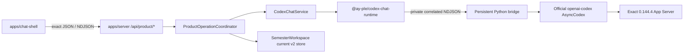

# Codex Chat 구현 지도

작성일: 2026-07-17

최근 검증: 2026-07-22

분류: 활성

성숙도: 구현됨

관련 문서: [Product-only cutover·durable v2 ADR](../adr/0013-adopt-product-only-public-surface-and-v2-store-compatibility-baseline.md), [Codex Chat-only graph ADR](../adr/0012-adopt-codex-chat-only-and-remove-legacy-runtime-surfaces.md), [Official Codex Python SDK 재사용 ADR](../adr/0011-reuse-official-codex-python-sdk-for-chat-shell.md), [Codex Runtime 격리](codex-runtime-isolation.md), [Codex-native 제품 작업 조합](codex-native-product-composition.md), [runtime package README](../../packages/codex-chat-runtime/README.md), [product contract README](../../packages/product-contract/README.md), [server README](../../apps/server/README.md), [Chat Shell README](../../apps/chat-shell/README.md)

## 목적

Tracked repository의 canonical product caller, official SDK 기반 Runtime, Server·Browser 경계, workspace-local state와 검증 표면을 한눈에 설명한다. 채택 이유와 compatibility 정책은 ADR 0011·0012·0013, package별 사용법과 exact 명령은 각 README, 제품 작업 순서는 Development Backlog가 소유한다.

Runtime Harness, Runtime Inspector, `HeadlessCodexClientHost`, `/api/codex-chat/*`와 legacy Browser Chat owner는 current topology가 아니다. Historical ADR·spec·ticket은 당시 증거를 보존하지만 executable fallback이나 compatibility surface로 해석하지 않는다.

## 현재 결론

| 질문 | 현재 답 |
| --- | --- |
| Maintained Runtime은 무엇인가? | Official Python SDK를 재사용하는 `@ay-ple/codex-chat-runtime` 하나다. Generic engine Interface와 두 번째 adapter는 없다. |
| Browser가 App Server와 직접 통신하는가? | 아니다. `@ay-ple/chat-shell`은 `@ay-ple/product-contract`를 통해 local Express Server의 `/api/product/*`만 사용한다. Native protocol·bridge·credential은 Browser bundle에 없다. |
| Native identity를 제품 ID로 다시 만드는가? | 아니다. Server가 발급한 opaque public operation·interaction·patch·decision binding만 Browser에 투영하고 native `threadId`·`turnId`·request identity는 통합 내부에 남는다. |
| Runtime와 workspace는 어떻게 선택하는가? | Canonical startup이 `packageRoot`에서 verified artifact를 찾고 explicit `appDataRoot`에서 controlled runtime directory를 계산한다. Product Turn의 `cwd`는 active ready `SemesterWorkspace`와 정확히 같다. `CODEX_CHAT_WORKSPACE`는 manual-development selection override일 뿐 Runtime root·`cwd` authority가 아니다. |
| Durable product state는 어디에 있는가? | Workspace-local current canonical v2 store가 confirmed revision, `Course`·`RawMaterial`·Assignment, settled `ModelingRun`·`StatePatch`·`UserConfirmation`, apply outcome와 recovery guard를 보존한다. ADR 0013의 첫 durable compatibility baseline이며 Server restart 후 같은 workspace에서 다시 연다. |
| First Assignment vertical은 닫혔는가? | Deterministic Chromium→Vite→Express→product store·Runtime, exact actual-child/local-provider와 isolated live-provider가 선택→proposal→Review→confirmed outcome, revision·reject·loss·guard·isolation과 bounded shutdown을 검증했다. |

## Tracked 구성

| 위치 | 책임 | 공개 경계 |
| --- | --- | --- |
| `packages/product-contract` | Product bootstrap·workspace recovery·settled history·material preview, Assignment·retry·Chat·Review·interaction·interrupt request/response와 closed operation frame의 dependency-free exact type·decoder | Browser-safe `.` 하나. HTTP framing, persistence, Server domain과 native Runtime protocol은 포함하지 않음 |
| `packages/codex-chat-runtime` | Exact bundle verification, official SDK, private Node↔Python bridge, native conversation·Plan·MCP·interaction projection, deadline·bound·fatal settlement과 process-group reap | Package root, Server·Runtime regression용 `./contract`, test-only `./testing`. Browser production source는 소비하지 않음 |
| `apps/server` | Canonical product composition, `SemesterWorkspace` activation, current-v2 store·recovery, selected-source snapshot·guard, private MCP host, product operation·Review coordinator, Account Readiness, neutral NDJSON writer, listener·Runtime close ordering | `createServerApplication()`, product composition seam과 `/api/product/*` |
| `apps/chat-shell` | Source-centered 3-pane workbench, cumulative Assignment·Chat activity, evidence-linked Review·replacement, explicit retry·workspace recovery, clarification·interrupt와 settled-only hydration | `@ay-ple/product-contract`를 strict decode하는 fetch/NDJSON adapter와 cross-frame reducer |
| `references/openai-codex` | Exact official source review와 pin upgrade diff를 위한 dev-only oracle | Production dependency가 아닌 fixed Git submodule |

`apps/inspector`, legacy runtime packages, `/api/runtime/*`, `/api/codex-chat/*`, `dev:chat-only`, `useChatShell`과 Browser compatibility consumer는 tracked product graph에 없다. Runtime의 internal text contract·regression export는 product lifecycle 검증을 위해 유지된다.

## 실행 흐름

Canonical `npm run dev -- --app-data-root <absolute-path>`는 package, app data와 materialized/override workspace를 검증한 뒤 Server와 Chat Shell을 exact local Origin으로 시작한다. Runtime은 product bootstrap의 Account Readiness read에서 lazy start할 수 있고, Python worker가 SDK initialize 후 private `ready`를 보낸 뒤에만 public factory가 resolve한다. Product native thread는 active ready workspace와 exact `cwd`를 가지며 private MCP URL·token은 그 thread에만 결합한다.

## HTTP와 Browser contract

| 표면 | 현재 동작 |
| --- | --- |
| `GET /api/product/bootstrap` | Account Readiness, coarse `operationStatus`, active workspace·Course·material, confirmed revision과 settled history를 `no-store`로 반환한다. Pending prompt·native correlation·store metadata는 제외한다. |
| `POST /api/product/workspaces/activate` | Server-owned chooser 결과를 root 불변 조건에 따라 연다. Existing current store는 original bytes를 authority로 채택하고 invalid store는 bytes-preserving read-only로 연다. |
| `POST /api/product/courses` | Empty ready workspace에 opaque first-vertical `Course`를 만든다. |
| `POST /api/product/materials/refresh` | 일반 bounded refresh 또는 explicit source rebaseline을 수행한다. |
| `GET /api/product/materials/:materialId/preview?digest=...` | Registry ID·digest와 live file을 재검증한 bounded UTF-8 preview를 반환한다. |
| `POST /api/product/actions/first-assignment` | Exact Recipe·arguments·source 두 개를 admission한 뒤 durable Run과 curated action stream을 연다. |
| `POST /api/product/actions/first-assignment/retry` | Prior retryable Run의 canonical input·ancestry를 검증한 뒤 새 Run·Turn·key로 한 번만 재시도한다. |
| `POST /api/product/chat/messages` | Optional current material selection과 text로 no-Run product Chat stream을 연다. |
| `POST /api/product/operations/:operationId/interactions/:interactionId/answer|cancel` | Active 일반 Plan interaction을 same-Turn native response로 번역한다. Academic state는 바꾸지 않는다. |
| `POST /api/product/reviews/:interactionId` | Exact Review binding의 수락·수정 요청·거절을 처리한다. 수락·거절 product transaction이 native answer보다 먼저다. |
| `POST /api/product/operations/:operationId/interrupt` | Matching Turn의 interrupt acknowledgement를 반환하고 stream terminal을 authoritative outcome으로 유지한다. |

Mutation은 loopback socket과 absent 또는 exact configured local Origin에서만 허용한다. `@ay-ple/product-contract`가 field roster를 단독 소유하고 Server는 request decoder와 public projection, Chat Shell은 JSON·NDJSON decoder를 사용한다. Raw protocol, hidden reasoning, traceback, absolute path, credential과 private correlation은 공개 경계를 넘지 않는다.

## Runtime과 lifecycle

Runtime package는 official source commit `8c68d4c87dc54d38861f5114e920c3de2efa5876`, native `0.144.4`, standalone CPython, patched SDK와 dependency closure를 canonical manifest로 검증한다. Product Turn은 bounded `TextInput`, optional exact `SkillInput`, native effective model·reasoning의 Plan mode와 `auto_review + workspace_write`를 사용한다. Codex permission은 `StatePatch`를 confirmed `SemesterModel`로 반영하는 AY-PLE `UserConfirmation`과 별도다.

`CodexChatService`는 Account Readiness, current product thread·active Turn, interaction·interrupt, Runtime terminal observation·recycle와 bounded close를 한 deep Module에 캡슐화한다. Internal text methods·native identity regression은 exact Runtime oracle로 남을 수 있지만 HTTP·Browser public surface가 아니다. Shared NDJSON line writer와 process-control test support는 product HTTP·canonical shutdown gate가 소유한다.

Server shutdown은 다음 순서를 유지한다.

1. 새 product work와 listener restart를 막는다.
2. Listener close를 시작해 새 TCP intake를 거절한다.
3. Active disconnect drain과 Runtime `close()`를 한 promise로 수렴한다.
4. Python·native process와 pipe가 사라진 뒤 application close를 resolve한다.

## Store compatibility

[ADR 0013](../adr/0013-adopt-product-only-public-surface-and-v2-store-compatibility-baseline.md)이 workspace-local current store를 첫 durable baseline으로 채택한다. 구현 topology에서의 결과는 cutover·restart가 confirmed state를 삭제하지 않고, 이해할 수 없는 store가 product mutation을 열지 않는다는 것이다. Exact codec·invariant·physical I/O 동작은 [Server README](../../apps/server/README.md)가 소유한다.

## 검증 표면

| 명령 | 증명하는 것 |
| --- | --- |
| `npm test` | Product contract, Runtime, Server, Chat Shell과 repository-owned tooling의 unit·integration contract |
| `npm run test:e2e` | Real Chromium→Vite→Express→product store·deterministic Runtime의 대표 9-trace vertical, desktop behavior·fresh-run isolation과 same-root Server application restart 뒤 durable history reopen |
| `npm run typecheck` / `npm run build` | Product contract→Runtime→Server→Shell TypeScript graph |
| `npm run lint -w @ay-ple/chat-shell` | Browser production source와 Playwright harness lint |
| `npm run check:docs-links` | Active/current Markdown link와 삭제된 owner reference |
| `npm run validate:exact-sdk -w @ay-ple/codex-chat-runtime` | Exact source·generated SDK·ordered patch·provenance |
| `npm run validate:production-runtime -w @ay-ple/codex-chat-runtime` | Canonical bundle·bundled bridge·post-run non-mutation |
| `npm run validate:node-runtime -w @ay-ple/codex-chat-runtime` | Hardened Node actual-child·exact local-provider·process-group reap |
| `npm run test:first-assignment-product-actual -w @ay-ple/server` | Exact local provider와 real product seam의 active workspace `cwd`, managed Skill·source, MCP→Plan→Review→terminal, durable outcome과 cleanup |
| `npm run test:product-entrypoint` | Root canonical product command의 explicit root 계산, product API·Browser owner, legacy path 무시와 SIGINT 뒤 OS process graph·port cleanup |
| `npm run test:product-shutdown-actual -w @ay-ple/server` | Product-capable Runtime을 시작한 Server의 listener refusal·close ordering과 full process-tree reap |
| `npm run trace:first-assignment-live -w @ay-ple/server -- --codex-home <isolated-auth-seed>` | Explicit isolated auth·fresh roots의 opt-in live complete Assignment outcome |

Deterministic Browser green은 exact native identity·bundle·process cleanup을 대신하지 않고 exact local-provider도 Browser reducer·HTTP fail-closed behavior를 대신하지 않는다.

## 현재 미지원 경계

| Gap | 현재 사실 | 정본 |
| --- | --- | --- |
| Conversation persistence | Browser transcript는 transient이고 `thread/read`·`thread/resume`, multi-thread catalog와 client별 isolation은 없다. Confirmed product state와 settled history만 durable하다. | [Chat Shell README](../../apps/chat-shell/README.md) |
| Workspace registry | Canonical startup과 Browser chooser는 explicit workspace를 열지만 최근 workspace registry와 macOS app data 기본값은 정하지 않았다. | [Codex Runtime 격리](codex-runtime-isolation.md) |
| Interactive Codex approval | First Assignment permission과 Plan interaction은 검증됐지만 generic command·file·network approval center는 채택하지 않았다. | [ADR 0011](../adr/0011-reuse-official-codex-python-sdk-for-chat-shell.md) |
| Packaging | macOS arm64 verified Runtime은 있으나 Desktop signing·notarization, distribution과 다른 platform은 지원하지 않는다. | [macOS-first ADR](../adr/0009-use-a-macos-first-local-web-app-product-path.md) |
