# Codex Chat 구현 지도

작성일: 2026-07-17

최근 검증: 2026-07-17

분류: 활성

성숙도: 구현됨

관련 문서: [Codex Chat-only cutover ADR](../adr/0012-adopt-codex-chat-only-and-remove-legacy-runtime-surfaces.md), [Official Codex Python SDK 재사용 ADR](../adr/0011-reuse-official-codex-python-sdk-for-chat-shell.md), [Codex Runtime 격리](codex-runtime-isolation.md), [Codex-native 제품 작업 조합](codex-native-product-composition.md), [runtime package README](../../packages/codex-chat-runtime/README.md), [server README](../../apps/server/README.md), [Chat Shell README](../../apps/chat-shell/README.md)

## 목적

Tracked repository에 남은 Codex Chat runtime의 현재 module, HTTP·Browser 경계, process lifecycle과 검증 표면을 한눈에 설명한다. 채택 이유와 삭제·복구 원칙은 ADR 0012, package별 사용법과 세부 명령은 각 README, 제품 작업 순서는 Development Backlog가 소유한다.

Runtime Harness, Runtime Inspector, `HeadlessCodexClientHost`와 generated legacy protocol inventory는 current topology가 아니다. 이들의 당시 구현과 교훈은 Git history와 완료·역사 문서에 남지만 executable fallback이나 compatibility surface로 해석하지 않는다.

## 현재 결론

| 질문 | 현재 답 |
| --- | --- |
| Maintained runtime은 무엇인가? | Official Python SDK를 재사용하는 `@ay-ple/codex-chat-runtime` 하나다. Generic engine Interface나 두 번째 runtime adapter는 없다. |
| Browser가 App Server와 직접 통신하는가? | 아니다. `@ay-ple/chat-shell`은 browser-safe contract와 Server의 `/api/codex-chat/*`만 사용한다. |
| Native identity를 제품 ID로 다시 만드는가? | 아니다. Runtime, Server와 Browser가 native `threadId`, `turnId`, `itemId`를 관계적으로 보존한다. Private bridge correlation은 Browser로 나가지 않는다. |
| Persistent child lifecycle은 누가 소유하는가? | `createServerApplication()`이 listener와 `CodexChatService`를 함께 소유하고, runtime close와 process-tree disappearance까지 같은 shutdown promise로 정산한다. |
| Runtime과 workspace는 어떻게 선택하는가? | Server가 여섯 explicit absolute `CODEX_CHAT_*` path를 검증한다. Legacy env, repository `.ay-ple`, `process.cwd()`, system Python과 ambient `PATH`로 fallback하지 않는다. |
| 제품의 `ModelingRun`까지 구현됐는가? | 아니다. Current tracer는 transient Chat conversation이며 `ModelingInvocation` 번역, 제품 receipt와 Review Workspace는 후속 제품 계층이다. |

## Tracked 구성

| 위치 | 책임 | 공개 경계 |
| --- | --- | --- |
| `packages/codex-chat-runtime` | Exact bundle verification, private Node↔Python bridge, official SDK conversation, native event projection, deadline·bound·fatal settlement와 process-group reap | Node-only `.`, browser-safe `./contract`, test-only `./testing` |
| `apps/server` | Chat configuration, runtime lease, loopback·Origin guarded HTTP/NDJSON, listener/runtime close ordering과 signal handling | `createServerApplication()`과 `/api/codex-chat/*` 네 route |
| `apps/chat-shell` | Status, 새 native conversation, strict NDJSON decode, identity reducer, AgentMessage transcript, interrupt와 same-thread follow-up | Browser UI와 `@ay-ple/codex-chat-runtime/contract` |
| `artifacts/camp-demo` | Runtime과 독립적인 정적 발표 artifact | Artifact-local serve, export, unit, typecheck와 Playwright |
| `references/openai-codex` | Exact official source review와 pin upgrade diff를 위한 dev-only oracle | Production dependency가 아닌 fixed Git submodule |

`apps/inspector`, `packages/runtime-core`, `packages/runtime-fake`, `packages/runtime-codex`와 tracked `spikes/codex-runtime-ownership`은 source·workspace·install graph에 없다. 삭제한 package alias, redirect와 compatibility export도 없다.

## 실행 흐름

```mermaid
flowchart LR
  Shell["apps/chat-shell"]
  Http["apps/server /api/codex-chat/*"]
  Service["CodexChatService"]
  Verifier["Canonical manifest + bundle verifier"]
  Node["CodexChatRuntime Node supervisor"]
  Python["Persistent Python bridge"]
  SDK["Official openai-codex AsyncCodex"]
  Native["Exact 0.144.4 App Server"]

  Shell -->|"status + JSON/NDJSON"| Http
  Http --> Service
  Service --> Verifier
  Verifier --> Node
  Node -->|"private correlated NDJSON"| Python
  Python --> SDK
  SDK --> Native
```

Server는 complete configuration을 spawn 전에 검증하되 runtime process는 첫 mutation까지 lazy하게 시작한다. Python worker가 SDK initialize를 마치고 private `ready` frame을 보낸 뒤에만 public runtime factory가 resolve한다. Native acceptance가 확인된 turn만 HTTP NDJSON을 commit하며 `turn.accepted`가 첫 frame이다.

## HTTP와 Browser contract

| 표면 | 현재 동작 |
| --- | --- |
| `GET /api/codex-chat/status` | `unavailable | configured | starting | ready | failed` closed union, fixed `deny_all + read_only`, configured 이후 exact source/runtime evidence를 반환한다. |
| `POST /api/codex-chat/threads` | Active turn이 없을 때 idle current handle을 release하고 새 native thread를 만든다. Native thread를 archive/delete하지 않는다. |
| `POST /api/codex-chat/threads/:threadId/turns` | Exact text body를 검증하고 native acceptance 뒤 AgentMessage와 terminal을 acceptance-first NDJSON으로 보낸다. |
| `POST /api/codex-chat/threads/:threadId/turns/:turnId/interrupt` | Matching active turn의 native interrupt acknowledgement 뒤 `202`를 반환한다. Stream terminal이 authoritative하다. |

Mutation은 loopback socket과 absent 또는 exact configured local Origin에서만 허용한다. Runtime은 process-global current thread 하나와 active turn 하나를 소유한다. Browser transcript는 tab memory에만 있고 reload resume, multi-thread persistence나 client별 isolation을 암시하지 않는다.

`agent_message.delta`는 exact item에 append하고 `agent_message.completed` text로 reconcile한다. `turn.error`는 nonterminal observation이며 matching `turn.completed` 또는 process-wide `runtime.failed`만 terminal이다. Raw protocol, hidden reasoning, traceback, path, credential과 private correlation은 Browser contract를 넘지 않는다.

## Runtime과 lifecycle

`@ay-ple/codex-chat-runtime`은 official source commit `8c68d4c87dc54d38861f5114e920c3de2efa5876`, exact native runtime `0.144.4`, standalone CPython, patched SDK와 dependency closure를 canonical manifest로 검증한다. Production factory는 complete verified bundle만 시작하고 system Python, source checkout, ambient environment나 network repair를 사용하지 않는다.

Node는 detached Python worker와 native child를 explicit controlled environment에서 supervise한다. Operation·stream·queue·stderr bound와 deadline을 적용하며, fatal·disconnect·shutdown은 pending operation과 stream을 한 번 정산한 뒤 process group disappearance까지 확인한다.

Server shutdown은 다음 순서를 유지한다.

1. 새 Chat work와 listener restart를 막는다.
2. Listener close를 시작해 새 TCP intake를 거부한다.
3. Active disconnect drain과 runtime `close()`를 한 promise로 수렴한다.
4. Python/native process와 pipe가 사라진 뒤 application close를 resolve한다.

Caller environment는 local `.env`보다 우선하고 `PORT` 미지정 시 `3000`을 사용한다. Root `npm run dev`는 `CODEX_CHAT_ORIGIN=http://127.0.0.1:4173`을 Server에 전달하고 Server와 Chat Shell만 시작한다. Origin만 있고 여섯 path가 없으면 exact status는 `unavailable/invalid_configuration`이다.

## 검증 표면

| 명령 | 증명하는 것 |
| --- | --- |
| `npm test` | Runtime, Server, Chat Shell과 static camp unit contract |
| `npm run typecheck` | 세 survivor workspace, root tooling과 artifact-local camp TypeScript graph |
| `npm run build` | 세 survivor `dist`를 literal-path clean한 뒤 runtime → Server → Shell 순서의 build graph |
| `npm run lint -w @ay-ple/chat-shell` | Maintained Browser production source와 Playwright harness lint |
| `npm run test:e2e` | 실제 Express/Vite를 통과하는 Chat Shell desktop behavior와 static camp browser flow |
| `npm run test:dev-entrypoint` | Canonical `dev`의 origin-only/configured 상태, local `.env`·`PORT`, exact process roster와 bounded reap |
| `npm run check:docs-links` | Active/current Markdown의 relative link와 삭제된 owner reference |
| `npm run verify:production-runtime -w @ay-ple/codex-chat-runtime` | Canonical manifest와 complete ignored bundle을 mutation 없이 검증 |
| `npm run test:node-actual -w @ay-ple/codex-chat-runtime` | Provider-free actual bridge fault, queue/deadline, unknown outcome와 process-group reap |
| `npm run test:local-provider -w @ay-ple/codex-chat-runtime` | Official local Responses harness를 통한 exact native identity/FIFO, terminal, interrupt, follow-up와 policy |
| `npm run test:codex-chat-actual -w @ay-ple/server` | 실제 listener와 Python/native child의 shutdown ordering·disappearance |

Deterministic runtime과 Browser green만으로 native identity, exact bundle·policy와 process-tree cleanup을 주장하지 않는다. 반대로 exact local-provider gate는 Browser reducer와 HTTP fail-closed behavior를 대체하지 않는다.

## 현재 미지원 경계

| Gap | 현재 사실 | 정본 |
| --- | --- | --- |
| 제품 작업 조합 | Text Chat tracer는 구현됐지만 Skill·mention·`outputSchema` 기반 `ModelingInvocation` 번역과 `ModelingRun` receipt는 없다. | [Codex-native 제품 작업 조합](codex-native-product-composition.md) |
| Conversation persistence | Browser transcript는 transient이고 `thread/read`·`thread/resume`, reload recovery, multi-thread sidebar와 client별 isolation은 없다. | [Chat Shell README](../../apps/chat-shell/README.md) |
| Product layout | 여섯 explicit path는 구현됐지만 macOS app data 기본 경로, workspace chooser·registry와 migration은 정하지 않았다. | [Codex Runtime 격리](codex-runtime-isolation.md) |
| Interactive approval | Current policy는 `deny_all + read_only`이며 approval UI와 unexpected request의 별도 client-side defense는 없다. | [ADR 0011](../adr/0011-reuse-official-codex-python-sdk-for-chat-shell.md) |
| Packaging | macOS arm64 verified runtime은 있으나 Desktop signing·notarization, distribution과 다른 platform은 지원하지 않는다. | [macOS-first ADR](../adr/0009-use-a-macos-first-local-web-app-product-path.md) |
| Local residue cleanup | Tracked legacy graph 제거는 local ignored·untracked data의 영구 삭제를 뜻하지 않는다. Exact candidate inventory와 post-delete evidence 전에는 삭제 완료로 보지 않는다. | [Codex Chat-only cutover ADR](../adr/0012-adopt-codex-chat-only-and-remove-legacy-runtime-surfaces.md) |
