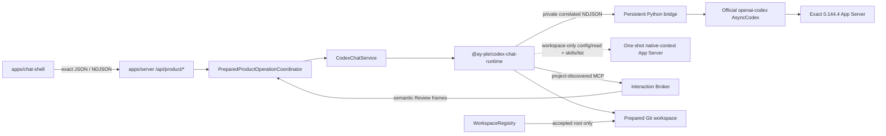

# Codex Chat 구현 지도

작성일: 2026-07-17

최근 검증: 2026-07-27

분류: 활성

성숙도: 구현됨

관련 문서: [Product-only cutover·durable v2 ADR](../adr/0013-adopt-product-only-public-surface-and-v2-store-compatibility-baseline.md), [User-owned Git SemesterWorkspace ADR](../adr/0018-adopt-user-owned-git-semester-workspaces.md), [pre-App native Bootstrap ADR](../adr/0020-bootstrap-semester-workspaces-before-app-startup.md), [InteractionCapability ADR](../adr/0019-use-mcp-interaction-capabilities-as-the-ay-app-seam.md), [Codex Chat-only graph ADR](../adr/0012-adopt-codex-chat-only-and-remove-legacy-runtime-surfaces.md), [Official Codex Python SDK 재사용 ADR](../adr/0011-reuse-official-codex-python-sdk-for-chat-shell.md), [Codex Runtime 격리](codex-runtime-isolation.md), [AY–App Interaction Capability 아키텍처](ay-app-interaction-capabilities.md), [historical app-owned SemesterWorkspace ADR](../adr/0014-create-app-owned-normalized-semester-workspaces.md), [runtime package README](../../packages/codex-chat-runtime/README.md), [product contract README](../../packages/product-contract/README.md), [server README](../../apps/server/README.md), [Chat Shell README](../../apps/chat-shell/README.md)

## 목적

Tracked repository의 canonical product caller, official SDK 기반 Runtime, Server·Browser 경계, workspace-local state와 검증 표면을 한눈에 설명한다. 이 문서는 **현재 구현**을 소유하며 ADR 0018·0019의 채택 목표를 이미 구현된 것처럼 쓰지 않는다. 채택 이유는 각 ADR, package별 사용법과 exact 명령은 각 README, 제품 작업 순서는 Development Backlog가 소유한다.

Runtime Harness, Runtime Inspector, `HeadlessCodexClientHost`, `/api/codex-chat/*`와 legacy Browser Chat owner는 current topology가 아니다. Historical ADR·spec·ticket은 당시 증거를 보존하지만 executable fallback이나 compatibility surface로 해석하지 않는다.

Canonical lifecycle의 `active`는 exact prepared Git root에서 listener·Broker, Runtime thread, project config와 required Interaction MCP readiness가 모두 확인되고 registry transaction이 acceptance됐다는 뜻이다. 제거한 public-preview Server graph의 `Semester Ready` envelope·attestation과 current-v2 controller의 internal `ready`는 current public topology가 아니다.

## 현재 결론

| 질문 | 현재 답 |
| --- | --- |
| Maintained Runtime은 무엇인가? | Official Python SDK를 재사용하는 `@ay-ple/codex-chat-runtime` 하나다. Generic engine Interface와 두 번째 adapter는 없다. |
| Browser가 App Server와 직접 통신하는가? | 아니다. `@ay-ple/chat-shell`은 `@ay-ple/product-contract`를 통해 local Express Server의 `/api/product/*`만 사용한다. Native protocol·bridge·credential은 Browser bundle에 없다. |
| In-app Browser OAuth가 구현됐는가? | 아니다. Public-preview Server route·account coordinator·Browser UI와 shared contract를 제거했다. Current dev·dogfood는 workspace-only Runtime에서 전역 `CODEX_HOME`의 기존 account readiness만 읽으며 Node package surface에는 login·logout capability가 없다. |
| Native identity를 제품 ID로 다시 만드는가? | 아니다. Server가 발급한 opaque public operation·interaction·patch·decision binding만 Browser에 투영하고 native `threadId`·`turnId`·request identity는 통합 내부에 남는다. |
| Runtime와 workspace는 어떻게 선택하는가? | Startup은 sibling `../.ay-ple/`의 verified Runtime과 canonical root contract를 사용한다. 첫 open·학기 변경은 explicit `--workspace` prepared Git root, 이후 인자 없는 실행은 registry active pointer를 fresh reopen한다. |
| Durable product state는 어디에 있는가? | External `WorkspaceRegistry`는 canonical root와 active pointer만 보존하고 workspace의 tracked v4 identity가 일치할 때만 사용한다. 학업 결과는 user-owned Git workspace 파일과 AY-owned checkpoint에 남는다. Old current-v2 aggregate는 자동 변환하지 않는 contraction source다. |
| First Assignment vertical은 닫혔는가? | Prepared Git workspace의 normal AY Chat→Interaction MCP proposal→inline Semantic Review→AY-owned actual-file apply/checkpoint가 deterministic Browser·actual Runtime trace로 검증됐다. |
| 채택된 public workflow는 무엇인가? | ADR 0018·0019·0020의 prepared Git workspace, project-discovered Skill·MCP, transient Interaction request/result와 AY-owned file apply다. Old app-owned source·Run·patch·confirmation·apply는 public Router에 mount되지 않는다. |

## Tracked 구성

| 위치 | 책임 | 공개 경계 |
| --- | --- | --- |
| `packages/interaction-mcp` | Domain-neutral `propose_state_patch` codec, strict private Broker wire와 authenticated handshake·one-held-POST를 수행하는 built STDIO Adapter | Server가 소비할 package root와 executable `dist/stdio.js`. Runtime package·Browser contract·active workspace 선택은 포함하지 않음 |
| `packages/product-contract` | Prepared-workspace lifecycle, normal Chat, Browser-safe semantic Review·interaction·interrupt request/response와 closed target operation frame을 위한 dependency-free exact type·decoder | Browser-safe `.` 하나. Course·material·academic action/history contract, raw MCP, private credential·binding, HTTP framing, persistence, Server domain과 native Runtime protocol은 포함하지 않음 |
| `packages/codex-chat-runtime` | Exact bundle verification, official SDK, private Node↔Python bridge, workspace-only `CodexWorkspaceRuntime`, fresh Account Readiness, native conversation·Plan·MCP·interaction projection, one-shot native-context probe·atomic coordinator, deadline·bound·fatal settlement과 process-group reap | Package root, Server·Runtime regression용 `./contract`, test-only `./testing`. Production과 lower-level verified factory는 exact workspace 하나만 받고 Node account command family는 `read_account`로 닫힘 |
| `packages/semester-workspace` | User-owned Git root v4 identity codec, old current-v2 compatibility decoder와 consumer 없는 v3 admission·setup kernel | Canonical startup은 v4 identity만 registry freshness에 사용한다. V2/v3는 public composition에 없고 자동 변환하지 않음 |
| `apps/server` | Prepared launch·registry·startup coordinator, target Product Router, Interaction Broker, generic Product Turn, neutral NDJSON writer와 listener·Runtime close ordering. Consumer 없는 old store/controller와 Runtime MCP source는 후속 physical contraction 경계 | Canonical entrypoint의 `/api/product/*`는 lifecycle·settings·normal Chat·semantic Review·general interaction·interrupt만 제공. Private Broker Router는 same listener loopback+credential 경계 |
| `apps/chat-shell` | Candidate-free lifecycle, full-width AY Chat, inline semantic Review card·settlement reducer와 recovery | `@ay-ple/product-contract`를 strict decode하는 fetch/NDJSON adapter와 cross-frame reducer. Semantic `204`는 delivery ACK이고 resolved frame만 settlement authority |
| `references/openai-codex` | Exact official source review와 pin upgrade diff를 위한 dev-only oracle | Production dependency가 아닌 fixed Git submodule |

`apps/inspector`, legacy runtime packages, `/api/runtime/*`, `/api/codex-chat/*`, `dev:chat-only`, `useChatShell`과 Browser compatibility consumer는 tracked product graph에 없다. Runtime의 internal text contract·regression export는 product lifecycle 검증을 위해 유지된다.

`@ay-ple/interaction-mcp`의 built Adapter·exact codecs와 `apps/server`의 held Interaction Broker·evidence resolver가 canonical graph에 있다. Runtime은 bounded generic child environment와 thread-scoped exact MCP readiness를 제공하며 tracked trusted Git project에서 built Adapter handshake·`propose_state_patch` roster까지 검증한다. Broker Router, normal Product Turn NDJSON, Browser inline card, bodyless result와 continuity failure가 한 public composition으로 이어진다. `/api/product-mcp`, academic Review/apply path와 thread-start private MCP override는 mount하지 않는다.

## 실행 흐름

Canonical root `npm run dev`는 current `hub/`, sibling `../.ay-ple/`, caller의 전역 `CODEX_HOME` 또는 `~/.codex`와 prepared workspace를 한 canonical contract로 검증한 뒤 Server와 Chat Shell을 exact local Origin으로 시작한다. Runtime payload와 cache는 external app data, controlled `HOME`과 temp만 app-owned state에 두며 separate SQLite home은 만들지 않는다. `CODEX_CHAT_WORKSPACE`와 ambient `cwd`는 selection authority가 아니다. Explicit `--workspace`는 첫 open·학기 변경을 선택하고 인자 없는 실행은 registry active pointer를 fresh reopen한다.

Persistent bridge와 workspace native-context sidecar는 모두 exact SemesterWorkspace Git root를 `cwd`로 사용하고 native `.git` project boundary를 따른다. Sidecar는 verified native executable과 controlled environment에서 `initialize(capabilities.experimentalApi=true) → initialized → config/read → skills/list`를 실행하고 완전히 reap된 뒤 high-level `CodexNativeContextPort` 결과만 반환한다. Runtime coordinator는 같은 caller `AbortSignal`의 Config·Skill read를 한 atomic snapshot으로 결합하고 서로 다른 concurrent caller를 독립 generation으로 격리한다. Server boundary는 두 read를 첫 `await` 전에 같은 signal로 claim한다. Raw JSON-RPC와 generated payload는 Runtime package 밖으로 나오지 않는다. Official `system` Skill은 응답 shape까지 검증하되 Server의 effective roster projection에서는 제외하고, `repo | user | admin` Skill만 managed bundle conflict gate의 입력이 된다. Process-wide managed Skill root와 `skills/extraRoots/set` injection은 사용하지 않는다.

## HTTP와 Browser contract

| 표면 | 현재 동작 |
| --- | --- |
| `GET /api/product/bootstrap` | Path-free `starting | active | recovery_required` prepared-workspace lifecycle와 coarse `operationStatus`를 `no-store`로 반환한다. |
| `GET /api/product/codex-settings` | 전역 Codex account가 광고한 visible model, reasoning effort 순서와 Fast availability를 Browser-safe하게 반환한다. |
| `POST /api/product/chat/messages` | Prepared Git root에서 normal AY Chat을 `workspace_write`로 실행한다. Project config가 Skill·MCP를 발견하며 App은 academic source·Run이나 managed Skill을 주입하지 않는다. |
| `POST /api/product/operations/:operationId/interactions/:interactionId/answer|cancel` | Active 일반 Plan interaction을 same-Turn native response로 번역한다. Academic state는 바꾸지 않는다. |
| `POST /api/product/reviews/:interactionId` | Exact Semantic Review binding의 `accept | revise | reject`를 held MCP call에 전달한다. Bodyless `204`는 전달 ACK이고 resolved NDJSON frame이 settlement authority다. |
| `POST /api/product/operations/:operationId/interrupt` | Matching Turn의 interrupt acknowledgement를 반환하고 stream terminal을 authoritative outcome으로 유지한다. |

Mutation은 loopback socket과 absent 또는 exact configured local Origin에서만 허용한다. `@ay-ple/product-contract`가 field roster를 단독 소유하고 Server는 request decoder와 public projection, Chat Shell은 JSON·NDJSON decoder를 사용한다. Raw protocol, hidden reasoning, traceback, absolute path, credential과 private correlation은 공개 경계를 넘지 않는다. Old chooser/Course/material/First Assignment/retry, `/api/product-mcp`와 patch/revision Review alias는 canonical Router에서 `404`다.

## Runtime과 lifecycle

Runtime package는 official source commit `8c68d4c87dc54d38861f5114e920c3de2efa5876`, native `0.144.4`, standalone CPython, 여덟 단계 patched SDK와 dependency closure를 canonical manifest로 검증한다. Runtime은 bounded generic child environment를 persistent bridge와 같은 native child에 전달하고, official thread-scoped MCP inventory를 `serverName + expectedTools` readiness로만 축약한다. Native-context read는 private SDK state에 의존하지 않고 official native App Server method를 AY-PLE-owned supervisor에서 strict decode한다. Canonical normal Product Turn은 bounded `TextInput`, native effective 또는 사용자가 고른 advertised model·reasoning, `workspace_write`와 `default | fast` service tier를 사용한다. Skill·MCP는 project에서 발견하며 managed `SkillInput`과 thread-start MCP override를 사용하지 않는다. Old First Assignment의 managed Skill·Course guard·academic permission 조합은 donor regression source에만 남는다.

Workspace Runtime의 sidecar와 persistent worker는 같은 verified bundle·controlled roots·application identity를 사용하며 Runtime `close()`는 둘의 complete reap을 함께 기다린다. Sidecar query·protocol failure는 persistent conversation Runtime을 곧바로 poison하지 않지만 cleanup ambiguity는 Runtime terminal로 latch된다. Public-preview 전용 `AccountRuntimeCoordinator`, auth-only→workspace transition과 Browser command drain은 Server에서 제거됐다.

`CodexChatService`는 Account Readiness, current product thread·active Turn, interaction·interrupt, Runtime terminal observation·recycle와 bounded close를 한 deep Module에 캡슐화한다. Internal text methods·native identity regression은 exact Runtime oracle로 남을 수 있지만 HTTP·Browser public surface가 아니다. Shared NDJSON line writer와 process-control test support는 product HTTP·canonical shutdown gate가 소유한다.

Server shutdown은 다음 순서를 유지한다.

1. 새 product work와 listener restart를 막는다.
2. Listener close를 시작해 새 TCP intake를 거절한다.
3. Active disconnect drain과 Runtime `close()`를 한 promise로 수렴한다.
4. Python·native process와 pipe가 사라진 뒤 application close를 resolve한다.

## Store compatibility

[ADR 0013](../adr/0013-adopt-product-only-public-surface-and-v2-store-compatibility-baseline.md)의 workspace-local v2 store는 cutover 전 durable baseline이었다. Cutover는 해당 bytes를 변환·rewrite·삭제하지 않으며 old decoder와 store source는 rollback·contraction 경계로 남는다. Exact codec·invariant·physical I/O 동작은 [Server README](../../apps/server/README.md)가 소유한다.

[ADR 0014](../adr/0014-create-app-owned-normalized-semester-workspaces.md)의 v3 admission·recovery, durable setup envelope·journey와 lease-bound Ready relaunch는 consumer 없는 historical kernel이다. V2와 v3 모두 canonical public authority가 아니며 contraction 전까지 original bytes를 보존한다.

ADR 0018 target의 root v4 identity codec, external `WorkspaceRegistry` v1 codec·CAS store, prepared-workspace launch resolver, candidate-free Browser lifecycle codec과 process-local product Turn coordinator가 canonical graph다. Resolver는 explicit prepared root를 우선하고 no-argument start에서 active pointer를 fresh reopen하며 canonical exact Git root와 strict v4 identity만 선택한다. No-argument authoritative reopen은 registry read 전에 dead `pending` writer를 reconcile하여 acceptance 전 first-open target을 제거하거나 switch 이전 pointer를 복원한다. Registry는 canonical root와 active pointer만 보존하고 fresh root identity가 matching할 때만 available로 판정하며 malformed·future bytes를 reset하지 않는다. Server startup coordinator는 shared listener·Broker generation을 Runtime보다 먼저 준비하고 exact-root config·authenticated thread·required MCP roster·fresh context 뒤에만 verified `workspaceId` CAS와 active projection을 연다. Registry transaction acceptance보다 Runtime terminal이 먼저 오면 같은 writer lease가 prior pointer를 exact 복원하고 normal active projection을 열지 않는다. Missing/moved/reused active root는 Runtime spawn 없는 path-free `workspace_unavailable`, malformed/future registry는 bytes-preserving `registry_incompatible`, startup readiness failure·active Runtime·Adapter continuity loss는 listener가 유지된 `runtime_unavailable` Browser recovery로 구분한다. Failed explicit relaunch 뒤 no-argument run은 previous pointer의 root를 fresh Runtime·thread·Broker generation으로 reopen한다. App shutdown만 Broker → Runtime → listener cleanup을 수행한다. Chat Shell은 `starting | active | recovery_required`를 polling해 desktop Browser에 투영하고 candidate/change control을 두지 않는다.

## 검증 표면

| 명령 | 증명하는 것 |
| --- | --- |
| `npm test` | Product contract, Runtime, Server, Chat Shell과 repository-owned tooling의 unit·integration contract |
| `npm run test:e2e` | Default Browser route의 prepared lifecycle, normal Chat, general clarification·interrupt와 inline Semantic Review accept·revise·reject. Removed academic control과 route가 없는 public trace도 함께 검증 |
| `npm run typecheck` / `npm run build` | Product contract→Runtime→Server→Shell TypeScript graph |
| `npm run lint -w @ay-ple/chat-shell` | Browser production source와 Playwright harness lint |
| `npm run check:docs-links` | Active/current Markdown link와 삭제된 owner reference |
| `npm run validate:exact-sdk -w @ay-ple/codex-chat-runtime` | Exact source·generated SDK·ordered patch·provenance |
| `npm run validate:production-runtime -w @ay-ple/codex-chat-runtime` | Canonical bundle·bundled bridge·post-run non-mutation |
| `npm run validate:node-runtime -w @ay-ple/codex-chat-runtime` | Hardened Node actual-child, native-context fake·exact native, exact local-provider와 process-group reap |
| `npm run test:native-context-actual -w @ay-ple/codex-chat-runtime` | One-shot App Server의 strict protocol·cleanup matrix와 exact native provider-free config·Skill projection |
| `npm run test:prepared-workspace-product-actual` | Native Bootstrap output의 exact Git root와 installed First Assignment Skill 계약을 real built Adapter·shared listener/Broker에 직접 공급한 handshake/tool readiness, inline Review, accept 전 no-mutation, accept 뒤 AY-owned file checkpoint, failure no-mutation과 credential·process cleanup |
| `npm run test:product-entrypoint` | Root canonical product command의 explicit root 계산, product API·Browser owner, legacy path 무시와 SIGINT 뒤 OS process graph·port cleanup |

Deterministic Browser green은 exact native identity·bundle·process cleanup을 대신하지 않고 exact local-provider도 Browser reducer·HTTP fail-closed behavior를 대신하지 않는다.

## 현재 미지원 경계

| Gap | 현재 사실 | 정본 |
| --- | --- | --- |
| Old academic physical contraction | Browser workbench, public Router/action adapter와 shared academic contract는 제거됐다. Consumer 없는 current-v2 store/controller, private patch MCP, managed Skill source와 old Runtime MCP override의 bytes-preserving physical 제거만 남아 있다. 제거 작업의 순서와 완료 상태는 Development Backlog가 소유한다. | [InteractionCapability ADR](../adr/0019-use-mcp-interaction-capabilities-as-the-ay-app-seam.md), [User-owned Git SemesterWorkspace ADR](../adr/0018-adopt-user-owned-git-semester-workspaces.md) |
| Rollback boundary | Cutover 전 rollback은 current Browser·Server·v2 store·private Runtime/MCP graph 전체, cutover 뒤 rollback은 prepared lifecycle Browser·target Router·Broker·generic Runtime environment·project Skill/MCP graph 전체다. Target Server/old Browser 또는 target Browser/old academic Runtime 같은 half-state는 지원하지 않는다. | [pre-App native Bootstrap ADR](../adr/0020-bootstrap-semester-workspaces-before-app-startup.md) |
| Conversation persistence | Browser transcript는 transient이고 `thread/read`·`thread/resume`, multi-thread catalog와 client별 isolation은 없다. 반영된 학업 결과의 durability는 user-owned Git workspace와 checkpoint가 소유한다. | [Chat Shell README](../../apps/chat-shell/README.md) |
| Interactive Codex approval | Normal Product Turn과 Plan interaction은 검증됐지만 generic command·file·network approval center는 채택하지 않았다. | [ADR 0011](../adr/0011-reuse-official-codex-python-sdk-for-chat-shell.md) |
| Packaged Desktop | `.app`·`.dmg`, Developer ID signing·notarization, automatic updater와 다른 platform은 지원하지 않는다. | [macOS-first ADR](../adr/0009-use-a-macos-first-local-web-app-product-path.md) |

중단한 public npx release lane의 `@ay-ple/runtime-release`, `apps/ay-ple` production host와 public-preview Server·Browser graph는 tracked graph에서 제거했다. 이는 현재 gap이나 후속 목표가 아니며 당시 결정과 구현 증거만 historical ADR 0016·0017과 완료 ticket에 남는다. Runtime의 managed account·`auth-only` surface와 AY-PLE-owned Python login/logout bridge command, managed-login 전용 patch는 제거됐다. Current Runtime은 workspace-only contract, fresh Account Readiness와 exact `0001`–`0007` patch stack만 유지한다. Consumer 없는 `semester-workspace` v3 kernel과 Server 내부 old academic persistence·Runtime MCP source는 ADR 0018·0019에 맞춘 후속 physical contraction 대상이다.
