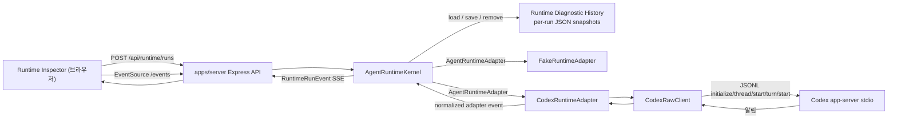

# Runtime Harness 구현 지도

작성일: 2026-07-09
최근 검증: 2026-07-13
분류: 활성

성숙도: 구현됨

관련 문서: [Runtime Harness와 Codex Adapter 기반 Spec](../specs/2026-07-09-runtime-harness-codex-adapter-foundation.md), [Runtime Harness Hardening Spec](../specs/2026-07-10-runtime-harness-hardening.md), [Runtime Harness ADR](../adr/0003-build-runtime-harness-before-product-layer.md), [실행 이력 저장소 ADR](../adr/0004-split-runtime-history-semantics-from-workspace-storage.md), [Codex-native runtime foundation ADR](../adr/0010-separate-codex-app-server-connection-from-conversation-runtime.md), [역사적 Headless Codex Client Host ADR](../adr/0008-separate-headless-codex-client-host-from-product-ui.md), [server README](../../apps/server/README.md), [Codex-native 제품 작업 조합](codex-native-product-composition.md), [Codex Runtime 격리](codex-runtime-isolation.md), [Codex App Server method 목록](codex-app-server-method-inventory.md)

## 목적

Runtime Harness와 Codex adapter 기반이 빠르게 구현된 뒤, 현재 코드가 어떤 모듈과 경계로 구성되어 있는지 한눈에 이해할 수 있게 정리한다. 이 문서는 spec의 요구사항을 다시 쓰는 문서가 아니라, 구현 이후의 실제 지도를 기록하는 기술 구조 문서다.

AGENTS.md는 안정적인 작업 규칙과 이 문서로 향하는 포인터만 유지한다. Runtime Harness의 구성, 엔드포인트, adapter 동작, 생성된 protocol 세부사항, 알려진 gap이 바뀌면 이 문서나 package README를 업데이트하고, 최종 판단은 항상 현재 코드와 테스트를 읽어 확인한다.

현재 `HeadlessCodexClientHost`, `ProductRuntimeLayout`과 `CodexStdioTransport`는 코드에 남아 있는 기존 구현이다. ADR 0010이 채택한 Connection → ConversationRuntime 목표는 아직 구현되지 않았으므로 아래 지도는 기존 구현의 현재 사실을 보존한다. [First-party client port·재사용 감사](../wayfinding/codex-native-client-redesign/assets/019-first-party-client-port-and-reuse-audit.md)의 disposition에 따라 교체 slice가 실제 gate를 통과할 때만 구성을 갱신한다.

## 현재 결론

| 질문 | 현재 답 |
| --- | --- |
| Runtime Harness의 중심 경계는 어디인가? | `packages/runtime-core`의 `AgentRuntimeKernel`이다. 외부는 `RuntimeRunEvent`, `RuntimeRunLog`, 어댑터 설명, 실행 이력을 본다. 이 답은 단일 실행 개발자 Harness 범위이며 제품 전체 상호작용 경계를 뜻하지 않는다. |
| Fake와 Codex는 같은 계약을 만족하는가? | 둘 다 `AgentRuntimeAdapter`를 구현하고 kernel에 `output_delta`, `completed`, `cancelled`, `failed`, `debug_log` adapter event를 전달한다. |
| 브라우저가 Codex app-server와 직접 통신하는가? | 아니다. `apps/server`가 kernel과 adapters를 소유하고, `apps/inspector`는 HTTP와 SSE만 사용한다. |
| raw Codex protocol type이 제품/core로 새는가? | 현재 생성된 Codex type은 `packages/runtime-codex/src/internal/` 아래에 있고 `runtime-core`, server, inspector의 안정 계약으로 다시 export되지 않는다. |
| Runtime Inspector는 제품 UI인가? | 아니다. prompt, transcript, status, events, raw/debug log, history, capability slots를 보는 개발자용 엔진 관측 표면이다. |
| run log는 영속적인가? | server-owned schema v1 per-run JSON snapshot으로 저장된다. Streaming evidence는 run별 최대 100ms fixed-window checkpoint로 저장되며, server restart 때 `running`/`cancelling` record는 ready 이전에 normalized `failed`로 복구된다. Terminal history는 count와 UTF-8 canonical envelope bytes로 제한되고 명시적으로 clear할 수 있다. 실행 중 persistence failure는 affected run을 non-durable `failed`로 닫고 kernel을 degraded로 전환한다. |

## 구성

| 위치 | 역할 | 공개 표면 | 중요한 내부 |
| --- | --- | --- | --- |
| `packages/runtime-core` | runtime 생명주기의 안정 계약과 kernel | `AgentRuntimeKernel`, `AgentRuntimeAdapter`, `RuntimeRunEvent`, `RuntimeRunLog`, `RuntimeRunLogPersistence`, persistence state, run summary/history | async hydration/recovery gate, run별 coalesced checkpoint, durability barrier, sticky degraded state, non-durable emergency failure, in-memory read view, subscriber 관리, cancellation mode 처리 |
| `packages/runtime-fake` | 검사용 결정적 adapter | `FakeRuntimeAdapter` | run 시작 debug evidence, 지연된 output 조각, `failNextRun()` 실패 시나리오, abort 기반 즉시 취소 |
| `packages/runtime-codex` | Codex app-server 통합 package | `CodexRuntimeAdapter`, `CodexRawClient` wrapper type, 기존 `HeadlessCodexClientHost` lifecycle·atomic subscription, 제품 runtime layout 사전 검증, status/smoke helper, capability slots | 생성된 app-server protocol type, direction·ID type과 adopted Client response schema를 검증하는 기존 bidirectional stdio JSONL transport, lifecycle epoch·generation, subscriber별 bounded queue, actual-child fixture journal, Harness-managed repository-local runtime home, 제품 root·binary·runtime-home pair 검증, raw/debug log |
| `apps/server` | 브라우저에 안전한 로컬 companion host | `/api/runtime/*`, `/api/runtime/runs/:id/events` SSE, `/api/runtime/codex/*` | fake/codex adapters와 ready kernel 조립, repository-local developer diagnostic store |
| `apps/inspector` | 개발자용 Runtime Inspector | adapter 선택, prompt, transcript, events, run log, history, Codex status, capability slots를 보는 React UI | server endpoint만 소비하며 app-server stdio와 직접 통신하지 않음 |

## Runtime 흐름

## Runtime 계약

| 계약 요소 | 의미 |
| --- | --- |
| `RuntimeRunStatus` | `running`, `cancelling`, `completed`, `cancelled`, `failed` |
| `RuntimeRunEvent` | `started`, `output_delta`, `cancelling`, `completed`, `cancelled`, `failed` event를 순서대로 담는 정규화된 생명주기 stream |
| `RuntimeRunLog` | prompt, status, output, error, normalized events, optional debug evidence, timestamp를 담는 run 기록 |
| `RuntimeAdapterEvent` | Adapter가 kernel에 전달하는 event vocabulary. Adapter는 inspector/server state에 직접 쓰지 않는다. |
| `RuntimeAdapterCancellationMode` | `immediate`는 kernel이 취소를 즉시 표시하게 하고, `adapter_confirmed`는 adapter가 종료 확인이나 실패를 내보낼 때까지 `cancelling`에 머무르게 한다. |
| `RuntimeRunLogPersistence` | 전체 log load, single-record save, startup retention 적용과 run ID remove를 표현하는 core-owned async seam이다. Production kernel은 hydration, interrupted-run recovery save와 retention 동기화를 마친 ready instance만 반환한다. |

Codex는 `adapter_confirmed`를 사용한다. 실제 취소는 단순한 `AbortSignal`이 아니며, adapter가 `turn/interrupt`를 보내고 Codex 종료 근거를 관측해야 run이 `cancelled`가 된다.

`RuntimeRunEvent`는 요청 시작부터 종료 상태까지의 진단 생명주기만 표현한다. ModelingInvocation, native Codex thread, `StatePatch`와 사용자 검토를 포함하는 AY-PLE 제품 계약이 아니다.

## Runtime Diagnostic History 저장

| 항목 | 현재 동작 |
| --- | --- |
| 기본 위치 | repository root 아래 server-owned developer diagnostic directory다. 정확한 경로와 override는 [server README](../../apps/server/README.md)가 소유한다. |
| envelope | `{ schemaVersion: 1, savedAt, log }`; `log`는 normalized events와 `debugLog`를 포함한 self-contained `RuntimeRunLog`다. |
| 민감 정보 경계 | 현재 developer-only 로컬 record는 prompt, output과 raw protocol을 포함할 수 있는 debug evidence를 저장한다. 제품 session, WorkspaceHistory 또는 감사 기록이 아니며 그 용도로 재사용하지 않는다. |
| atomic replace | 같은 directory의 unique temporary file에 UTF-8 JSON을 쓰고 file을 sync·close한 뒤 canonical UUID filename으로 rename한다. 실패한 replacement는 이전 canonical record를 보존한다. |
| hydration | Store-owned stale temporary file을 best-effort 정리하고, canonical JSON의 envelope, UUID filename 일치, required log/event/debug 구조와 lifecycle sequence를 검증한 뒤 `startedAt`, `runId` 순으로 hydrate한다. Hydrated terminal record는 그대로 유지한다. |
| streaming checkpoint | Output delta와 debug evidence는 in-memory view에 즉시 반영되고, output normalized event만 subscriber에 즉시 공개된다. Dirty snapshot은 run별 직렬 queue에서 최대 100ms fixed window마다 최신 revision 하나로 coalesce되며, 지속적인 stream도 timer를 trailing debounce하지 않고 주기적으로 checkpoint한다. |
| transition durability ordering | Cancelling과 terminal transition은 pending timer를 취소하고 in-flight checkpoint를 drain한 뒤 최신 dirty snapshot과 transition snapshot을 순서대로 저장한다. Transition은 저장 뒤 publish되며 terminal waiter는 publish 뒤 resolve되어, 늦은 checkpoint가 terminal snapshot을 덮어쓰지 않는다. |
| restart recovery | Hydrated `running`/`cancelling` record는 adapter 실행, resume 또는 thread 재연결 없이 기존 transcript/events/debug evidence를 보존하고 다음 sequence의 normalized `failed` event를 추가한다. Exact error는 `Runtime interrupted by server restart`이며 recovery snapshot save가 끝나야 kernel과 server가 ready가 된다. |
| retention | 기본 terminal run 100개와 canonical envelope 총 104,857,600 UTF-8 bytes를 유지한다. Terminal completion time, started time, run ID 오름차순으로 prune하며 active record는 두 한도에서 제외한다. |
| terminal clear | `DELETE /api/runtime/runs`가 operation 시작 시점의 terminal record를 disk와 kernel memory에서 제거한다. Active run의 adapter, checkpoint, subscriber와 SSE는 유지한다. |
| persistence failure | Initial save failure는 adapter 실행과 run 공개를 막는다. Checkpoint, cancelling 또는 terminal save failure는 affected adapter를 abort하고 다음 sequence의 normalized `failed` event와 `persistence_error` debug evidence를 memory/subscriber에 공개하되 다시 저장하지 않는다. Kernel은 sticky degraded가 되어 새 run, cancel request와 clear를 거부하고 diagnostic read는 유지한다. |
| startup integrity | Invalid setting, 준비할 수 없는 directory, malformed/invalid/unsupported canonical record는 app/listener 생성 전 startup을 실패시킨다. Stale store-owned temporary cleanup failure만 warning 후 canonical hydration을 계속한다. |

## Codex Adapter 책임

| 단계 | 현재 동작 |
| --- | --- |
| runtime 경로 해석 | `CodexRawClient`는 package dependency의 binary를 해석하고 repository `.ay-ple/runtime-codex/*` home을 기본 사용한다. `CODEX_HOME`과 `CODEX_SQLITE_HOME` override는 현재 독립적으로 resolve된다. |
| 초기화 | 생성된 계약에 맞춰 `initialize`를 보내고 이어서 `initialized`를 보낸 뒤 raw/debug message를 기록한다. |
| 작업 디렉터리 | `CODEX_RUNTIME_CWD`가 없으면 server process의 `process.cwd()`를 사용한다. npm workspace 실행에서는 보통 `apps/server`다. |
| prompt run 시작 | 실행마다 새 app-server process와 persistent thread를 만들고 text input으로 한 turn을 시작한다. Process 종료 때 thread archive/delete/unsubscribe를 보내지 않는다. |
| output stream | app-server 알림을 읽고, 일치하는 `item/agentMessage/delta`를 normalized `output_delta`로 mapping한다. |
| run 완료 | 일치하는 `turn/completed`의 status가 `completed`이면 normalized `completed`로 mapping한다. |
| run 실패 | failed turn completion, non-retryable `error`, spawn/init/thread/turn 실패, terminal stream loss를 normalized `failed`로 mapping한다. |
| run 취소 | turn scope가 생긴 뒤 abort되면 `turn/interrupt`를 보내고 interrupted completion을 관측할 때까지 알림을 비워 읽은 뒤 `cancelled`를 내보낸다. 확인 timeout은 기본 15초이며 adapter option으로 주입할 수 있다. interrupt request failure, missing confirmation, pre-turn-scope cancellation은 debug evidence가 있는 `failed`가 된다. |

## Capability 가시성

[Codex App Server 전체 raw method 목록](codex-app-server-method-inventory.md)은 pinned stable·experimental schema의 모든 method와 AY-PLE의 연결·채택 판단을 기록한다. 전체 method 존재 여부와 method별 연결·채택 판단은 이 generated 목록이 보여준다.

`packages/runtime-codex/src/capability-slots.ts`는 Runtime Inspector에서 몇 가지 capability family를 빠르게 살펴보기 위한 broad-shallow projection이다. 전체 목록의 대체 정본이 아니며, engine capability를 AY-PLE 제품 약속으로 바꾸지도 않는다.

| Slot | 상태 | 의미 |
| --- | --- | --- |
| `steering` | raw-callable | `turn/steer` raw wrapper는 있지만 충돌 처리 알고리즘이나 제품 UX는 없다. |
| `thread-session-read` | raw-callable | inspection용 thread list/read wrapper는 있지만 thread data는 core/product contract가 아니다. |
| `thread-session-lifecycle` | reserved | resume/fork/archive는 schema에서 관측됐지만 제품화하지 않았다. |
| `approval` | reserved | approval/guardian review method는 관측됐지만 학생용 review UX로 구현하지 않았다. |
| `profile-settings` | reserved | permission/config/thread settings는 runtime 가시성이며 AY-PLE 의미 체계가 아니다. |
| `attachment-input` | reserved | Skill·mention을 포함한 input capability는 schema에 있지만 ModelingInvocation을 native input으로 번역하는 product layer는 아직 없다. |
| `account-profile` | reserved | auth/account 관측은 있지만 계정 관리 UX는 범위 밖이다. |

## 제품 경계와의 관계

제품 작업의 normative mapping은 [Codex-native 제품 작업 조합](codex-native-product-composition.md), runtime root의 현재·목표·후속 배치는 [Codex Runtime 격리](codex-runtime-isolation.md)가 소유한다. Runtime Harness는 그 제품 계약을 아직 구현하지 않으며 아래에는 코드로 확인한 미지원 범위만 기록한다.

## 검증 표면

| 명령어 | 증명하는 것 |
| --- | --- |
| `npm run test:e2e` | 실제 Express server process와 Inspector를 통과하는 Fake lifecycle browser gate. Terminal clear와 active-run 지속, restart hydration/recovery에 더해 test-only checkpoint failure에서 normalized failed transcript, degraded health, stable mutation `503`, readable history/log와 disabled mutation controls를 검증한다. |
| `npm test` | fake Codex app-server scenario를 포함한 runtime-core, runtime-codex, server 생명주기 테스트 |
| `npm run typecheck` | packages/apps 전반의 TypeScript 계약 호환성 |
| `npm run build` | package 빌드 순서와 app build |
| `npm run lint -w @ay-ple/inspector` | Inspector lint |
| `npm run smoke:codex -w @ay-ple/runtime-codex` | 구성된 runtime home을 대상으로 명시적으로 선택해 실행하는 live Codex app-server initialize smoke |
| `npm run verify:codex-parity -w @ay-ple/server` | package pin과 실제 binary 일치, server HTTP/SSE를 통과하는 live prompt 완료와 adapter-confirmed cancellation |

대부분의 자동화된 Codex 동작 테스트는 `packages/runtime-codex/src/testing/fake-codex-app-server.ts`를 사용한다. 이 fake app-server는 live auth나 model behavior 없이 protocol 형태와 실패 mapping을 검증한다. 실제 인증된 Codex 검증은 CI 밖의 opt-in parity command가 담당하고, 수동 Runtime Inspector demo는 보조 근거로 남는다.

## 확인된 미지원 범위

| Gap | 현재 사실 | 정본·계획 |
| --- | --- | --- |
| ModelingInvocation 번역 | Public wrapper는 text input과 `cwd`만 지원하고 Skill, mention, `outputSchema`를 함께 전달하지 않는다. ModelingRun도 생성하지 않는다. | [제품 작업 조합](codex-native-product-composition.md), [개발 백로그](../product/ay-ple-development-backlog.md) |
| 기존 제품 Host의 App Server 요청 왕복 | `packages/runtime-codex`의 lower stdio transport는 네 protocol direction과 exact `RequestId`를 분리하고 known response를 generated schema로 검증한다. `HeadlessCodexClientHost`는 이 transport를 single consumer로 claim해 `initialize`와 `initialized` handshake, lifecycle generation, sanitized failure와 atomic bounded subscription을 공개한다. 기존 Harness `CodexRawClient`는 이 seam을 사용하지 않으며, thread·turn operation 의미와 Server request의 product-safe pending interaction mapping은 아직 없다. 실제 기존 Host path에 연결된 두 handshake method만 inventory의 `client-host` 단계다. | [runtime-codex README](../../packages/runtime-codex/README.md), [Method 목록](codex-app-server-method-inventory.md), [개발 백로그](../product/ay-ple-development-backlog.md) |
| 기존 제품 Host의 검증된 layout 사용 | `prepareProductRuntimeLayout()`이 명시적 세 root, package-owned pinned binary와 app-managed runtime-home pair를 spawn 전에 검증한다. `HeadlessCodexClientHost`의 첫 start가 이 seam을 호출해 validated layout을 cache하고 exact workspace `cwd`와 runtime-home pair로 child를 시작한다. 기존 Harness `cwd`와 home default/override는 그대로다. | [runtime-codex README](../../packages/runtime-codex/README.md), [Runtime 격리](codex-runtime-isolation.md), [개발 백로그](../product/ay-ple-development-backlog.md) |
| 제품 기록용 진단 정제 | Diagnostic History는 prompt와 raw/debug evidence를 포함할 수 있다. | [개발 백로그](../product/ay-ple-development-backlog.md) |
