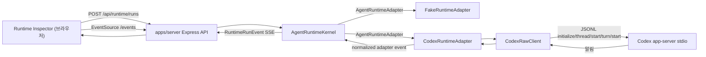

# Runtime Harness 구현 지도

작성일: 2026-07-09
상태: 활성
관련 문서: [Runtime Harness와 Codex Adapter 기반 PRD](../prds/2026-07-09-runtime-harness-codex-adapter-foundation.md), [Runtime Harness ADR](../adr/0003-build-runtime-harness-before-product-layer.md), [Runtime history storage ADR](../adr/0004-split-runtime-history-semantics-from-workspace-storage.md)

## 목적

Runtime Harness와 Codex adapter 기반이 빠르게 구현된 뒤, 현재 코드가 어떤 모듈과 경계로 구성되어 있는지 한눈에 이해할 수 있게 정리한다. 이 문서는 PRD의 요구사항을 다시 쓰는 문서가 아니라, 구현 이후의 실제 지도를 기록하는 기술 구조 문서다.

AGENTS.md는 안정적인 작업 규칙과 이 문서로 향하는 포인터만 유지한다. Runtime Harness의 구성, 엔드포인트, adapter 동작, 생성된 protocol 세부사항, 알려진 gap이 바뀌면 이 문서나 package README를 업데이트하고, 최종 판단은 항상 현재 코드와 테스트를 읽어 확인한다.

## 현재 결론

| 질문 | 현재 답 |
| --- | --- |
| Runtime Harness의 중심 seam은 어디인가? | `packages/runtime-core`의 `AgentRuntimeKernel`이다. 외부는 `RuntimeRunEvent`, `RuntimeRunLog`, adapter 설명, run 이력을 본다. |
| Fake와 Codex는 같은 계약을 만족하는가? | 둘 다 `AgentRuntimeAdapter`를 구현하고 kernel에 `output_delta`, `completed`, `cancelled`, `failed`, `debug_log` adapter event를 전달한다. |
| 브라우저가 Codex app-server와 직접 통신하는가? | 아니다. `apps/server`가 kernel과 adapters를 소유하고, `apps/inspector`는 HTTP와 SSE만 사용한다. |
| raw Codex protocol type이 제품/core로 새는가? | 현재 생성된 Codex type은 `packages/runtime-codex/src/internal/` 아래에 있고 `runtime-core`, server, inspector의 안정 계약으로 다시 export되지 않는다. |
| Runtime Inspector는 제품 UI인가? | 아니다. prompt, transcript, status, events, raw/debug log, history, capability slots를 보는 개발자용 엔진 관측 표면이다. |
| run log는 영속적인가? | 현재 `RuntimeRunLog` format은 정해졌지만 kernel 내부 메모리에 저장된다. 서버 재시작 이후에도 남는 영속 저장소는 아직 별도 과제다. |

## 구성

| 위치 | 역할 | 공개 표면 | 중요한 내부 |
| --- | --- | --- | --- |
| `packages/runtime-core` | runtime 생명주기의 안정 계약과 kernel | `AgentRuntimeKernel`, `AgentRuntimeAdapter`, `RuntimeRunEvent`, `RuntimeRunLog`, run summary/history | 메모리 기반 run log, subscriber 관리, cancellation mode 처리 |
| `packages/runtime-fake` | 검사용 결정적 adapter | `FakeRuntimeAdapter` | 지연된 output 조각, `failNextRun()` 실패 시나리오, abort 기반 즉시 취소 |
| `packages/runtime-codex` | Codex app-server 통합 package | `CodexRuntimeAdapter`, `CodexRawClient` wrapper type, status/smoke helper, capability slots | 생성된 app-server protocol type, stdio JSONL transport, app-owned runtime home, raw/debug log |
| `apps/server` | 브라우저에 안전한 로컬 companion host | `/api/runtime/*`, `/api/runtime/runs/:id/events` SSE, `/api/runtime/codex/*` | 테스트에서 kernel을 주입하지 않으면 fake/codex adapters와 kernel을 생성 |
| `apps/inspector` | 개발자용 Runtime Inspector | adapter 선택, prompt, transcript, events, run log, history, Codex status, capability slots를 보는 React UI | server endpoint만 소비하며 app-server stdio와 직접 통신하지 않음 |

## Runtime 흐름

## Runtime 계약

| 계약 요소 | 의미 |
| --- | --- |
| `RuntimeRunStatus` | `running`, `cancelling`, `completed`, `cancelled`, `failed` |
| `RuntimeRunEvent` | `started`, `output_delta`, `cancelling`, `completed`, `cancelled`, `failed` event를 순서대로 담는 정규화된 생명주기 stream |
| `RuntimeRunLog` | prompt, status, output, error, normalized events, optional debug evidence, timestamp를 담는 run 기록 |
| `RuntimeAdapterEvent` | Adapter가 kernel에 전달하는 event vocabulary. Adapter는 inspector/server state에 직접 쓰지 않는다. |
| `RuntimeAdapterCancellationMode` | `immediate`는 kernel이 취소를 즉시 표시하게 하고, `adapter_confirmed`는 adapter가 종료 확인이나 실패를 내보낼 때까지 `cancelling`에 머무르게 한다. |

Codex는 `adapter_confirmed`를 사용한다. 실제 취소는 단순한 `AbortSignal`이 아니며, adapter가 `turn/interrupt`를 보내고 Codex 종료 근거를 관측해야 run이 `cancelled`가 된다.

## Codex Adapter 책임

| 단계 | 현재 동작 |
| --- | --- |
| runtime 경로 해석 | `CodexRawClient`는 기본적으로 package가 소유한 Codex binary를 해석하고, override가 없으면 workspace-local `.ay-ple/runtime-codex/*` home을 사용한다. |
| 초기화 | 생성된 계약에 맞춰 `initialize`를 보내고 이어서 `initialized`를 보낸 뒤 raw/debug message를 기록한다. |
| prompt run 시작 | text input으로 `thread/start`와 `turn/start`를 보낸다. |
| output stream | app-server 알림을 읽고, 일치하는 `item/agentMessage/delta`를 normalized `output_delta`로 mapping한다. |
| run 완료 | 일치하는 `turn/completed`의 status가 `completed`이면 normalized `completed`로 mapping한다. |
| run 실패 | failed turn completion, non-retryable `error`, spawn/init/thread/turn 실패, terminal stream loss를 normalized `failed`로 mapping한다. |
| run 취소 | turn scope가 생긴 뒤 abort되면 `turn/interrupt`를 보내고 interrupted completion을 관측할 때까지 알림을 비워 읽은 뒤 `cancelled`를 내보낸다. interrupt request failure, missing confirmation, pre-turn-scope cancellation은 debug evidence가 있는 `failed`가 된다. |

## Capability Slot

`packages/runtime-codex/src/capability-slots.ts`는 의도적으로 broad-shallow하게 둔다. 이 파일은 엔진 capability 근거를 기록하지만, 해당 capability를 AY-PLE 제품 약속으로 바꾸지는 않는다.

| Slot | 상태 | 의미 |
| --- | --- | --- |
| `steering` | raw-callable | `turn/steer` raw wrapper는 있지만 충돌 처리 알고리즘이나 제품 UX는 없다. |
| `thread-session-read` | raw-callable | inspection용 thread list/read wrapper는 있지만 thread data는 core/product contract가 아니다. |
| `thread-session-lifecycle` | reserved | resume/fork/archive는 schema에서 관측됐지만 제품화하지 않았다. |
| `approval` | reserved | approval/guardian review method는 관측됐지만 학생용 review UX로 구현하지 않았다. |
| `profile-settings` | reserved | permission/config/thread settings는 runtime 가시성이며 AY-PLE 의미 체계가 아니다. |
| `attachment-input` | reserved | input/file capability는 schema에 있지만 SourceSelection과 parsing은 product layer 작업으로 남아 있다. |
| `account-profile` | reserved | auth/account 관측은 있지만 계정 관리 UX는 범위 밖이다. |

## 검증 표면

| 명령어 | 증명하는 것 |
| --- | --- |
| `npm test` | fake Codex app-server scenario를 포함한 runtime-core, runtime-codex, server 생명주기 테스트 |
| `npm run typecheck` | packages/apps 전반의 TypeScript 계약 호환성 |
| `npm run build` | package 빌드 순서와 app build |
| `npm run lint -w @ay-ple/inspector` | Inspector lint |
| `npm run smoke:codex -w @ay-ple/runtime-codex` | 구성된 runtime home을 대상으로 명시적으로 선택해 실행하는 live Codex app-server initialize smoke |

대부분의 자동화된 Codex 동작 테스트는 `packages/runtime-codex/src/testing/fake-codex-app-server.ts`를 사용한다. 이 fake app-server는 live auth나 model behavior 없이 protocol 형태와 실패 mapping을 검증한다. Live Codex 검증은 별도의 명시적인 smoke/demo 단계로 남아 있다.

## 남은 Gap

| Gap | 중요한 이유 | 다음 제안 |
| --- | --- | --- |
| 영속 run log | PRD는 영속 log를 요구했지만 현재 log는 서버 프로세스 안에 산다. | ADR 0004에 따라 `runtime-core`가 self-contained RuntimeRunLog persistence와 recovery semantics를 소유하고, server가 per-run versioned JSON snapshot adapter를 조립하도록 구현한다. |
| Live Codex parity 근거 | 테스트는 Codex-shaped protocol을 가진 fake app-server를 다루지만, 실제 인증된 Codex behavior는 여전히 달라질 수 있다. | ADR 0003에 따라 app-managed runtime home의 실제 Codex를 server HTTP/SSE seam으로 실행·취소하는 opt-in parity command를 추가하고, 수동 Inspector demo는 보조 증거로 확인한다. |
| 제품 runtime handoff | Runtime Harness는 의도적으로 SourceSelection, StatePatch, Review, TrustedState가 아니다. | parity demo 이후 첫 product-facing adapter use case를 정의하되, `runtime-core`만 runtime contract로 유지한다. |
| Cancellation timeout 정책 | Codex interrupt confirmation timeout은 현재 package constant다. | 더 느린 turn에서 live Codex cancellation behavior를 관측한 뒤 timeout/config를 재검토한다. |
| Inspector 영속성 | Inspector history는 현재 server memory를 반영한다. | Inspector가 reload나 server restart를 견뎌야 한다면 durable run log와 history hydration을 함께 설계한다. |
| Inspector UI-level verification | Inspector workspace에는 browser test와 `test` script가 없어 실제 HTTP/SSE wiring, terminal display, history interaction을 자동 검증하지 않는다. | ADR 0003에 따라 real server와 FakeRuntimeAdapter를 사용하는 Playwright browser integration test로 streaming, cancel, failure, history, restart hydration을 검증한다. |

## 이후 Agent 작업 규칙

- `AgentRuntimeKernel`을 runtime seam으로 취급한다. Adapter 내부로 들어가기 전에 이 seam에서 동작 테스트를 추가한다.
- 생성된 Codex app-server type은 `packages/runtime-codex/src/internal/` 안에 둔다. `runtime-core`, `apps/server`, product package에서 다시 export하지 않는다.
- `CodexRawClient`는 엔진 관측과 adapter 구현에 사용하고, AY-PLE product semantics로 취급하지 않는다.
- broad raw capability evidence는 non-productized 상태를 유지할 때만 capability slot에 추가한다.
- storage가 server restart를 견딜 때까지 run history를 영속적이라고 설명하지 않는다.
