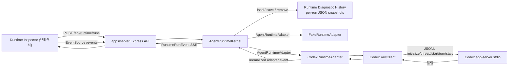

# Runtime Harness 구현 지도

작성일: 2026-07-09
상태: 활성
관련 문서: [Runtime Harness와 Codex Adapter 기반 PRD](../prds/2026-07-09-runtime-harness-codex-adapter-foundation.md), [Runtime Harness ADR](../adr/0003-build-runtime-harness-before-product-layer.md), [Runtime history storage ADR](../adr/0004-split-runtime-history-semantics-from-workspace-storage.md)

## 목적

Runtime Harness와 Codex adapter 기반이 빠르게 구현된 뒤, 현재 코드가 어떤 모듈과 경계로 구성되어 있는지 한눈에 이해할 수 있게 정리한다. 이 문서는 PRD의 요구사항을 다시 쓰는 문서가 아니라, 구현 이후의 실제 지도를 기록하는 기술 구조 문서다.

AGENTS.md는 안정적인 작업 규칙과 이 문서로 향하는 포인터만 유지한다. Runtime Harness의 구성, 엔드포인트, adapter 동작, 생성된 protocol 세부사항, 알려진 gap이 바뀌면 이 문서나 package README를 업데이트하고, 최종 판단은 항상 현재 코드와 테스트를 읽어 확인한다.

## 현재 결론

| 질문 | 현재 답 |
| --- | --- |
| Runtime Harness의 중심 seam은 어디인가? | `packages/runtime-core`의 `AgentRuntimeKernel`이다. 외부는 `RuntimeRunEvent`, `RuntimeRunLog`, adapter 설명, run 이력을 본다. |
| Fake와 Codex는 같은 계약을 만족하는가? | 둘 다 `AgentRuntimeAdapter`를 구현하고 kernel에 `output_delta`, `completed`, `cancelled`, `failed`, `debug_log` adapter event를 전달한다. |
| 브라우저가 Codex app-server와 직접 통신하는가? | 아니다. `apps/server`가 kernel과 adapters를 소유하고, `apps/inspector`는 HTTP와 SSE만 사용한다. |
| raw Codex protocol type이 제품/core로 새는가? | 현재 생성된 Codex type은 `packages/runtime-codex/src/internal/` 아래에 있고 `runtime-core`, server, inspector의 안정 계약으로 다시 export되지 않는다. |
| Runtime Inspector는 제품 UI인가? | 아니다. prompt, transcript, status, events, raw/debug log, history, capability slots를 보는 개발자용 엔진 관측 표면이다. |
| run log는 영속적인가? | server-owned schema v1 per-run JSON snapshot으로 저장된다. Streaming evidence는 run별 최대 100ms fixed-window checkpoint로 저장되며, server restart 때 `running`/`cancelling` record는 ready 이전에 normalized `failed`로 복구된다. |

## 구성

| 위치 | 역할 | 공개 표면 | 중요한 내부 |
| --- | --- | --- | --- |
| `packages/runtime-core` | runtime 생명주기의 안정 계약과 kernel | `AgentRuntimeKernel`, `AgentRuntimeAdapter`, `RuntimeRunEvent`, `RuntimeRunLog`, `RuntimeRunLogPersistence`, run summary/history | async hydration/recovery gate, run별 coalesced checkpoint, durability barrier, in-memory read view, subscriber 관리, cancellation mode 처리 |
| `packages/runtime-fake` | 검사용 결정적 adapter | `FakeRuntimeAdapter` | run 시작 debug evidence, 지연된 output 조각, `failNextRun()` 실패 시나리오, abort 기반 즉시 취소 |
| `packages/runtime-codex` | Codex app-server 통합 package | `CodexRuntimeAdapter`, `CodexRawClient` wrapper type, status/smoke helper, capability slots | 생성된 app-server protocol type, stdio JSONL transport, app-owned runtime home, raw/debug log |
| `apps/server` | 브라우저에 안전한 로컬 companion host | `/api/runtime/*`, `/api/runtime/runs/:id/events` SSE, `/api/runtime/codex/*` | fake/codex adapters와 ready kernel 조립, workspace-local per-run JSON snapshot store |
| `apps/inspector` | 개발자용 Runtime Inspector | adapter 선택, prompt, transcript, events, run log, history, Codex status, capability slots를 보는 React UI | server endpoint만 소비하며 app-server stdio와 직접 통신하지 않음 |

## Runtime 흐름

## Runtime 계약

| 계약 요소 | 의미 |
| --- | --- |
| `RuntimeRunStatus` | `running`, `cancelling`, `completed`, `cancelled`, `failed` |
| `RuntimeRunEvent` | `started`, `output_delta`, `cancelling`, `completed`, `cancelled`, `failed` event를 순서대로 담는 정규화된 생명주기 stream |
| `RuntimeRunLog` | prompt, status, output, error, normalized events, optional debug evidence, timestamp를 담는 run 기록 |
| `RuntimeAdapterEvent` | Adapter가 kernel에 전달하는 event vocabulary. Adapter는 inspector/server state에 직접 쓰지 않는다. |
| `RuntimeAdapterCancellationMode` | `immediate`는 kernel이 취소를 즉시 표시하게 하고, `adapter_confirmed`는 adapter가 종료 확인이나 실패를 내보낼 때까지 `cancelling`에 머무르게 한다. |
| `RuntimeRunLogPersistence` | 전체 log load, single-record save, run ID remove를 표현하는 core-owned async seam이다. Production kernel은 hydration과 필요한 interrupted-run recovery save를 마친 ready instance만 반환한다. |

Codex는 `adapter_confirmed`를 사용한다. 실제 취소는 단순한 `AbortSignal`이 아니며, adapter가 `turn/interrupt`를 보내고 Codex 종료 근거를 관측해야 run이 `cancelled`가 된다.

## Runtime Diagnostic History 저장

| 항목 | 현재 동작 |
| --- | --- |
| 기본 위치 | `.ay-ple/runtime-harness/runs/<uuid>.json`; `RUNTIME_HISTORY_DIR`로 runs directory를 바꿀 수 있다. |
| envelope | `{ schemaVersion: 1, savedAt, log }`; `log`는 normalized events와 `debugLog`를 포함한 self-contained `RuntimeRunLog`다. |
| atomic replace | 같은 directory의 unique temporary file에 UTF-8 JSON을 쓰고 file을 sync·close한 뒤 canonical UUID filename으로 rename한다. 실패한 replacement는 이전 canonical record를 보존한다. |
| hydration | Store-owned stale temporary file을 best-effort 정리하고, canonical JSON의 envelope, UUID filename 일치, required log/event/debug 구조와 lifecycle sequence를 검증한 뒤 `startedAt`, `runId` 순으로 hydrate한다. Hydrated terminal record는 그대로 유지한다. |
| streaming checkpoint | Output delta와 debug evidence는 in-memory view에 즉시 반영되고, output normalized event만 subscriber에 즉시 공개된다. Dirty snapshot은 run별 직렬 queue에서 최대 100ms fixed window마다 최신 revision 하나로 coalesce되며, 지속적인 stream도 timer를 trailing debounce하지 않고 주기적으로 checkpoint한다. |
| transition durability ordering | Cancelling과 terminal transition은 pending timer를 취소하고 in-flight checkpoint를 drain한 뒤 최신 dirty snapshot과 transition snapshot을 순서대로 저장한다. Transition은 저장 뒤 publish되며 terminal waiter는 publish 뒤 resolve되어, 늦은 checkpoint가 terminal snapshot을 덮어쓰지 않는다. |
| restart recovery | Hydrated `running`/`cancelling` record는 adapter 실행, resume 또는 thread 재연결 없이 기존 transcript/events/debug evidence를 보존하고 다음 sequence의 normalized `failed` event를 추가한다. Exact error는 `Runtime interrupted by server restart`이며 recovery snapshot save가 끝나야 kernel과 server가 ready가 된다. |

## Codex Adapter 책임

| 단계 | 현재 동작 |
| --- | --- |
| runtime 경로 해석 | `CodexRawClient`는 기본적으로 package가 소유한 Codex binary를 해석하고, override가 없으면 workspace-local `.ay-ple/runtime-codex/*` home을 사용한다. |
| 초기화 | 생성된 계약에 맞춰 `initialize`를 보내고 이어서 `initialized`를 보낸 뒤 raw/debug message를 기록한다. |
| prompt run 시작 | text input으로 `thread/start`와 `turn/start`를 보낸다. |
| output stream | app-server 알림을 읽고, 일치하는 `item/agentMessage/delta`를 normalized `output_delta`로 mapping한다. |
| run 완료 | 일치하는 `turn/completed`의 status가 `completed`이면 normalized `completed`로 mapping한다. |
| run 실패 | failed turn completion, non-retryable `error`, spawn/init/thread/turn 실패, terminal stream loss를 normalized `failed`로 mapping한다. |
| run 취소 | turn scope가 생긴 뒤 abort되면 `turn/interrupt`를 보내고 interrupted completion을 관측할 때까지 알림을 비워 읽은 뒤 `cancelled`를 내보낸다. 확인 timeout은 기본 15초이며 adapter option으로 주입할 수 있다. interrupt request failure, missing confirmation, pre-turn-scope cancellation은 debug evidence가 있는 `failed`가 된다. |

## Capability Slot

`packages/runtime-codex/src/capability-slots.ts`는 의도적으로 broad-shallow하게 둔다. 이 파일은 엔진 capability 근거를 기록하지만, 해당 capability를 AY-PLE 제품 약속으로 바꾸지는 않는다.

| Slot | 상태 | 의미 |
| --- | --- | --- |
| `steering` | raw-callable | `turn/steer` raw wrapper는 있지만 충돌 처리 알고리즘이나 제품 UX는 없다. |
| `thread-session-read` | raw-callable | inspection용 thread list/read wrapper는 있지만 thread data는 core/product contract가 아니다. |
| `thread-session-lifecycle` | reserved | resume/fork/archive는 schema에서 관측됐지만 제품화하지 않았다. |
| `approval` | reserved | approval/guardian review method는 관측됐지만 학생용 review UX로 구현하지 않았다. |
| `profile-settings` | reserved | permission/config/thread settings는 runtime 가시성이며 AY-PLE 의미 체계가 아니다. |
| `attachment-input` | reserved | input/file capability는 schema에 있지만 SourceSelection과 parsing은 product layer 작업으로 남아 있다. |
| `account-profile` | reserved | auth/account 관측은 있지만 계정 관리 UX는 범위 밖이다. |

## 검증 표면

| 명령어 | 증명하는 것 |
| --- | --- |
| `npm run test:e2e` | 실제 Express server process와 Inspector를 통과하는 Fake lifecycle browser gate. Completed-run 복원뿐 아니라 streaming Fake run의 partial output/debug checkpoint를 확인한 뒤 같은 history directory와 API port로 PID가 다른 server를 시작해, reload 후 normalized restart failure와 transcript/debug/sequence 보존 및 non-terminal residue 부재를 검증한다. |
| `npm test` | fake Codex app-server scenario를 포함한 runtime-core, runtime-codex, server 생명주기 테스트 |
| `npm run typecheck` | packages/apps 전반의 TypeScript 계약 호환성 |
| `npm run build` | package 빌드 순서와 app build |
| `npm run lint -w @ay-ple/inspector` | Inspector lint |
| `npm run smoke:codex -w @ay-ple/runtime-codex` | 구성된 runtime home을 대상으로 명시적으로 선택해 실행하는 live Codex app-server initialize smoke |
| `npm run verify:codex-parity -w @ay-ple/server` | package pin과 실제 binary 일치, server HTTP/SSE를 통과하는 live prompt 완료와 adapter-confirmed cancellation |

대부분의 자동화된 Codex 동작 테스트는 `packages/runtime-codex/src/testing/fake-codex-app-server.ts`를 사용한다. 이 fake app-server는 live auth나 model behavior 없이 protocol 형태와 실패 mapping을 검증한다. 실제 인증된 Codex 검증은 CI 밖의 opt-in parity command가 담당하고, 수동 Runtime Inspector demo는 보조 근거로 남는다.

## 남은 Gap

| Gap | 중요한 이유 | 다음 제안 |
| --- | --- | --- |
| 제품 runtime handoff | Runtime Harness는 의도적으로 SourceSelection, StatePatch, Review, TrustedState가 아니다. | parity demo 이후 첫 product-facing adapter use case를 정의하되, `runtime-core`만 runtime contract로 유지한다. |
| bounded history와 clear (Issue 004) | Per-run snapshot은 아직 count/byte retention을 적용하지 않으며 terminal history clear API/UI가 없다. | Terminal-only retention, remove synchronization과 clear flow를 추가한다. |
| fail-closed degraded runtime (Issue 005) | Persistence fault를 runtime health, stable 503 contract와 Inspector degraded UI로 드러내는 동작은 아직 없다. | Fault injection을 기반으로 degraded lifecycle과 mutation rejection을 구현한다. |

## 이후 Agent 작업 규칙

- `AgentRuntimeKernel`을 runtime seam으로 취급한다. Adapter 내부로 들어가기 전에 이 seam에서 동작 테스트를 추가한다.
- 생성된 Codex app-server type은 `packages/runtime-codex/src/internal/` 안에 둔다. `runtime-core`, `apps/server`, product package에서 다시 export하지 않는다.
- `CodexRawClient`는 엔진 관측과 adapter 구현에 사용하고, AY-PLE product semantics로 취급하지 않는다.
- broad raw capability evidence는 non-productized 상태를 유지할 때만 capability slot에 추가한다.
- Restart recovery는 kernel-owned history semantics로 유지한다. Adapter resume, Codex thread 재연결 또는 raw-engine status를 recovery contract에 섞지 않는다.
