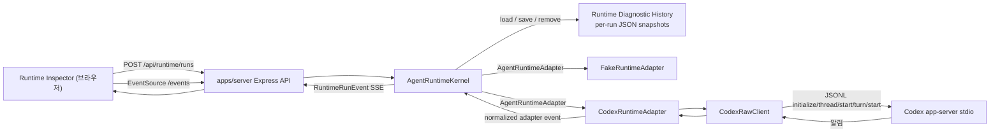

# Runtime Harness 구현 지도

작성일: 2026-07-09
최근 검증: 2026-07-11
상태: 활성
관련 문서: [Runtime Harness와 Codex Adapter 기반 PRD](../prds/2026-07-09-runtime-harness-codex-adapter-foundation.md), [Runtime Harness Hardening PRD](../prds/2026-07-10-runtime-harness-hardening.md), [Runtime Harness ADR](../adr/0003-build-runtime-harness-before-product-layer.md), [실행 이력 저장소 ADR](../adr/0004-split-runtime-history-semantics-from-workspace-storage.md), [4주 제품의 Codex App Server 우선 사용 ADR](../adr/0005-use-codex-app-server-as-first-class-mvp-runtime.md), [제품 실행 경로 분리 ADR](../adr/0006-separate-package-app-data-and-semester-workspace-roots.md)

## 목적

Runtime Harness와 Codex adapter 기반이 빠르게 구현된 뒤, 현재 코드가 어떤 모듈과 경계로 구성되어 있는지 한눈에 이해할 수 있게 정리한다. 이 문서는 PRD의 요구사항을 다시 쓰는 문서가 아니라, 구현 이후의 실제 지도를 기록하는 기술 구조 문서다.

AGENTS.md는 안정적인 작업 규칙과 이 문서로 향하는 포인터만 유지한다. Runtime Harness의 구성, 엔드포인트, adapter 동작, 생성된 protocol 세부사항, 알려진 gap이 바뀌면 이 문서나 package README를 업데이트하고, 최종 판단은 항상 현재 코드와 테스트를 읽어 확인한다.

## 현재 결론

| 질문 | 현재 답 |
| --- | --- |
| Runtime Harness의 중심 경계는 어디인가? | `packages/runtime-core`의 `AgentRuntimeKernel`이다. 외부는 `RuntimeRunEvent`, `RuntimeRunLog`, 어댑터 설명, 실행 이력을 본다. 이 답은 단일 실행 개발자 Harness 범위이며 제품 전체 상호작용 경계를 뜻하지 않는다. |
| Fake와 Codex는 같은 계약을 만족하는가? | 둘 다 `AgentRuntimeAdapter`를 구현하고 kernel에 `output_delta`, `completed`, `cancelled`, `failed`, `debug_log` adapter event를 전달한다. |
| 브라우저가 Codex app-server와 직접 통신하는가? | 아니다. `apps/server`가 kernel과 adapters를 소유하고, `apps/inspector`는 HTTP와 SSE만 사용한다. |
| raw Codex protocol type이 제품/core로 새는가? | 현재 생성된 Codex type은 `packages/runtime-codex/src/internal/` 아래에 있고 `runtime-core`, server, inspector의 안정 계약으로 다시 export되지 않는다. |
| Runtime Inspector는 제품 UI인가? | 아니다. prompt, transcript, status, events, raw/debug log, history, capability slots를 보는 개발자용 엔진 관측 표면이다. |
| run log는 영속적인가? | server-owned schema v1 per-run JSON snapshot으로 저장된다. Streaming evidence는 run별 최대 100ms fixed-window checkpoint로 저장되며, server restart 때 `running`/`cancelling` record는 ready 이전에 normalized `failed`로 복구된다. Terminal history는 count와 UTF-8 canonical envelope bytes로 제한되고 명시적으로 clear할 수 있다. 실행 중 persistence failure는 affected run을 non-durable `failed`로 닫고 kernel을 degraded로 전환한다. |
| 4주 제품 실행 엔진 방향은 무엇인가? | Codex App Server만 우선 지원한다. ACP와 다중 엔진 동작 일치는 미루고, 학기 workspace와 반복 작업 recipe를 native Codex turn으로 조합한 뒤 결과를 AY-PLE의 검토 상태로 연결한다. 고정 thread topology나 범용 CoControl framework를 선행 구현하지 않는다. |

## 구성

| 위치 | 역할 | 공개 표면 | 중요한 내부 |
| --- | --- | --- | --- |
| `packages/runtime-core` | runtime 생명주기의 안정 계약과 kernel | `AgentRuntimeKernel`, `AgentRuntimeAdapter`, `RuntimeRunEvent`, `RuntimeRunLog`, `RuntimeRunLogPersistence`, persistence state, run summary/history | async hydration/recovery gate, run별 coalesced checkpoint, durability barrier, sticky degraded state, non-durable emergency failure, in-memory read view, subscriber 관리, cancellation mode 처리 |
| `packages/runtime-fake` | 검사용 결정적 adapter | `FakeRuntimeAdapter` | run 시작 debug evidence, 지연된 output 조각, `failNextRun()` 실패 시나리오, abort 기반 즉시 취소 |
| `packages/runtime-codex` | Codex app-server 통합 package | `CodexRuntimeAdapter`, `CodexRawClient` wrapper type, status/smoke helper, capability slots | 생성된 app-server protocol type, stdio JSONL transport, app-managed runtime home, raw/debug log |
| `apps/server` | 브라우저에 안전한 로컬 companion host | `/api/runtime/*`, `/api/runtime/runs/:id/events` SSE, `/api/runtime/codex/*` | fake/codex adapters와 ready kernel 조립, workspace-local per-run JSON snapshot store |
| `apps/inspector` | 개발자용 Runtime Inspector | adapter 선택, prompt, transcript, events, run log, history, Codex status, capability slots를 보는 React UI | server endpoint만 소비하며 app-server stdio와 직접 통신하지 않음 |

## Runtime 흐름

## Runtime 계약

| 계약 요소 | 의미 |
| --- | --- |
| `RuntimeRunStatus` | `running`, `cancelling`, `completed`, `cancelled`, `failed` |
| `RuntimeRunEvent` | `started`, `output_delta`, `cancelling`, `completed`, `cancelled`, `failed` event를 순서대로 담는 정규화된 생명주기 stream |
| `RuntimeRunLog` | prompt, status, output, error, normalized events, optional debug evidence, timestamp를 담는 run 기록 |
| `RuntimeAdapterEvent` | Adapter가 kernel에 전달하는 event vocabulary. Adapter는 inspector/server state에 직접 쓰지 않는다. |
| `RuntimeAdapterCancellationMode` | `immediate`는 kernel이 취소를 즉시 표시하게 하고, `adapter_confirmed`는 adapter가 종료 확인이나 실패를 내보낼 때까지 `cancelling`에 머무르게 한다. |
| `RuntimeRunLogPersistence` | 전체 log load, single-record save, startup retention 적용과 run ID remove를 표현하는 core-owned async seam이다. Production kernel은 hydration, interrupted-run recovery save와 retention 동기화를 마친 ready instance만 반환한다. |

Codex는 `adapter_confirmed`를 사용한다. 실제 취소는 단순한 `AbortSignal`이 아니며, adapter가 `turn/interrupt`를 보내고 Codex 종료 근거를 관측해야 run이 `cancelled`가 된다.

`RuntimeRunEvent`는 요청 시작부터 종료 상태까지의 진단 생명주기만 표현한다. `ModelingRecipe` 조합, 선택 자료, native Codex thread, `StatePatch`와 사용자 검토를 포함하는 AY-PLE 제품 계약이 아니다. 새 제품 동작을 이 여섯 가지 이벤트 계약에 억지로 추가하지 않는다.

## Runtime Diagnostic History 저장

| 항목 | 현재 동작 |
| --- | --- |
| 기본 위치 | `.ay-ple/runtime-harness/runs/<uuid>.json`; `RUNTIME_HISTORY_DIR`로 runs directory를 바꿀 수 있다. |
| envelope | `{ schemaVersion: 1, savedAt, log }`; `log`는 normalized events와 `debugLog`를 포함한 self-contained `RuntimeRunLog`다. |
| 민감 정보 경계 | 현재 developer-only 로컬 record는 prompt, output과 raw protocol을 포함할 수 있는 debug evidence를 저장한다. 제품 session, WorkspaceHistory 또는 감사 기록이 아니며 그 용도로 재사용하지 않는다. |
| atomic replace | 같은 directory의 unique temporary file에 UTF-8 JSON을 쓰고 file을 sync·close한 뒤 canonical UUID filename으로 rename한다. 실패한 replacement는 이전 canonical record를 보존한다. |
| hydration | Store-owned stale temporary file을 best-effort 정리하고, canonical JSON의 envelope, UUID filename 일치, required log/event/debug 구조와 lifecycle sequence를 검증한 뒤 `startedAt`, `runId` 순으로 hydrate한다. Hydrated terminal record는 그대로 유지한다. |
| streaming checkpoint | Output delta와 debug evidence는 in-memory view에 즉시 반영되고, output normalized event만 subscriber에 즉시 공개된다. Dirty snapshot은 run별 직렬 queue에서 최대 100ms fixed window마다 최신 revision 하나로 coalesce되며, 지속적인 stream도 timer를 trailing debounce하지 않고 주기적으로 checkpoint한다. |
| transition durability ordering | Cancelling과 terminal transition은 pending timer를 취소하고 in-flight checkpoint를 drain한 뒤 최신 dirty snapshot과 transition snapshot을 순서대로 저장한다. Transition은 저장 뒤 publish되며 terminal waiter는 publish 뒤 resolve되어, 늦은 checkpoint가 terminal snapshot을 덮어쓰지 않는다. |
| restart recovery | Hydrated `running`/`cancelling` record는 adapter 실행, resume 또는 thread 재연결 없이 기존 transcript/events/debug evidence를 보존하고 다음 sequence의 normalized `failed` event를 추가한다. Exact error는 `Runtime interrupted by server restart`이며 recovery snapshot save가 끝나야 kernel과 server가 ready가 된다. |
| retention | 기본 terminal run 100개와 canonical envelope 총 104,857,600 UTF-8 bytes를 유지한다. Terminal completion time, started time, run ID 오름차순으로 prune하며 active record는 두 한도에서 제외한다. |
| terminal clear | `DELETE /api/runtime/runs`가 operation 시작 시점의 terminal record를 disk와 kernel memory에서 제거한다. Active run의 adapter, checkpoint, subscriber와 SSE는 유지한다. |
| persistence failure | Initial save failure는 adapter 실행과 run 공개를 막는다. Checkpoint, cancelling 또는 terminal save failure는 affected adapter를 abort하고 다음 sequence의 normalized `failed` event와 `persistence_error` debug evidence를 memory/subscriber에 공개하되 다시 저장하지 않는다. Kernel은 sticky degraded가 되어 새 run, cancel request와 clear를 거부하고 diagnostic read는 유지한다. |
| startup integrity | Invalid setting, 준비할 수 없는 directory, malformed/invalid/unsupported canonical record는 app/listener 생성 전 startup을 실패시킨다. Stale store-owned temporary cleanup failure만 warning 후 canonical hydration을 계속한다. |

## Codex Adapter 책임

| 단계 | 현재 동작 |
| --- | --- |
| runtime 경로 해석 | `CodexRawClient`는 기본적으로 package가 소유한 Codex binary를 해석하고, override가 없으면 workspace-local `.ay-ple/runtime-codex/*` home을 사용한다. |
| 초기화 | 생성된 계약에 맞춰 `initialize`를 보내고 이어서 `initialized`를 보낸 뒤 raw/debug message를 기록한다. |
| prompt run 시작 | `thread/start`에 `cwd`를 보내 새 thread를 만든 뒤, 반환된 `threadId`와 text input으로 `turn/start`를 보낸다. |
| output stream | app-server 알림을 읽고, 일치하는 `item/agentMessage/delta`를 normalized `output_delta`로 mapping한다. |
| run 완료 | 일치하는 `turn/completed`의 status가 `completed`이면 normalized `completed`로 mapping한다. |
| run 실패 | failed turn completion, non-retryable `error`, spawn/init/thread/turn 실패, terminal stream loss를 normalized `failed`로 mapping한다. |
| run 취소 | turn scope가 생긴 뒤 abort되면 `turn/interrupt`를 보내고 interrupted completion을 관측할 때까지 알림을 비워 읽은 뒤 `cancelled`를 내보낸다. 확인 timeout은 기본 15초이며 adapter option으로 주입할 수 있다. interrupt request failure, missing confirmation, pre-turn-scope cancellation은 debug evidence가 있는 `failed`가 된다. |

## Capability Slot

`packages/runtime-codex/src/capability-slots.ts`는 의도적으로 broad-shallow하게 둔다. 이 파일은 엔진 capability 근거를 기록하지만, 해당 capability를 AY-PLE 제품 약속으로 바꾸지는 않는다.

| Slot | 상태 | 의미 |
| --- | --- | --- |
| `steering` | raw-callable | `turn/steer` raw wrapper는 있지만 충돌 처리 알고리즘이나 제품 UX는 없다. |
| `thread-session-read` | raw-callable | inspection용 thread list/read wrapper는 있지만 thread data는 core/product contract가 아니다. |
| `thread-session-lifecycle` | reserved | resume/fork/archive는 schema에서 관측됐지만 제품화하지 않았다. |
| `approval` | reserved | approval/guardian review method는 관측됐지만 학생용 review UX로 구현하지 않았다. |
| `profile-settings` | reserved | permission/config/thread settings는 runtime 가시성이며 AY-PLE 의미 체계가 아니다. |
| `attachment-input` | reserved | Skill·mention을 포함한 input capability는 schema에 있지만, `ModelingRecipe`와 선택 자료를 native input으로 조합하는 product layer는 아직 없다. |
| `account-profile` | reserved | auth/account 관측은 있지만 계정 관리 UX는 범위 밖이다. |

## 4주 제품 연결 방향

[ADR 0005](../adr/0005-use-codex-app-server-as-first-class-mvp-runtime.md)는 현재 Harness 구현을 폐기하지 않고 역할을 단일 실행 진단으로 좁힌다. 제품은 일반적인 Codex 사용 위에 얇은 조합·검토 계층을 둔다. Codex App Server를 직접 사용하되 생성된 protocol type을 제품 계약으로 노출하지 않고, ACP와 다중 실행 엔진 추상화는 실제 두 번째 실행 엔진이 필요해질 때 검토한다. 패키지·앱 데이터·학기 작업공간의 경로 소유권은 [ADR 0006](../adr/0006-separate-package-app-data-and-semester-workspace-roots.md)을 따른다.

### 제품 개념과 native Codex 동작의 대응

| 제품 의미 | Codex App Server 통합에서의 해석 | 경계 |
| --- | --- | --- |
| 학기 workspace | 새 thread의 `thread/start.cwd`로 설정하고 재사용 thread의 sticky `cwd`가 현재 SemesterWorkspace와 같은지 검증 | 다르면 새 thread를 시작하며 cross-workspace override UX를 MVP에 두지 않는다. |
| 선택 자료 | 실행 시 선택한 파일을 mention input으로 전달 | 파일의 학업 의미와 선택 UX는 제품이 소유하고 raw `UserInput` shape은 통합 내부에 둔다. |
| `ModelingRecipe` | Skill input, argument로 렌더링한 prompt text, 선택 자료 mention과 `outputSchema`의 조합 | Skill protocol에 별도 argument 객체가 있다고 가정하지 않고 template rendering은 제품 composer가 담당한다. |
| `ModelingRun` | 조합된 recipe로 시작한 한 번의 turn 시도와 결과를 연결하는 얇은 receipt | `RuntimeRun`, Codex `thread` 또는 학업 workflow와 동일시하지 않는다. |
| 학업 상태 변경 | 구조화 결과를 제품의 `StatePatch`로 해석하고 사용자가 검토 | raw item/event나 built-in memory를 `SemesterModel`에 직접 저장하지 않는다. |
| 진행 중 상호작용 | 필요에 따라 `turn/steer`, `turn/interrupt`, server request/response를 직접 사용 | 즉시 전달 여부를 상호작용별로 정하고 범용 event router를 먼저 만들지 않는다. |
| 작업 대화 | native Codex `thread`를 작업마다 시작하거나 필요할 때 재개 | 학기·과목·run을 특정 thread에 일대일로 고정하지 않는다. |

아래 표는 이 대응을 실제 제품 코드로 연결하기 위해 확인된 구현 차이다. 새 학업 도메인 모델이나 범용 orchestration framework를 정의하는 표가 아니다.

| 영역 | 현재 Harness | 다음 구현 |
| --- | --- | --- |
| 학기 workspace activation | repository workspace를 개발용 runtime 기준 경로로 사용 | 사용자가 선택한 학기 root를 새 thread의 `cwd`로 전달하고, native `AGENTS.md`·Skills discovery와 app-managed runtime-home pair의 opt-in Memories eligibility를 smoke로 확인 |
| Recipe input composition | `CodexRawClient`가 `thread/start`로 thread를 만든 뒤 text input으로 `turn/start`를 호출 | 새 thread 또는 명시적으로 선택한 기존 thread의 필수 `threadId`에 Skill, rendered text, mention input과 `outputSchema`를 조합하는 통합-internal API 추가 |
| 결과 연결 | normalized output과 terminal lifecycle을 `RuntimeRunLog`로 진단 | 구조화 결과를 `ModelingRun` receipt에 연결하고 제품 계층이 `StatePatch`로 해석하도록 raw protocol과 분리 |
| Thread 사용 | 실행마다 새 App Server process와 fresh persistent `Thread`·`Turn`을 만든 뒤 process만 종료한다. 명시적인 archive/delete/unsubscribe는 보내지 않는다. | 첫 수직 흐름은 새 native thread로도 완성할 수 있게 하고, 실제 UX가 요구할 때만 명시적 resume·cleanup을 추가한다. 고정 학기·과목 topology는 도입하지 않는다. |
| 진행 중 capability | 취소 확인과 `raw-callable` 상태의 `turn/steer`가 있음 | 선택한 제품 상호작용이 필요로 하는 `steer`, `interrupt` 또는 request/response만 case-by-case로 연결 |
| 실행 상태 위치 | 저장소 작업공간 아래 `.ay-ple/runtime-codex/*`가 Harness의 의도적인 개발 기본값 | 실제 학기 작업공간 activation을 구현할 때 학기 workspace 밖 운영체제 앱 데이터 디렉터리에 하나의 `CODEX_HOME`과 `CODEX_SQLITE_HOME`을 두고 격리 smoke로 검증 |

## 검증 표면

| 명령어 | 증명하는 것 |
| --- | --- |
| `npm run test:e2e` | 실제 Express server process와 Inspector를 통과하는 Fake lifecycle browser gate. Terminal clear와 active-run 지속, restart hydration/recovery에 더해 test-only checkpoint failure에서 normalized failed transcript, degraded health, stable mutation `503`, readable history/log와 disabled mutation controls를 검증한다. |
| `npm test` | fake Codex app-server scenario를 포함한 runtime-core, runtime-codex, server 생명주기 테스트 |
| `npm run typecheck` | packages/apps 전반의 TypeScript 계약 호환성 |
| `npm run build` | package 빌드 순서와 app build |
| `npm run lint -w @ay-ple/inspector` | Inspector lint |
| `npm run smoke:codex -w @ay-ple/runtime-codex` | 구성된 runtime home을 대상으로 명시적으로 선택해 실행하는 live Codex app-server initialize smoke |
| `npm run verify:codex-parity -w @ay-ple/server` | package pin과 실제 binary 일치, server HTTP/SSE를 통과하는 live prompt 완료와 adapter-confirmed cancellation |

대부분의 자동화된 Codex 동작 테스트는 `packages/runtime-codex/src/testing/fake-codex-app-server.ts`를 사용한다. 이 fake app-server는 live auth나 model behavior 없이 protocol 형태와 실패 mapping을 검증한다. 실제 인증된 Codex 검증은 CI 밖의 opt-in parity command가 담당하고, 수동 Runtime Inspector demo는 보조 근거로 남는다.

## 남은 Gap

| Gap | 중요한 이유 | 다음 제안 |
| --- | --- | --- |
| 제품 recipe composition | Runtime Harness는 text prompt와 단일 실행 생명주기를 검증하지만 Skill, argument rendering, 선택 자료 mention, `outputSchema`를 하나의 제품 실행으로 조합하지 않는다. | `ModelingRecipe` composer와 최소 실행 API를 만들고 한 번의 native turn 결과를 얇은 `ModelingRun` receipt와 `StatePatch` 해석으로 연결한다. |
| App Server 요청 왕복 | 현재 `CodexRawClient`는 App Server가 보낸 `request`를 클라이언트 `response`와 구분해 형식이 지정된 응답을 보내지 못한다. 따라서 `approval`, Codex 사용자 입력, `elicitation`, 동적 도구 왕복의 기반이 없다. | 첫 제품 상호작용이 실제로 요구할 때 통합 내부의 `notification`, `request`, `response` correlation과 안전한 종료 처리를 구현한다. 모든 상호작용을 위한 범용 router를 먼저 만들지 않는다. |
| 제품 실행 상태 위치 | 현재 Harness 기본값은 저장소 작업공간 아래 `.ay-ple/runtime-codex/*`이며 개발 환경에서는 그대로 유효하다. | `npx ay-ple` 또는 실제 사용자 학기 작업공간 활성화에 착수할 때 경로 배치 모듈, 명시적인 재정의, 경로 상태 정보와 격리 스모크 테스트를 함께 추가한다. 현재 Harness 데이터를 미리 이전하지 않는다. |
| 제품 기록용 진단 데이터 정제 | Developer-only Runtime Diagnostic History는 prompt와 raw/debug evidence를 포함할 수 있어 제품 기록의 privacy contract를 만족하지 않는다. | 제품 session이나 감사 기록에 재사용하기 전에 P1 gate로 allowlist, redaction, 크기와 보존 기간 정책을 구현한다. |

## 이후 Agent 작업 규칙

- `AgentRuntimeKernel`을 단일 실행 Runtime Harness 경계로 취급한다. Harness 생명주기 변경은 이 경계에서 테스트하되, 이어지는 제품 상호작용을 이 경계 하나에 강제로 통과시키지 않는다.
- 제품 실행은 새 thread를 만들거나 기존 thread를 선택해 필수 `threadId`를 얻고, `ModelingRecipe`를 Skill, rendered prompt text, source mention과 `outputSchema`로 조합하는 별도 얇은 경계에서 시작한다. `RuntimeRun`을 `ModelingRun`의 도메인 구현으로 승격하지 않는다.
- 생성된 Codex app-server type은 `packages/runtime-codex/src/internal/` 안에 둔다. `runtime-core`, `apps/server`, product package에서 다시 export하지 않는다.
- `CodexRawClient`와 후속 제품 통합은 `thread`/`turn`/`item`/`request` 식별자를 integration diagnostics와 correlation에 필요한 범위에서 보존하고 알 수 없는 이벤트도 관측할 수 있게 한다. 필요한 내용만 제품 의미로 변환하며 원본 프로토콜을 제품 계약이나 `SemesterModel`의 영속 상태로 사용하지 않는다.
- Codex thread는 native 작업 대화 단위로 취급한다. 학기·과목·`ModelingRun`과 일대일로 대응하는 topology나 자체 compaction 정책을 도입하지 않는다.
- `AGENTS.md`, Skills와 built-in Memories는 Codex native 동작을 사용한다. app-managed `CODEX_HOME`·`CODEX_SQLITE_HOME` pair의 opt-in memory는 편의 맥락이며 학업 상태 정확성 계약이 아니다.
- broad raw capability evidence는 non-productized 상태를 유지할 때만 capability slot에 추가한다.
- `FakeRuntimeAdapter`를 두 번째 제품 실행 엔진의 증거로 사용하지 않는다. ACP 또는 다른 실행 엔진 어댑터 경계는 실제 제품 시나리오를 수행하는 두 번째 엔진이 생긴 뒤 추출한다.
- Restart recovery는 kernel-owned history semantics로 유지한다. Adapter resume, Codex thread 재연결 또는 raw-engine status를 recovery contract에 섞지 않는다.
- Runtime Diagnostic History를 제품 session, WorkspaceHistory 또는 감사 기록으로 복사하지 않는다. 제품 재사용은 allowlist와 redaction을 구현한 뒤 별도 제품 계약을 통해서만 허용한다.
