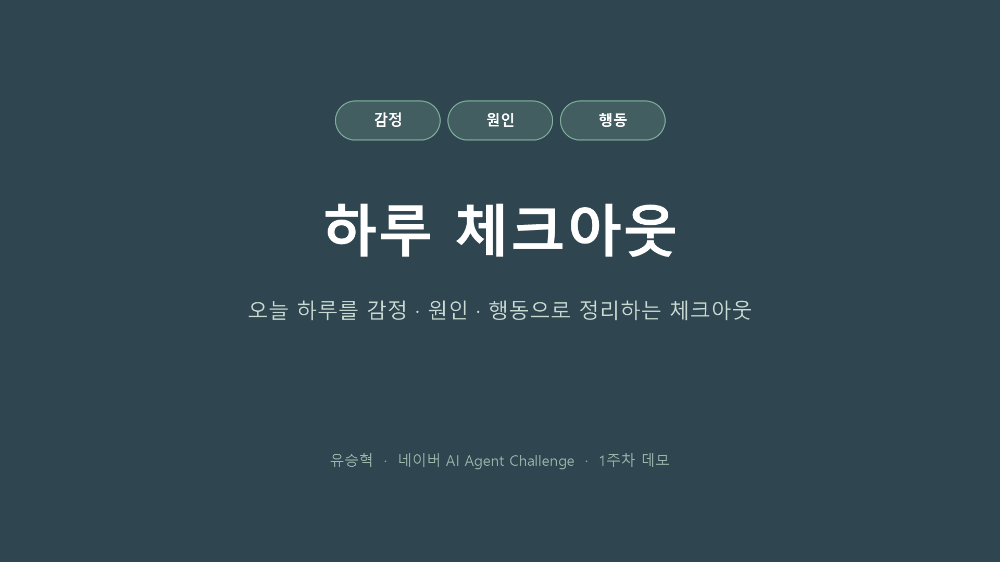
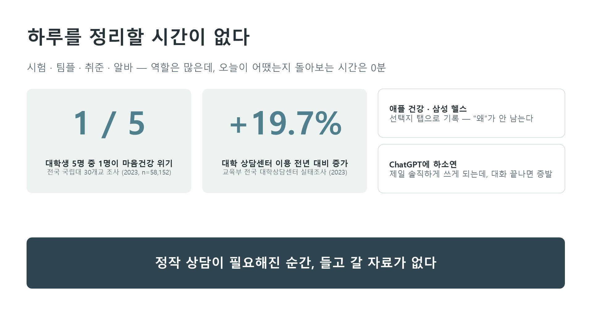
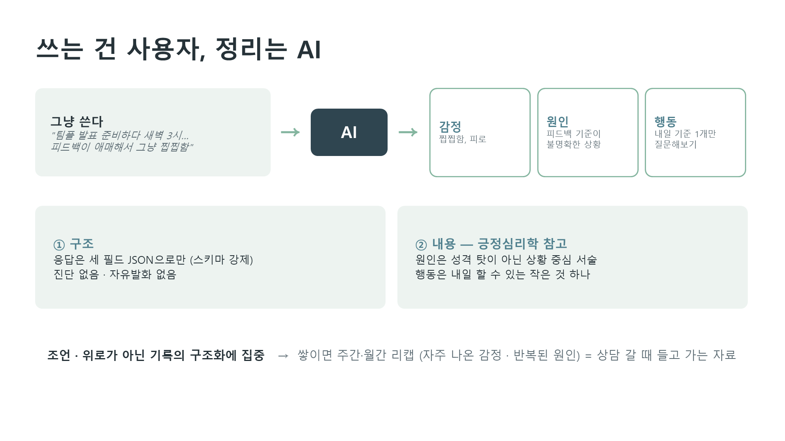
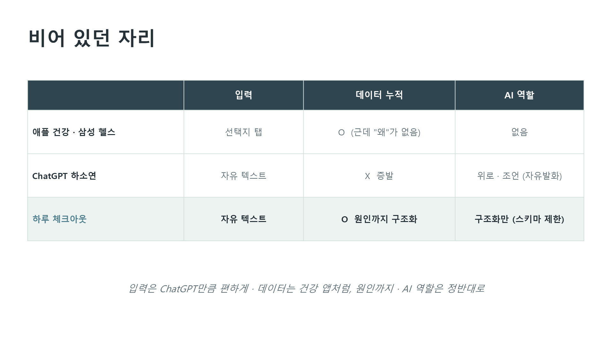
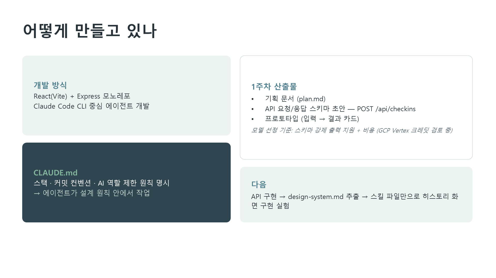
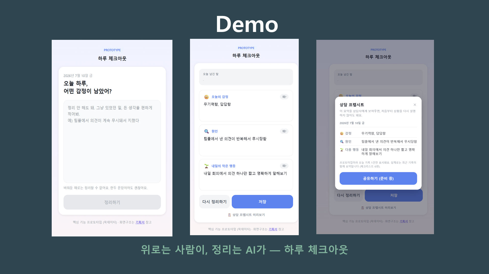

# 1주차 데모 발표 (7/10)

## 발표 자료

## 핵심 메시지
- 문제: 건강 앱은 "왜"가 안 남고, 챗봇 하소연은 증발 — 상담이 필요한 순간 들고 갈 자료가 없다
- 해결: 날것의 텍스트를 AI가 감정/원인/행동 세 카드로 정리. AI는 조언·위로 없이 정리만 (스키마 강제)
- 이번 주: 기획서, API 초안, 프로토타입 + Vertex AI / LiteLLM 조사

## 받은 피드백
- (발표 후 작성)
