# 카페 스탬프 MVP 개발 로드맵

> 개발을 처음 접하는 사용자가 “무엇을, 왜, 어떤 순서로 만드는지” 확인하기 위한 안내서입니다.

## 1. 우리가 만들 결과

손님과 사장님이 같은 카페 스탬프 데이터를 사용하는 모바일 웹을 만듭니다.

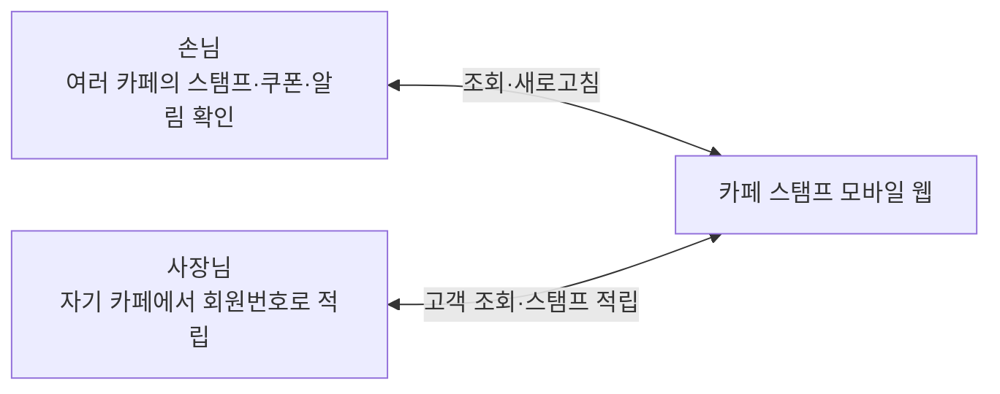

핵심 데모는 다음 한 줄로 설명할 수 있습니다.

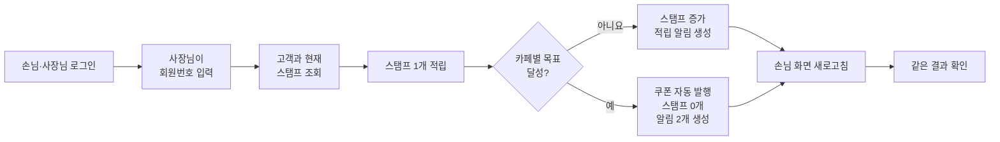

## 2. 사용 기술을 카페에 비유하면

| 기술 | 쉬운 비유 | 실제 역할 |
|---|---|---|
| React | 손님과 사장님이 보는 메뉴판·화면 | 버튼, 카드, 로그인 화면 등 사용자 화면을 만듭니다. |
| Vite | 빠르게 가게 문을 여는 준비 도구 | 개발 화면을 실행하고 배포용 결과물을 만듭니다. |
| React Router | 매장 안의 안내 표지판 | 로그인, 손님, 쿠폰, 알림, 사장님 주소를 연결합니다. |
| Supabase Auth | 출입구의 신분 확인 직원 | 로그인한 사람이 손님인지 사장님인지 확인합니다. |
| PostgreSQL | 잠금장치가 있는 장부 | 회원, 카페, 스탬프, 쿠폰, 알림을 저장합니다. |
| RLS | 장부별 열람 규칙 | 손님은 자기 데이터만, 사장님은 자기 카페만 보게 합니다. |
| RPC | 한 번에 처리하는 계산대 직원 | 적립·쿠폰 발행·초기화·알림을 하나의 작업으로 처리합니다. |
| Vercel | 누구나 찾아올 수 있는 매장 주소 | 완성된 웹을 인터넷에 공개합니다. |
| Git | 모든 수정 내역을 남기는 작업 일지 | 언제 무엇을 바꿨는지 기록하고 되돌릴 수 있게 합니다. |

별도의 Express 서버는 만들지 않습니다. Supabase가 로그인, 데이터베이스, 서버 작업을 담당하므로 3주 MVP에 필요한 기능을 더 단순하게 구현할 수 있습니다.

## 3. 전체 구조

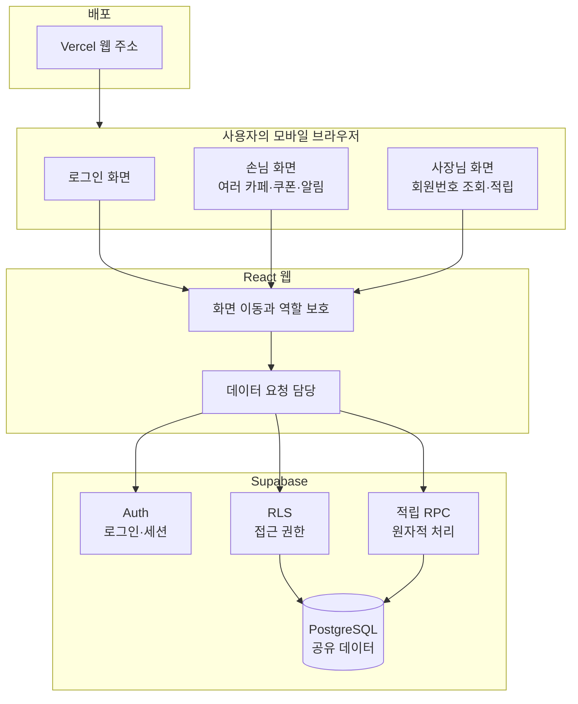

### 저장되는 데이터

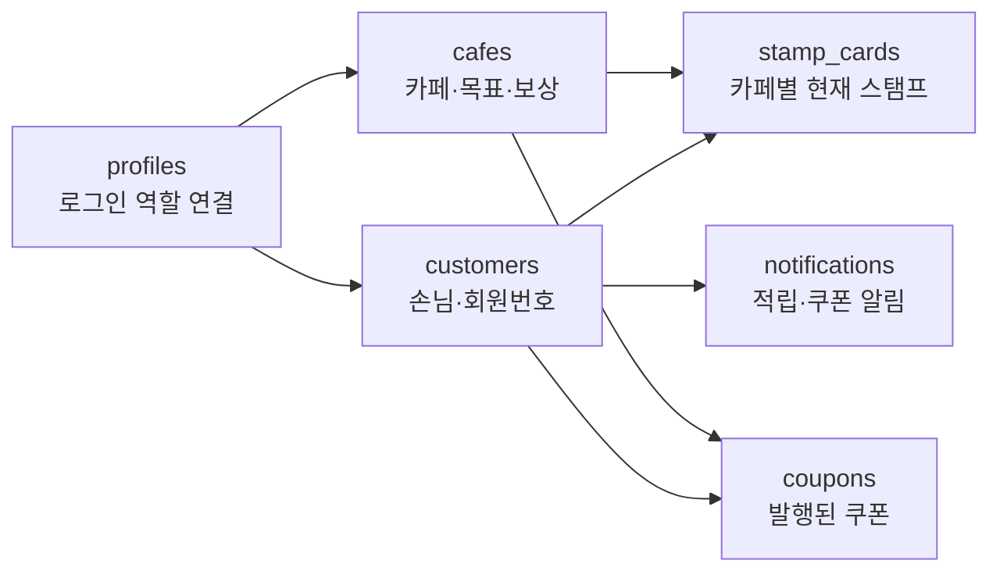

카페마다 목표와 보상이 다릅니다. 예를 들어 멜로우 브루는 10개, 포레스트 커피는 6개, 데이라이트 로스터스는 8개를 목표로 둘 수 있습니다. 데모 사장님은 이 중 한 카페에만 연결됩니다.

## 4. 3주 개발 지도

총 작업 시간은 약 105시간입니다. 화면을 먼저 예쁘게 완성하기보다 데이터가 안전하게 저장되고 양쪽 화면에서 같은 결과가 보이는 흐름을 먼저 만듭니다.

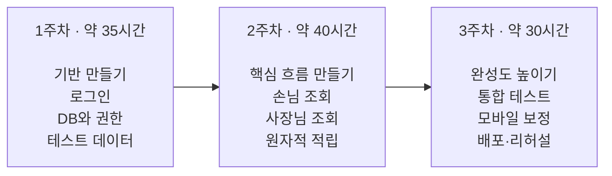

### 1주차: 건물의 기초 만들기

목표는 로그인한 사용자가 자신의 역할에 맞는 데이터에 안전하게 접근하는 것입니다.

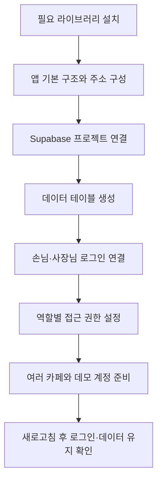

완료 모습:

- 손님과 사장님 계정으로 로그인할 수 있습니다.
- 역할에 맞는 화면으로 이동합니다.
- 손님 화면에서 여러 카페의 데이터가 조회됩니다.
- 다른 사람의 데이터에는 접근할 수 없습니다.

### 2주차: 핵심 시연 흐름 만들기

목표는 사장님 적립 결과가 손님 화면에 정확하게 반영되는 것입니다.

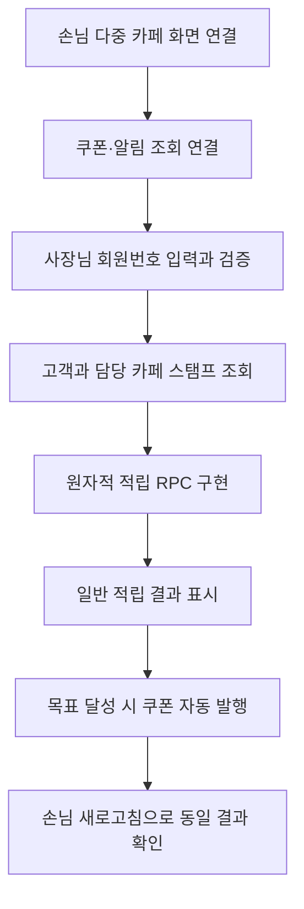

완료 모습:

- 스탬프가 정확히 1개만 증가합니다.
- 카페별 목표 직전에서 적립하면 해당 카페 쿠폰이 발행됩니다.
- 쿠폰 발행과 함께 스탬프가 0개로 초기화됩니다.
- 일반 적립은 알림 1개, 쿠폰 발행은 알림 2개를 만듭니다.

### 3주차: 데모가 흔들리지 않게 만들기

목표는 실제 휴대폰에서 반복 시연할 수 있는 상태입니다.

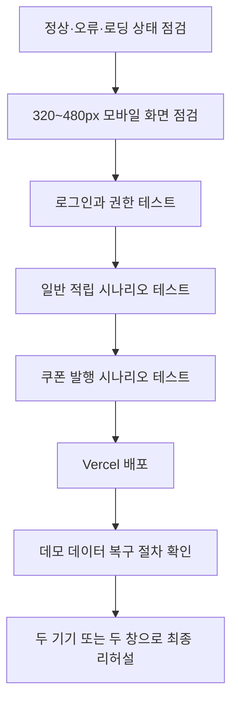

완료 모습:

- 잘못된 회원번호나 네트워크 오류가 명확하게 표시됩니다.
- 모바일 화면에서 버튼과 내용이 잘리지 않습니다.
- 배포 주소에서 손님·사장님 로그인이 작동합니다.
- 데모 후 데이터를 목표 직전 상태로 쉽게 복구할 수 있습니다.

## 5. 한 기능을 만드는 실제 과정

Codex는 기능 하나를 다음 순서로 처리합니다.

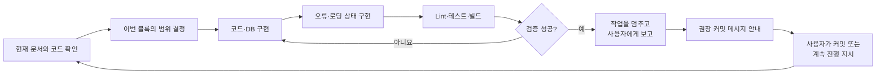

Codex는 유의미한 블록이 끝나면 임의로 다음 기능으로 넘어가지 않습니다. 변경 내용과 검증 결과를 설명하고 “지금이 커밋할 시점”이라고 알립니다.

## 6. 사용자와 Codex의 역할

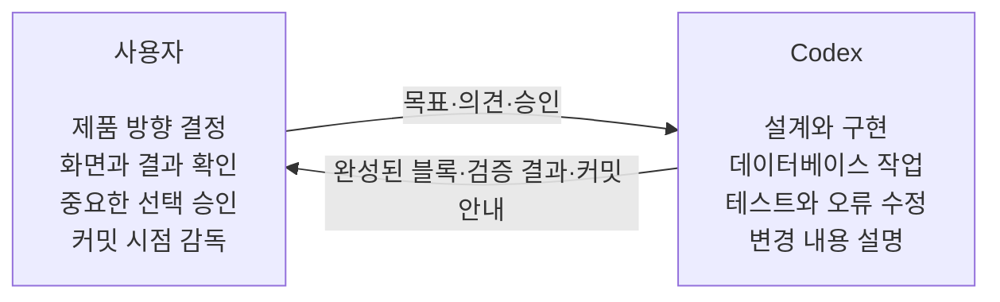

사용자가 개발 명령어나 세부 문법을 알 필요는 없습니다. 각 체크포인트에서 다음 네 가지를 확인하면 됩니다.

1. 사용자가 원한 동작과 같은가?
2. 화면에서 이해하기 쉬운가?
3. 이번 단계에서 제외하기로 한 기능이 다시 들어오지 않았는가?
4. Codex가 lint, 테스트, build 결과를 확인했는가?

## 7. 예정된 커밋 체크포인트

커밋은 게임의 저장 지점과 비슷합니다. 기능이 제대로 작동하는 시점마다 기록하면 문제가 생겨도 안전한 지점으로 돌아갈 수 있습니다.

| 순서 | 유의미한 블록 | 커밋 메시지 예시 |
|---:|---|---|
| 1 | 라이브러리와 앱 기본 구조 | `chore(app): Supabase와 라우팅 개발 환경 구성` |
| 2 | 데이터 구조와 접근 권한 | `feat(db): 카페별 스탬프 스키마와 RLS 정책 추가` |
| 3 | 로그인과 역할 보호 | `feat(auth): 데모 로그인과 세션 복원 구현` |
| 4 | 손님 다중 카페 조회 | `feat(customer): 카페별 스탬프 목록 연결` |
| 5 | 사장님 고객 조회 | `feat(owner): 회원번호 고객 조회 구현` |
| 6 | 스탬프·쿠폰·알림 처리 | `feat(stamp): 원자적 적립과 쿠폰 발행 구현` |
| 7 | 통합 화면과 오류 상태 | `feat(app): 손님과 사장님 데이터 흐름 통합` |
| 8 | 모바일 화면 보정 | `style(app): 모바일 레이아웃과 접근성 개선` |
| 9 | 배포와 데모 준비 | `chore(deploy): 배포 설정과 데모 복구 절차 추가` |

실제 구현 중에는 작업 관계에 따라 체크포인트를 합치거나 나눌 수 있습니다. Codex가 매번 이유와 권장 메시지를 안내합니다.

## 8. 데모 당일 모습

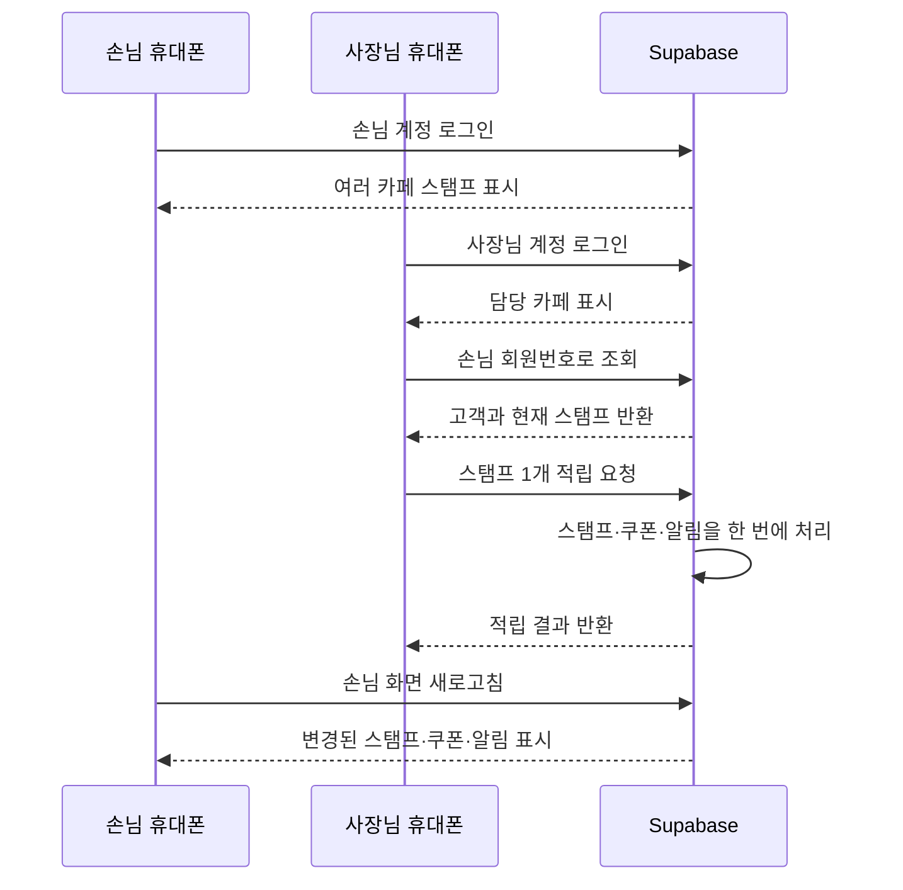

목표 직전 상태에서 적립하면 사장님 화면에는 쿠폰 발행 성공이 표시되고, 손님 화면에는 해당 카페 스탬프 0개, 새 쿠폰, 적립 알림과 쿠폰 알림이 함께 나타납니다.

## 9. 이번 MVP에서 하지 않는 일

다음 기능은 좋은 아이디어이지만 3주 안에 핵심 데모를 안정적으로 완성하기 위해 제외합니다.

- 실제 QR 카메라 스캔
- 카카오·구글 로그인과 회원가입
- 결제·POS 연결
- 쿠폰 사용 및 만료 처리
- 사장님의 카페 설정 화면
- 여러 카페를 관리하는 사장님
- 외부 문자·푸시 알림
- 카페 검색, 지도, 운영 통계

화면에 QR 모양을 보여줄 수는 있지만 실제 적립은 회원번호 입력으로 진행합니다.

## 10. 한눈에 보는 성공 기준

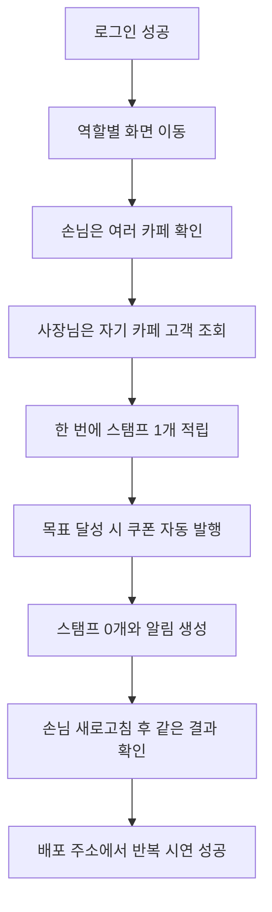

이 흐름이 안정적으로 동작하면 MVP의 목적은 달성된 것입니다. 추가 기능과 시각 효과는 이 성공 기준을 완성한 뒤에만 검토합니다.
