# 카페 스탬프 MVP 개발 로드맵

> 개발을 처음 접하는 사용자가 “무엇을, 왜, 어떤 순서로 만드는지” 확인하기 위한 안내서입니다.

## 1. 우리가 만들 결과

손님은 모바일 웹에서, 사장님은 매장 컴퓨터나 태블릿의 넓은 화면 웹에서 같은 카페 스탬프 데이터를 사용합니다. 스탬프 적립은 손님 QR을 매장 QR·바코드 스캐너로 읽어 회원번호를 조회하는 흐름을 우선 사용하고, 스캐너가 없거나 잘 되지 않으면 회원번호를 수동으로 입력합니다.

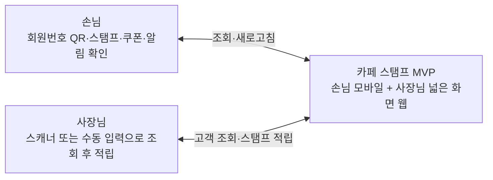

핵심 데모는 다음 한 줄로 설명할 수 있습니다.

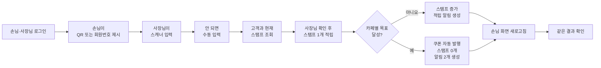

## 2. 사용 기술을 카페에 비유하면

| 기술 | 쉬운 비유 | 실제 역할 |
|---|---|---|
| React | 손님과 사장님이 보는 메뉴판·화면 | 버튼, 카드, 로그인 화면 등 사용자 화면을 만듭니다. |
| Vite | 빠르게 가게 문을 여는 준비 도구 | 개발 화면을 실행하고 배포용 결과물을 만듭니다. |
| React Router | 매장 안의 안내 표지판 | 로그인, 손님, 쿠폰, 알림, 사장님 주소를 연결합니다. |
| Supabase Auth | 출입구의 신분 확인 직원 | 로그인한 사람이 손님인지 사장님인지 확인합니다. |
| PostgreSQL | 잠금장치가 있는 장부 | 회원, 카페, 스탬프, 쿠폰, 알림을 저장합니다. |
| RLS | 장부별 열람 규칙 | 손님은 자기 데이터만, 사장님은 자기 카페만 보게 합니다. |
| RPC | 한 번에 처리하는 계산대 직원 | 적립·쿠폰 발행·초기화·알림을 하나의 작업으로 처리합니다. |
| 매장 QR·바코드 스캐너 | 자동으로 타이핑해 주는 기계 | 손님 QR을 읽어 사장님 화면 입력창에 회원번호 값을 넣습니다. |
| Vercel | 누구나 찾아올 수 있는 매장 주소 | 완성된 웹을 인터넷에 공개합니다. |
| Git | 모든 수정 내역을 남기는 작업 일지 | 언제 무엇을 바꿨는지 기록하고 되돌릴 수 있게 합니다. |

별도의 Express 서버는 만들지 않습니다. Supabase가 로그인, 데이터베이스, 서버 작업을 담당하므로 3주 MVP에 필요한 기능을 더 단순하게 구현할 수 있습니다. 브라우저 카메라 QR 인식도 만들지 않습니다. 매장 스캐너는 웹앱과 직접 연동하는 장비가 아니라, 입력창에 값을 넣어주는 키보드처럼 다룹니다.

## 3. 전체 구조

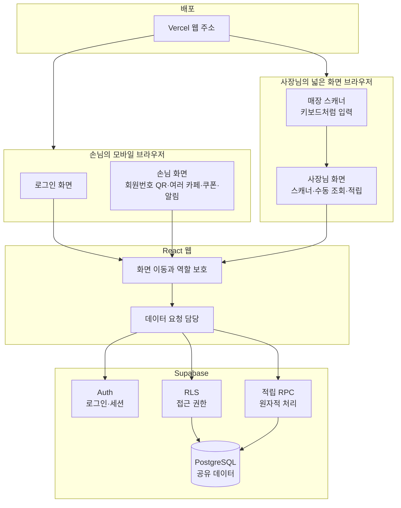

### 저장되는 데이터

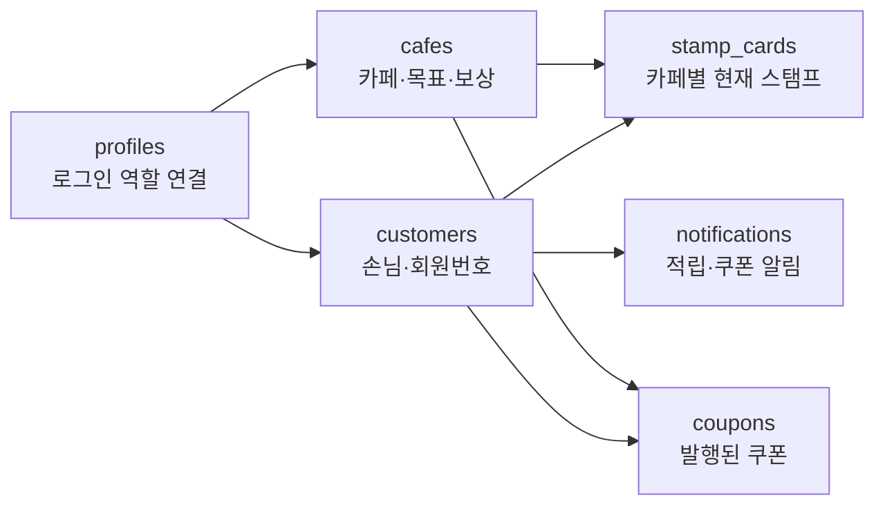

카페마다 목표와 보상이 다릅니다. 예를 들어 멜로우 브루는 10개, 포레스트 커피는 6개, 데이라이트 로스터스는 8개를 목표로 둘 수 있습니다. 파일럿 사장님은 이 중 한 카페에만 연결됩니다.

## 4. 3주 개발 지도

주차별 계획은 [개발 작업 계획](development-tasks.md)의 10단계 흐름을 기준으로 합니다. 남은 기간은 2026년 7월 13일 월요일부터 2026년 7월 31일 금요일 데모데이까지이며, 월~금 하루 약 5시간 조금 넘게 작업할 수 있다고 보고 전체 작업 시간은 약 75~85시간으로 잡습니다.

마지막 주 금요일인 2026년 7월 31일이 데모데이이므로, 필수 기능은 2026년 7월 29일 수요일까지 끝내는 것을 목표로 합니다. 목요일과 금요일은 새 기능을 늘리기보다 배포 점검, 시연 데이터 복구, 리허설, 작은 버그 대응에 사용합니다.

화면을 먼저 예쁘게 완성하기보다 데이터가 안전하게 저장되고 양쪽 화면에서 같은 결과가 보이는 흐름을 먼저 만듭니다.

### 10단계 작업 흐름

| 단계 | 작업 | 주차 |
|---:|---|---|
| 1 | 앱 입구 만들기 | 1주차 |
| 2 | 공통 장부 만들기 | 1주차 |
| 3 | 로그인과 역할 나누기 | 1주차 |
| 4 | 손님이 자기 회원번호, QR, 스탬프 보기 | 2주차 |
| 5 | 사장님이 매장 스캐너 또는 수동 입력으로 손님 찾기 | 2주차 |
| 6 | 사장님이 조회 결과를 확인하고 스탬프 1개 적립하기 | 2주차 |
| 7 | 손님 화면에서 바뀐 결과 확인하기 | 2주차 |
| 8 | 쿠폰과 알림 화면 붙이기 | 3주차 |
| 9 | 화면을 손님용/사장님용에 맞게 다듬기 | 3주차 |
| 10 | 배포와 시연 준비하기 | 3주차 |

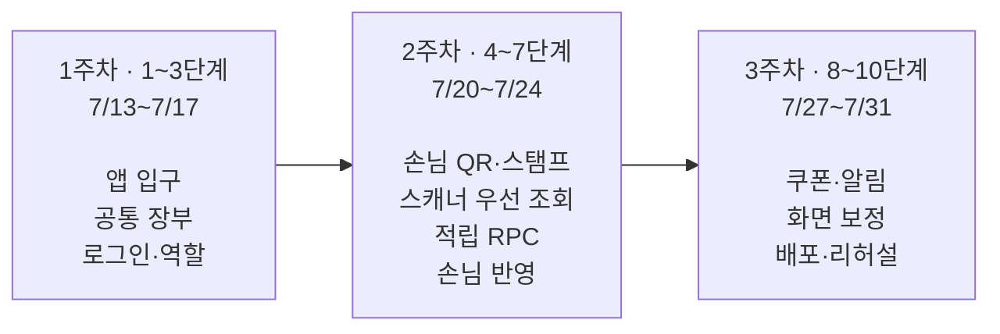

### 1주차: 기반과 장부 만들기 (1~3단계)

목표는 서비스가 길을 찾고, 데이터를 저장하고, 로그인한 사람의 역할을 구분할 수 있게 만드는 것입니다. 이 주에는 예쁜 화면보다 “손님과 사장님이 같은 장부를 볼 준비”가 더 중요합니다.

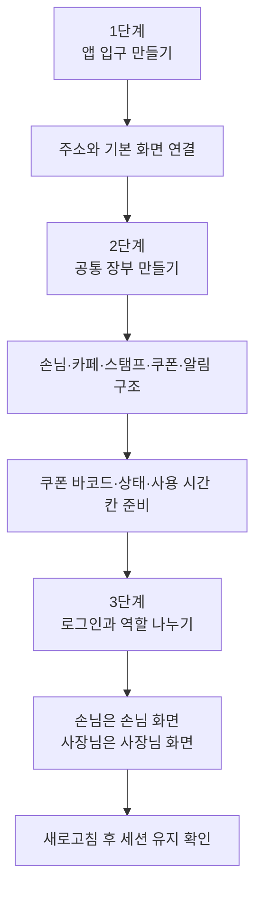

완료 모습:

- 손님과 사장님 계정으로 로그인할 수 있습니다.
- 역할에 맞는 화면으로 이동합니다.
- 손님, 카페, 스탬프, 쿠폰, 알림을 저장할 장부가 있습니다.
- 쿠폰 장부에는 나중을 위한 바코드 번호, 상태, 사용 시간이 준비되어 있습니다.
- 손님은 자기 데이터만, 사장님은 자기 담당 카페만 다루는 권한 구조를 준비합니다.

### 2주차: 손님과 사장님 연결 흐름 만들기 (4~7단계)

목표는 두 화면이 각각 잘 보이는 것을 넘어서, 사장님이 처리한 결과가 손님 화면에 같은 데이터로 반영되는 것입니다. 이번 주에 MVP의 핵심 뼈대가 완성됩니다.

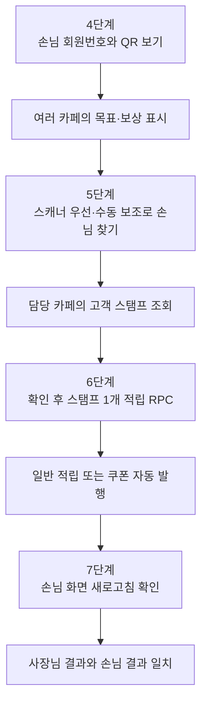

완료 모습:

- 손님은 자기 회원번호, 고객 QR, 여러 카페의 스탬프를 볼 수 있습니다.
- 사장님은 매장 스캐너 입력을 우선 사용하고, 안 되면 수동 회원번호 입력으로 손님을 찾을 수 있습니다.
- QR 스캔이나 Enter 조회만으로는 적립되지 않고, 사장님이 조회 결과를 확인한 뒤 적립 버튼을 누릅니다.
- 스탬프가 정확히 1개만 증가합니다.
- 카페별 목표 직전에서 적립하면 바코드 번호가 있는 쿠폰이 발행됩니다.
- 쿠폰 발행과 함께 스탬프가 0개로 초기화됩니다.
- 일반 적립은 알림 1개, 쿠폰 발행은 알림 2개를 만듭니다.
- 손님 새로고침 후 사장님 처리 결과와 같은 데이터가 보입니다.

### 3주차: 완성, 보정, 배포, 리허설 (8~10단계)

목표는 손님 휴대폰과 사장님 컴퓨터 웹 화면에서 반복 시연할 수 있는 상태입니다. 2026년 7월 29일 수요일까지 필수 기능 완료를 목표로 하고, 7월 30일 목요일과 7월 31일 금요일은 안정화와 리허설에 집중합니다.

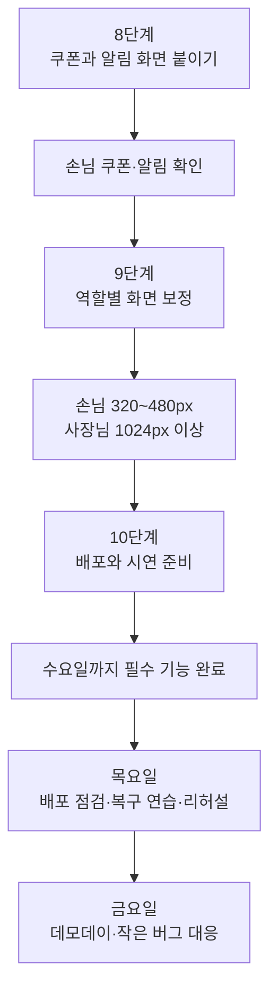

완료 모습:

- 손님은 쿠폰과 알림을 확인할 수 있습니다.
- 잘못된 회원번호나 네트워크 오류가 명확하게 표시됩니다.
- 손님 모바일 화면에서 버튼과 내용이 잘리지 않습니다.
- 사장님 넓은 화면에서 고객 조회와 적립 흐름이 한눈에 보입니다.
- 배포 주소에서 손님·사장님 로그인이 작동합니다.
- 가능하면 실제 매장 스캐너로 고객 QR 조회를 리허설합니다.
- 스캐너가 없으면 붙여넣기+Enter와 수동 입력으로 같은 흐름을 리허설합니다.
- 데모 후 데이터를 목표 직전 상태로 쉽게 복구할 수 있습니다.

## 5. 한 기능을 만드는 실제 과정

Codex는 기능 하나를 다음 순서로 처리합니다.

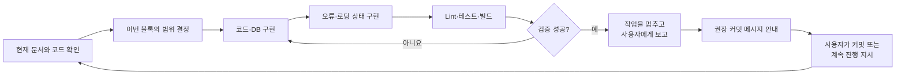

Codex는 유의미한 블록이 끝나면 임의로 다음 기능으로 넘어가지 않습니다. 변경 내용과 검증 결과를 설명하고 “지금이 커밋할 시점”이라고 알립니다.

## 6. 사용자와 Codex의 역할

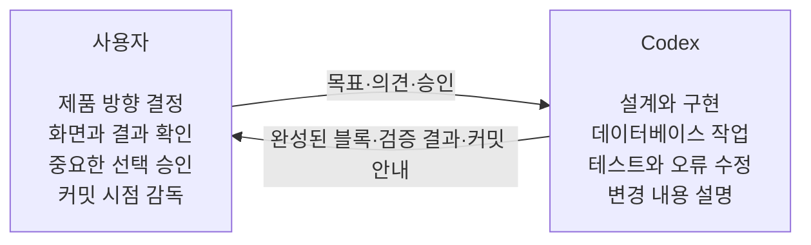

사용자가 개발 명령어나 세부 문법을 알 필요는 없습니다. 각 체크포인트에서 다음 네 가지를 확인하면 됩니다.

1. 사용자가 원한 동작과 같은가?
2. 화면에서 이해하기 쉬운가?
3. 이번 단계에서 제외하기로 한 기능이 다시 들어오지 않았는가?
4. Codex가 lint, 테스트, build 결과를 확인했는가?

## 7. 예정된 커밋 체크포인트

커밋은 게임의 저장 지점과 비슷합니다. 기능이 제대로 작동하는 시점마다 기록하면 문제가 생겨도 안전한 지점으로 돌아갈 수 있습니다.

| 순서 | 관련 단계 | 유의미한 블록 | 커밋 메시지 예시 |
|---:|---|---|---|
| 1 | 1단계 | 앱 입구와 라우팅 | `chore(app): 라우팅 기본 구조 구성` |
| 2 | 2단계 | DB 장부와 시연 데이터 | `feat(db): 스탬프 장부와 시연 데이터 구성` |
| 3 | 3단계 | 로그인과 역할 보호 | `feat(auth): 역할별 로그인 흐름 구현` |
| 4 | 4단계 | 손님 QR·스탬프 홈 | `feat(customer): 회원번호 QR과 스탬프 현황 연결` |
| 5 | 5단계 | 사장님 고객 조회 | `feat(owner): 스캐너 입력 기반 고객 조회 구현` |
| 6 | 6단계 | 원자적 적립 RPC | `feat(stamp): 원자적 적립과 쿠폰 발행 구현` |
| 7 | 7~8단계 | 손님 반영, 쿠폰, 알림 | `feat(customer): 쿠폰과 알림 조회 연결` |
| 8 | 9단계 | 역할별 화면 보정 | `style(app): 역할별 화면 레이아웃 개선` |
| 9 | 10단계 | 배포와 데모 준비 | `chore(deploy): 배포 설정과 데모 복구 절차 추가` |

실제 구현 중에는 작업 관계에 따라 체크포인트를 합치거나 나눌 수 있습니다. Codex가 매번 이유와 권장 메시지를 안내합니다.

## 8. 데모 당일 모습

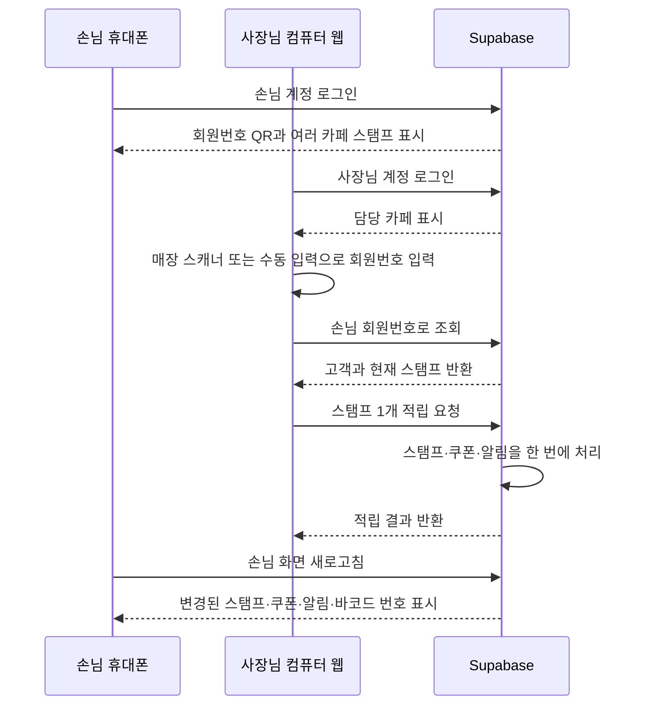

목표 직전 상태에서 적립하면 사장님 화면에는 쿠폰 발행 성공이 표시되고, 손님 화면에는 해당 카페 스탬프 0개, 새 쿠폰, 쿠폰 바코드 번호, 적립 알림과 쿠폰 알림이 함께 나타납니다. 바코드 번호 입력으로 쿠폰을 사용 처리하는 기능은 시간이 남을 때 확장으로 둡니다.

## 9. 이번 MVP에서 하지 않는 일

다음 기능은 좋은 아이디어이지만 3주 안에 핵심 데모를 안정적으로 완성하기 위해 제외합니다.

- 실제 QR 카메라 스캔
- 스캐너 입력만으로 즉시 적립
- 스캐너 장비 구매, 설정, 드라이버 관리
- 카카오·구글 로그인과 회원가입
- 결제·POS 연결
- 쿠폰 사용 및 만료 처리
- 사장님의 카페 설정 화면
- 여러 카페를 관리하는 사장님
- 외부 문자·푸시 알림
- 카페 검색, 지도, 운영 통계

쿠폰에는 향후 사용 처리를 위해 바코드 번호와 상태를 저장할 수 있지만, 이번 필수 MVP에서는 사장님이 쿠폰 바코드 번호를 입력해 쿠폰을 `used`로 바꾸는 기능까지는 만들지 않습니다. 고객 QR은 고객 조회용이고, 쿠폰 바코드는 향후 쿠폰 사용 처리용입니다. 이번 MVP의 고객 QR은 브라우저 카메라가 아니라 매장 스캐너 또는 수동 입력으로 처리합니다.

## 10. 한눈에 보는 성공 기준

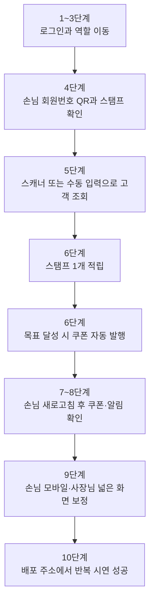

이 흐름이 안정적으로 동작하면 MVP의 목적은 달성된 것입니다. 추가 기능과 시각 효과는 이 성공 기준을 완성한 뒤에만 검토합니다.
