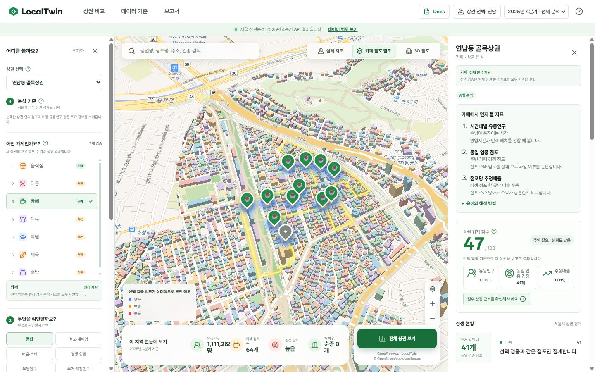
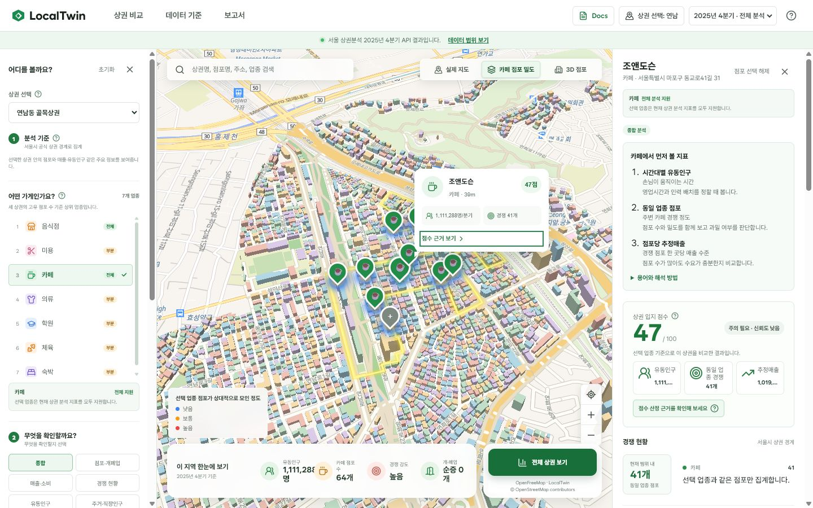
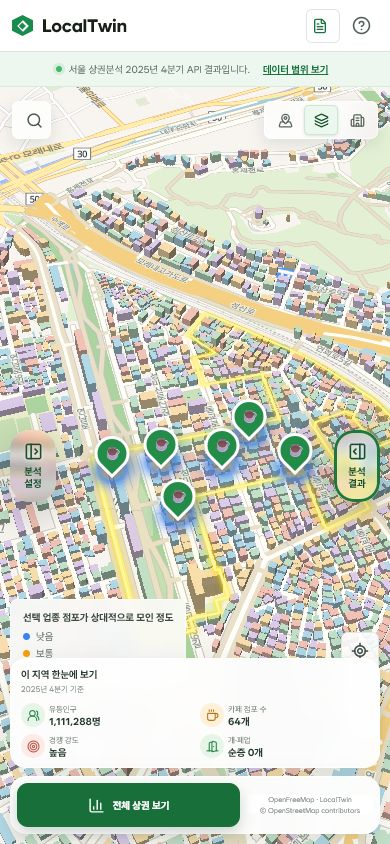
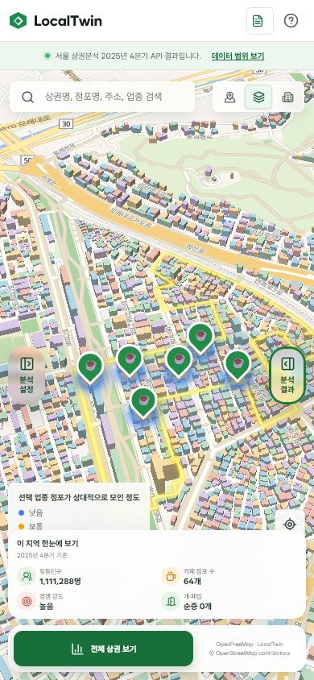
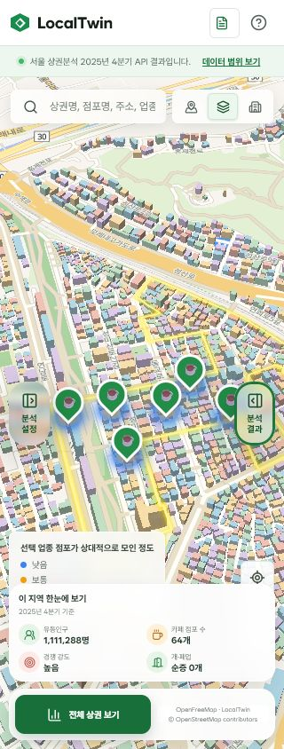
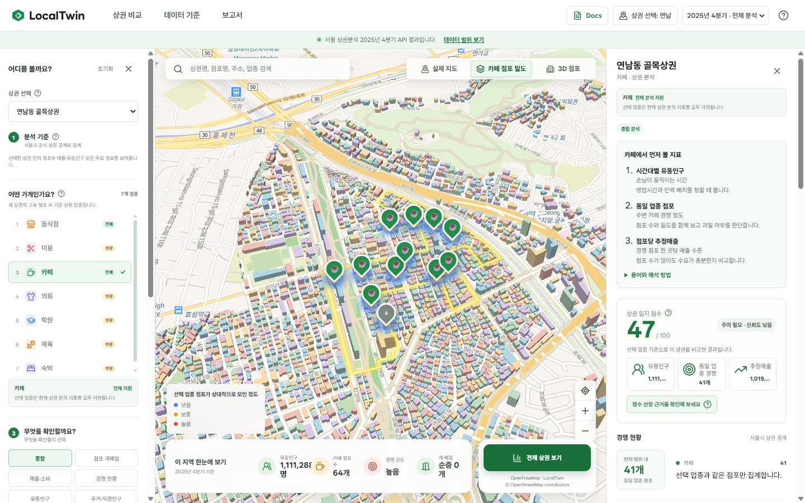

# Apple HIG 기반 UI/UX 규칙 감사

## 작업 목적

Apple HIG, Mobbin과 Awwwards를 LocalTwin의 지도 기반 상권 분석 흐름에 맞게 해석하고, 반복 적용 가능한 규칙을 `docs/design/design-system.md`에 반영한다. 레퍼런스의 외형을 복제하지 않고 사용성, 적응형 정보 구조와 상태 설계를 우선한다.

## 감사 범위

- 제품: `product/apps/web`
- 흐름: 상권 분석 진입 → 지도에서 점포 선택 → mobile map-first 진입
- desktop viewport: `1440 × 900`
- mobile viewport: `390 × 844`
- 기준 일자: 2026-07-28
- 제한: screenshot과 DOM 기반 감사이며 screen reader의 실제 발화, 색각별 인지와 모든 dialog 흐름은 이번 범위에서 확인하지 않았다.

## 레퍼런스에서 채택한 원리

| 출처                                                                                                          | LocalTwin 적용                                                                        |
| ------------------------------------------------------------------------------------------------------------- | ------------------------------------------------------------------------------------- |
| [Apple Design principles](https://developer.apple.com/kr/design/human-interface-guidelines/design-principles) | 분석 목적, 사용자 통제권, 데이터 투명성, 익숙한 조작 문법                             |
| [Apple Tab bars](https://developer.apple.com/kr/design/human-interface-guidelines/tab-bars)                   | tab은 action이 아니라 top-level navigation에만 사용                                   |
| [Apple Sidebars](https://developer.apple.com/kr/design/human-interface-guidelines/sidebars)                   | 넓은 화면의 평평한 정보 계층, 좁은 화면의 compact adaptation                          |
| [Apple Search fields](https://developer.apple.com/kr/design/human-interface-guidelines/search-fields)         | 검색 대상 placeholder, clear action, 넓은 기본 scope                                  |
| [Apple Layout](https://developer.apple.com/kr/design/human-interface-guidelines/layout)                       | 지도와 control plane 분리, tertiary column 우선 collapse, text/viewport adaptation    |
| [Apple Typography](https://developer.apple.com/kr/design/human-interface-guidelines/typography)               | 작은 text와 thin weight 제한, 역할 기반 type hierarchy                                |
| [Mobbin](https://mobbin.com/)                                                                                 | screen 한 장이 아니라 search, selection, loading, empty와 recovery를 포함한 flow 비교 |
| [Awwwards](https://www.awwwards.com/)                                                                         | 시각 완성도를 usability, content, responsive behavior와 함께 판단                     |

## 화면별 결과

### 1. Desktop 상권 분석 진입 — 양호, 정보 밀도 조정 필요

- 강점: 지도는 가장 넓은 작업 영역을 유지하고, 좌측 조건과 우측 결과가 역할별로 분리된다.
- 강점: 분기, 출처, 지원 범위와 누락 근거가 화면에 드러난다.
- 위험: 일부 본문과 control이 `8–11px`에 집중되어 장시간 분석 시 가독성이 떨어질 수 있다.
- 위험: header의 비교, 데이터 기준과 보고서는 navigation처럼 보이지만 실제로는 dialog command다.

### 2. 점포 선택 — 양호

- 강점: marker 선택이 지도 card와 우측 inspector에 동시에 반영되어 현재 대상을 잃지 않는다.
- 강점: 점수, 유동인구와 경쟁 수치가 근거 action으로 연결된다.
- 위험: 선택 card, legend, map control과 bottom dock이 겹치지 않도록 새 overlay를 추가할 때 safe inset 검증이 필요하다.

### 3. Mobile map-first — 사용 가능, 검색과 overlay 개선 필요

변경 전:

- 강점: 좌우 panel을 닫고 지도를 먼저 제공하며 분석 설정과 결과로 돌아갈 경로가 있다.
- 강점: 핵심 네 지표와 전체 상권 비교 action이 유지된다.
- 수정: icon-only로 접히던 search field를 모든 mobile 너비에서 계속 노출한다.
- 수정: text가 숨는 지도 mode button에 고정 accessible name과 tooltip을 제공한다.
- 후속: 좌우 panel trigger, legend와 bottom dock이 동시에 지도를 덮는 면적을 한 navigation pass에서 줄인다.

변경 후 `390 × 844`:

변경 후 `320 × 844`:

## 이번에 반영한 변경

- header의 dialog command group을 `navigation`이 아니라 `toolbar`로 노출
- mobile에서도 search placeholder가 보이는 persistent field 사용
- query clear button과 search field focus 복귀 추가
- search `focus-within` ring 추가
- 지도 mode button의 breakpoint 독립적인 accessible name과 tooltip 추가
- typography, touch target, navigation, sidebar, search와 overlay 규칙을 디자인 시스템에 추가

Desktop 변경 후:

## 후속 우선순위

1. `8–11px` text를 attribution 예외와 일반 content로 분류하고 일반 content를 token scale로 이전한다.
2. mobile panel trigger와 bottom dock을 하나의 adaptive navigation 구조로 재설계한다.
3. `320px`, `390px`, `760px`, `1120px`, `1440px`에서 screenshot과 keyboard focus path를 회귀 기준으로 고정한다.

## 검증 기준

- mobile search field가 처음부터 보이고 placeholder가 검색 범위를 설명한다.
- query clear 뒤 search field에 focus가 남는다.
- 지도 mode button 세 개가 text 숨김 여부와 무관하게 고유한 accessible name을 가진다.
- desktop header command group이 `toolbar`로 노출된다.
- `320px` 이상에서 search와 지도 mode control이 겹치지 않는다.
- `pnpm --dir product/apps/web test`, typecheck, lint와 build가 통과한다.

## 검증 결과

- web test: `34 files`, `116 tests` 통과
- web lint: 통과
- web production build: 통과
- docs index와 HTML/local-link check: 통과
- code structure check: 통과
- browser: `1440 × 900`, `390 × 844`, `320 × 844` render와 DOM 확인
- browser: query clear 뒤 active element가 `상권 또는 점포 검색`이고 값이 빈 문자열인지 확인
- 전체 `scripts/check.ps1`: 기존 web 파일 32개의 Prettier 불일치 때문에 `product format:check`에서 중단한다. 이번 변경 파일의 test, lint, typecheck와 build 결과와는 별도인 repository formatting debt다.
