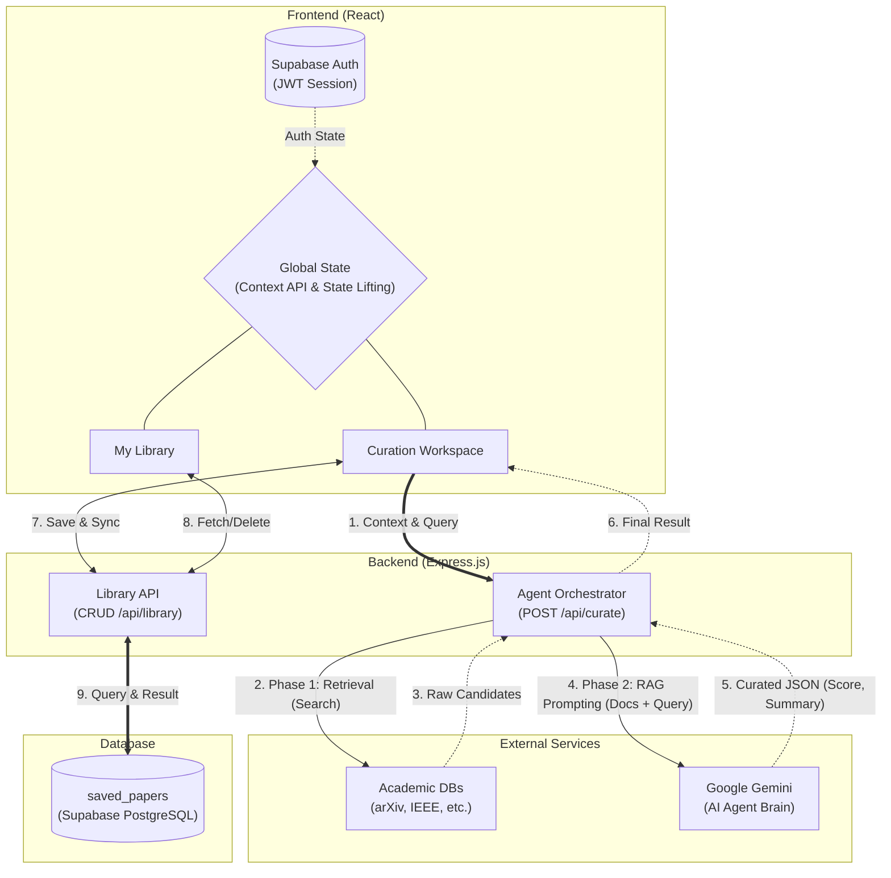

# 에이전트 협업 과정 및 역할 분담 체계 시각화

## 1. 개발 생명주기별 도구 및 역할 명세

사람(Human)은 전체 시스템의 아키텍처와 로직의 '방향성(기획/설계/통제)'을 쥐고, AI 에이전트는 이를 실현하는 '수행/제안/디버깅'을 전담하는 체계로 협업함.

| Phase | Human 결정 내용 (통제자) | AI Agent 수행/제안 내용 (실행자) | 사용 도구 및 Skill |
| :--- | :--- | :--- | :--- |
| **기획/설계** | 문제 정의, 유저 타겟팅, 화면 비례(2x2 격자) 및 DB 테이블 물리 스키마 결정 | 유스케이스 기반 백로그 분할, 2-Phase RAG 파이프라인 백엔드 통신 규격(DTO) 초안 제안 | 'planning_agent.md', Markdown |
| **구현** | 기술 스택 확정, 디자인 시스템 제약(색상, 폰트, 컴포넌트 둥글기) 명시 및 이탈 방지 | React 상태 끌어올리기 구조 작성, 다국어(KO/EN) 인터페이스 로직 구현 | 안티그래비티 CLI, 'design_production.md' |
| **검증/디버깅** | 브라우저 렌더링 버그 관찰("Resize 시 풀림 현상") 및 디버깅 스레드 제공 | 원인 분석(CSS Flexbox 스크롤 모호성) 및 CSS Containment 격리 코드 제안 | 'verification_agent.md', Chrome DevTools |
| **배포/형상관리** | 릴리스 타이밍 승인, Git 커밋 롤백 여부 결정 | 'git add .' 등의 스파게티 커밋 방지를 위한 3분할 원자적 Git 커밋 스크립트 작성 | 'Atomic Commit Skill', Vercel, Render |

## 2. 아키텍처 및 2-Phase RAG 통신 흐름 다이어그램

