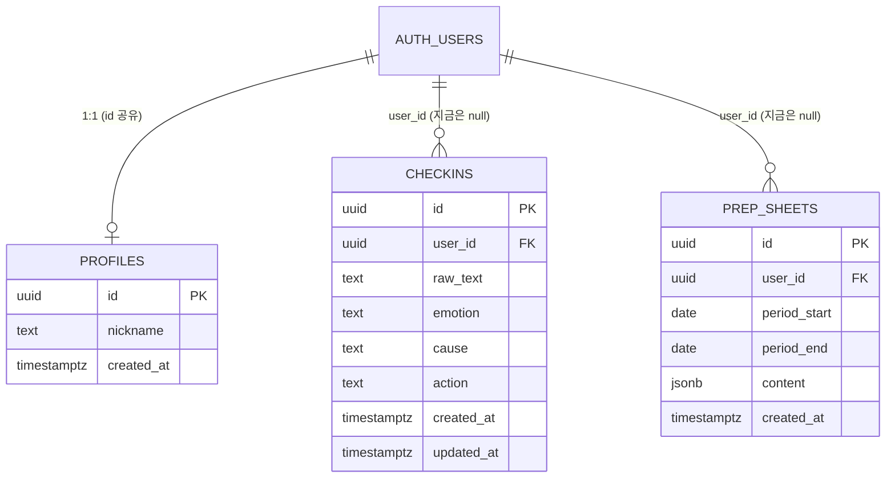

# 데이터 모델 초안

> **초안 — 승혁님과 논의 후 확정.** `server/supabase/schema.sql`은 논의가 끝나기 전까지 수정하지 않는다.

4주 백로그의 기능 전체(체크인, 로그인/사용자, 감정 태그, 캘린더 뷰, 반복 패턴, 상담 프렙시트)를 미리 고려해서
테이블을 어디까지 만들지 정리한 문서. 결론부터: **테이블은 3개(users 프로필, checkins, prep_sheets)면 충분**하고,
캘린더 뷰와 반복 패턴은 checkins에서 계산하면 되므로 별도 테이블이 필요 없다.

## 테이블 설계

### users (Supabase Auth 연계)

로그인은 Supabase Auth를 쓰면 `auth.users` 테이블이 자동으로 생긴다. 우리는 직접 users 테이블을 만들지 않고,
부가 정보가 필요할 때만 `public.profiles`를 만들어 연결한다.

| 컬럼 | 타입 | 왜 필요한가 |
| --- | --- | --- |
| id | uuid (PK, `auth.users.id` 참조) | Supabase Auth 계정과 1:1 연결 |
| nickname | text | 화면에 보여줄 이름 (이메일 노출 방지) |
| created_at | timestamptz | 가입 시점 기록 |

### checkins (기존 유지)

지금 schema.sql 그대로. 감정 태그를 어디에 둘지가 논의 포인트.

| 컬럼 | 타입 | 왜 필요한가 |
| --- | --- | --- |
| id | uuid (PK) | 기록 식별자 |
| user_id | uuid (null 허용, 추후 `auth.users` FK) | 로그인 도입 후 "내 기록"만 조회 |
| raw_text | text | 사용자가 쓴 원문 (상세 화면·프렙시트 원자료) |
| emotion | text | AI가 정리한 오늘의 감정 |
| cause | text | AI가 정리한 원인 |
| action | text | AI가 정리한 내일의 작은 행동 |
| created_at | timestamptz | 캘린더 뷰·반복 패턴 계산의 기준 축 |
| updated_at | timestamptz | 결과 카드 수정 시점 추적 |

### prep_sheets (상담 프렙시트)

최근 기록 요약을 상담사에게 보여주는 기능. "생성 당시의 스냅샷"을 보존하려면 저장 테이블이 필요하다.

| 컬럼 | 타입 | 왜 필요한가 |
| --- | --- | --- |
| id | uuid (PK) | 프렙시트 식별자 |
| user_id | uuid (null 허용, 추후 FK) | 누구의 프렙시트인지 |
| period_start / period_end | date | 어떤 기간의 기록을 요약했는지 |
| content | jsonb | 요약 결과(감정 흐름, 자주 나온 원인 등) — 구조가 바뀔 수 있어 jsonb |
| created_at | timestamptz | 상담 직전에 뽑은 시점 기록 |

### 테이블이 필요 없는 기능

- **캘린더 뷰**: `checkins.created_at`을 날짜별로 묶어서 그리면 됨 — 조회만 있으면 충분.
- **반복 패턴**: 최근 N일의 `emotion`(또는 태그)을 세는 계산 — checkins 쿼리로 가능. 별도 테이블 불필요.

## ERD

## 논의 포인트 (확정 전 승혁님과 결정할 것)

1. **감정 태그: checkins 컬럼 vs 별도 테이블**
   - 컬럼안: `checkins.tags text[]` — 구현이 제일 쉽고 join 없음. 태그 종류가 고정 목록이면 충분.
   - 별도 테이블안: `tags` + `checkin_tags`(다대다) — 태그별 통계·이름 변경이 쉬워지지만 초보 단계에서 join 2번은 부담.
   - 초안 의견: Week 3 범위(선택만 하는 수준)면 컬럼안으로 시작하고, 통계가 필요해지면 이관.
2. **반복 패턴은 테이블 없이 계산으로 충분한가**
   - "최근 2주에 같은 감정 3회 이상" 같은 규칙은 checkins 조회로 계산 가능 → 테이블 불필요.
   - 다만 "패턴 알림을 언제 띄웠는지" 이력을 남기고 싶다면 그때 `pattern_alerts` 테이블을 추가.
3. **user_id를 언제부터 not null로 바꿀지**
   - 지금은 로그인이 없어 모든 기록이 user_id = null. 로그인 도입 시 기존 null 기록을 (a) 첫 로그인 계정에 귀속, (b) 익명 기록으로 남김, (c) 삭제 중 택1 후 not null + FK 제약 추가.
4. **prep_sheets를 저장할지, 매번 즉석 생성할지**
   - 즉석 생성이면 테이블 자체가 불필요. 저장하면 "상담 때 보여준 그 시점" 스냅샷이 남는 장점. 상담 프렙시트의 목적상 저장 쪽이 맞아 보이나 확정 필요.
