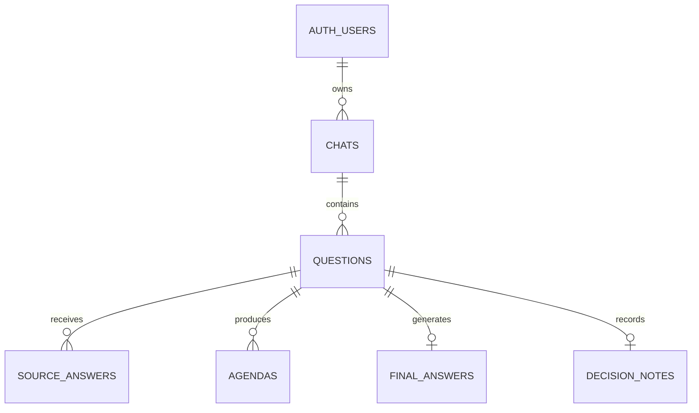

# Decision Log 데이터 모델

> 논리 DB 모델, 제약, RLS 방향의 기준 문서다. 실제 SQL Migration은 DB Spec에서 작성한다.
> 상태 값과 전이의 의미는 `docs/domain-policy.md`를 따른다.

---

## 1. DB 모델링 원칙

### 1.1 List 필드를 직접 저장하지 않는다

다음과 같은 List 필드는 PostgreSQL 테이블에 직접 두지 않는다.

```text
Chat.questions
Question.sourceAnswers
Question.agendas
```

외래키 관계로 표현한다.

```text
questions.chat_id
source_answers.question_id
agendas.question_id
```

### 1.2 Supabase Auth를 사용자 기준으로 사용한다

별도의 Account 테이블은 만들지 않는다.

```text
auth.users
- id
- email
- 인증 정보
```

서비스 테이블은 `auth.users.id`를 외래키로 참조한다.

프로필 정보가 필요해질 때만 다음을 추가한다.

```text
public.profiles
- user_id
- display_name
- created_at
- updated_at
```

### 1.3 공통 필드

각 서비스 테이블은 기본적으로 다음 필드를 고려한다.

```text
id
created_at
updated_at
```

`updated_at`은 PostgreSQL Trigger(`moddatetime` 확장 등)로 자동 갱신한다. 애플리케이션 코드에서 개별적으로 갱신하지 않는다.

관계에 따라 다음 외래키를 사용한다.

```text
user_id
chat_id
question_id
```

물리 DB 설계 시 다음도 함께 확정한다.

```text
nullable 여부
default 값
foreign key
on delete 정책
unique 조건
index
```

### 1.4 중복 데이터를 줄인다

- SourceAnswer에 Question message를 중복 저장하지 않는다.
- DecisionNote에 `chat_id`를 중복 저장하지 않는다.
- Chat에 Question 배열을 저장하지 않는다.
- Question에 Agenda나 SourceAnswer 배열을 저장하지 않는다.
- 재현에 필요한 실행 Snapshot은 의도적으로 JSONB에 저장한다.

### 1.5 JSONB 사용 범위

MVP에서 JSONB를 사용하는 항목:

```text
questions.context_snapshot
source_answers.request_snapshot
source_answers.structured_content
agendas.source_refs
agendas.recheck_result
final_answers.input_snapshot
```

명확한 소유 관계와 반복 조회가 필요한 데이터는 테이블과 외래키로 관리한다. 실행 당시의 구조화된 Snapshot이나 유동적인 AI 응답은 JSONB로 저장한다.


---

## 2. DB 전체 관계



MVP에서는 Agenda의 사용자 판단과 재검토 결과를 `agendas` 테이블에 함께 저장한다.

이유:

- Agenda별 최종 판단은 하나뿐이다.
- 재검토도 최대 한 번이다.
- 이전 판단 이력을 보존하는 기능이 없다.
- 단방향 상태 전이를 사용한다.

향후 판단 이력이나 다중 재검토가 필요해질 때 다음 테이블로 분리할 수 있다.

```text
agenda_decisions
agenda_review_attempts
```


---

## 3. DB 테이블 초안

### 3.1 `auth.users`

Supabase가 관리하는 인증 테이블이다.

| 필드 | 형식 | 설명 |
|---|---|---|
| `id` | `uuid` | 사용자 식별자 |
| `email` | Supabase 관리 | 로그인 이메일 |
| 인증 관련 필드 | Supabase 관리 | 비밀번호 Hash, 인증 상태 등 |

서비스에서 비밀번호를 직접 저장하거나 조회하지 않는다.

### 3.2 `chats`

| 필드 | 형식 | Null | 기본값 | 설명 |
|---|---|---:|---|---|
| `id` | `uuid` | No | `gen_random_uuid()` | Chat ID |
| `user_id` | `uuid` | No | 없음 | `auth.users.id` 참조 |
| `title` | `varchar(100)` | No | 없음 | 첫 Question message 기반 제목, 100자 초과 시 앞 100자만 저장 |
| `created_at` | `timestamptz` | No | `now()` | 생성 시간 |
| `updated_at` | `timestamptz` | No | `now()` | 수정 시간 |

제약:

```text
user_id → auth.users.id
ON DELETE RESTRICT
```

권장 Index:

```text
INDEX chats_user_id_updated_at
(user_id, updated_at desc)
```

### 3.3 `questions`

| 필드 | 형식 | Null | 기본값 | 설명 |
|---|---|---:|---|---|
| `id` | `uuid` | No | `gen_random_uuid()` | Question ID |
| `chat_id` | `uuid` | No | 없음 | 소속 Chat |
| `sequence_number` | `integer` | No | 없음 | Chat 안의 질문 순서 |
| `message` | `text` | No | 없음 | 사용자 질문 |
| `status` | `question_status` | No | `draft` | Question 상태 |
| `context_snapshot` | `jsonb` | No | `{}` | 실제 전달한 이전 대화 Context |
| `context_version` | `varchar(50)` | No | `v1` | Context 구성 버전 |
| `last_error_code` | `varchar(100)` | Yes | `null` | 최근 오류 코드 |
| `last_error_message` | `text` | Yes | `null` | 안전한 오류 메시지 |
| `created_at` | `timestamptz` | No | `now()` | 생성 시간 |
| `updated_at` | `timestamptz` | No | `now()` | 수정 시간 |
| `completed_at` | `timestamptz` | Yes | `null` | 완료 시간 |

제약:

```text
chat_id → chats.id
ON DELETE CASCADE

UNIQUE (chat_id, sequence_number)

CHECK (char_length(message) BETWEEN 1 AND 1000)
```

한 Chat에 미완료 Question 하나만 허용하는 권장 Partial Unique Index:

```sql
CREATE UNIQUE INDEX questions_one_open_per_chat
ON questions (chat_id)
WHERE status IN ('draft', 'processing', 'review_required');
```

권장 Index:

```text
INDEX questions_chat_id_sequence
(chat_id, sequence_number)
```

### 3.4 `source_answers`

| 필드 | 형식 | Null | 기본값 | 설명 |
|---|---|---:|---|---|
| `id` | `uuid` | No | `gen_random_uuid()` | SourceAnswer ID |
| `question_id` | `uuid` | No | 없음 | 소속 Question |
| `provider` | `ai_provider` | No | 없음 | `claude`, `openai`, `gemini` |
| `model` | `varchar(100)` | No | 없음 | 실제 사용 모델 |
| `status` | `source_answer_status` | No | `pending` | 호출 상태 |
| `prompt_version` | `varchar(100)` | No | 없음 | Prompt 버전 |
| `request_snapshot` | `jsonb` | No | `{}` | 실제 요청 Snapshot |
| `raw_content` | `text` | Yes | `null` | Provider 원문 응답 |
| `structured_content` | `jsonb` | Yes | `null` | Zod 검증 완료 구조화 응답 |
| `error_code` | `varchar(100)` | Yes | `null` | 오류 코드 |
| `error_message` | `text` | Yes | `null` | 안전하게 가공한 오류 내용 |
| `retry_count` | `smallint` | No | `0` | 재시도 횟수, 최대 1 |
| `excluded_from_comparison` | `boolean` | No | `false` | 재시도 실패 후 비교 제외 여부 |
| `excluded_at` | `timestamptz` | Yes | `null` | 비교에서 제외된 시간 |
| `started_at` | `timestamptz` | Yes | `null` | 호출 시작 시간 |
| `completed_at` | `timestamptz` | Yes | `null` | 성공 또는 실패 완료 시간 |
| `created_at` | `timestamptz` | No | `now()` | 생성 시간 |
| `updated_at` | `timestamptz` | No | `now()` | 수정 시간 |

제약:

```text
question_id → questions.id
ON DELETE CASCADE

UNIQUE (question_id, provider)

CHECK (retry_count BETWEEN 0 AND 1)
```

권장 Index:

```text
INDEX source_answers_question_id
(question_id)
```

### 3.5 `agendas`

| 필드 | 형식 | Null | 기본값 | 설명 |
|---|---|---:|---|---|
| `id` | `uuid` | No | `gen_random_uuid()` | Agenda ID |
| `question_id` | `uuid` | No | 없음 | 소속 Question |
| `status` | `agenda_status` | No | `draft` | Agenda 처리 상태 |
| `resolution_reason` | `agenda_resolution_reason` | Yes | `null` | 최종 상태가 된 이유 |
| `title` | `varchar(200)` | No | 없음 | Agenda 제목 |
| `summary` | `text` | No | 없음 | Agenda 요약 |
| `selected_content` | `text` | Yes | `null` | 합의 내용(auto_consensus), 기존 AI 내용 채택 또는 사용자가 직접 입력한 최종 채택 내용 |
| `user_note` | `text` | Yes | `null` | 사용자 메모 |
| `source_refs` | `jsonb` | No | `[]` | 근거 SourceAnswer·Section 참조 |
| `recheck_request` | `text` | Yes | `null` | 사용자 재검토 요청 내용 |
| `recheck_result` | `jsonb` | Yes | `null` | Manager AI 재검토 결과 |
| `recheck_requested_at` | `timestamptz` | Yes | `null` | 재검토 요청 시간 |
| `reanswered_at` | `timestamptz` | Yes | `null` | 재검토 완료 시간 |
| `resolved_at` | `timestamptz` | Yes | `null` | Passed 또는 Rejected 시간 |
| `created_at` | `timestamptz` | No | `now()` | 생성 시간 |
| `updated_at` | `timestamptz` | No | `now()` | 수정 시간 |

제약:

```text
question_id → questions.id
ON DELETE CASCADE
```

상태와 Resolution Reason 정합성 규칙:

```text
status IN ('draft', 'conflicted', 'recheck_requested', 'reanswered')
→ resolution_reason IS NULL

status IN ('passed', 'rejected')
→ resolution_reason IS NOT NULL

status = 'passed'
→ selected_content IS NOT NULL
```

권장 Index:

```text
INDEX agendas_question_id_status
(question_id, status)
```

### 3.6 `final_answers`

| 필드 | 형식 | Null | 기본값 | 설명 |
|---|---|---:|---|---|
| `id` | `uuid` | No | `gen_random_uuid()` | FinalAnswer ID |
| `question_id` | `uuid` | No | 없음 | 소속 Question |
| `content` | `text` | No | 없음 | 최종 답변 |
| `generation_mode` | `final_answer_generation_mode` | No | `multi_source` | 생성 방식 |
| `prompt_version` | `varchar(100)` | Yes | `null` | AI 생성 시 사용한 Prompt 버전 |
| `input_snapshot` | `jsonb` | No | `{}` | 생성에 사용한 Agenda 또는 SourceAnswer Snapshot |
| `created_at` | `timestamptz` | No | `now()` | 생성 시간 |

제약:

```text
question_id → questions.id
ON DELETE CASCADE

UNIQUE (question_id)
```

### 3.7 `decision_notes`

| 필드 | 형식 | Null | 기본값 | 설명 |
|---|---|---:|---|---|
| `id` | `uuid` | No | `gen_random_uuid()` | DecisionNote ID |
| `question_id` | `uuid` | No | 없음 | 소속 Question |
| `content` | `text` | No | 없음 | 사용자 결정 기록 |
| `created_at` | `timestamptz` | No | `now()` | 생성 시간 |
| `updated_at` | `timestamptz` | No | `now()` | 수정 시간 |

제약:

```text
question_id → questions.id
ON DELETE CASCADE

UNIQUE (question_id)
```

DecisionNote에는 `chat_id`를 저장하지 않는다.

MVP에서는 저장 후 수정 API를 제공하지 않는다. `updated_at`은 공통 필드 일관성을 위해 유지한다.


---

## 4. Enum 초안

### 4.1 `question_status`

```text
draft
processing
review_required
completed
```

### 4.2 `source_answer_status`

```text
pending
processing
succeeded
failed
```

### 4.3 `agenda_status`

```text
draft
conflicted
recheck_requested
reanswered
passed
rejected
```

### 4.4 `agenda_resolution_reason`

```text
auto_consensus
user_accepted
user_accepted_after_recheck
user_composed
user_composed_after_recheck
user_rejected
user_rejected_after_recheck
```

### 4.5 `final_answer_generation_mode`

```text
multi_source
single_source_fallback
all_agendas_rejected
```

### 4.6 `ai_provider`

```text
claude
openai
gemini
```

새 Provider를 추가할 경우 Enum 확장 또는 Provider 테이블 전환을 검토한다.


---

## 5. Supabase RLS 초안

모든 서비스 데이터는 로그인 사용자별로 분리한다.

기본 소유권 경로:

```text
auth.users.id
→ chats.user_id
→ questions.chat_id
→ source_answers.question_id
→ agendas.question_id
→ final_answers.question_id
→ decision_notes.question_id
```

정책 방향:

- 사용자는 자신의 Chat만 조회·생성·수정할 수 있다.
- MVP에서는 Chat 삭제 정책을 제공하지 않는다.
- Question 이하 데이터는 소속 Chat의 `user_id = auth.uid()`인 경우에만 접근할 수 있다.
- 클라이언트가 전달한 `user_id`를 신뢰하지 않는다.
- Express는 검증된 Supabase JWT에서 사용자 ID를 가져온다.
- 조회와 사용자 행동에 의한 쓰기는 사용자 JWT를 전달한 Supabase Client로 처리하며, RLS가 적용된다.
- AI 파이프라인의 시스템 쓰기(SourceAnswer·Agenda·FinalAnswer 저장과 상태 갱신)는 Secret Key Client로 처리한다.
- Secret Key Client의 시스템 쓰기는 Service 계층에서 검증된 JWT의 userId로 대상 Chat·Question의 소유권을 확인한 뒤에만 수행한다.
- Secret Key 사용 범위는 `docs/dev-setup.md`의 "명확히 제한된 기능" 규칙을 따르며, 위 시스템 쓰기 목록 밖으로 확장하지 않는다.
- 하위 테이블에 `user_id`를 중복 저장하지 않으며, RLS Policy는 `chats.user_id`까지의 join 경로(EXISTS)로 소유권을 검사한다.
- Supabase Secret Key나 Service Role Key는 프론트엔드에 노출하지 않는다.
- 실제 RLS SQL은 DB Spec 및 Migration 단계에서 별도로 작성한다.


---

## 6. 후속 확장 구조

### 6.1 Answer Section 정규화

```text
answer_sections
- id
- source_answer_id
- section_key
- title
- content
```

### 6.2 Agenda Source 정규화

```text
agenda_sources
- agenda_id
- answer_section_id
```

### 6.3 Agenda 판단 이력

```text
agenda_decisions
- id
- agenda_id
- decision
- selected_content
- user_note
- created_at
```

### 6.4 다중 재검토

```text
agenda_review_attempts
- id
- agenda_id
- attempt_number
- request
- result
- status
- created_at
- completed_at
```

현재 MVP에서는 단일 판단과 1회 재검토 정책이므로 위 테이블을 만들지 않는다.
