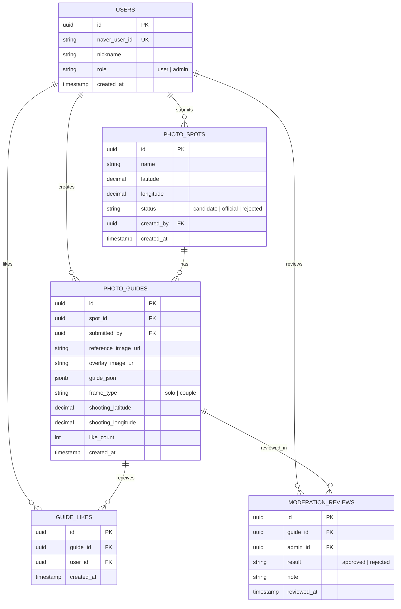

# Database Design

후보 제안, 좋아요, 관리자 검토를 지원하는 목표 DB 구조다. 2주차 수직 슬라이스에서는 `users`, `photo_spots`, `photo_guides`부터 생성하고, 좋아요와 검토 테이블은 이후 연결한다.

## Rules

- `guide_likes`에는 `(user_id, guide_id)` 유니크 제약을 둔다.
- 사용자는 후보만 제안할 수 있다. `official` 전환은 관리자 검토 결과로만 처리한다.
- `guide_json`에는 배경 윤곽, 수평선, 1인 또는 커플 프레임의 비율 좌표를 저장한다.
- 사진 원본과 생성 Overlay PNG는 Supabase Storage에 두고, DB에는 URL과 메타데이터만 저장한다.
- 접근 권한과 RLS 원칙은 [security.md](./security.md)를 따른다.
