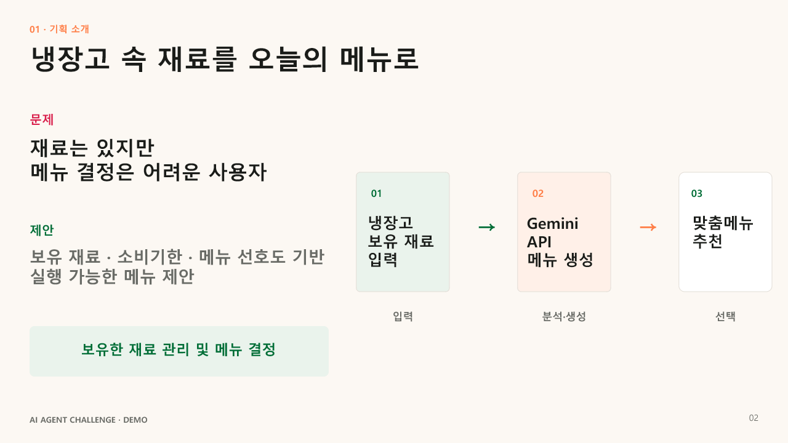
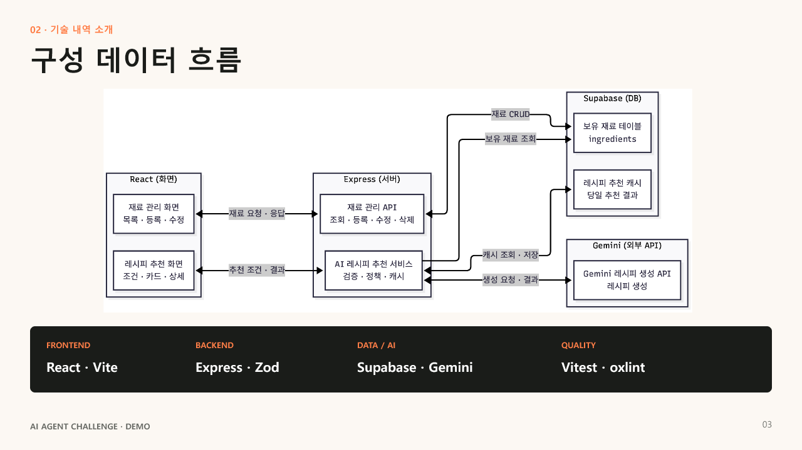
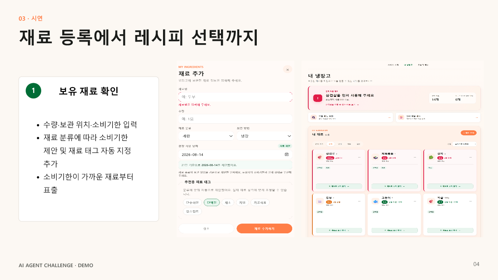
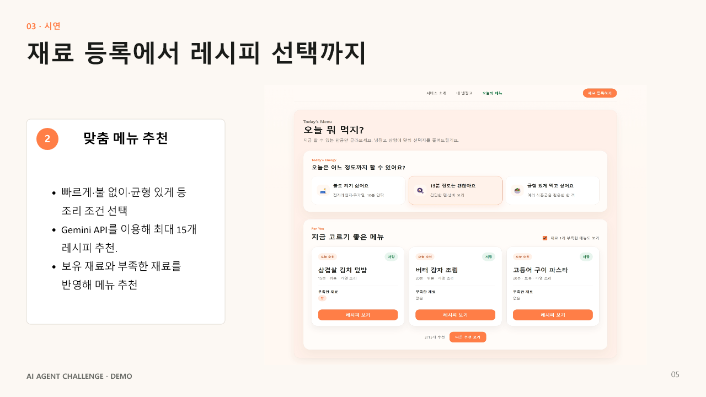
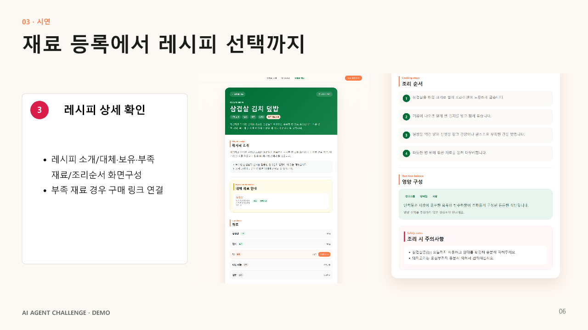
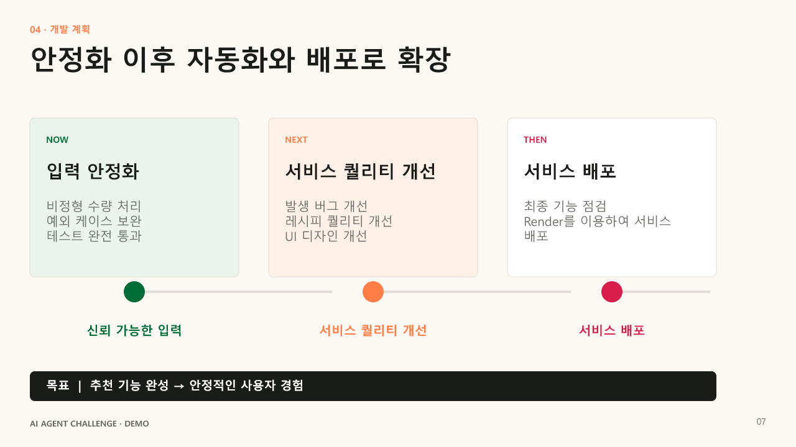

# AI Agent Challenge 데모 프레젠테이션

보유 재료와 소비기한을 바탕으로 지금 만들 수 있는 1인분 레시피를 추천하는 `있는대로` 프로젝트의 데모 발표 자료입니다.

[PowerPoint 원본 다운로드](./ai-agent-challenge-demo-2026-07-24.pptx)

## 1. 보유 재료 기반 레시피 추천

## 2. 냉장고 속 재료를 오늘의 메뉴로

## 3. 구성 데이터 흐름

## 4. 보유 재료 확인

## 5. 맞춤 메뉴 추천

## 6. 레시피 상세 확인

## 7. 개발 계획

