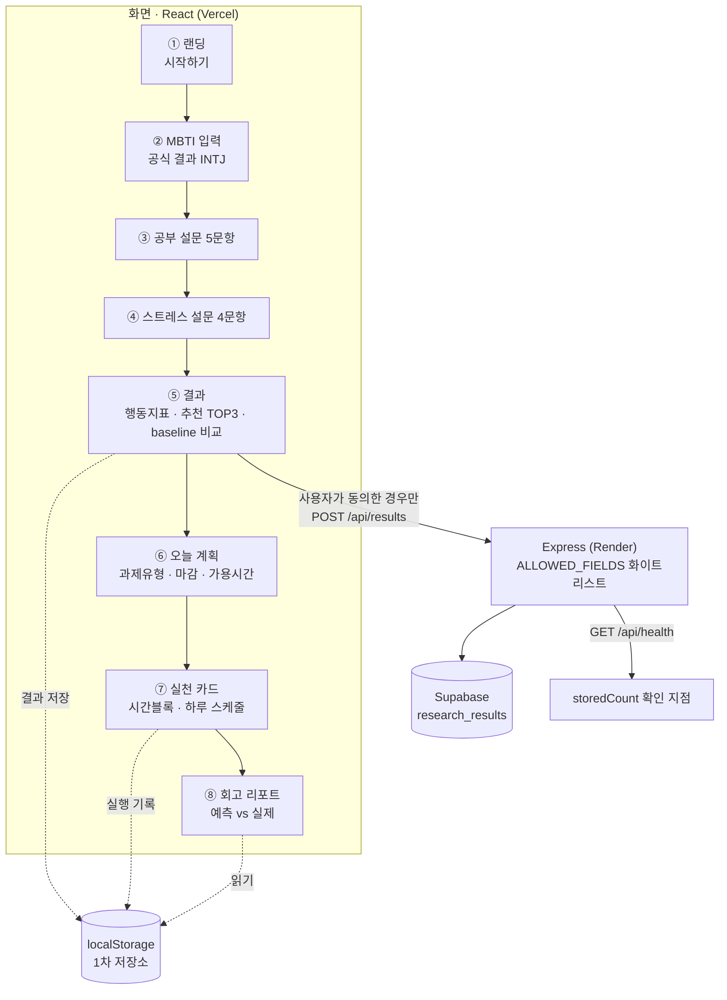

# demo-scenario.md — 발표용 핵심 데모 시나리오

> 목적: 데모에서 보여줄 **핵심 사용자 흐름을 하나로 고정**하고, 그 흐름이 화면 → 서버 → DB까지 실제로 이어지는 것을 5분 안에 보여준다. 기능을 전부 훑지 않는다. 데모에 넣지 않는 것과 아직 동작하지 않는 것은 §5·§6에 따로 적는다.
>
> 대상 환경: **배포된 공개 URL** (로컬 아님) — https://hub-theta-brown.vercel.app
>
> **촬영 대본은 이 문서가 아니다.** 아래 §2 시간표는 정확히 5:00이라 "5분 미만" 요구사항에 마진이 없고,
> 기술적 특징·문제해결 과정·Agent 활용 방식이 마지막 20초에 몰려 있다. 실제 녹화는
> [demo-video-script.md](./demo-video-script.md)의 초 단위 큐시트를 따른다 — 이 문서는 **제품 흐름의 설계 근거**로 남긴다.

---

## 1. 데모에서 보여줄 핵심 사용자 흐름 (하나)

**"공식 MBTI 결과가 있는 사용자가, 오늘 할 공부법을 추천받고, 그 추천이 정말 자기에게 맞는지 검증할 준비까지 마친다."**



**흐름 한 줄 요약:** 성향·상태를 점검하고 → 오늘 시도할 방법을 근거와 함께 받고 → 20~30분 실천 카드로 바꾸고 → 해본 결과를 예측과 대조해 회고로 남긴다. MBTI는 입구일 뿐이고, **추천이 맞았는지는 사용자가 직접 검증한다.**

---

## 2. 클릭 순서와 말할 것 (5분 미만 기준)

| 시간 | 화면 | 클릭 | 말할 것 |
|---|---|---|---|
| 0:00–0:30 | 랜딩 | — | "성격풀이가 아니라 **자기조절 회고 도구**입니다. MBTI는 친숙한 입구로만 씁니다." |
| 0:30–0:50 | ① → ② | `시작하기` → `공식 MBTI 결과를 입력할게요` → `INTJ` → `공부 설문으로 이동` | "공식 문항을 복제하지 않습니다. 이미 받은 결과를 **기록**하는 입력입니다." |
| 0:50–1:00 | AI 근거 보충(선택) | `건너뛰고 설문으로` | "여기서 외부 LLM으로 근거를 보충할 수도 있지만, **동의하지 않아도 전 과정이 진행됩니다.**" |
| 1:00–1:30 | ③ ④ | 문항 선택 → `스트레스 설문으로 이동` → `결과 보기` | "MBTI가 아니라 **실제 공부 행동과 피로 신호**를 묻습니다." |
| 1:30–2:30 | ⑤ 결과 1/2 | (스크롤) | **여기가 핵심.** 4축 탐색 신호 옆의 *"공식 MBTI 평가 결과가 아닙니다"* 고지를 짚고, **BASELINE COMPARISON**에서 "MBTI 힌트를 넣었을 때 추천 순서가 바뀌었는지"를 보여준다. |
| 2:30–3:00 | ⑤ 결과 2/2 | `다음: 추천·근거 보기` | 행동지표 5개(점수는 우열이 아니라 방향 신호) + 추천 공부법 TOP 3의 **근거 지표 배지**를 짚는다. |
| 3:00–3:30 | ⑥ ⑦ | `오늘 계획 입력하기` → 과제유형·마감·가용시간 → `오늘의 실천 카드 보기` | "추천이 말로 끝나지 않고 **오늘의 시간블록과 하루 스케줄**로 바뀝니다." |
| 3:30–4:00 | ⑦ → ⑧ | `다음: 루틴 실행·기록` → `기록 저장` → `내 회고 리포트 보기` | "해본 결과를 기록하면 **예측 vs 실제 대조**가 쌓입니다. 이게 '나에게 맞는지'를 검증하는 방법입니다." |
| 4:00–4:40 | 서버·DB | 결과 화면 → 동의 체크 → `서버에 익명 저장` → `내 서버 기록 보기` → `내 서버 기록 삭제` | 별도 탭에서 `/api/health`를 열어 **`storedCount`가 늘고 다시 줄어드는 것**을 보여준다. 화면→서버→DB가 실제로 도는 증거. |
| 4:40–5:00 | 마무리 | — | Agent 협업 워크플로우([`ai-workflow.md`](./ai-workflow.md))와 남은 과제 한 줄. |

### 서버·DB가 실제로 도는 것을 보여주는 지점

```bash
curl -m 90 https://hub-backend-kymx.onrender.com/api/health
# {"status":"ok","backend":"supabase","storedCount":N,"time":"..."}
```

- `backend:"supabase"` — in-memory 폴백이 아니라 **실제 DB에 붙어 있다**는 뜻.
- `storedCount` — 화면에서 저장하면 늘고, 삭제하면 줄어든다. 이 숫자 하나가 화면·서버·DB 연결의 증거다.

> **데모 직전 준비:** Render 무료 티어는 15분 미사용 시 슬립한다. 시작 5분 전에 프런트와 `/api/health`를 한 번씩 호출해 워밍업한다.

---

## 3. 이 흐름이 코드에서 어디로 이어지는가

| 화면 단계 | 프런트 | 서버 | 저장 |
|---|---|---|---|
| ② MBTI 입력 | `components/steps/StepMbtiSource.jsx` | — | — |
| (선택) AI 근거 보충 | `components/steps/StepMbtiChat.jsx` | `POST /api/mbti-chat` → `lib/llm.js` | 저장 안 함 |
| ③ ④ 설문 | `components/steps/StepSurvey.jsx` | — | — |
| ⑤ 결과·추천 | `lib/scoring.js`, `lib/recommendations.js`, `data/mbtiMethodMatching.js` | — | `lib/storage.js` → localStorage |
| ⑤ 동의 후 익명 저장 | `components/ConsentNotice.jsx`, `lib/api.js` | `POST/GET/DELETE /api/results` → `store.js` | Supabase `research_results` |
| ⑥ ⑦ 계획·실천 카드 | `components/steps/StepTaskState.jsx`, `lib/schedule.js` | — | localStorage |
| ⑧ 회고 리포트 | `components/RetrospectiveReport.jsx`, `hooks/useMetacognition.js` | — | localStorage(읽기 전용) |

전체 아키텍처 다이어그램은 [README.md](../README.md#아키텍처)에 있다.

---

## 4. 데모에 넣지 않는 것 (있지만 안 보여줌)

시간 안에 하나의 흐름을 끝까지 보여주는 것이 목적이므로, 아래는 **동작하지만 데모에서는 생략**한다.

- 공식 결과 없이 진행하는 경로(탐색 신호만 사용) — 하드룰 설명이 길어짐
- AI 근거 보충 채팅(Gemini) 실제 대화 — 응답 시간이 데모 흐름을 끊음. 대신 "건너뛸 수 있다"는 점만 언급
- 전체 경향(연구 집계) 화면 `AnalysisReport` — 파일럿 데이터가 4건뿐이라 보여줄 게 적음
- 주간 타임테이블 상세, 필수시간 슬라이더 조정

---

## 5. 아직 동작하지 않는 것 (솔직하게 남기는 목록)

| 항목 | 현재 상태 | 추적 |
|---|---|---|
| 데모 영상(5분 미만) | 미녹화 — 수요일 마감. 대본·자막·체크리스트는 준비됨([demo-video-script.md](./demo-video-script.md), [subtitles/demo.srt](./subtitles/demo.srt)) | 이슈: 데모 영상 제작 |
| 주간 타임테이블 | **골격만** 있음. 실제 분산 배치 로직 미완 | 이슈: 하루 스케줄 생성기 완성 + 주간 타임테이블 |
| 분석 리포트 심화(기질×방법 교차표·시계열) | 미착수 — 파일럿 데이터 부족 | 이슈: 분석 리포트 심화 |
| 추천 이유를 LLM이 설명해주는 기능 | 미구현. 현재 추천 설명은 **규칙 기반 문구** | 이슈: 제품 내 LLM 설명 에이전트 |
| 설문 문항 쉬운 재작성·예시/툴팁 | 미착수 | 이슈: 설문 문항 쉬운 재작성 |
| 판정 근거·한계 전용 신뢰 패널 | 결과 화면에 문구로만 있고 **전용 패널 없음** | 이슈: 판정 근거·한계 신뢰 패널 |
| 실천 기록 연속 실행(스트릭) 요약 | 미착수 | 이슈: 스트릭 요약 표시 |
| 모바일·접근성 점검 | 데스크톱 기준으로만 확인됨 | 이슈: 반응형 및 접근성 점검 |
| **로컬 데이터 삭제 시 `hub-anon-id` 잔존** | "이 브라우저의 저장 데이터 삭제"가 앱 데이터는 모두 지우지만, 서버 기록용 가명 ID는 남는다(2026-07-27 확인) | 이슈: 로컬 삭제 시 가명 ID 처리 |

---

## 6. 월요일까지 끝낼 것 / 이후로 미룰 것

**월요일(오늘) 안에 끝낸 것**

- 배포 환경에서 핵심 흐름 완주 검증(공식 결과 입력 경로 · baseline 비교 · localStorage 저장·복구·삭제)
- 배포 절차와 확인 기준을 워크플로우 문서에 반영
- Agent 협업 과정 시각 자료
- 이 데모 시나리오 문서
- showcase 자료 갱신(대표 이미지를 실제 서비스 화면으로 교체)

**이후로 미루는 것**

- 데모 영상 촬영·업로드 (수요일)
- 주간 타임테이블 완성, 분석 리포트 심화 (데이터가 쌓인 뒤)
- 모바일·접근성 점검 (금요일 통합 QA에 포함)
