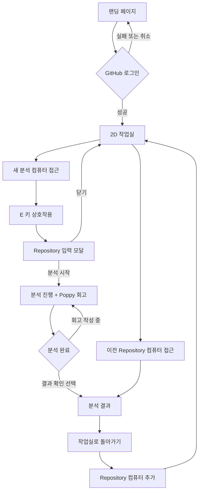

# PtoP 게임형 작업실 설계

## 문서 상태

- 기준일: 2026-07-23
- 관련 이슈: [#18](https://github.com/SubJeeLee/hub/issues/18), [#19](https://github.com/SubJeeLee/hub/issues/19)
- 첫 구현 범위: 랜딩 이후 전체 viewport 작업실에서 이동하고 에셋 기반 컴퓨터를 통해 기존 Repository 입력 모달을 여는 기술 스파이크

## 목표

PtoP의 핵심 기능을 게임으로 대체하는 것이 아니라, 포트폴리오 정리를 시작하는 부담을 낮추는 탐색 경험을 제공한다.

사용자는 GitHub 로그인 후 자신만의 작업실에 들어간다. 작업실의 컴퓨터는 분석한 프로젝트를 나타내며, 새 분석 컴퓨터에서 Repository 분석을 시작한다. 분석 중에는 Poppy와 짧은 대화를 통해 Repository만으로 확인하기 어려운 개인 경험을 보완한다.

## 성공 기준

- GitHub 로그인 사용자가 작업실에 진입할 수 있다.
- 방향키 또는 WASD로 기본 캐릭터를 이동할 수 있다.
- 새 분석 컴퓨터에 접근하면 `E` 상호작용 안내가 표시된다.
- `E` 입력 시 기존 Repository 입력 UI가 React 모달로 열린다.
- 모달이 열려 있는 동안 게임 입력이 멈춘다.
- 게임을 조작하기 어려운 환경에서도 목록 UI로 분석 기능에 접근할 수 있다.

## 제외 범위

- 멀티플레이와 실시간 위치 동기화
- 캐릭터 생성과 커스터마이징
- 사용자가 직접 가구를 배치하는 맵 편집
- 여러 방과 포털 이동
- 최종 Poppy 픽셀 스프라이트 제작
- Repository 분석 알고리즘의 전면 변경

## 사용자 시나리오

1. 사용자는 랜딩 화면에서 작업실 미리보기와 서비스 목적을 확인한다.
2. 사용자는 `GitHub로 시작하기`를 선택하고 인증한다.
3. PtoP는 기본 2D 캐릭터를 배정하고 작업실에 입장시킨다.
4. 사용자는 방향키 또는 WASD로 작업실을 이동한다.
5. 이전 분석이 있으면 각 Repository에 해당하는 컴퓨터를 확인할 수 있다.
6. 사용자는 새 분석 컴퓨터에 접근하고 `E` 키를 누른다.
7. Repository 입력 모달에서 URL을 입력하고 분석을 시작한다.
8. 분석 중에는 Poppy가 한 번에 하나의 짧은 회고 질문을 제공한다.
9. 분석이 먼저 완료되어도 작성 중인 대화는 중단되지 않는다.
10. 사용자는 `결과 확인하기`를 눌러 분석 근거와 회고가 합쳐진 결과를 확인한다.
11. 사용자가 작업실로 돌아오면 완료된 Repository가 새 컴퓨터로 표시된다.

## 화면 흐름



## 정보 구조

```text
PtoP
├── Landing
│   ├── 작업실 영상 또는 poster
│   └── GitHub 로그인
├── Workspace
│   ├── Player
│   ├── New Analysis Computer
│   ├── Repository Computers
│   ├── Poppy NPC
│   └── Mobile Repository List
├── Repository Terminal
│   ├── Repository URL
│   ├── GitHub ID
│   └── Analysis Status
├── Reflection Dialogue
│   ├── Poppy Question
│   ├── Short Answer
│   └── Skip / Previous / Next
└── Analysis Report
    ├── Repository Evidence
    ├── User Reflection
    ├── AI Interpretation
    └── Return to Workspace
```

## 와이어프레임

### 랜딩 페이지

```text
┌────────────────────────────────────────────────────────────┐
│ PtoP                                        로그인 또는 프로필 │
│                                                            │
│       [2D 캐릭터가 작업실을 이동하는 영상 / poster]           │
│                                                            │
│          프로젝트 경험을 발견하는 나만의 작업실               │
│                    [GitHub로 시작하기]                       │
└────────────────────────────────────────────────────────────┘
```

### 2D 작업실

```text
┌────────────────────────────────────────────────────────────┐
│ PtoP 작업실                                    설정 / 로그아웃 │
├────────────────────────────────────────────────────────────┤
│                                                            │
│   [repo PC]        [새 분석 PC]        [repo PC]             │
│                         ✦                                  │
│                                                            │
│                    [기본 캐릭터]                             │
│                                                            │
│       [Poppy NPC]                          [보관함]           │
│                                                            │
├────────────────────────────────────────────────────────────┤
│ 이동: 방향키/WASD                 [E] Repository 분석 시작    │
└────────────────────────────────────────────────────────────┘
```

### Repository 입력 모달

```text
┌──────────────────────────────────────────────┐
│ 새 프로젝트 분석                         [×] │
│                                              │
│ GitHub Repository URL                        │
│ [https://github.com/owner/repository       ] │
│                                              │
│ 분석할 GitHub ID                             │
│ [SubJeeLee                                 ] │
│                                              │
│                  [분석 시작]                  │
└──────────────────────────────────────────────┘
```

### Poppy 회고 대화

```text
┌────────────────────────────────────────────────────────────┐
│ [Poppy]  이 프로젝트를 시작하게 된 가장 큰 이유는 무엇인가요? │
│                                                            │
│          [한 문장으로 적어도 충분해요                    ]   │
│                                                            │
│          [건너뛰기]                       [다음 질문]         │
└────────────────────────────────────────────────────────────┘
```

## 맵과 runtime 에셋 연결

현재 기술 스파이크는 Tiled 편집 파일을 바로 도입하기보다, `workspace2`에 준비한 맵 PNG와 캐릭터 스프라이트를 먼저 연결한다. Phaser가 맵과 스프라이트를 preload하고, `workspaceMap.ts`가 상호작용 좌표와 충돌 영역을 관리한다. 다음 단계에서 맵이 커지면 같은 레이어 규칙을 Tiled JSON으로 옮긴다.

### 기본 규격

- 논리 타일: `32×32px`
- 기술 스파이크 맵: `1376×768px` 완성형 오피스 맵, 논리상 `43×24` 타일
- 카메라: 맵 경계 안에서 캐릭터를 추적
- 시작 위치: 작업실 중앙 하단
- 첫 상호작용 대상: 새 분석 컴퓨터 1개
- runtime 에셋: `apps/web/public/assets/workspace2/`
- 현재 에셋: `map1.png`, `map2.png`, `wide_map.png`, `art-tileset.png`, `furniture.png`, `women.png`, `man.png`, `poppy.png`
- 현재 화면 연결: `wide_map.png`를 배경으로 사용하고, `women.png`와 `poppy.png`를 256px 프레임 스프라이트로 사용
- 캐릭터 이미지의 체크무늬 배경은 원본을 수정하지 않고 런타임 Canvas 처리로 투명화

### 레이어

```text
Workspace-Floor
Workspace-Wall
Workspace-Furniture-Low
Workspace-Furniture-High
Workspace-Collision
ObjectLayer-Spawn
ObjectLayer-Interaction
```

- `Workspace-Collision`은 렌더링하지 않는다.
- 가구의 앞과 뒤를 자연스럽게 표현해야 할 때 Low/High 레이어를 사용한다.
- 상호작용 판정은 충돌 레이어가 아니라 `ObjectLayer-Interaction`의 사각형 영역을 사용한다.

### 상호작용 오브젝트 속성

| 속성 | 타입 | 새 분석 컴퓨터 예시 |
| --- | --- | --- |
| `type` | string | `new-analysis-pc` |
| `slotId` | string | `repository-slot-new` |
| `repositoryId` | string | 빈 문자열 |
| `prompt` | string | `E 키로 분석 시작` |
| `direction` | string | `up` |

## 아키텍처

### 책임 경계

| 단위 | 책임 | 책임이 아닌 것 |
| --- | --- | --- |
| `WorkspaceGame` | React에서 Phaser mount와 이벤트 연결 | 이동·충돌 구현 |
| `createWorkspaceGame` | Phaser 설정과 인스턴스 생성 | React 상태 관리 |
| `WorkspaceScene` | 맵 preload/create/update | API 호출과 모달 렌더링 |
| `InputManager` | 방향키, WASD, E 입력 | 상호작용 대상 결정 |
| `InteractionManager` | 근접 대상 탐색과 이벤트 생성 | Repository 분석 실행 |
| `workspaceAssets` | 배포 base가 반영된 에셋 URL | 에셋 preload 실행 |
| `RepositoryTerminal` | URL 입력과 분석 요청 | Phaser 캐릭터 제어 |
| `InteractionPrompt` | 현재 상호작용 안내 | 근접 거리 계산 |

### 현재 구현 파일 구조

```text
apps/web/src/features/workspace/
├── WorkspaceGame.tsx
├── workspace.css
├── components/
│   └── InteractionPrompt.tsx
├── game/
│   ├── createWorkspaceGame.ts
│   ├── WorkspaceScene.ts
│   ├── InputManager.ts
│   └── InteractionManager.ts
└── model/
    ├── workspace.types.ts
    ├── workspaceAssets.ts
    └── workspaceMap.ts
```

작업실 화면은 랜딩 이후 전역 헤더를 숨기고 전체 viewport를 사용한다. 상단 HUD에는 작업실 이름과 최소 조작 안내만 두며, 분석 모달과 접근성 대체 UI는 React가 담당한다. 현재 `wide_map.png`에 이미 여러 컴퓨터가 배치되어 있고, 새 분석 대상은 오른쪽 중앙의 강조된 컴퓨터로 정의한다. Repository 이력 슬롯과 Poppy 대화는 후속 단계에서 연결한다.

### React와 Phaser 이벤트

```ts
export type WorkspaceEvent =
  | { type: "interaction-changed"; prompt: string | null }
  | { type: "open-new-analysis" };
```

- Phaser는 `open-new-analysis` 이벤트만 전달한다.
- React는 이벤트를 받아 기존 Repository 입력 UI를 모달로 연다.
- 모달이 열리면 React가 Phaser에 입력 비활성 command를 전달한다.
- Scene은 Repository 분석 API와 Supabase를 알지 못한다.

## 상태와 오류

| 상황 | 처리 |
| --- | --- |
| 맵 로딩 중 | 고정 높이의 준비 화면과 상태 문구 |
| 에셋 404 | 작업실을 열지 않고 재시도 안내 |
| 키보드 미지원 | Repository 목록 UI 제공 |
| 모달 열림 | 게임 입력과 전역 keyboard capture 중지 |
| 분석 API 실패 | 모달을 유지하고 오류 원인과 재시도 제공 |
| 분석 완료 | 사용자 확인 전 자동 전환 금지 |

## 테스트 전략

### 순수 로직

- 상호작용 영역 안에 들어오면 prompt가 반환된다.
- 여러 대상이 있을 때 가장 가까운 대상을 선택한다.
- 영역 밖으로 나가면 prompt가 사라진다.
- Repository 모달이 열리면 게임 입력 command가 비활성화된다.

### 컴포넌트

- `open-new-analysis` 이벤트가 Repository 입력 모달을 연다.
- 모달을 닫으면 게임 입력이 복원된다.
- Escape와 focus 복귀가 동작한다.

### 브라우저

- Canvas가 비어 있지 않다.
- 캐릭터가 방향키와 WASD로 이동한다.
- 벽과 컴퓨터를 통과하지 않는다.
- PC 근처에서만 상호작용 안내가 표시된다.
- `/` 배포 base에서도 모든 에셋이 로드된다.
- 모바일에서는 목록 기반 대체 UI가 표시된다.

## 구현 순서

1. 에셋과 라이선스 후보 기록
2. Phaser 초기화와 Canvas mount
3. `workspace2` runtime 맵·캐릭터·Poppy preload
4. `workspaceMap.ts` 기반 작업실 배치와 충돌
5. 기본 캐릭터 이동과 상호작용 이벤트
6. 기존 Repository 입력 UI 연결
7. 전체 viewport HUD와 랜딩 복귀 동선 연결
8. 타입 검사, 테스트, 빌드, 브라우저 검증
9. 맵이 커질 때 Tiled JSON과 레이어 구조로 확장
