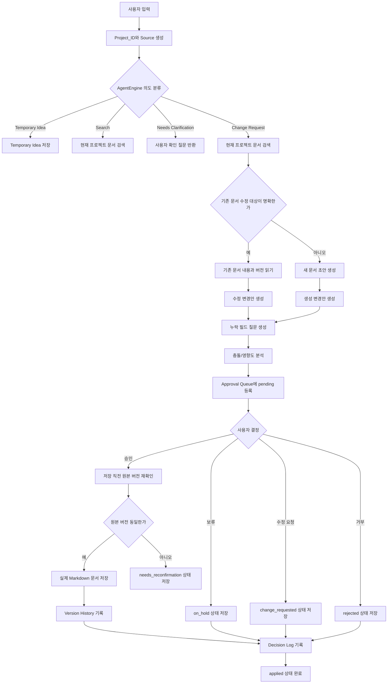
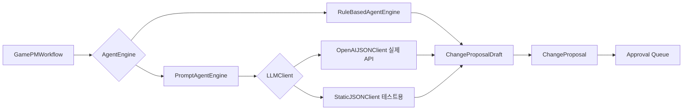
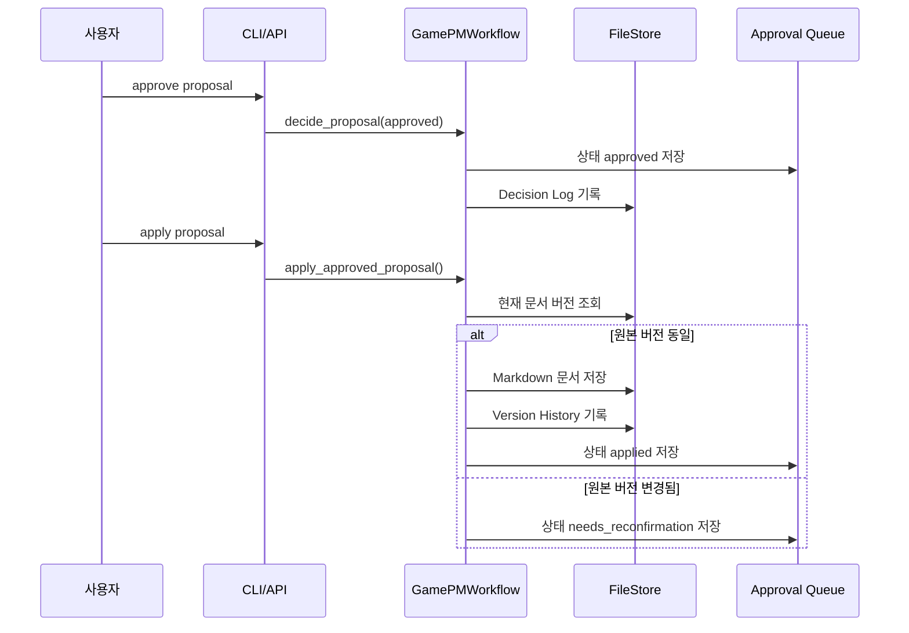

# 2026-07-08 개발 일지

## 주제

승인 기반 AI 문서 생성/수정 파이프라인 MVP 개발

## 오늘의 목표

`docs/plan.md`와 `docs/checklist.md`를 기준으로 가장 먼저 개발할 기능을 정하고, 사용자가 문서 생성/수정 요청을 입력했을 때 AI가 변경안을 만들고 사용자의 승인 후에만 실제 문서를 저장하는 흐름을 구현한다.

핵심 원칙:

- AI는 문서를 직접 수정하지 않는다.
- AI는 문서 생성안 또는 수정안을 만든다.
- 변경안은 반드시 Approval Queue에 먼저 등록된다.
- 사용자가 승인한 경우에만 실제 문서가 저장된다.
- 승인 후 저장 직전에도 원본 문서 버전을 다시 확인한다.

## 진행 요약

1. `docs/plan.md`와 `docs/checklist.md`를 확인했다.
2. 첫 개발 대상은 대시보드나 외부 연동이 아니라 승인 기반 문서 생성/수정 흐름으로 정했다.
3. Python 표준 라이브러리 기반의 백엔드 MVP를 만들었다.
4. 에이전트 판단 레이어를 `RuleBasedAgentEngine`과 `PromptAgentEngine`으로 분리했다.
5. 프롬프트 품질을 강화했다.
6. OpenAI SDK 기반 API 연결 구조를 추가했다.
7. API key는 하드코딩하지 않고 `OPENAI_API_KEY` 환경 변수만 사용하도록 정했다.
8. 기능 흐름과 개발 과정을 문서화했다.

## 구현한 범위

포함:

- 프로젝트 생성
- 문서 추가
- 사용자 입력 제출
- 규칙 기반 의도 분류
- 프로젝트별 문서 검색
- 문서 생성/수정 변경안 생성
- Approval Queue 저장
- 승인, 보류, 수정 요청, 거부 상태 처리
- 승인 후 실제 문서 저장
- 원본 버전 변경 시 저장 중단
- Version History 기록
- Decision Log 기록
- 프롬프트 기반 에이전트 인터페이스
- OpenAI SDK 기반 JSON client
- CLI 실행 경로
- 테스트

제외:

- 웹 UI
- Approval Queue 화면
- Diff Viewer 화면
- PDF/DOCX 업로드
- Notion/GitHub/Unity 연동
- DB 저장소
- 고급 검색/RAG
- 실제 사용자 권한 모델
- 실제 OpenAI API end-to-end 검증

## 주요 결정

### 개발 시작점

대시보드나 외부 연동보다 먼저 다음 흐름을 완성하기로 했다.

```text
입력 수집
-> 의도 분류
-> 기존 문서 검색
-> 문서 생성/수정 변경안 생성
-> Approval Queue 등록
-> 사용자 승인
-> 실제 저장
-> Version History / Decision Log 기록
```

이유:

- `docs/plan.md`의 핵심 원칙은 Human in the Loop다.
- `docs/checklist.md`의 여러 기능이 Approval Queue를 전제로 한다.
- 먼저 안전한 승인/저장 루프가 잡혀야 이후 Resource Extraction, Reminder, Automation을 얹을 수 있다.

### 에이전트 구조

처음에는 Python 코드로 흐름을 먼저 만들고, 이후 에이전트 판단 부분을 교체 가능하게 분리했다.

현재 구조:

- `RuleBasedAgentEngine`: 키워드/템플릿 기반 fallback
- `PromptAgentEngine`: 프롬프트 기반 판단 레이어
- `OpenAIJSONClient`: OpenAI SDK 기반 JSON 응답 client
- `StaticJSONClient`: 테스트용 fake LLM client

`GamePMWorkflow`는 직접 LLM이나 규칙 함수를 알지 않고 `AgentEngine` 인터페이스를 통해 판단을 요청한다.

### 프롬프트 언어 정책

입력 문서는 한국어일 가능성이 높지만, 프롬프트 지시는 영어로 작성했다.

정책:

- 시스템 지시와 JSON 스키마는 영어로 작성한다.
- 사용자에게 보이는 결과는 한국어로 생성하게 한다.
- JSON key와 enum 값은 영어 고정값을 유지한다.

이유:

- 영어 지시는 모델이 구조화 출력 규칙을 안정적으로 따르기 쉽다.
- 실제 기획자/PM이 보는 결과는 한국어여야 검토하기 쉽다.

### API key 정책

OpenAI API key는 하드코딩하지 않는다.

정책:

- `OPENAI_API_KEY` 환경 변수에서만 읽는다.
- `.env`는 Git에 포함하지 않는다.
- API key가 없으면 명확한 에러를 낸다.

## 사용자 질문과 답변

### Q1. 기능을 만드는 것과 흐름을 완성하는 것의 차이는?

답변:

- 기능을 만든다는 것은 문서 생성 함수, 검색 함수, 승인 테이블 같은 개별 능력을 만드는 것이다.
- 흐름을 완성한다는 것은 사용자가 입력부터 승인 후 저장까지 실제 작업 하나를 끝낼 수 있게 연결하는 것이다.

결정:

- 이 프로젝트에서는 먼저 개별 기능보다 승인 기반 전체 흐름을 작게 완성한다.

### Q2. 에이전트를 만든다는 것은 프롬프트 흐름을 만든다는 의미인가?

답변:

부분적으로 맞지만 프롬프트만은 아니다.

에이전트 흐름은 다음 세 가지가 함께 필요하다.

- 프롬프트/판단 규칙
- 상태와 데이터 구조
- 실제 코드 흐름

결정:

- Python workflow로 안전한 승인/저장 흐름을 먼저 만들고, 이후 프롬프트 기반 판단 레이어를 붙인다.

### Q3. 문서 타입별 필수 필드는 사용자가 정의하는가?

답변:

- 기본 필드는 시스템이 제공한다.
- 사용자는 프로젝트별 RuleSet에서 나중에 수정할 수 있게 한다.

결정:

- MVP에서는 `NPC`, `Quest`, `Item`, `System`, `WorldSetting`, `MeetingNote`의 기본 필드를 코드에 둔다.

### Q4. 애매한 요청은 어떻게 처리하는가?

답변:

- 새 문서 생성인지 기존 문서 수정인지 애매하면 먼저 사용자에게 질문하는 정책이 안전하다.

결정:

- 애매한 요청은 `needs_clarification`으로 처리한다.

### Q5. 승인 후 저장 직전에 원본 문서가 바뀌면?

답변:

- 승인 당시 diff를 그대로 적용하면 최신 변경을 덮어쓸 수 있다.

결정:

- 원본 문서 버전이 바뀌었으면 저장하지 않고 `needs_reconfirmation` 상태로 돌린다.

### Q6. 프롬프트는 작성되어 있는가?

답변:

- 초기에는 프롬프트 골격만 있었다.
- 이후 프롬프트 품질을 강화했다.

결정:

- 실제 API 연결 전 프롬프트 품질을 먼저 강화한다.

### Q7. OpenAI API key는 하드코딩해야 하는가?

답변:

- 절대 하드코딩하지 않는다.

결정:

- `OPENAI_API_KEY` 환경 변수만 사용한다.
- `.gitignore`에 `.env`를 추가한다.

### Q8. OpenAI API는 유료인가?

답변:

- 기본적으로 OpenAI API는 사용량 기반 유료 서비스로 보면 된다.
- ChatGPT 무료/유료 플랜과 API 과금은 별개다.
- 무료 크레딧이 계정에 있을 수는 있지만, 항상 무료라고 전제하면 안 된다.

결정:

- 기본 rule-agent는 비용 없이 동작하게 유지한다.
- 실제 OpenAI 호출은 사용자가 명시적으로 `--agent prompt --llm openai`를 선택할 때만 실행한다.

### Q9. 현재 기능이 완전히 작동한다고 확신할 수 있는가?

답변:

- rule-agent MVP와 내부 코드 구조는 테스트로 확인됐다.
- prompt-agent 구조는 fake LLM으로 확인됐다.
- OpenAI client adapter도 fake SDK로 확인됐다.
- 실제 OpenAI API end-to-end 호출은 아직 미검증이다.

결정:

- 실제 모델 품질과 JSON 응답 안정성은 별도 end-to-end 검증이 필요하다.

## 구현 파일

### 코드

- `gamepm_agent/models.py`
  - Project, Document, Source, IntentResult, ChangeProposal, DecisionLog, VersionHistory 모델
- `gamepm_agent/storage.py`
  - `.gamepm/projects/<project_id>` 기반 파일 저장소
- `gamepm_agent/workflow.py`
  - 전체 입력/검색/제안/승인/저장 흐름
- `gamepm_agent/rules.py`
  - 규칙 기반 의도 분류, 문서 타입 추론, 기본 필수 필드
- `gamepm_agent/agent_engine.py`
  - `AgentEngine`, `RuleBasedAgentEngine`, `PromptAgentEngine`, 테스트용 `StaticJSONClient`
- `gamepm_agent/openai_client.py`
  - OpenAI SDK 기반 `OpenAIJSONClient`
- `gamepm_agent/cli.py`
  - CLI 실행 진입점

### 프롬프트

- `gamepm_agent/prompts/intent_classification.md`
  - Temporary Idea, Change Request, Search, Needs Clarification 분류
- `gamepm_agent/prompts/document_change_plan.md`
  - 새 문서 생성/기존 문서 수정 변경안 생성
- `gamepm_agent/prompts/missing_field_questions.md`
  - 누락 필드 질문 생성
- `gamepm_agent/prompts/conflict_impact_analysis.md`
  - 충돌/영향도 분석

### 테스트

- `tests/test_workflow.py`
  - 승인 전 저장 금지, 승인 후 저장, 버전 재확인, 프로젝트 격리 테스트
- `tests/test_prompts.py`
  - 프롬프트 필수 규칙 회귀 테스트
- `tests/test_openai_client.py`
  - OpenAI client JSON 파싱, 에러 처리, CLI 선택 경로 테스트

## 검증 상태

전체 테스트:

```bash
python3 -m unittest discover -s tests -v
```

결과:

```text
21 tests OK
```

OpenAI adapter 단위 테스트:

```bash
python3 -m unittest tests.test_openai_client -v
```

결과:

```text
6 tests OK
```

주의:

- 실제 OpenAI 네트워크 호출은 아직 수행하지 않았다.
- 노출된 API key는 사용하지 않았고, 파일이나 명령어에 저장하지 않았다.

## 기능 흐름도

### 전체 문서 생성/수정 흐름



### 에이전트 판단 레이어



### 승인 후 저장 시퀀스



## 현재 완료 상태

완료:

- 승인 기반 문서 생성/수정 백엔드 MVP
- 규칙 기반 에이전트
- 프롬프트 기반 에이전트 인터페이스
- 프롬프트 품질 강화
- OpenAI SDK 기반 JSON client
- CLI 실행 경로
- 파일 기반 저장소
- 테스트 21개
- 개발 일지 구조 시작

미완료:

- 웹 UI
- Approval Queue 화면
- Diff Viewer 화면
- 실제 OpenAI API end-to-end 수동 검증
- 고급 검색/RAG
- RuleSet 편집 기능
- PDF/DOCX/Notion/GitHub/Unity 연동
- 사용자/권한 모델

## 다음 추천 단계

다음 단계는 **실제 OpenAI API end-to-end 검증**이다.

목표:

- 한국어 문서 생성 요청이 안정적으로 JSON proposal로 변환되는지 확인한다.
- 프롬프트가 실제 모델에서 JSON only 규칙을 잘 지키는지 확인한다.
- 누락 필드, 충돌 분석, 영향도 분석 결과가 Approval Queue에 적절히 들어가는지 확인한다.

예상 실행:

```bash
python3 -m pip install -r requirements.txt
export OPENAI_API_KEY="your_new_api_key_here"
python3 -m gamepm_agent.cli --store .gamepm project-create demo "Demo Project"
python3 -m gamepm_agent.cli --store .gamepm --agent prompt --llm openai submit demo "새 NPC 문서로 만들어줘. 이름은 Rina이고 역할은 guide다."
```

이 검증이 끝난 뒤 UI를 붙이는 것이 좋다.
