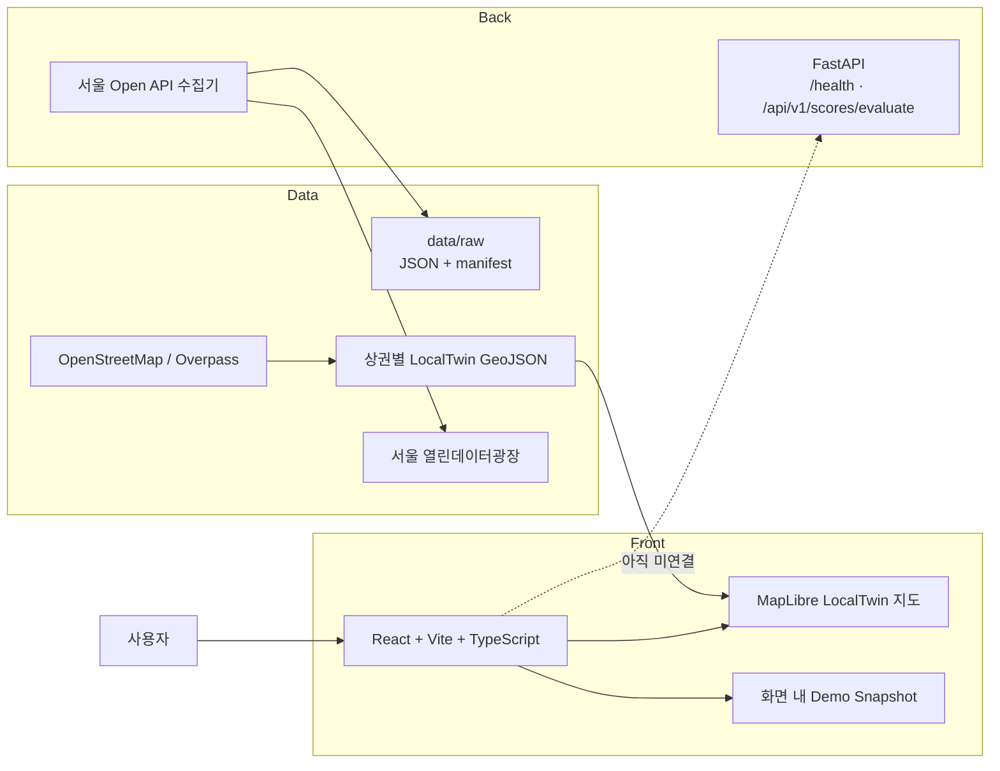
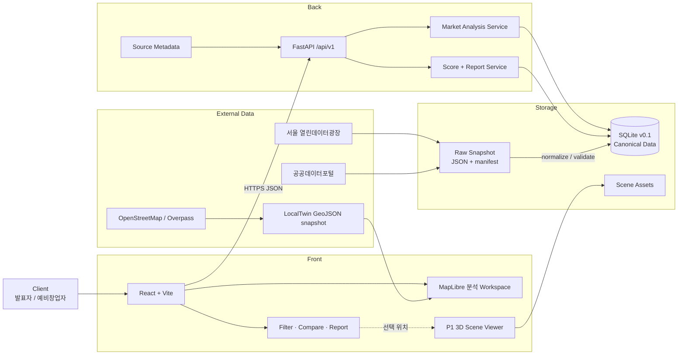

# LocalTwin 시스템 아키텍처

문서 상태: current
최종 갱신: 2026-07-11

이 문서는 LocalTwin의 Front, Back, Data와 외부 서비스가 어떻게 연결되는지 설명하는 아키텍처 원본이다. 구현된 현재 구조와 4주 개발 후 목표 구조를 구분한다.

## 1. 설계 원칙

- 브라우저는 공공데이터 인증키를 직접 사용하지 않는다.
- 원본 데이터, 정규화 데이터와 화면용 응답을 분리한다.
- 상권 분석은 P0, 3D 현장 탐색은 P1로 둔다.
- 4주 프로토타입은 Microservice보다 단일 FastAPI와 SQLite를 우선한다.
- 분석 결과에는 source, period, unit과 method 근거를 함께 제공한다.

## 2. 현재 구현 구조



현재 확인된 상태:

| 영역  | 구현 상태                                                             | 제한                                            |
| ----- | --------------------------------------------------------------------- | ----------------------------------------------- |
| Front | 자체 GeoJSON 지도와 실제 지도를 전환하고 상권·업종·반경·Layer를 조작하는 React 웹 | 분석 수치는 화면용 snapshot과 규칙 기반 demo 값 |
| Back  | FastAPI `/health`와 근거 기반 상권 점수 endpoint                       | 실제 DB 조회와 Front API 연결 미구현             |
| Data  | 서울 Open API 수집 코드, OSM 지도 생성기와 snapshot 저장 규칙            | canonical schema와 DB 적재 미구현                |
| 3D    | 지도 건물과 prefab Layer를 켜고 끄는 시연                             | 실제 Gaussian Splatting scene 미연결            |

## 3. 4주 목표 구조



## 4. 요청과 데이터 흐름

### 4.1 데이터 준비

```text
공식 API/File
-> provider별 raw snapshot과 manifest 저장
-> 주소·좌표·업종·기간 정규화
-> canonical schema 품질 검사
-> SQLite 적재
```

### 4.2 사용자 분석 요청

```text
상권/업종/반경 선택
-> React가 FastAPI 분석 endpoint 호출
-> DB에서 대상 점포와 지표 조회
-> 경쟁·변화·시간대·입지 점수 계산
-> source metadata를 포함한 JSON 응답
-> 지도, 비교표와 리포트 갱신
```

### 4.3 보조 3D 탐색

```text
지도에서 선택 위치 상세보기
-> 익명화된 scene asset 로드
-> 사람 눈높이 탐색
-> 10시 / 13시 / 15시 / 18시 대표 혼잡도 표시
```

## 5. 기술 스택과 도입 시점

| 계층     | 현재 사용                                       | 4주 안에 추가                               | 4주 이후 후보                                   |
| -------- | ----------------------------------------------- | ------------------------------------------- | ----------------------------------------------- |
| Front    | React, Vite, TypeScript, MapLibre, react-map-gl | 실제 API adapter, loading/error/empty state | 대규모 Layer가 필요할 때 deck.gl 검토           |
| Back     | FastAPI, Pydantic Settings, Uvicorn             | `/api/v1` 분석 endpoint와 service 분리      | 부하가 확인된 뒤 worker/cache 검토              |
| Data     | JSON raw snapshot, manifest                     | canonical schema, SQLite                    | 다지역 공간 질의가 필요할 때 PostgreSQL/PostGIS |
| Analysis | 공식 1.0.0 규칙 기반 score API                  | 실제 DB peer 분포와 Front evidence 연결      | 충분한 데이터 이후 예측 모델 검토               |
| 3D       | MapLibre extrusion과 prefab                     | 작은 실제 scene 1개 또는 검증된 대체 데모   | Gaussian Splatting pipeline 고도화              |
| Quality  | pytest, Vitest, TypeScript, lint, 문서 검사     | 평가 script와 시연 smoke test               | 필요 시 E2E 자동화                              |

## 6. 배포 구조

```text
Vercel
  /             React 제품 웹
  /docs/        문서 허브
  /prototype    /로 이동하는 legacy 호환 주소

Local demo runtime
  React -> FastAPI -> SQLite
```

공공데이터 인증키와 수집기는 Vercel 브라우저 bundle에 넣지 않는다. 발표용 배포는 검증된 snapshot을 사용하고, 데이터 갱신은 별도 수집 명령에서 수행한다.

## 7. 이번 구조에서 하지 않는 것

- Eureka, API Gateway, Microservice 분할
- Redis와 Elasticsearch 선도입
- 실시간 영상 스트리밍
- 브라우저에서 provider API 직접 호출
- 4주 안에 PostgreSQL/PostGIS 운영 배포

첨부 예시처럼 Front와 Back의 책임은 분리하되, 프로토타입 규모에 필요하지 않은 분산 시스템 구성은 넣지 않는다.

## 8. 관련 문서

- [4주 개발 백로그](./tasks.md)
- [개발환경](./environment.md)
- [개발 컨벤션](./conventions.md)
- [데이터 소스 매핑](../data/data-source-mapping.md)
- [공공데이터 기반 상권 분석](../features/market-analysis.md)
- [2.5D 상권 지도와 유동인구 Layer](../features/market-map-experience.md)

## 9. 변경 기록

| 날짜       | 변경                                         | 이유                                                       |
| ---------- | -------------------------------------------- | ---------------------------------------------------------- |
| 2026-07-10 | 현재 구조와 4주 목표 구조를 분리해 최초 작성 | 구현된 기능과 계획을 같은 구조도로 오해하지 않게 하기 위해 |
