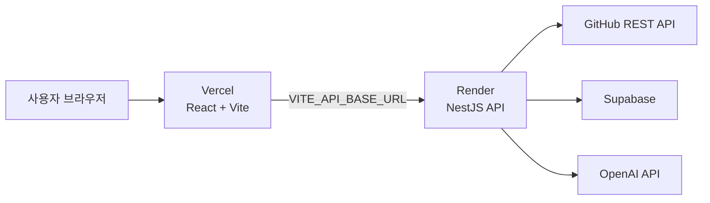

# 배포 구성

PtoP는 프론트엔드와 API를 분리해 배포한다.



## 배포 대상

| 대상 | 플랫폼 | 저장소 설정 |
| --- | --- | --- |
| React + Vite 웹 | Vercel | `vercel.json` |
| NestJS API | Render | `render.yaml` |

## 1. Vercel 연결

1. Vercel에서 GitHub 저장소 `SubJeeLee/hub`를 Import한다.
2. Root Directory는 저장소 루트로 둔다.
3. Framework는 Vite로 선택한다. `vercel.json`이 빌드 명령과 출력 폴더를 지정한다.
4. Production 환경변수를 등록한다.

```text
VITE_SUPABASE_URL=https://<project-ref>.supabase.co
VITE_SUPABASE_PUBLISHABLE_KEY=<publishable-key>
VITE_API_BASE_URL=https://<render-api-host>
```

`VITE_` 변수는 브라우저 번들에 포함되므로 Supabase publishable key 외의 비밀키를 넣으면 안 된다.

## 2. Render 연결

1. Render에서 `New > Blueprint`를 선택한다.
2. GitHub 저장소 `SubJeeLee/hub`를 연결하고 저장소 루트의 `render.yaml`을 선택한다.
3. 생성될 서비스 이름은 `ptop-api`이며, 빌드 후 NestJS API를 실행한다.
4. Render 대시보드에서 `sync: false`로 표시된 환경변수를 입력한다.

```text
WEB_ORIGIN=https://<vercel-project>.vercel.app
SUPABASE_URL=https://<project-ref>.supabase.co
SUPABASE_SECRET_KEY=<server-secret-key>
SUPABASE_JWKS_URL=https://<project-ref>.supabase.co/auth/v1/.well-known/jwks.json
AI_API_KEY=<server-only-ai-key>
AI_MODEL=<selected-model>
GITHUB_TOKEN=<optional-github-token>
```

Render가 발급한 API 주소를 확인한 뒤 Vercel의 `VITE_API_BASE_URL`에 입력한다.

## 3. Supabase와 OAuth 설정

배포 URL이 정해지면 Supabase Auth 설정에 Vercel 주소를 추가한다.

- Site URL: `https://<vercel-project>.vercel.app`
- Redirect URL: `https://<vercel-project>.vercel.app/**`

GitHub OAuth Provider의 callback URL은 Supabase 대시보드가 제공하는 값을 그대로 GitHub OAuth App에 등록한다.

## 4. 연결 확인

API가 먼저 배포된 뒤 아래 요청에서 `200` 응답을 확인한다.

```bash
curl -i https://<render-api-host>/api/v1/health
```

그 다음 Vercel 웹에서 다음 흐름을 확인한다.

1. GitHub 로그인
2. 작업실 입장
3. Repository 분석 시작
4. 분석 중 회고 저장
5. 분석 결과와 회고 반영 확인

## 로컬 빌드 기준

Vite는 Vercel 루트 경로(`/`)를 기준으로 정적 asset을 생성한다.
