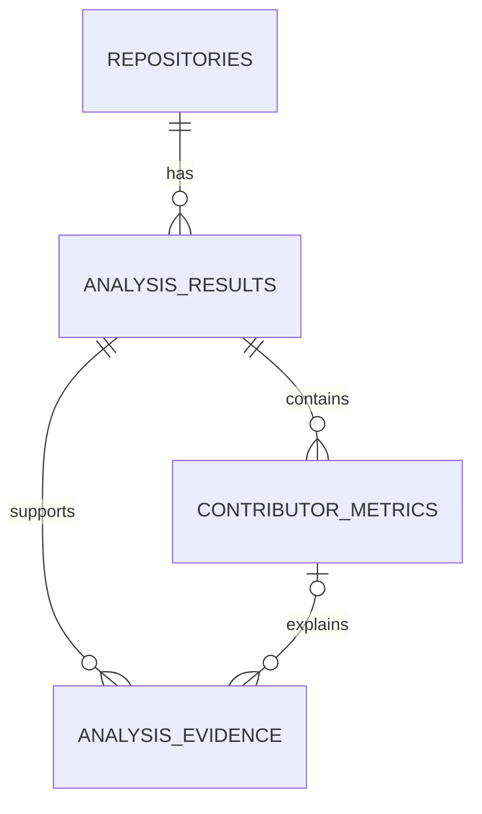

# PtoP Supabase 데이터 모델 설계

## 문서 목적

이 문서는 PtoP의 Repository 분석 결과를 Supabase에 저장하기 전에 데이터의 책임과 관계를 먼저 정리한 설계 초안이다. 아직 Supabase 테이블이나 migration을 생성하지 않으며, 실제 구현 전에 필드와 저장 기준이 서비스 목적에 맞는지 검토하는 데 사용한다.

## 설계 배경

처음에는 수직 슬라이스를 빠르게 완성하기 위해 `analysis_results` 한 테이블에 Repository 정보, 참여자, commit, 기술 스택을 모두 JSONB로 저장하는 방식을 생각했다. 하지만 분석 범위가 넓어질수록 한 행의 크기와 책임이 계속 커지고, 참여자별 조회나 분석 근거 확인도 어려워질 수 있다고 판단했다.

반대로 모든 GitHub 데이터를 각각의 테이블로 세분화하면 아직 검증되지 않은 기능까지 미리 설계하게 된다. 특히 GitHub의 모든 commit, PR, Issue를 그대로 복제하는 것은 PtoP의 목적이 아니며 저장량과 동기화 책임만 늘릴 수 있다.

따라서 현재는 다음 원칙을 선택한다.

- 안정적인 식별 정보와 관계는 일반 컬럼과 관계형 테이블로 관리한다.
- 분석 과정에서 형태가 바뀔 수 있는 요약 정보는 JSONB로 관리한다.
- GitHub 원본 데이터를 전부 복제하지 않고, 결과를 설명하는 데 사용한 근거만 저장한다.
- 같은 결과는 중복 저장하지 않고, 실제 분석 결과가 달라졌을 때만 새로운 스냅샷을 만든다.
- commit 수는 활동량을 보여주는 참고 지표이며 실제 기여도나 작업 난이도로 단정하지 않는다.

## 현재 범위

이번 데이터 모델은 다음 흐름만 지원한다.

1. 사용자가 GitHub Repository URL과 선택적인 GitHub ID를 입력한다.
2. Nest API가 Repository 구조, 기술 스택, 협업 활동을 분석한다.
3. 분석 결과와 참여자별 지표, 결과의 근거를 저장한다.
4. React 화면이 저장된 분석 결과를 조회해 표시한다.
5. 동일한 Repository를 다시 분석할 때 변경 여부를 확인한다.

사용자 인증, 회고 답변, 포트폴리오 초안, 초안 수정 이력은 현재 모델에 포함하지 않는다. 해당 기능은 Repository 분석 흐름이 안정된 뒤 별도 테이블로 설계한다.

## 테이블 구성

현재 단계에서는 다음 네 테이블로 책임을 나눈다.

| 테이블 | 책임 |
| --- | --- |
| `repositories` | GitHub Repository의 안정적인 식별 정보 관리 |
| `analysis_results` | 특정 시점의 Repository 분석 결과 스냅샷 관리 |
| `contributor_metrics` | 분석 시점의 참여자별 활동 지표 관리 |
| `analysis_evidence` | 분석 결과를 설명하는 commit, PR, Issue, 파일 근거 관리 |

## 관계

- 하나의 Repository에는 여러 분석 결과가 존재할 수 있다.
- 하나의 분석 결과에는 여러 참여자 지표와 분석 근거가 포함될 수 있다.
- 분석 근거는 전체 프로젝트를 설명하거나 특정 참여자의 작업을 설명할 수 있다.

## 1. `repositories`

Repository 이름이나 owner가 변경되어도 같은 프로젝트를 식별할 수 있도록 GitHub Repository ID를 기준으로 관리한다.

| 필드 | PostgreSQL 타입 | 필수 | 설명 |
| --- | --- | --- | --- |
| `id` | `uuid` | O | 내부 식별자, DB에서 생성 |
| `github_repository_id` | `bigint` | O | GitHub가 제공하는 Repository 고유 ID |
| `owner` | `text` | O | 현재 Repository owner |
| `name` | `text` | O | 현재 Repository 이름 |
| `url` | `text` | O | GitHub Repository URL |
| `description` | `text` | X | Repository 설명 |
| `default_branch` | `text` | O | 기본 브랜치 |
| `visibility` | `text` | O | `public`, `private`, `internal` 구분 |
| `is_fork` | `boolean` | O | Fork Repository 여부 |
| `is_archived` | `boolean` | O | Archived 여부 |
| `topics` | `text[]` | O | GitHub topics, 기본값은 빈 배열 |
| `license_spdx_id` | `text` | X | 확인 가능한 라이선스 식별자 |
| `homepage_url` | `text` | X | 프로젝트 홈페이지 또는 배포 주소 |
| `github_created_at` | `timestamptz` | O | GitHub에서 Repository가 생성된 시점 |
| `last_pushed_at` | `timestamptz` | X | GitHub에서 마지막 push가 발생한 시점 |
| `created_at` | `timestamptz` | O | PtoP DB에 처음 등록한 시점 |
| `updated_at` | `timestamptz` | O | Repository 기본 정보를 갱신한 시점 |

### 제약 조건

- `github_repository_id`는 unique로 관리한다.
- URL만으로 Repository를 식별하지 않는다. owner나 이름이 변경되면 URL도 달라질 수 있기 때문이다.
- `visibility`는 허용된 값만 저장하도록 check constraint를 적용한다.

## 2. `analysis_results`

한 Repository를 특정 branch와 commit 시점에서 분석한 결과를 스냅샷으로 저장한다. 프로젝트 단위의 요약 정보 중 구조가 자주 바뀔 수 있는 값은 JSONB로 관리한다.

| 필드 | PostgreSQL 타입 | 필수 | 설명 |
| --- | --- | --- | --- |
| `id` | `uuid` | O | 분석 결과 식별자 |
| `repository_id` | `uuid` | O | `repositories.id` 외래 키 |
| `target_github_login` | `text` | X | 사용자가 자신의 활동을 확인하기 위해 선택한 GitHub ID |
| `status` | `text` | O | `pending`, `completed`, `failed` 상태 |
| `analyzed_ref` | `text` | O | 분석한 branch 또는 tag |
| `head_sha` | `text` | O | 분석 시점의 최신 commit SHA |
| `analyzer_version` | `text` | O | 분석 규칙과 결과 형식을 구분하는 버전 |
| `result_hash` | `text` | X | 완료된 결과의 중복 여부를 확인하는 해시 |
| `repository_snapshot` | `jsonb` | O | 분석 당시 설명, 기본 브랜치, 언어 비율 등 |
| `tech_stack` | `jsonb` | O | 언어, 프레임워크, 주요 라이브러리, 실행 환경 요약 |
| `project_structure` | `jsonb` | O | 프로젝트 유형, 주요 디렉터리, entry point, 구조적 특징 |
| `quality_signals` | `jsonb` | O | 테스트, lint, typecheck, CI, 문서화 등 확인된 신호 |
| `collaboration_summary` | `jsonb` | O | PR, Issue, Review, branch, release 활동 요약 |
| `activity_summary` | `jsonb` | O | 분석 범위와 전체 활동량 요약 |
| `warnings` | `jsonb` | O | API 제한, 누락 데이터, 해석상 주의점 |
| `error_code` | `text` | X | 분석 실패를 분류하는 내부 코드 |
| `error_message` | `text` | X | 사용자 또는 개발자가 확인할 실패 원인 |
| `started_at` | `timestamptz` | O | 분석 시작 시점 |
| `analyzed_at` | `timestamptz` | X | 분석 완료 시점 |
| `last_checked_at` | `timestamptz` | O | 같은 Repository에 마지막 분석 요청이 들어온 시점 |
| `created_at` | `timestamptz` | O | 분석 행 생성 시점 |

### JSONB 사용 기준

- JSONB에는 단순 GitHub 원본 응답이 아니라 PtoP가 정리한 분석 결과를 저장한다.
- 화면에서 자주 검색하거나 정렬할 값은 JSONB 안에 숨기지 않고 일반 컬럼으로 분리한다.
- JSONB 구조는 `analyzer_version`과 함께 관리해 분석 로직 변경을 추적한다.
- `warnings`에는 commit 수 기반 활동 비율의 한계와 가져오지 못한 데이터 범위를 포함한다.

## 3. `contributor_metrics`

분석 당시 참여자별 활동 지표를 행 단위로 저장한다. 참여자 목록과 주요 지표를 JSONB 배열로만 저장하면 특정 참여자를 조회하거나 정렬하기 어려우므로 별도 테이블로 분리한다.

| 필드 | PostgreSQL 타입 | 필수 | 설명 |
| --- | --- | --- | --- |
| `id` | `uuid` | O | 참여자 지표 식별자 |
| `analysis_result_id` | `uuid` | O | `analysis_results.id` 외래 키 |
| `github_login` | `text` | O | 참여자 GitHub ID |
| `is_target` | `boolean` | O | 사용자가 선택한 분석 대상 계정인지 여부 |
| `commit_count` | `integer` | O | 분석 범위 안의 commit 수 |
| `commit_activity_percent` | `numeric(5,2)` | O | commit 수 합계 기준 활동 비율 |
| `authored_pr_count` | `integer` | O | 작성한 PR 수 |
| `merged_pr_count` | `integer` | O | merge된 PR 수 |
| `review_count` | `integer` | O | 확인 가능한 Review 수 |
| `issue_count` | `integer` | O | 작성하거나 담당한 Issue 수 |
| `touched_paths` | `jsonb` | O | 자주 변경한 디렉터리와 파일 경로 요약 |
| `touched_extensions` | `jsonb` | O | 주로 변경한 파일 확장자와 횟수 요약 |
| `first_activity_at` | `timestamptz` | X | 분석 범위에서 확인된 첫 활동 시점 |
| `last_activity_at` | `timestamptz` | X | 분석 범위에서 확인된 마지막 활동 시점 |
| `created_at` | `timestamptz` | O | 지표 생성 시점 |

### 제약 조건

- 하나의 분석 결과 안에서 `github_login`은 한 번만 저장한다.
- 모든 count 필드는 0 이상이어야 한다.
- `commit_activity_percent`는 0 이상 100 이하로 제한한다.
- `is_target`은 사용자가 선택한 대상 표시일 뿐, 해당 사용자의 소유권이나 신원을 인증하지 않는다.

## 4. `analysis_evidence`

분석 결과가 어떤 데이터에서 나온 것인지 사용자가 확인할 수 있도록 근거를 저장한다. GitHub의 모든 데이터를 복제하지 않고, 기술 스택·프로젝트 구조·협업 활동·개인 작업 단서를 설명하는 데 실제 사용한 항목만 남긴다.

| 필드 | PostgreSQL 타입 | 필수 | 설명 |
| --- | --- | --- | --- |
| `id` | `uuid` | O | 분석 근거 식별자 |
| `analysis_result_id` | `uuid` | O | `analysis_results.id` 외래 키 |
| `contributor_metric_id` | `uuid` | X | 특정 참여자 근거일 경우 참조 |
| `evidence_type` | `text` | O | `commit`, `pull_request`, `issue`, `file`, `config`, `release` |
| `reference_id` | `text` | X | commit SHA 또는 GitHub 객체 ID |
| `title` | `text` | O | commit message, PR 제목, 파일 설명 등 |
| `url` | `text` | X | GitHub에서 직접 확인할 수 있는 링크 |
| `file_path` | `text` | X | 파일 또는 설정 근거의 Repository 경로 |
| `occurred_at` | `timestamptz` | X | commit, PR, Issue 등이 발생한 시점 |
| `metadata` | `jsonb` | O | 근거 유형별 추가 정보 |
| `created_at` | `timestamptz` | O | 근거 저장 시점 |

### 저장 기준

- 포트폴리오에 활용할 분석 문장을 설명할 수 있는 근거를 우선 저장한다.
- 같은 분석 결과 안에서 동일한 근거가 중복 저장되지 않게 한다.
- 근거가 부족하면 역할을 단정하지 않고 `warnings`에 한계를 표시한다.
- 원본이 삭제되거나 비공개로 변경될 수 있으므로 결과에 사용한 최소 제목과 식별자는 함께 저장한다.

## 동일 결과 처리

같은 Repository를 다시 분석했을 때 결과가 이전과 같다면 새로운 스냅샷을 만들지 않는다.

1. Repository 기본 정보와 분석 대상 데이터를 가져온다.
2. 비교에 사용할 결과를 키 순서와 배열 순서가 일정하도록 정규화한다.
3. 분석 시각처럼 매번 달라지는 값은 제외하고 `result_hash`를 생성한다.
4. 같은 Repository, 분석 대상 GitHub ID, 분석기 버전의 최신 결과와 비교한다.
5. 해시가 같으면 기존 결과의 `last_checked_at`만 갱신하고 기존 결과를 반환한다.
6. 해시가 다르면 새로운 `analysis_results` 스냅샷과 하위 데이터를 저장한다.

`result_hash` 비교에는 최소한 `head_sha`, 기술 스택, 프로젝트 구조, 참여자 지표, 협업 요약을 포함한다. API 응답 순서 때문에 다른 결과로 판단하지 않도록 배열도 안정적인 기준으로 정렬한 뒤 해시를 계산한다.

## 삭제와 갱신 원칙

- `repositories` 정보는 GitHub의 현재 상태에 맞게 갱신할 수 있다.
- `analysis_results`는 과거 분석 시점의 스냅샷이므로 완료 후 내용을 덮어쓰지 않는다.
- 분석 결과를 삭제하면 연결된 `contributor_metrics`와 `analysis_evidence`도 함께 삭제한다.
- Repository 행을 바로 삭제할지는 사용자 인증과 분석 기록 보관 정책을 정한 뒤 결정한다.
- 실패한 분석은 원인을 확인할 수 있도록 `analysis_results`에 남기되 하위 지표와 근거는 생성하지 않는다.

## 주요 조회 시나리오

이 설계는 다음 조회가 복잡한 JSONB 전체 탐색 없이 가능해야 한다.

- Repository URL 또는 GitHub Repository ID로 프로젝트 찾기
- Repository의 가장 최근 성공 분석 결과 조회
- 같은 분석 결과의 전체 참여자 활동 비율 정렬
- 사용자가 선택한 GitHub ID의 활동 지표 조회
- 특정 분석 결과를 설명하는 근거 목록 조회
- 최신 결과와 이전 결과의 `result_hash` 비교

## 이후 확장 방향

Repository 분석 흐름을 먼저 검증한 뒤 다음 데이터를 별도 책임으로 추가한다.

| 확장 기능 | 예상 테이블 | 분리 이유 |
| --- | --- | --- |
| 사용자 인증과 분석 소유권 | `profiles`, `user_analyses` | GitHub ID 선택과 실제 로그인 사용자를 구분해야 함 |
| 분석 중 회고 질문과 답변 | `reflection_sessions`, `reflection_answers` | Repository 근거와 사용자의 개인 경험을 분리해야 함 |
| 포트폴리오 초안과 수정 이력 | `portfolio_drafts`, `draft_revisions` | 생성 결과와 사용자 수정본의 버전을 관리해야 함 |

현재 네 테이블에는 위 데이터를 미리 넣지 않는다. 먼저 `React -> Nest API -> Supabase -> React` 수직 슬라이스에서 Repository 분석 결과가 안정적으로 저장되고 조회되는지 확인한 뒤 확장한다.

## ERD 작성 전 확인할 사항

- GitHub API에서 각 필드의 원천 데이터를 실제로 가져올 수 있는가?
- 공개 Repository만 지원할지, 인증된 비공개 Repository까지 지원할지 결정했는가?
- 분석 대상 기간과 최대 commit, PR, Issue 개수를 어디까지로 제한할 것인가?
- 결과 해시 생성 시 포함할 데이터와 정렬 규칙이 명확한가?
- JSONB 내부 타입이 `@ptop/contracts`와 일치하는가?
- 사용자 인증 도입 전 Supabase RLS를 어떤 방식으로 제한할 것인가?

이 항목을 확인한 뒤 실제 Supabase ERD와 migration을 작성한다.
