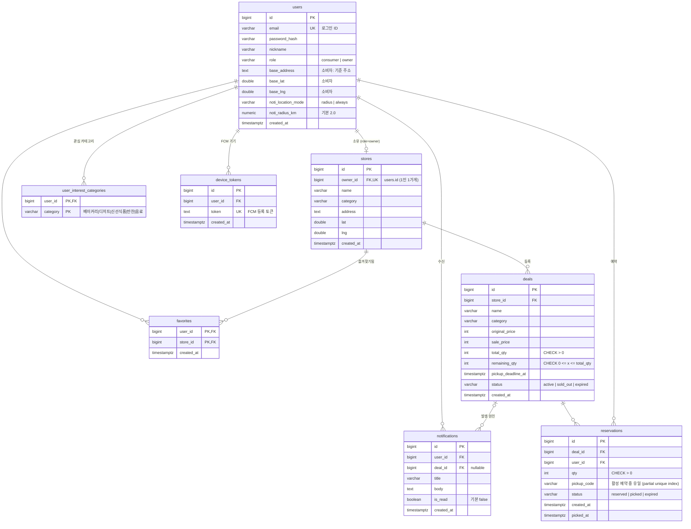

# ERD — 마감할인 MVP

기준: [기획서.md](./기획서.md) §4 데이터 모델 + 회원가입 포함 확장. 네이밍은 `snake_case`(CLAUDE.md 컨벤션).

## 설계 전제

- **단일 users 테이블 + role 구분** — 일반 회원(consumer)과 사장님(owner)은 인증(email+password)이 동일하고, 테이블을 나누면 로그인 시 양쪽 조회·email 유니크 분산·FK 식별자 공간 분리(reservations는 consumer를, stores는 owner를 참조) 문제가 생긴다. 역할별 전용 속성은 소비자용 알림 설정뿐이라 nullable 컬럼으로 흡수한다. "사장님임"은 users의 컬럼이 아니라 **stores와의 관계(내 가게가 있다)로 표현**된다.
- **회원가입 포함** — email + password_hash 기반. 가입 시 역할을 선택하고, 사장님은 가입 후 가게 등록(W1)으로 이어진다.
- **users ↔ stores = 1 : 0..1** — `stores.owner_id → users.id` (FK, `NOT NULL`, `UNIQUE`). 참조는 stores → users 한 방향(자식 → 부모)이며 users는 stores를 모른다. `NOT NULL`이 "모든 가게는 주인 정확히 1명"을, `UNIQUE`가 "1인 1가게(MVP)"를 보장한다. 다점포 확장은 UNIQUE 제거만으로 가능.
- **role 정합성 (확정)** — FK만으로는 `owner_id`가 consumer를 가리키는 것을 막지 못한다. **MVP는 가게 등록 서비스 레이어에서 `role = 'owner'` 검증**으로 처리한다. DB 레벨 강제가 필요해지면 `users UNIQUE(id, role)` + stores에 `owner_role CHECK ('owner')` 컬럼을 두고 복합 FK `(owner_id, owner_role) → users(id, role)`로 강제하는 선택지가 있다(스키마 탁해짐을 감수).
- **위치는 lat/lng 컬럼 + Haversine 쿼리**로 시작, PostGIS 전환 시 geometry 컬럼 추가(Backlog).

## 다이어그램

## 핵심 불변식과 지키는 방법

`deals.remaining_qty = total_qty − Σ(status='reserved'|'picked' 인 reservations.qty)` 이며 항상 `>= 0`.

- 예약: `UPDATE deals SET remaining_qty = remaining_qty - $qty WHERE id = $id AND status = 'active' AND remaining_qty >= $qty` — 영향 행이 0이면 품절 응답. 같은 트랜잭션에서 reservations INSERT.
- 만료(T-14): 예약을 `expired`로 바꾸는 트랜잭션에서 `remaining_qty`를 되돌린다.
- DB 레벨 방어: `CHECK (remaining_qty >= 0)` — 애플리케이션 버그가 있어도 오버셀은 DB가 거부.

## 인덱스 계획

| 대상 | 형태 | 근거 |
|---|---|---|
| deals(status, pickup_deadline_at) | 복합 | 활성 딜 목록·만료 배치 스캔 |
| reservations(pickup_code) WHERE status='reserved' | **partial unique** | 픽업코드는 "활성 예약 중"에서만 유일하면 됨 — 짧은 코드 재사용 가능 |
| reservations(deal_id), favorites(store_id) | 일반 | 예약 수 집계, 알림 대상 판정 역방향 조회 |
| stores(lat, lng) | 일반 → PostGIS GIST(추후) | Haversine 후보군 축소 |

## 회원가입 반영 메모

- 기획서에서 "로그인은 이번 단계 초점 아님"이었으나, **스키마는 회원가입을 포함해 확정**한다(나중에 auth 컬럼을 추가하는 마이그레이션보다 처음부터 두는 편이 싸다).
- 구현 순서는 선택: 시딩 사용자로 핵심 루프를 먼저 시연하고, 회원가입/로그인 API(bcrypt + 세션 또는 JWT)는 별도 Task로 진행한다 — task.md Backlog에 등재.

## 왜 PostgreSQL인가 (Oracle·MySQL 대비)

1. **PostGIS 로드맵** — 기획서 §6이 위치 조회를 "Haversine → PostGIS → Redis 비교"로 명시. 공간 인덱스·함수 생태계는 PostGIS가 가장 성숙하다. Oracle Spatial은 라이선스 비용, MySQL 공간 기능은 상대적으로 빈약.
2. **`UPDATE ... RETURNING`** — 재고 차감과 차감 후 수량 확인을 한 문장으로 처리(원자적 차감 + 응답용 데이터). MySQL에는 없는 문법이라 별도 SELECT가 필요해진다.
3. **partial unique index** — "활성 예약 중에서만 픽업코드 유일" 같은 조건부 제약을 DB가 직접 보장. MySQL은 미지원(트리거/우회 필요).
4. **엄격한 제약 문화** — CHECK 제약이 완전하게 동작(MySQL은 8.0.16 이후에야 실제 검증). 오버셀 방지의 최종 방어선을 DB에 둘 수 있다.
5. **비용/운영** — Oracle은 무료 아님 + 로컬 개발 무거움. PostgreSQL은 무료·docker 한 줄·node `pg` 드라이버 성숙.

단, MySQL(InnoDB)도 원자적 UPDATE·`FOR UPDATE`는 동일하게 가능하므로 동시성만 보면 대안이 된다. 결정타는 PostGIS 로드맵과 2·3번의 개발 편의다.
