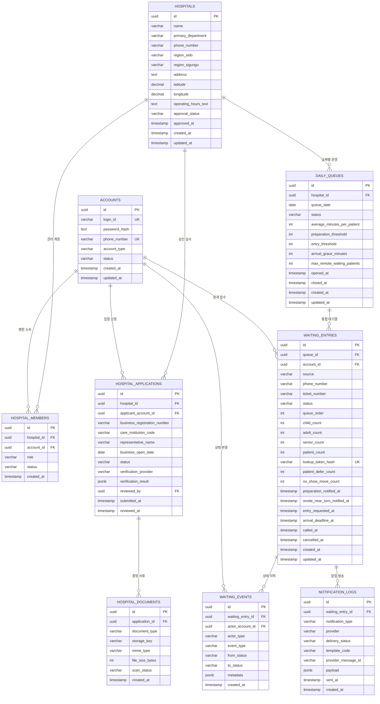

# 바로진료 ERD

## 1. 설계 범위

이 문서는 바로진료 MVP의 데이터 구조와 핵심 제약조건을 정의합니다.

- 환자, 병원 관리자, 플랫폼 관리자의 로그인 계정을 하나의 계정 구조로 관리합니다.
- 환자는 로그인한 경우에만 원격 웨이팅을 등록할 수 있습니다.
- 현장 환자는 회원가입 없이 병원 데스크에서 직원이 웨이팅을 등록합니다.
- 병원별로 날짜마다 하나의 통합 대기열을 운영합니다.
- 원격 환자와 현장 환자는 같은 대기 순서를 사용합니다.
- 가족은 하나의 웨이팅으로 묶되 대기 계산에는 실제 환자 수를 반영합니다.
- 알림톡은 MVP에서 mock provider를 사용하고 발송 결과를 기록합니다.

## 2. ERD 개요



## 3. accounts

환자, 병원 관리자, 플랫폼 관리자의 공통 로그인 계정입니다.

| 컬럼 | 타입 | 제약 | 설명 |
|---|---|---|---|
| `id` | `uuid` | PK | 계정 ID |
| `login_id` | `varchar(50)` | NOT NULL, UNIQUE | 로그인 아이디 |
| `password_hash` | `text` | NOT NULL | 해시된 비밀번호 |
| `phone_number` | `varchar(20)` | NOT NULL, UNIQUE | 알림 수신 전화번호 |
| `account_type` | `varchar(20)` | NOT NULL | `patient`, `hospital_admin`, `platform_admin` |
| `status` | `varchar(20)` | NOT NULL, DEFAULT `active` | `active`, `suspended`, `withdrawn` |
| `created_at` | `timestamp` | NOT NULL | 생성 시각 |
| `updated_at` | `timestamp` | NOT NULL | 수정 시각 |

MVP에서는 아이디와 비밀번호로 로그인합니다. 소셜 로그인은 확장 기능으로 별도 인증 식별자 테이블을 추가합니다.

## 4. hospitals

검색과 웨이팅 운영에 필요한 병원 정보입니다.

| 컬럼 | 타입 | 제약 | 설명 |
|---|---|---|---|
| `id` | `uuid` | PK | 병원 ID |
| `name` | `varchar(100)` | NOT NULL | 병원명 |
| `primary_department` | `varchar(50)` | NOT NULL | 대표 진료과 |
| `phone_number` | `varchar(20)` | NOT NULL | 환자 상담용 전화번호 |
| `region_sido` | `varchar(30)` | NOT NULL | 시/도 검색값 |
| `region_sigungu` | `varchar(30)` | NOT NULL | 시/군/구 검색값 |
| `address` | `text` | NOT NULL | 상세 주소 |
| `latitude` | `decimal(10,7)` | NULL | 확장 지도 기능용 위도 |
| `longitude` | `decimal(10,7)` | NULL | 확장 지도 기능용 경도 |
| `operating_hours_text` | `text` | NOT NULL | 화면 표시용 진료시간 |
| `approval_status` | `varchar(20)` | NOT NULL, DEFAULT `pending` | `pending`, `approved`, `rejected`, `suspended` |
| `approved_at` | `timestamp` | NULL | 승인 시각 |
| `created_at` | `timestamp` | NOT NULL | 생성 시각 |
| `updated_at` | `timestamp` | NOT NULL | 수정 시각 |

MVP에서는 병원 가입 신청과 증빙서류 메타데이터를 mock으로 저장하고 승인 상태를 mock 또는 DB에서 수동 변경합니다. 플랫폼 관리자 승인 화면은 확장 기능으로 둡니다. 승인된 병원만 검색 결과에 노출하고 대기열을 운영할 수 있습니다.

## 5. hospital_members

계정과 병원의 소속 관계를 저장합니다.

| 컬럼 | 타입 | 제약 | 설명 |
|---|---|---|---|
| `id` | `uuid` | PK | 소속 ID |
| `hospital_id` | `uuid` | FK, NOT NULL | 병원 ID |
| `account_id` | `uuid` | FK, NOT NULL | 관리자 계정 ID |
| `role` | `varchar(20)` | NOT NULL | `owner`, `staff`, `viewer` |
| `status` | `varchar(20)` | NOT NULL, DEFAULT `active` | `active`, `inactive` |
| `created_at` | `timestamp` | NOT NULL | 생성 시각 |

- `UNIQUE (hospital_id, account_id)`로 같은 소속의 중복 생성을 막습니다.
- MVP에서는 병원마다 활성 `owner` 한 명만 허용합니다.
- `staff`와 `viewer` 역할은 여러 직원 계정을 지원하는 확장 기능에서 사용합니다.

## 6. hospital_applications

병원 입점 신청과 mock 또는 실제 검증 결과를 저장합니다.

| 컬럼 | 타입 | 제약 | 설명 |
|---|---|---|---|
| `id` | `uuid` | PK | 신청 ID |
| `hospital_id` | `uuid` | FK, NOT NULL | 신청 대상 병원 |
| `applicant_account_id` | `uuid` | FK, NOT NULL | 신청한 병원 관리자 계정 |
| `business_registration_number` | `varchar(20)` | NOT NULL | 사업자등록번호 |
| `care_institution_code` | `varchar(30)` | NOT NULL | 요양기관기호 등 의료기관 식별정보 |
| `representative_name` | `varchar(100)` | NOT NULL | 사업자 진위확인용 대표자명 |
| `business_open_date` | `date` | NOT NULL | 사업자 진위확인용 개업일자 |
| `status` | `varchar(20)` | NOT NULL, DEFAULT `pending` | `pending`, `approved`, `rejected` |
| `verification_provider` | `varchar(30)` | NOT NULL, DEFAULT `mock` | `mock`, `nts`, `hira`, `manual` |
| `verification_result` | `jsonb` | NOT NULL, DEFAULT `{}` | 민감정보를 제외한 검증 결과 요약 |
| `reviewed_by` | `uuid` | FK, NULL | 검토한 플랫폼 관리자 계정 |
| `submitted_at` | `timestamp` | NOT NULL | 신청 시각 |
| `reviewed_at` | `timestamp` | NULL | 승인·거절 시각 |

MVP에서는 입력 형식만 검증하고 `verification_provider = mock`으로 승인 결과를 생성합니다. 실제 국세청·심평원 API 호출과 플랫폼 관리자 심사는 확장 기능으로 둡니다.

## 7. hospital_documents

사업자등록증과 의료기관 개설신고증명서 등 증빙 이미지의 저장 위치와 검수 상태를 관리합니다. 이미지 바이너리를 DB에 직접 넣지 않고 비공개 객체 저장소의 키만 저장합니다.

| 컬럼 | 타입 | 제약 | 설명 |
|---|---|---|---|
| `id` | `uuid` | PK | 문서 ID |
| `application_id` | `uuid` | FK, NOT NULL | 병원 입점 신청 ID |
| `document_type` | `varchar(40)` | NOT NULL | `business_certificate`, `medical_opening_certificate` |
| `storage_key` | `varchar(255)` | NOT NULL, UNIQUE | 비공개 저장소 객체 키. MVP는 mock 경로 |
| `mime_type` | `varchar(100)` | NOT NULL | 허용된 이미지 MIME 타입 |
| `file_size_bytes` | `int` | NOT NULL | 파일 크기 |
| `scan_status` | `varchar(20)` | NOT NULL, DEFAULT `mock_safe` | `pending`, `safe`, `rejected`, `mock_safe` |
| `created_at` | `timestamp` | NOT NULL | 업로드 시각 |

## 8. daily_queues

병원별 하루 1개의 통합 대기열과 해당 날짜의 운영 설정을 저장합니다.

| 컬럼 | 타입 | 제약 | 설명 |
|---|---|---|---|
| `id` | `uuid` | PK | 대기열 ID |
| `hospital_id` | `uuid` | FK, NOT NULL | 병원 ID |
| `queue_date` | `date` | NOT NULL | 대기열 운영일 |
| `status` | `varchar(20)` | NOT NULL | `open`, `paused`, `closed` |
| `average_minutes_per_patient` | `int` | NOT NULL, DEFAULT `10` | 환자 1명당 평균 진료시간 |
| `preparation_threshold` | `int` | NOT NULL, DEFAULT `6` | 준비 알림 기준 순서 |
| `entry_threshold` | `int` | NOT NULL, DEFAULT `4` | 입장 요청 기준 순서 |
| `arrival_grace_minutes` | `int` | NOT NULL, DEFAULT `20` | 입장 요청 후 도착 제한시간 |
| `max_remote_waiting_patients` | `int` | NOT NULL, DEFAULT `20` | 원격으로 받을 수 있는 최대 대기 환자 수 |
| `opened_at` | `timestamp` | NULL | 접수 시작 시각 |
| `closed_at` | `timestamp` | NULL | 운영 종료 시각 |
| `created_at` | `timestamp` | NOT NULL | 생성 시각 |
| `updated_at` | `timestamp` | NOT NULL | 수정 시각 |

제약조건:

- `UNIQUE (hospital_id, queue_date)`로 병원별 하루 1개 대기열만 허용합니다.
- `preparation_threshold > entry_threshold`여야 합니다.
- 평균 진료시간은 5분 단위의 양수여야 합니다.
- 전날 대기 항목은 다음 날 대기열로 이월하지 않습니다.
- `paused`는 신규 원격 접수만 막고 기존 대기 항목과 현장 접수는 계속 처리합니다.
- `closed`는 신규 접수를 모두 막고 남은 환자 처리 후 운영을 종료합니다.
- 원격 접수 한도는 활성 상태인 원격 접수의 실제 환자 수 합계에만 적용합니다.
- 새 가족 접수 인원을 더했을 때 원격 접수 한도를 넘으면 해당 원격 접수를 거절합니다.
- 현장 환자는 원격 접수 한도에 포함하지 않으며 한도에 도달해도 등록할 수 있습니다.
- 병원이 한도를 현재 원격 대기 환자 수보다 낮게 변경해도 기존 접수는 유지하고 신규 원격 접수만 차단합니다.

## 9. waiting_entries

가족 단위 웨이팅과 통합 대기 순서를 저장합니다.

| 컬럼 | 타입 | 제약 | 설명 |
|---|---|---|---|
| `id` | `uuid` | PK | 웨이팅 ID |
| `queue_id` | `uuid` | FK, NOT NULL | 날짜별 대기열 ID |
| `account_id` | `uuid` | FK, NULL | 원격 환자 계정. 현장 접수는 NULL 가능 |
| `source` | `varchar(20)` | NOT NULL | `remote`, `onsite` |
| `phone_number` | `varchar(20)` | NOT NULL | 접수 당시 알림 수신 번호 스냅샷 |
| `ticket_number` | `varchar(30)` | NOT NULL | 환자와 병원이 확인하는 접수번호 |
| `status` | `varchar(30)` | NOT NULL | 현재 웨이팅 상태 |
| `queue_order` | `int` | NOT NULL | 활성 대기열 안의 가족 단위 정렬 순서 |
| `child_count` | `int` | NOT NULL, DEFAULT `0` | 소아 인원수 |
| `adult_count` | `int` | NOT NULL, DEFAULT `0` | 성인 인원수 |
| `senior_count` | `int` | NOT NULL, DEFAULT `0` | 노인 인원수 |
| `patient_count` | `int` | 생성값 | 세 연령대 인원수 합계 |
| `lookup_token_hash` | `varchar(64)` | UNIQUE, NULL | 현장 환자 상태 링크 검증용 토큰 해시 |
| `patient_defer_count` | `int` | NOT NULL, DEFAULT `0` | 환자가 직접 순서를 미룬 횟수 |
| `no_show_move_count` | `int` | NOT NULL, DEFAULT `0` | 차례 도달 시 미도착으로 뒤로 이동한 횟수 |
| `preparation_notified_at` | `timestamp` | NULL | 6번째 준비 알림 시각 |
| `onsite_near_turn_notified_at` | `timestamp` | NULL | 현장 환자의 4번째 진료 임박 알림 시각 |
| `entry_requested_at` | `timestamp` | NULL | 4번째 입장 요청 시각 |
| `arrival_deadline_at` | `timestamp` | NULL | 원격 환자 도착 기한 |
| `called_at` | `timestamp` | NULL | 진료실 호출 시각 |
| `cancelled_at` | `timestamp` | NULL | 취소 시각 |
| `created_at` | `timestamp` | NOT NULL | 접수 시각 |
| `updated_at` | `timestamp` | NOT NULL | 수정 시각 |

상태값:

| 상태 | 의미 | 활성 대기열 포함 |
|---|---|---|
| `remote_waiting` | 원격으로 순서를 기다림 | 포함 |
| `entry_requested` | 병원 입장과 데스크 접수를 요청함 | 포함 |
| `onsite_waiting` | 데스크 접수를 마치고 현장에서 기다림 | 포함 |
| `held` | 병원 직원이 일시 보류함 | 제외 |
| `called` | 진료실 호출로 웨이팅 서비스에서 빠짐 | 제외 |
| `cancelled` | 환자·직원·시스템이 취소함 | 제외 |

제약조건:

- 원격 접수는 `account_id`가 반드시 있어야 합니다.
- 현장 접수는 회원가입 없이 직원이 등록하므로 `account_id`가 없어도 됩니다.
- 소아·성인·노인 인원수는 0 이상이며 `patient_count`는 1명 이상이어야 합니다.
- 한 계정에는 활성 원격 웨이팅을 1건만 허용합니다.
- 활성 대기열 안에서 `(queue_id, queue_order)`는 중복될 수 없습니다.
- 현장 접수는 `onsite_waiting` 상태로 시작합니다.
- 원격 접수는 `remote_waiting` 상태로 시작합니다.
- 환자의 직접 미루기와 차례 도달 시 미도착 이동은 각각 최대 1회만 허용합니다.
- 준비 알림은 상태를 바꾸지 않고 발송 기록만 남깁니다.
- 현장 환자가 4번째에 도달하면 진료 임박 알림을 한 번 발송하며 상태는 바꾸지 않습니다.
- 현장 환자에게는 원격 환자용 입장 요청과 20분 도착 기한을 적용하지 않습니다.
- 입장 요청 기준에 도달하면 `entry_requested`로 바꾸고 20분 기한을 시작합니다.
- 원격 환자의 도착과 데스크 접수는 병원 직원만 `onsite_waiting`으로 변경합니다.
- 보류를 해제할 때 병원 직원이 복귀 순서를 지정하며, 지정하지 않으면 활성 대기열 마지막에 배치합니다.
- 보류 전 순서와 실제 복귀 순서는 `waiting_events.metadata`에 기록합니다.
- 진료실 호출은 진료 완료를 뜻하지 않으며 활성 대기열에서 제외하는 동작입니다.
- `called` 또는 `cancelled`로 종료되면 현장 상태 조회용 `lookup_token_hash`를 즉시 제거합니다.
- 조회 링크만 무효화하고 웨이팅과 상태 변경 이력은 운영 기록으로 유지합니다.

현재 순서와 예상 시간은 저장값이 아니라 조회 시 계산합니다.

```text
앞 대기 환자 수 = queue_order가 앞선 활성 웨이팅의 patient_count 합계
현재 진료 대기 순서 = 앞 대기 환자 수 + 1
예상 대기시간 = 앞 대기 환자 수 × average_minutes_per_patient
```

## 10. waiting_events

웨이팅의 상태 변경과 운영 동작을 감사 이력으로 저장합니다.

| 컬럼 | 타입 | 제약 | 설명 |
|---|---|---|---|
| `id` | `uuid` | PK | 이벤트 ID |
| `waiting_entry_id` | `uuid` | FK, NOT NULL | 대상 웨이팅 ID |
| `actor_account_id` | `uuid` | FK, NULL | 실행 계정. 자동 처리는 NULL |
| `actor_type` | `varchar(20)` | NOT NULL | `patient`, `staff`, `system` |
| `event_type` | `varchar(30)` | NOT NULL | 생성, 입장 요청, 도착, 미루기, 보류, 호출, 취소, 순서 변경 등 |
| `from_status` | `varchar(30)` | NULL | 변경 전 상태 |
| `to_status` | `varchar(30)` | NULL | 변경 후 상태 |
| `metadata` | `jsonb` | NOT NULL, DEFAULT `{}` | 취소 사유, 이전 순서 등 부가정보 |
| `created_at` | `timestamp` | NOT NULL | 발생 시각 |

전화 상담에서 병원이 어떤 방식으로 환자를 확인했는지는 시스템이 강제하거나 기록하지 않습니다. 직원이 취소를 실행했다는 사실과 취소 사유만 저장합니다.

## 11. notification_logs

카카오 알림톡 mock 발송과 향후 실제 중계 API 응답을 같은 구조로 기록합니다.

| 컬럼 | 타입 | 제약 | 설명 |
|---|---|---|---|
| `id` | `uuid` | PK | 알림 ID |
| `waiting_entry_id` | `uuid` | FK, NOT NULL | 대상 웨이팅 ID |
| `notification_type` | `varchar(30)` | NOT NULL | 알림 종류 |
| `provider` | `varchar(30)` | NOT NULL, DEFAULT `mock_kakao` | 발송 provider |
| `delivery_status` | `varchar(20)` | NOT NULL | `pending`, `sent`, `failed` |
| `template_code` | `varchar(50)` | NOT NULL | 알림톡 템플릿 코드 |
| `provider_message_id` | `varchar(100)` | NULL | 중계업체 응답 ID |
| `payload` | `jsonb` | NOT NULL | 비밀값을 제외한 템플릿 변수와 mock 결과 |
| `sent_at` | `timestamp` | NULL | 발송 처리 시각 |
| `created_at` | `timestamp` | NOT NULL | 생성 시각 |

알림 종류:

- `remote_registered`: 원격 웨이팅 등록 완료
- `onsite_registered`: 현장 접수 완료와 상태 조회 링크
- `preparation`: 6번째 도달, 예상 시간과 방문 준비 안내
- `entry_requested`: 4번째 도달, 입장 요청과 20분 기한 안내
- `onsite_near_turn`: 현장 환자 4번째 도달, 대기실 진료 준비 안내
- `cancelled`: 취소 완료 안내
- `called`: 진료실 호출 또는 웨이팅 종료 안내

현장 환자의 알림 링크는 원격 환자 상태 화면에서 직접 취소 버튼만 제거한 화면으로 연결합니다. 병원명, 진료과, 주소, 전화번호, 전화하기 버튼, 접수번호, 현재 순서, 예상 시간, 인원 구성과 현재 상태를 표시합니다.

## 12. 핵심 인덱스

| 테이블 | 인덱스 | 목적 |
|---|---|---|
| `accounts` | `UNIQUE (login_id)` | 아이디 중복 가입 방지 |
| `accounts` | `UNIQUE (phone_number)` | 전화번호당 계정 1개 보장 |
| `hospitals` | `(approval_status, region_sido, region_sigungu)` | 승인 병원의 지역 검색 |
| `hospitals` | `(primary_department)` | 진료과 검색 |
| `hospital_applications` | `(status, submitted_at)` | 미처리 입점 신청 조회 |
| `hospital_documents` | `(application_id, document_type)` | 신청별 증빙 조회 |
| `daily_queues` | `UNIQUE (hospital_id, queue_date)` | 병원별 하루 1개 대기열 보장 |
| `waiting_entries` | `(queue_id, status, queue_order)` | 활성 통합 대기열 조회 |
| `waiting_entries` | `UNIQUE (account_id) WHERE status IN (...)` | 계정당 활성 웨이팅 1건 보장 |
| `waiting_entries` | `UNIQUE (lookup_token_hash)` | 현장 상태 링크 식별 |
| `waiting_events` | `(waiting_entry_id, created_at)` | 웨이팅 상태 이력 조회 |
| `notification_logs` | `(waiting_entry_id, created_at)` | 알림 발송 이력 조회 |

## 13. 확장 기능

- `social_identities`: 카카오·구글 소셜 로그인 연결
- 실제 카카오 알림톡·SMS 중계업체 provider 구현
- 플랫폼 관리자의 병원 신청 조회·승인·거절·이용 중지 화면
- `hospital_verification_checks`: 국세청·심평원·수동 서류 검토별 요청 결과와 처리 이력
- 국세청 사업자등록 진위·휴폐업 상태조회 API 연동
- 심평원 병원정보 API로 병원명·주소·전화번호·종별 교차 확인
- 의료기관 개설신고증명서와 입력 정보의 수동 대조
- 증빙 이미지용 비공개 객체 저장소, 서명 URL, 파일 형식·용량 검사와 악성 파일 검사
- 승인·거절 사유와 플랫폼 관리자 작업 감사 로그
- 승인 후 사업자 휴폐업 및 병원 운영 상태의 정기 재검증
- 검토가 끝난 증빙서류의 보관 기간과 자동 파기 정책
- 병원별 여러 직원 계정과 `owner`, `staff`, `viewer` 권한 적용
- GPS와 지도 API를 이용한 실제 내 주변 병원 검색
- 여러 의사·진료과 대기열과 환자의 간단한 증상 입력
- 실제 처리시간을 이용한 평균 진료시간 자동 보정
- 병원 운영시간과 휴게시간의 구조화
