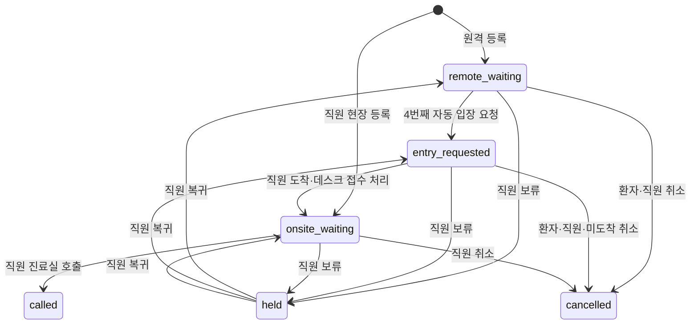

# 바로진료 시스템 기능 명세

이 문서는 [`plan.md`](./plan.md)의 기획을 개발 가능한 규칙으로 구체화합니다. 데이터 구조는 [`erd.md`](./erd.md), 화면 구조는 [`ux-structure.md`](./ux-structure.md), 작업 순서는 [`checklist.md`](./checklist.md)를 기준으로 합니다.

## 1. 목적과 범위

### 1.1 목적

로그인한 환자가 병원에 도착하기 전에 당일 실제 진료 대기열에 참여하고, 병원이 원격 환자와 현장 환자를 하나의 순서로 관리하도록 합니다.

### 1.2 MVP 범위

- 아이디·비밀번호 기반 환자와 병원 관리자 계정
- 병원별 날짜 단위 통합 대기열 1개
- 가족 단위 원격 웨이팅과 직원의 현장 웨이팅 등록
- 실제 환자 수 기반 순서와 예상 시간 계산
- 원격 6번째 준비 알림, 4번째 입장 요청과 20분 기한
- 현장 접수 완료와 4번째 진료 임박 알림
- 카카오 알림톡을 가정한 mock provider와 발송 이력
- 병원 입점 신청, 증빙 이미지 mock 업로드와 mock 승인
- 병원명·지역·대표 진료과 검색과 `내 주변` mock 데이터

### 1.3 제외 범위

- 날짜와 시간을 지정하는 예약 진료
- 진단, 증상 해석, 진료기록과 처방전
- 결제와 보험 처리
- 환자 이름, 생년월일과 증상 수집
- 실제 카카오 알림톡·SMS 발송
- 실제 사업자·의료기관·지도 API
- 여러 의사·진료과별 대기열
- 병원 전산 시스템 연동

## 2. 사용자와 권한

| 역할 | MVP 권한 |
|---|---|
| 환자 | 회원가입·로그인, 병원 검색, 원격 웨이팅 등록, 본인 상태 조회, 1회 미루기, 직접 취소 |
| 병원 관리자 | 병원 입점 신청, 현장 환자 등록, 통합 대기열 조회, 원격 환자 도착 처리, 호출·보류·취소·순서 변경, 운영 설정 |
| 플랫폼 관리자 | 계정 유형과 데이터 구조만 준비. 승인 화면은 P2 |
| 시스템 | 순서·예상 시간 계산, 자동 알림 판정, 미도착 처리, 상태·알림 이력 저장 |

- 환자용과 병원 관리자용 가입·로그인 화면은 분리합니다.
- 로그인 정보는 공통 `accounts` 구조를 사용합니다.
- MVP에서는 병원당 활성 `owner` 한 명만 허용합니다.
- 병원 관리자 API는 해당 병원의 활성 소속 계정만 접근할 수 있습니다.
- 현장 상태 조회 토큰으로 병원 관리자 API나 다른 환자 데이터에 접근할 수 없습니다.

## 3. 계정과 인증

### 3.1 환자 회원가입

- `loginId`, `password`, `phoneNumber`를 받습니다.
- 로그인 아이디와 전화번호는 각각 중복될 수 없습니다.
- 전화번호 하나당 계정 하나만 허용합니다.
- 비밀번호 원문은 저장하거나 로그에 기록하지 않고 해시만 저장합니다.
- MVP 전화번호 인증은 mock 처리합니다.

### 3.2 로그인

- 아이디와 비밀번호가 일치하고 계정 상태가 `active`일 때 인증 세션을 발급합니다.
- 원격 웨이팅 등록, 미루기와 취소는 인증된 환자만 실행할 수 있습니다.
- 카카오·구글 소셜 로그인은 P2에서 별도 인증 식별자를 연결합니다.

### 3.3 활성 원격 웨이팅 제한

- 환자 계정 하나에는 병원과 관계없이 활성 원격 웨이팅을 1건만 허용합니다.
- 활성 상태는 `remote_waiting`, `entry_requested`, `onsite_waiting`입니다.
- `called` 또는 `cancelled`로 종료된 뒤 새 원격 웨이팅을 등록할 수 있습니다.
- 애플리케이션 검증과 DB 부분 UNIQUE 인덱스를 함께 사용합니다.

## 4. 병원 입점과 검색

### 4.1 입점 신청

병원 관리자는 다음 정보를 제출합니다.

- 병원명, 대표 진료과, 주소, 지역, 전화번호와 운영시간
- 사업자등록번호, 대표자명과 개업일자
- 요양기관기호 등 의료기관 식별정보
- 사업자등록증과 의료기관 개설신고증명서 이미지

MVP에서는 입력 형식과 mock 파일 메타데이터만 검증하고 `verificationProvider = mock`으로 승인 결과를 만듭니다. 승인 상태가 `approved`인 병원만 검색 결과에 노출하고 대기열을 열 수 있습니다.

### 4.2 검색

- 병원명, 시·도, 시·군·구와 대표 진료과를 조합해 검색합니다.
- `내 주변` 영역은 MVP에서 미리 준비한 병원 데이터를 보여줍니다.
- 거리 계산, 위치 권한과 지도 API는 P2입니다.

## 5. 날짜별 통합 대기열

### 5.1 생성과 상태

- 병원마다 날짜별 대기열을 하나만 생성할 수 있습니다.
- 운영 상태는 `open`, `paused`, `closed`입니다.
- `paused`에서는 신규 원격 접수만 막고 현장 접수와 기존 대기열 처리는 계속합니다.
- `closed`에서는 신규 접수를 모두 막고 남은 환자를 처리합니다.
- 전날 항목을 다음 날 대기열로 이월하지 않습니다.

### 5.2 기본 설정

| 설정 | 기본값 | 규칙 |
|---|---:|---|
| 평균 진료시간 | 10분 | 5분 단위 양수 |
| 준비 알림 기준 | 6번째 | 입장 요청 기준보다 커야 함 |
| 입장 요청 기준 | 4번째 | 1 이상 |
| 도착 제한시간 | 20분 | 입장 요청부터 계산 |
| 최대 원격 대기 환자 | 20명 | 실제 환자 수 합계 기준 |

- 원격 한도는 활성 원격 접수의 `patientCount` 합계에만 적용합니다.
- 현장 접수는 원격 한도와 관계없이 등록합니다.
- 운영 중 한도를 현재 원격 환자 수보다 낮춰도 기존 접수는 유지하고 신규 원격 접수만 차단합니다.

## 6. 웨이팅 상태

### 6.1 상태 목록

| 상태 | 의미 | 활성 대기열 |
|---|---|---|
| `remote_waiting` | 병원 밖에서 순서를 기다림 | 포함 |
| `entry_requested` | 병원 입장과 데스크 접수를 요청함 | 포함 |
| `onsite_waiting` | 데스크 접수를 마치고 현장에서 기다림 | 포함 |
| `held` | 직원이 일시 보류함 | 제외 |
| `called` | 진료실 호출로 웨이팅 서비스에서 빠짐 | 제외, 종료 |
| `cancelled` | 환자·직원·시스템이 취소함 | 제외, 종료 |

준비 알림과 현장 진료 임박 알림은 상태가 아니라 알림 이벤트입니다.

### 6.2 상태 전환



- `called`와 `cancelled`는 다시 활성 상태로 되돌리지 않습니다.
- 잘못 종료한 항목은 MVP에서 복구하지 않고 새로 접수합니다.
- 원격 환자의 `onsite_waiting` 전환은 병원 직원만 수행합니다.
- 현장 코드와 환자 직접 도착 처리는 사용하지 않습니다.

### 6.3 상태별 동작

| 상태 | 원격 환자 | 현장 환자 링크 | 병원 관리자 |
|---|---|---|---|
| `remote_waiting` | 조회, 1회 미루기, 취소 | 해당 없음 | 보류, 취소, 순서 변경 |
| `entry_requested` | 조회, 1회 미루기, 취소 | 해당 없음 | 도착 처리, 보류, 취소, 순서 변경 |
| `onsite_waiting` | 조회 | 조회만 | 호출, 보류, 취소, 순서 변경 |
| `held` | 조회 | 조회만 | 보류 해제, 취소, 복귀 위치 지정 |
| `called`, `cancelled` | 활성 웨이팅 없음 | 링크 무효 | 이력 조회 |

## 7. 통합 순서와 예상 시간

### 7.1 기본 순서

- 원격과 현장 항목은 같은 `queueOrder` 공간을 사용합니다.
- 새 항목은 활성 대기열 마지막에 추가합니다.
- `held`, `called`, `cancelled`는 순서와 예상 시간 계산에서 제외합니다.
- 순서 변경과 재정렬은 하나의 트랜잭션으로 처리합니다.

### 7.2 환자 수와 표시 순서

```text
patientCount = childCount + adultCount + seniorCount
앞 대기 환자 수 = 앞선 활성 항목들의 patientCount 합계
현재 진료 대기 순서 = 앞 대기 환자 수 + 1
예상 대기시간 = 앞 대기 환자 수 × 평균 진료시간
```

- 가족은 하나의 상태를 공유하지만 진료 분량은 실제 인원수만큼 반영합니다.
- 현재 순서는 가족 중 첫 환자의 위치를 표시합니다.
- 예상 시간에는 `약` 또는 `예상`을 붙이고 진료 상황에 따라 바뀔 수 있음을 안내합니다.

## 8. 접수 규칙

### 8.1 원격 접수

다음 조건을 모두 만족할 때 등록합니다.

- 환자 계정이 로그인 상태입니다.
- 병원과 오늘 대기열이 승인·접수 가능 상태입니다.
- 계정에 다른 활성 원격 웨이팅이 없습니다.
- 가족 실제 인원은 1명 이상 9명 이하입니다.
- 새 가족 인원을 더해도 최대 원격 대기 환자 수를 넘지 않습니다.

전화번호는 계정 정보를 접수 시점에 스냅샷으로 저장합니다. 환자 이름, 생년월일과 증상은 받지 않습니다.

### 8.2 현장 접수

- 병원 직원이 데스크의 정식 접수 후 관리자 화면에서 등록합니다.
- 전화번호와 소아·성인·노인 인원수만 입력합니다.
- 회원가입과 환자 계정 연결은 필수가 아닙니다.
- 초기 상태는 `onsite_waiting`입니다.
- 원격 접수가 일시 중지되거나 한도에 도달해도 현장 접수는 가능합니다.
- 추측하기 어려운 일회성 조회 토큰을 만들고 원문 대신 해시를 저장합니다.

## 9. 자동 알림과 미도착

### 9.1 원격 준비 알림

- 원격 환자의 현재 순서가 준비 기준인 6번째 이하가 되면 한 번 발송합니다.
- 현재 순서와 예상 시간을 포함하고 병원 방문 준비를 안내합니다.
- 상태와 도착 기한은 바꾸지 않습니다.

### 9.2 원격 입장 요청

- 원격 환자의 현재 순서가 입장 기준인 4번째 이하가 되면 발송합니다.
- 상태를 `entry_requested`로 바꾸고 20분 도착 기한을 시작합니다.
- 6번째를 건너뛰고 바로 4번째 이하가 되면 준비 알림은 생략하고 입장 요청만 발송합니다.
- 환자가 직접 미룬 뒤 다시 입장 기준에 도달하면 새 입장 요청을 발송할 수 있습니다.

### 9.3 미도착

- 입장 요청 환자의 차례가 되었는데 도착하지 않으면 대기열 마지막으로 한 번 이동합니다.
- 이 이동은 환자의 직접 미루기 횟수를 소비하지 않습니다.
- 최초 20분 도착 기한은 연장하지 않습니다.
- 기한 안에 직원의 도착 처리가 없으면 시스템이 `cancelled`로 변경합니다.

### 9.4 현장 알림

- 현장 등록 직후 접수 완료와 상태 조회 링크를 발송합니다.
- 현장 환자가 4번째 이하가 되면 대기실에서 진료를 준비하라는 알림을 한 번 발송합니다.
- 현장 환자에게 입장 요청과 20분 도착 기한을 적용하지 않습니다.

### 9.5 MockNotificationProvider

- 모든 알림 요청은 `NotificationProvider` 인터페이스를 통과합니다.
- MVP 구현체는 `MockNotificationProvider`입니다.
- mock provider는 템플릿 코드, 변수, 성공·실패 결과와 발송 시각을 `notification_logs`에 저장합니다.
- 실제 알림톡·SMS 중계업체는 같은 인터페이스의 P2 구현체로 교체합니다.

## 10. 미루기·보류·취소

### 10.1 환자 직접 미루기

- `remote_waiting` 또는 `entry_requested`에서 한 번만 가능합니다.
- 대기열 마지막으로 이동합니다.
- `entry_requested`에서 미루면 `remote_waiting`으로 되돌리고 입장 요청 시각과 도착 기한을 비웁니다.
- 두 번째 요청은 `DEFER_LIMIT_REACHED`를 반환합니다.

### 10.2 직원 보류

- 직원은 종료되지 않은 항목을 `held`로 변경할 수 있습니다.
- 보류 전 상태와 순서를 이력에 저장합니다.
- 보류 해제 시 직원이 복귀 위치를 지정합니다.
- 위치를 지정하지 않으면 활성 대기열 마지막에 배치합니다.

### 10.3 취소

- 원격 환자는 입장 전 상태에서 직접 취소할 수 있습니다.
- 현장 환자 링크에는 취소 버튼을 표시하지 않고 병원 전화번호와 전화하기 동작을 제공합니다.
- 전화 확인 방식은 병원 운영 영역으로 두고 시스템이 강제하지 않습니다.
- 병원 직원은 종료 전 모든 상태를 취소할 수 있습니다.
- 취소 주체, 시각과 사유를 상태 이력에 저장합니다.

## 11. 상태 조회와 링크

### 11.1 원격 환자

- 로그인한 계정의 활성 웨이팅만 조회합니다.
- 다른 계정의 웨이팅 ID나 접수번호로 조회할 수 없습니다.
- 직접 미루기와 취소 버튼은 현재 상태에서 허용될 때만 표시합니다.

### 11.2 현장 환자

- 알림톡의 임의 조회 토큰으로 상태 화면에 접근합니다.
- 원격 환자와 같은 상태 컴포넌트를 사용하지만 직접 미루기·취소 버튼은 숨깁니다.
- 병원명, 대표 진료과, 주소, 전화번호, 전화하기, 접수번호, 가족 인원, 현재 순서와 예상 시간을 보여줍니다.
- `called` 또는 `cancelled`가 되면 조회 토큰 해시를 즉시 제거합니다.
- 웨이팅 이력은 유지하지만 기존 URL에서는 내용을 보여주지 않습니다.

## 12. 개인정보와 파일 보안

- 전화번호는 숫자로 정규화하고 환자 간 화면이나 공개 목록에 노출하지 않습니다.
- 직원 기본 대기열에는 전화번호를 숨기고 선택한 상세 영역에서만 표시합니다.
- 로그에 비밀번호, 전체 전화번호, 원본 조회 토큰과 증빙 이미지 URL을 남기지 않습니다.
- 증빙 이미지 바이너리는 DB에 넣지 않고 비공개 객체 저장소 키만 관리합니다.
- MVP는 mock 저장 경로와 mock 안전 검사 결과를 사용합니다.
- 실제 확장에서는 서명 URL, MIME·크기 검사, 악성 파일 검사, 접근 감사와 자동 파기 정책을 적용합니다.

## 13. 상태 이력과 동시성

모든 상태와 순서 변경에 다음 정보를 기록합니다.

- 웨이팅 ID
- 변경 전·후 상태와 순서
- 변경 주체: 환자, 직원, 시스템
- 동작 종류와 시각
- 취소·보류 등 선택적 사유

동시 변경 규칙:

- 상태 변경에는 버전 또는 갱신 시각 기반 낙관적 잠금을 적용합니다.
- 요청이 최신 상태와 다르면 `QUEUE_CONFLICT`를 반환합니다.
- 상태 변경, 순서 재정렬과 알림 판정은 데이터 정합성이 깨지지 않도록 트랜잭션 경계를 명확히 둡니다.
- 중복 알림은 알림 종류와 발송 시각 필드 또는 고유 제약으로 막습니다.

## 14. API 계약 초안

### 14.1 인증

| 메서드 | 경로 | 역할 |
|---|---|---|
| `POST` | `/api/auth/patients/register` | 환자 회원가입 |
| `POST` | `/api/auth/hospitals/register` | 병원 관리자 계정 생성 |
| `POST` | `/api/auth/login` | 아이디·비밀번호 로그인 |
| `POST` | `/api/auth/logout` | 로그아웃 |
| `GET` | `/api/auth/me` | 현재 계정과 권한 조회 |

### 14.2 환자

| 메서드 | 경로 | 역할 |
|---|---|---|
| `GET` | `/api/hospitals` | 병원명·지역·진료과 검색 |
| `GET` | `/api/hospitals/nearby-mock` | `내 주변` mock 병원 목록 |
| `GET` | `/api/hospitals/:hospitalId` | 병원 상세와 대기 현황 |
| `POST` | `/api/hospitals/:hospitalId/waitings` | 로그인 환자의 원격 웨이팅 등록 |
| `GET` | `/api/me/waiting` | 나의 활성 웨이팅 조회 |
| `POST` | `/api/me/waiting/defer` | 순서 1회 미루기 |
| `POST` | `/api/me/waiting/cancel` | 원격 환자 직접 취소 |
| `GET` | `/api/waitings/status/:lookupToken` | 현장 환자 링크 상태 조회 |

### 14.3 병원 관리자

| 메서드 | 경로 | 역할 |
|---|---|---|
| `POST` | `/api/hospital-applications` | 병원 입점 신청과 mock 증빙 제출 |
| `GET` | `/api/staff/hospitals/:hospitalId/queue` | 오늘의 통합 대기열 조회 |
| `POST` | `/api/staff/hospitals/:hospitalId/queues/open` | 날짜별 대기열 열기 |
| `PATCH` | `/api/staff/hospitals/:hospitalId/queue/settings` | 평균 시간·알림 기준·원격 한도 설정 |
| `POST` | `/api/staff/hospitals/:hospitalId/waitings` | 현장 웨이팅 등록 |
| `PATCH` | `/api/staff/waitings/:waitingId/status` | 도착·호출·보류·취소 처리 |
| `PATCH` | `/api/staff/hospitals/:hospitalId/queue-order` | 순서 변경과 보류 복귀 위치 지정 |
| `GET` | `/api/staff/waitings/:waitingId/history` | 상태와 알림 이력 조회 |

### 14.4 플랫폼 관리자·P2

| 메서드 | 경로 | 역할 |
|---|---|---|
| `GET` | `/api/platform/hospital-applications` | 병원 신청 목록 |
| `PATCH` | `/api/platform/hospital-applications/:id` | 승인·거절 |
| `PATCH` | `/api/platform/hospitals/:id/status` | 병원 이용 중지·복구 |

### 14.5 오류 코드

| 코드 | 의미 |
|---|---|
| `AUTH_REQUIRED` | 로그인이 필요함 |
| `FORBIDDEN` | 해당 역할·병원에 대한 권한이 없음 |
| `LOGIN_ID_TAKEN` | 이미 사용 중인 아이디 |
| `PHONE_NUMBER_TAKEN` | 이미 가입된 전화번호 |
| `HOSPITAL_NOT_APPROVED` | 승인되지 않은 병원 |
| `QUEUE_NOT_OPEN` | 오늘 대기열이 접수 가능하지 않음 |
| `REMOTE_CAPACITY_EXCEEDED` | 최대 원격 대기 환자 수 초과 |
| `DUPLICATE_ACTIVE_WAITING` | 계정에 다른 활성 원격 웨이팅이 있음 |
| `INVALID_PATIENT_COUNTS` | 가족 인원수가 유효하지 않음 |
| `INVALID_TRANSITION` | 현재 상태에서 허용되지 않은 변경 |
| `DEFER_LIMIT_REACHED` | 직접 미루기 1회를 사용함 |
| `ARRIVAL_DEADLINE_EXPIRED` | 20분 도착 기한이 지남 |
| `WAITING_NOT_FOUND` | 활성 웨이팅 또는 조회 토큰을 찾을 수 없음 |
| `STATUS_LINK_INVALID` | 현장 상태 링크가 종료·무효화됨 |
| `QUEUE_CONFLICT` | 다른 요청이 먼저 상태나 순서를 변경함 |

## 15. 우선순위

### P0

- 환자 회원가입·로그인
- 원격 웨이팅 등록과 계정당 활성 1건 제한
- 환자 상태 조회와 실제 인원 기반 계산
- 직원 현장 접수와 통합 대기열
- 자동 준비·입장·현장 알림 mock
- 직원 도착 처리와 진료실 호출

### P1

- 병원 검색과 `내 주변` mock
- 병원 입점 신청·증빙 mock 업로드·mock 승인
- 운영 설정, 미루기, 취소와 미도착 자동 처리
- 보류, 순서 조정, 상태·알림 이력
- 접근성, 반응형과 오류 상태

### P2

- 실제 알림톡·SMS 중계 API
- 소셜 로그인
- 플랫폼 관리자 약식 승인 화면
- 국세청·심평원 검증과 증빙 파일 보안
- 실제 GPS·지도 검색
- 여러 진료과·의사 대기열과 증상 기반 배정
- 병원 전산 연동과 통계

## 16. 완료 조건

1. 환자가 회원가입·로그인 후 원격 웨이팅을 등록합니다.
2. 계정에 활성 웨이팅이 있으면 다른 병원에도 새 원격 접수를 만들 수 없습니다.
3. 가족 3명 접수가 앞선 환자 계산에 3명으로 반영됩니다.
4. 현장과 원격 접수가 날짜별 한 대기열에 순서대로 나타납니다.
5. 6번째 원격 환자에게 준비 알림 mock이 한 번 기록됩니다.
6. 4번째 원격 환자가 `entry_requested`로 바뀌고 20분 기한이 시작됩니다.
7. 6번째를 건너뛴 환자에게는 입장 요청만 발송됩니다.
8. 직원이 원격 환자를 `onsite_waiting`으로 처리할 수 있습니다.
9. 현장 등록 알림의 링크로 상태를 조회하고 직접 취소 버튼은 볼 수 없습니다.
10. 현장 환자가 4번째가 되면 진료 임박 알림 mock이 한 번 기록됩니다.
11. 호출·취소 후 현장 조회 링크가 즉시 무효화됩니다.
12. 입장 요청 후 20분 미도착 환자가 규칙에 따라 이동·취소됩니다.
13. 직원의 보류·복귀·순서 변경 후 모든 순서와 예상 시간이 갱신됩니다.
14. 승인되지 않은 병원은 검색 노출과 대기열 운영을 할 수 없습니다.
15. 다른 환자의 전화번호와 웨이팅 정보가 노출되지 않습니다.

## 17. 시스템 불변 조건

- 하나의 활성 웨이팅은 정확히 하나의 날짜별 대기열에 속합니다.
- `patientCount`는 항상 소아·성인·노인의 합입니다.
- 활성 대기열의 `(queueId, queueOrder)`는 중복되지 않습니다.
- 한 환자 계정의 활성 원격 웨이팅은 최대 1건입니다.
- 종료·보류 상태는 순서와 예상 시간 계산에 포함되지 않습니다.
- 원격 환자만 입장 요청과 도착 기한을 가집니다.
- 접수번호만으로 환자 개인정보를 조회할 수 없습니다.
- 종료된 현장 상태 토큰으로 웨이팅 내용을 조회할 수 없습니다.
- 진료실 호출은 진료 완료나 진료 내용을 기록하지 않습니다.
- 예상 대기 시간은 확정 진료 시각으로 안내하지 않습니다.
