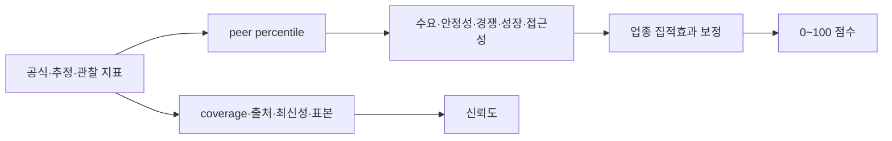

# 기능 스펙: LocalTwin 상권 점수 공식

## 1. 문서 상태

```text
공식 버전: 1.0.0
상태: API 구현
목적: 후보 상권 비교와 근거 설명
비목적: 창업 성공 확률 예측
```

## 2. 판단 원칙

상권 점수는 절대적인 `좋음/나쁨` 판정이 아니다. 같은 기간, 업종, 공간 유형과 반경을 가진 peer group 안에서 상대적인 기회와 위험을 설명한다.



점수와 신뢰도는 반드시 따로 표시한다. 점수가 높아도 근거 coverage가 낮으면 `근거 부족` 상태다.

## 3. Peer Group

백분위는 다음 조건이 같은 비교군에서 계산한다.

```text
기간: 같은 분기
업종: 같은 canonical category
공간 유형: 골목상권 / 발달상권 / 관광특구 등
반경: 100m / 300m / 500m
지역: 데이터가 충분한 최소 행정 범위
```

비교군이 너무 작으면 상위 지역 단위로 넓히고 화면에 실제 peer group을 표시한다. 최소 표본 기준은 metric별로 기록하며 30개 미만이면 신뢰도를 낮춘다.

## 4. 입력 지표

| Component | 기본 가중치 | Metric | 방향 |
| --- | ---: | --- | --- |
| 수요 | 30% | 점포당 추정매출 45%, 유동 수요 35%, 수요 증가율 20% | 높을수록 긍정 |
| 영업 안정성 | 25% | 동일 cohort 생존율 55%, 폐업률 45% | 생존율은 높게, 폐업률은 낮게 |
| 경쟁 적합성 | 20% | 동일 업종 밀도 65%, 업종 다양성 35% | 밀도는 기본적으로 압력, 집적효과 별도 보정 |
| 성장성 | 15% | 매출 증가율 55%, 점포 순증률 45% | 높을수록 긍정 |
| 접근성 | 10% | 대중교통 55%, 보행 접근성 45% | 높을수록 긍정 |

매출은 서울시 상권분석서비스의 `추정매출`이며 실제 세무 매출로 표현하지 않는다. 점포, 개·폐업과 프랜차이즈 정보는 점포 데이터에서 사용한다.

## 5. 정규화와 Component 계산

Metric `m`의 peer percentile을 `p_m`이라고 한다.

```text
높을수록 긍정인 metric: q_m = p_m
낮을수록 긍정인 metric: q_m = 1 - p_m
```

Component `c`는 사용 가능한 metric만 다시 정규화한다.

```text
C_c = 100 × Σ(q_m × w_m) / Σ(w_m)
```

전체 기본점수:

```text
B = Σ(C_c × W_c) / Σ(W_c)
```

누락 지표를 0점으로 처리하지 않는다. 해당 가중치를 제외하고 `data_coverage`와 신뢰도를 낮춘다.

## 6. 특수상권과 업종 집적효과

빵집처럼 같은 업종이 모여 방문 목적지를 형성하는 경우, 동일 업종 수를 무조건 경쟁 감점으로 처리하면 안 된다.

업종 특화 정도는 Location Quotient로 계산한다.

```text
LQ = (지역의 선택 업종 점포 / 지역 전체 점포)
     / (peer의 선택 업종 점포 / peer 전체 점포)
```

최소 5개 점포와 `LQ ≥ 1.25`일 때 특화상권 검사를 시작한다.

### 생산적 집적상권

```text
점포당 매출 percentile ≥ 50
유동 수요 percentile ≥ 55
폐업률 percentile ≤ 60
매출·수요·생존·성장 근거 평균 ≥ 58
```

조건을 만족하면 집적효과 보정 `A`를 최대 `+8점` 적용한다.

### 과포화 상권

```text
LQ가 높음
+ 점포당 매출 percentile < 45
또는 폐업률 percentile > 65
+ 부정 근거 평균 ≥ 58
```

조건을 만족하면 최대 `-8점`을 적용한다. 어느 쪽도 충분히 입증되지 않으면 `특화상권 관찰`로 표시하고 점수를 보정하지 않는다.

최종 점수:

```text
S = clamp(B + A, 0, 100)
```

## 7. 점수 구간

| 점수 | 표시 | 해석 |
| ---: | --- | --- |
| 80~100 | 강한 후보 | 다수 component가 peer보다 강함 |
| 65~79.9 | 유망 후보 | 장점이 위험보다 우세 |
| 50~64.9 | 혼합 신호 | 장점과 위험을 함께 검토 |
| 35~49.9 | 주의 필요 | 약한 component가 뚜렷함 |
| 0~34.9 | 높은 위험 | 여러 위험 신호가 동시 발생 |

이 구간은 성공 확률이 아니다. 같은 조건의 후보지를 정렬하고 근거를 읽기 위한 UI band다.

## 8. 신뢰도

Metric별 근거 강도:

```text
E_m = 0.45 × source reliability
    + 0.35 × freshness
    + 0.20 × sample strength
```

전체 신뢰도:

```text
Confidence = data coverage × weighted mean(E_m) × 100
```

Source reliability 상한:

| Source type | 상한 |
| --- | ---: |
| official | 1.00 |
| official_estimate | 0.90 |
| derived | 0.85 |
| observed | 0.70 |
| fixture | 0.25 |

`60 미만`이면 `insufficient_evidence`로 표시하고 점수를 결론처럼 사용하지 않는다.

## 9. 사용자 설명 구조

화면은 숫자 한 개보다 다음 순서로 설명한다.

```text
총점과 신뢰도
→ Component별 점수와 가중치
→ 강한 근거 2개 / 주의 근거 2개
→ 특수상권 분류와 보정값
→ 출처·기간·단위
→ 누락 지표와 한계
```

API는 `/api/v1/scores/evaluate`에서 `formula_version`, component, cluster, reasons와 limitations를 함께 반환한다.

## 10. 조사 근거

- [서울시 상권분석서비스 점포-상권](https://data.seoul.go.kr/dataList/datasetView.do?currentPageNo=1&infId=OA-15577&serviceKind=1&srvType=A): 점포, 개·폐업, 프랜차이즈 근거
- [서울시 상권분석서비스 추정매출-상권](https://data.seoul.go.kr/dataList/OA-15572/F/1/datasetView.do): 업종별 추정매출 근거
- [Quantifying Retail Agglomeration using Diverse Spatial Data](https://arxiv.org/abs/1612.06441): retail location choice에서 집적효과를 별도로 고려해야 한다는 연구 근거

집적효과 연구의 325m 결과를 LocalTwin의 모든 업종에 인과적으로 적용하지 않는다. 제품의 100m/300m/500m 반경별로 재검증하고, 매출·수요·생존 근거가 동반될 때만 제한된 보정을 적용한다.

## 11. 제한

```text
개별 점포 성공을 예측하지 않는다.
임대료, 좌석 수와 운영자 역량이 없으면 한계로 표시한다.
카드 기반 추정매출을 실제 총매출로 표현하지 않는다.
peer group과 공식 버전이 다른 점수를 직접 비교하지 않는다.
가중치는 평가 fixture와 사용자 연구 후 version을 올려 조정한다.
```

## 12. 관련 문서

- [공공데이터 기반 상권 분석](./market-analysis.md)
- [데이터 소스 매핑](../data/data-source-mapping.md)
- [시스템 아키텍처](../development/architecture.md)
