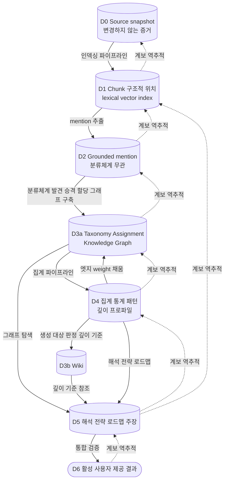
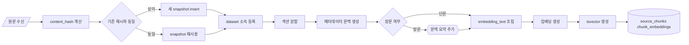

# CareerSignal 지식·저장 구조

## 1. 문서 목적

이 문서는 CareerSignal이 다루는 데이터의 계층, 테이블을 나눈 이유, 지식 그래프, Wiki, 근거 계보의 정의를 담는다. 이 문서는 데이터 구조의 기준 문서이며, 다른 문서는 구조를 다시 설명하지 않고 이 문서를 참조한다.

컬럼의 타입, 기본키, 외래키, 인덱스, 제약은 [ERD](erd.md)가 소유한다. 이 문서의 `text` 블록은 어떤 값이 어느 테이블에 속하는지를 보이는 요약이며 물리 정의가 아니다. 두 문서가 어긋나면 ERD를 따른다.

실행 구조와 버전 활성화는 [아키텍처](architecture.md), 에이전트의 입출력과 검증은 [에이전트 설계](agent-design.md), 요구 분류체계의 발견과 지표 정의는 [통계 모델](statistics-model.md), 자료의 출처와 허용 용도는 [데이터 전략](data-strategy.md)에서 다룬다.

## 2. 데이터 성숙도

데이터는 원본에서 사용자 제공 결과까지 일곱 단계를 거친다. 각 단계는 앞 단계에 대한 계보를 가진다.

| 계층 | 데이터 | 버전 축 | 생산 |
| --- | --- | --- | --- |
| D0 | 변경하지 않는 source snapshot | `dataset_version` | 데이터 수집 에이전트 |
| D1 | source chunk와 구조적 위치, 검색 인덱스 | `dataset_version` | 인덱싱 파이프라인 |
| D2 | 원문에 근거한 mention과 observation | `dataset_version` | 통계 분석 에이전트 |
| D3a | 분류체계, 정규화 할당, 지식 그래프 | `taxonomy_version`, `knowledge_version` | 통계 분석·지식 구축 에이전트 |
| D4 | 집계 통계, 패턴, 깊이 프로파일 | `analysis_version` | 집계 파이프라인 |
| D3b | Wiki | `knowledge_version` | 지식 구축 에이전트 |
| D5 | 해석·전략·로드맵 주장 | `analysis_version` | 해석·전략·로드맵 에이전트 |
| D6 | 활성화된 사용자 제공 결과 | `analysis_version` | 통합 Verifier |

D3a와 D3b는 지식을 정규화하는 같은 성격의 계층이나 생성 순서가 다르다. D3a는 집계의 입력이고, D3b는 집계의 결과를 입력으로 받는다. Wiki의 생성 대상을 통계적 우선순위로 판정하므로 D3b는 D4 뒤에 온다.

지식 그래프는 할당만 있으면 구축할 수 있으므로 D3a에 둔다. 엣지의 `weight`는 통계에서 계산하는 후행 값이며 D4 이후에 채운다. `weight`가 비어 있는 동안 경로 탐색은 가능하고 순위만 정해지지 않는다.

사용자의 체크 상태와 그에 따른 재조합 결과는 데이터 성숙도 계층에 속하지 않는다. 이는 Express가 요청 시점에 계산하는 런타임 결과다.



D0은 변경하지 않는 증거 snapshot이며 시스템 산출물의 최종 계보 기준이다. 출처의 내용이 사실임을 보장하지는 않는다. 출처의 신뢰도와 허용 용도는 별도의 평가로 관리한다.

## 3. D0 원본

원본은 논리적 출처, 내용 snapshot, 관찰 사실, 출처 평가의 네 가지로 나눈다. snapshot의 내용은 변경하지 않으며, 시간이 지나며 달라지는 정보는 별도 테이블에 기록한다.

| 테이블 | 책임 |
| --- | --- |
| `sources` | URL과 발행자로 식별되는 논리적 출처 |
| `source_snapshots` | 특정 시점에 수집한 내용. payload 불변 |
| `source_observations` | 수집 시도와 결과의 append-only 이벤트 |
| `source_assessments` | 자료 계층·허용 용도의 버전별 평가 |

### 3.1 `sources`

```text
source_id
source_type
url
publisher
author
robots_policy
license_note
job_role_ids
company_id
first_seen_at
```

### 3.2 `source_snapshots`

```text
snapshot_id
source_id
content_hash
raw_content
published_at
fetched_at
dataset_version
supersedes_snapshot_id
```

`content_hash`가 같은 내용은 새 snapshot을 만들지 않는다. 내용이 달라지면 새 snapshot을 만들고 `supersedes_snapshot_id`로 이전 snapshot을 가리킨다.

`raw_content`에 대한 `UPDATE`와 `DELETE`는 데이터베이스 트리거로 차단한다. 정정은 새 snapshot 생성으로만 표현한다.

### 3.3 `source_observations`

```text
observation_id
snapshot_id
observed_at
fetch_status
canonical_url
http_status
notes
```

접근할 수 없게 된 자료도 기존 분석의 계보 추적을 위해 snapshot과 관찰 기록을 보존한다.

관찰은 특정 snapshot에 대한 관찰이다. 내용을 한 번도 얻지 못한 출처에는 관찰을 기록하지 않는다. URL을 알지만 내용이 없는 상태는 snapshot이 없는 `sources` 행이 표현하고, 수집 시도와 실패는 실행 궤적의 도구 호출 기록이 담는다.

이 경계가 표의 뜻을 좁게 유지한다. `source_observations`는 자료의 사실을, `tool_calls`는 실행의 사실을 담는다. 출처를 스스로 발견하는 수집 에이전트는 다수의 후보를 시도하므로, 두 표를 합치면 계보 추적용 표가 탐색 기록으로 덮인다.

### 3.4 `source_assessments`

```text
assessment_id
snapshot_id
source_tier
allowed_uses
reliability_score
assessment_version
assessed_at
assessed_by_run_id
```

`source_tier`와 `allowed_uses`의 정의는 [데이터 전략](data-strategy.md)을 따른다. 평가 기준이 바뀌면 새 `assessment_version`으로 다시 평가하고 이전 평가를 보존한다.

### 3.5 공고

```text
postings
  posting_id, source_id, company_id, job_role_id, first_posted_at

posting_versions
  posting_version_id, posting_id, snapshot_id
  title, career_label, edu_label, entry_label
  posted_at, closed_at, dataset_version
```

기업군은 공고 버전의 속성이 아니다. 회사와 기업군의 소속은 `company_cluster_memberships`가 유일한 원천이며, 집계는 실행 봉투의 `as_of_date` 기준으로 소속을 해석한다. 같은 `as_of_date`로 재실행하면 같은 소속을 얻으므로 재현성이 유지된다.

```text
company_cluster_memberships
  company_id, cluster_id, valid_from, valid_to
```

공고의 수정과 마감은 `posting_versions`로 표현한다. 분석의 모집단은 항상 `posting_version` 단위로 센다.

## 4. D1 검색 표현

원문을 검색 단위로 나누고 문맥과 인덱스를 붙인다.



### 4.1 `source_chunks`

```text
chunk_id
snapshot_id
section
ordinal
text
context
embedding_text
tsvector
token_count
dataset_version
```

`context`는 회사, 기업군, 문서 유형, 섹션, 직무, 게시 시점을 담는 구조화 값이며 메타데이터에서 결정적으로 생성한다. 문서 자체의 장기 문맥이 필요한 경우에만 생성 모델로 요약을 덧붙인다.

`embedding_text`는 `context`를 접두로 붙인 문자열이며 임베딩과 키워드 검색의 입력이다. 섹션 정보가 사라진 청크는 필수와 우대를 구분하지 못하므로 문맥을 분리해 보관한다.

### 4.2 `chunk_embeddings`

```text
chunk_id
embedding_model
embedding_dimension
embedding
embedding_version
created_at
```

임베딩을 별도 테이블에 두어 모델을 교체할 때 청크를 다시 만들지 않는다. 여러 임베딩 모델의 비교 평가도 같은 구조로 수행한다.

## 5. D2 근거 기반 mention

공고에 나타난 요구 표현을 분류체계와 무관하게 먼저 추출한다. 분류체계가 확정되기 전에도 원문 근거는 확보할 수 있으며, 새 표현을 기존 분류에 강제로 넣지 않는다.

```text
requirement_mentions
  mention_id
  posting_version_id
  snapshot_id
  chunk_id
  raw_expression
  evidence_span_start
  evidence_span_end
  stated_requiredness
  section
  extraction_confidence
  extraction_run_id
  dataset_version
```

`stated_requiredness`는 공고가 사용한 표현을 그대로 담는다. 필수·우대·주요업무의 판정은 원문 라벨을 따르고 해석하지 않는다.

`raw_expression`은 원문 문장의 부분 문자열이며 `evidence_span_start`와 `evidence_span_end`로 위치를 고정한다. 위치가 원문과 일치하지 않는 mention은 검증에서 폐기한다.

## 6. D3a 분류체계와 할당

### 6.1 할당

```text
posting_requirement_assignments
  assignment_id
  mention_id
  taxonomy_version_id
  dimension_id
  normalized_label
  depth_level
  assignment_confidence
  assignment_method
  verifier_status
```

집계의 키는 `dimension_id`와 `taxonomy_version_id`다. 분류체계 버전이 바뀌면 해당 데이터셋의 mention 전체를 다시 할당한다.

`depth_level`은 `foundation`, `application`, `tradeoff` 중 하나다. 정의는 8장을 따른다.

### 6.2 분류체계 테이블

```text
requirement_taxonomies            직무별 분류체계
requirement_taxonomy_versions     버전과 발행 시점
requirement_dimensions            차원 정체성
requirement_dimension_versions    버전별 정의 라벨 상태
requirement_aliases               별칭
requirement_dimension_relations   broader narrower related
requirement_candidates            승격 전 후보
requirement_candidate_mentions    후보의 근거 mention
requirement_candidate_decisions   승격 결정 기록
capabilities                      역량
capability_dimension_links        차원과 역량 연결
standards                         외부 표준 항목
```

`requirement_dimension_versions`는 외부 표준 연결을 상태로 관리한다.

```text
internal_canonical_label
display_label
standard_mapping_status     exact | broader | narrower | related | unmapped
standard_id
mapping_confidence
mapping_evidence
review_status
role_boundary_eligible
```

발견된 시장 어휘를 외부 표준 용어로 치환하지 않는다. 표준은 직무 간 비교의 기준점으로 연결하고, 연결의 성격을 `standard_mapping_status`로 표시한다.

차원 후보의 발견, 관계 판정, 승격 절차는 [통계 모델](statistics-model.md)에서 정의한다.

## 7. D3a 지식 그래프

그래프는 두 개의 논리 층으로 나눈다. 하나는 직무 지식의 연결을 표현하고, 다른 하나는 산출물이 만들어진 경로를 표현한다. 두 층은 같은 노드·엣지 테이블에 `graph_layer` 속성으로 구분해 저장한다.

### 7.1 Semantic Knowledge Graph

정규화가 끝난 도메인 관계를 표현한다. 생성 시점에 따라 두 묶음으로 나눈다.

#### 7.1.1 사전 semantic

D3a에서 지식 구축 에이전트가 생성한다. 해석·전략·로드맵 에이전트의 탐색 입력이다.

| 노드 유형 | 참조 |
| --- | --- |
| `JobRole` | `job_roles` |
| `Posting` | `postings` |
| `Company` | `companies` |
| `CompanyCluster` | `company_clusters` |
| `RequirementDimension` | `requirement_dimensions` |
| `Capability` | `capabilities` |
| `Technology` | `requirement_dimensions` 중 기술 유형 |
| `Standard` | `standards` |

| 엣지 유형 | 방향 |
| --- | --- |
| `POSTED_BY` | Posting → Company |
| `BELONGS_TO_CLUSTER` | Company → CompanyCluster |
| `REQUIRES` | Posting → RequirementDimension |
| `REQUIRES_CAPABILITY` | RequirementDimension → Capability |
| `MAPS_TO_STANDARD` | Capability → Standard |
| `PREREQUISITE_OF` | Capability → Capability |

`BELONGS_TO_CLUSTER`는 `company_cluster_memberships`에서 파생한 투영이다. 엣지의 `valid_from`과 `valid_to`는 membership의 값을 그대로 옮긴다.

#### 7.1.2 사후 semantic

D5 산출물이 저장될 때 계보 기록 파이프라인이 생성한다.

| 노드 유형 | 참조 |
| --- | --- |
| `ProofArtifact` | `checklist_items` 중 증명 산출물 유형 |
| `Channel` | 포트폴리오·자소서·면접의 고정 목록 |
| `LearningResource` | `study_tracks` |
| `Project` | `roadmap_items` |

| 엣지 유형 | 방향 |
| --- | --- |
| `PROVEN_BY` | Capability → ProofArtifact |
| `USED_IN_CHANNEL` | ProofArtifact → Channel |
| `TEACHES` | LearningResource → Capability |

사후 semantic은 이를 생성한 에이전트의 같은 실행 안에서는 사용할 수 없다. 전략 에이전트는 `ProofArtifact`를 만드는 주체이므로 `PROVEN_BY`를 탐색 입력으로 받지 않는다. 이 묶음은 화면의 근거 경로 표시와 다음 분석 버전의 탐색에 사용한다.

### 7.2 Provenance Lineage Graph

산출물의 생성 경로를 표현한다. 계보 기록 파이프라인이 각 계층의 산출물이 저장될 때 결정적으로 기록한다. 판단이 개입하지 않으므로 에이전트가 쓰지 않는다.

이 층의 엣지는 관계형 테이블에서 빌드한 파생 표현이다. 주장과 근거의 원천은 `analysis_claim_evidence`이며 `SUPPORTED_BY`와 `CONTRADICTED_BY`는 이 테이블에서 만든다. 검증의 근거 위치 검사와 근거 함의 검사는 엣지가 아니라 테이블을 검사한다. 엣지에서 테이블로 향하는 역방향 갱신은 없다. `graph_paths`가 `knowledge_edges`에 대해 갖는 지위와 같다.

| 노드 유형 | 참조 |
| --- | --- |
| `SourceSnapshot` | `source_snapshots` |
| `Chunk` | `source_chunks` |
| `RequirementMention` | `requirement_mentions` |
| `Assignment` | `posting_requirement_assignments` |
| `StatisticFact` | `statistics_facts` |
| `AnalysisClaim` | `analysis_claims` |
| `ChecklistItem` | `checklist_items` |
| `RoadmapItem` | `roadmap_items` |
| `AnalysisOutput` | `analysis_outputs` |
| `AgentRun` | `agent_runs` |

| 엣지 유형 | 방향 |
| --- | --- |
| `PART_OF` | Chunk → SourceSnapshot |
| `EVIDENCED_BY` | RequirementMention → Chunk |
| `ASSIGNED_TO` | RequirementMention → RequirementDimension |
| `COMPUTED_FROM` | StatisticFact → Assignment |
| `SUPPORTED_BY` | AnalysisClaim → Chunk 또는 StatisticFact |
| `CONTRADICTED_BY` | AnalysisClaim → Chunk |
| `DERIVED_FROM` | ChecklistItem → AnalysisClaim |
| `FILLS` | RoadmapItem → ChecklistItem |
| `PRODUCED_BY` | AnalysisOutput → AgentRun |

원문 표현에서 차원으로 이어지는 정규화는 계보이므로 `ASSIGNED_TO`로 Provenance 층에 기록한다. Semantic 층에는 정규화가 끝난 관계만 넣는다.

### 7.3 층별 생성 주체와 시점

| 묶음 | 생성 | 시점 | 진실의 원천 |
| --- | --- | --- | --- |
| 사전 semantic | 지식 구축 에이전트 | D3a | `knowledge_edges` |
| 사후 semantic | 계보 기록 파이프라인 | D5 산출물 저장 직후 | 산출물 정규 테이블 |
| Provenance | 계보 기록 파이프라인 | 각 계층 산출물 저장 직후 | 산출물 정규 테이블 |

Provenance 엣지와 사후 semantic 엣지는 정규 테이블의 외래키를 그래프 표현으로 옮긴 것이다. `analysis_claim_evidence`와 `SUPPORTED_BY`가 같은 사실을 담을 때 진실의 원천은 `analysis_claim_evidence`이며, 엣지는 경로 탐색을 위한 파생 표현이다. 두 값이 어긋나면 검증에서 엣지를 폐기하고 다시 기록한다.

### 7.4 노드·엣지 테이블

```text
knowledge_nodes
  node_id, graph_layer, node_type, ref_table, ref_id, label
  ontology_version, dataset_version, taxonomy_version, analysis_version

knowledge_edges
  edge_id, graph_layer, edge_type, src_node_id, dst_node_id
  weight, evidence_id, produced_by_run_id, verification_status
  ontology_version, dataset_version, taxonomy_version, analysis_version
  valid_from, valid_to
```

노드와 엣지의 유형은 `ontology_versions`에 등록한 목록으로 제한한다. 등록되지 않은 유형과 허용되지 않은 연결은 검증에서 폐기한다.

```text
ontology_versions
  ontology_version, graph_layer            복합 기본키
  node_types, edge_types, allowed_connections
  required_evidence_by_edge_type, effective_from
```

`knowledge_nodes`와 `knowledge_edges`는 `(ontology_version, graph_layer)` 두 컬럼으로 이 표를 참조한다.

`taxonomy_version`은 nullable이다. 분류체계에 의존하는 노드·엣지만 채우고 나머지는 null로 둔다.

| 구분 | 노드 | 엣지 |
| --- | --- | --- |
| 의존 | `RequirementDimension`, `Technology` | `REQUIRES`, `REQUIRES_CAPABILITY`, `ASSIGNED_TO` |
| 독립 | 그 외 전부 | `POSTED_BY`, `BELONGS_TO_CLUSTER`, `MAPS_TO_STANDARD`, `PREREQUISITE_OF`, `PROVEN_BY`, `USED_IN_CHANNEL`, `TEACHES`, `PART_OF`, `EVIDENCED_BY`, `COMPUTED_FROM`, `SUPPORTED_BY`, `CONTRADICTED_BY`, `DERIVED_FROM`, `FILLS`, `PRODUCED_BY` |

분류체계 버전을 발행하면 의존 노드·엣지를 재구축한다. 이 규칙이 있어야 `graph_paths`의 네 버전 캐시 키가 실제 의존 관계와 일치한다.

`weight`는 통계 지표에서 계산한 값을 담아 경로 순위 계산에 사용한다.

### 7.5 `graph_paths`

```text
graph_paths
  path_id, path_type, node_sequence, edge_sequence
  taxonomy_version, knowledge_version, analysis_version, graph_policy_version
  computed_at
```

`graph_paths`는 자주 조회하는 경로의 캐시다. 진실의 원천은 `knowledge_edges`이며 경로는 버전이 고정된 엣지에서 계산한다. 네 개의 버전이 캐시 키에 포함되므로 분류체계나 분석 버전이 바뀌면 이전 경로를 재사용하지 않는다.

### 7.6 근거 경로

로드맵 항목에서 공고 원문까지의 경로는 두 층을 잇는 계보다.

```text
RoadmapItem
  → FILLS → ChecklistItem
  → DERIVED_FROM → AnalysisClaim
  → SUPPORTED_BY → StatisticFact
  → COMPUTED_FROM → Assignment
  → ASSIGNED_TO 역방향 → RequirementMention
  → EVIDENCED_BY → Chunk
  → PART_OF → SourceSnapshot
```

## 8. D3b Wiki

### 8.1 책임

Wiki는 역량을 어느 깊이까지 다뤄야 하는지의 기준을 정의한다. 통계는 무엇을 얼마나 자주 요구하는지, 지식 그래프는 개념이 어떻게 연결되는지, 청크는 원문에 무엇이 적혀 있는지를 담당한다. 깊이의 기준은 여러 자료를 종합해야 얻어지며 Wiki가 이를 담당한다.

Wiki는 개별 공고를 복제하지 않는다. 공고 원문은 D0에 있다.

### 8.2 깊이 등급

| 등급 | 의미 |
| --- | --- |
| `foundation` | 개념·용어·기본 작동 원리를 이해한다 |
| `application` | 코드·도구·프로젝트에 적용한다 |
| `tradeoff` | 설계 선택, 트레이드오프, 장애·운영 상황을 설명한다 |

등급의 구조는 직무와 무관하게 고정한다. 각 등급의 판정 기준 문장은 직무별로 발견하고 버전으로 관리한다.

### 8.3 테이블

```text
wiki_pages
  page_id, capability_id, knowledge_version, status

wiki_revisions
  revision_id, page_id
  definition, why_required
  depth_criteria, prerequisites
  common_misconceptions, interview_verification, learning_sequence
  created_at, produced_by_run_id

wiki_evidence
  revision_id, field_name, chunk_id, source_tier
```

모든 필드는 `wiki_evidence`에 근거를 가진다. 근거가 없는 필드는 저장하지 않는다.

### 8.4 생성 조건

```text
활성 capability
AND 필수 필드의 근거 충족
AND (통계적 우선순위 상위 OR research_request 존재)
```

모든 역량에 대해 Wiki를 만들지 않는다. 생성 조건은 통계 결과와 조사 요청으로 판정하며 하위 산출물의 참조 여부를 조건으로 사용하지 않는다.

### 8.5 필드별 허용 근거

| 필드 | 허용 근거 |
| --- | --- |
| `definition` | 공공 표준, 공식 문서 |
| `why_required` | 채용공고 통계, 회사 공식 자료 |
| `depth_criteria` | 공공 표준, 회사 공식 자료, 검증된 외부 전문가 자료 |
| `prerequisites` | 공공 표준, 공식 학습 자료 |
| `common_misconceptions` | 검증된 외부 전문가 자료 |
| `interview_verification` | 검증된 외부 전문가 자료 |
| `learning_sequence` | 공식 학습 자료, 검증된 실무 자료 |

자료 계층은 품질의 단일 순서가 아니라 허용 용도의 구분이다. 외부 전문가 자료는 준비 방법과 면접 관점에 사용하고 기업의 요구사항 집계에 사용하지 않는다.

### 8.6 기대 깊이

특정 직무·대상군·기업군·기간에서 실제로 기대되는 깊이는 Wiki의 고정 속성이 아니라 분석 산출물이다. `capability_depth_profiles`는 D4 계층에 속하며 집계 파이프라인이 `depth_distribution` 지표에서 생성한다. Wiki가 참조하는 입력이므로 정의를 이 장에 둔다.

```text
capability_depth_profiles
  profile_id, capability_id, taxonomy_version_id
  scope_level, scope_id, entry_segment, period_id
  depth_distribution, expected_depth
  sample_size, evidence_support, confidence
  analysis_version_id
```

Wiki는 각 깊이 등급이 무엇을 의미하는지를 저장하고, `capability_depth_profiles`는 어느 등급이 기대되는지를 저장한다.

## 9. D4·D5 분석 산출물

```text
analysis_versions
  analysis_version, job_role_id, dataset_version
  taxonomy_version, knowledge_version
  model_version, prompt_version, retrieval_policy_version, metric_policy_version
  scope_spec, status, tokens, cost, started_at, ended_at

active_analysis_versions
  job_role_id, analysis_version, activated_at

analysis_outputs
  output_id, analysis_version, job_role_id
  scope_level, scope_id, output_type, payload
  verification_status, generated_at

statistics_facts
  fact_id, analysis_version, metric_family, metric_policy_version
  scope_level, scope_id, period_id
  dimension_id, secondary_dimension_id
  measure, numerator, denominator, value
  sample_size, sample_status, uncertainty

analysis_claims
  claim_id, analysis_version, output_id
  claim_type, scope_level, scope_id
  claim_text, structured_slots
  confidence, confidence_components, verification_status

analysis_claim_evidence
  claim_id, support_type, support_id, relation, weight

coverage_assertions
  assertion_id, analysis_version, scope_level, scope_id
  dimension_id, population_n, checked_n, matched_n
  assertion, coverage_complete
```

`analysis_outputs.payload`는 화면 계약 형태의 JSONB다. 검증·검색·연결에 필요한 값은 정규 테이블에 함께 저장한다.

`coverage_assertions`는 편차 없음 주장의 근거다. `coverage_complete`가 참이 아니면 편차 없음을 출력하지 않고 판단 근거 부족을 출력한다.

### 9.1 체크리스트와 로드맵

```text
checklist_concepts
  concept_id, job_role_id, canonical_title, kind

checklist_items
  item_id, concept_id, analysis_version
  scope_level, scope_id, title, subtitle
  reason, evidence_needed, channels, required

checklist_item_mappings
  from_item_id, to_item_id, relation, analysis_version

roadmap_items
  roadmap_item_id, analysis_version, scope_level, scope_id
  step_order, phase_label, weeks, priority
  title, body, deliverable, reason, tags

roadmap_item_fills
  roadmap_item_id, concept_id, fill_kind

study_tracks
  track_id, analysis_version, scope_level, scope_id
  capability_id, phase_label, priority, depth_reference
```

사용자의 체크 상태는 `checklist_concept_id`에 연결한다. 분석 버전이 바뀌어 문구가 달라져도 개념 식별자가 유지되므로 체크 상태가 잘못된 항목에 붙지 않는다. 개념의 분리·통합은 `checklist_item_mappings`로 표현한다.

## 10. 지표와 화면 정책

```text
metric_templates
  metric_family, formula_version, input_arity, output_unit

metric_template_parameters
  metric_family, parameter_name, parameter_type, required

metric_policy_versions
  metric_family, formula_version, minimum_n
  suppression_policy, uncertainty_method, effective_from

dimension_metric_applicability
  taxonomy_version_id, dimension_id, metric_family, applicable, reason

screen_block_templates
  block_id, block_name, block_order, job_role_agnostic

screen_block_metric_bindings
  block_id, metric_family, measure, presentation_role
```

지표 family의 수식, 적용 대상, 표본 상태 판정은 [통계 모델](statistics-model.md)에서 정의한다.

## 11. 계측

```text
retrieval_runs
  retrieval_run_id, analysis_version, agent_name, agent_run_id, started_at

retrieval_queries
  query_id, retrieval_run_id, subquery_type, query_text, strategy, filters

retrieval_candidates
  candidate_id, query_id, target_type, target_id
  strategy, strategy_rank
  lexical_score, vector_score, graph_score, fusion_score, rerank_score
  selected, rejection_reason

evidence_sets
  evidence_set_id, retrieval_run_id, objective_id, optimization_policy_version

evidence_set_members
  evidence_set_id, candidate_id, slot_name

evidence_usages
  usage_id, candidate_id, used_claim_id
  usage_type, recorded_at

agent_runs
  agent_run_id, analysis_version, agent_name, objective_id
  iteration, stop_reason, tokens, cost, started_at, ended_at

agent_run_steps
  step_id, agent_run_id, step_name, autonomy_level, started_at, ended_at

tool_calls
  call_id, agent_run_id, tool_name, arguments, latency, error

research_requests
  request_id, requested_by_run_id, analysis_version
  goal, needed_evidence_type, scope_level, scope_id
  status, priority, fulfilled_by_snapshot_ids, created_at, resolved_at

verification_results
  result_id, analysis_version, target_type, target_id
  check_name, autonomy_level, verdict, severity
  reason_code, repair_action, judge_model, detail

repair_orders
  order_id, agent_run_id, target_claim_id
  failed_check, reason, action, missing_evidence, requery_hint, round

saturation_observations
  observation_id, analysis_version, job_role_id, scope_id
  posting_count, new_candidate_count, cumulative_dimension_count
  marginal_gain, observed_at
```

`evidence_usages.usage_type`은 다음 값을 가진다.

```text
supports_claim
contradicts_claim
verification_only
normalization
planning
coverage_check
unused
```

검색된 자료는 최종 인용 외에도 반례 검사, 용어 정규화, 다음 검색 계획, 부재 확인에 기여한다. 사용 목적을 구분해 기록해야 검색 전략별 기여도를 계산할 수 있다.

`used_claim_id`는 nullable이다. `usage_type`이 `planning`, `normalization`, `coverage_check`, `verification_only`, `unused`인 경우 대상 주장이 없다.

## 12. 평가

```text
evaluation_sets
  eval_set_id, job_role_id, source_file, loaded_at

evaluation_cases
  case_id, eval_set_id, posting_id, case_type

evaluation_expected_items
  expected_id, case_id, expected_field, expected_value, rubric

evaluation_runs
  eval_run_id, eval_set_id, analysis_version, started_at

evaluation_metrics
  eval_run_id, metric_name, value

evaluation_failures
  failure_id, eval_run_id, case_id, expected_id, observed_value, reason
```

평가 세트의 원본은 `docs/eval/`의 JSON 파일이며 사람이 확정한다. 데이터베이스는 평가 실행과 결과 비교에 사용한다.

평가 세트의 기대 차원은 분류체계 버전과 독립적인 사람 기준이며, 차원 승격 심사의 채점 기준이 된다.

## 13. 접근 권한

### 13.1 에이전트별 쓰기 범위

| 구성요소 | 쓰기 가능 테이블 |
| --- | --- |
| 데이터 수집 에이전트 | `sources`, `source_snapshots`, `source_observations`, `source_assessments` |
| 지식 구축 에이전트 | `knowledge_nodes`·`knowledge_edges`의 사전 semantic 묶음, `wiki_pages`, `wiki_revisions`, `wiki_evidence` |
| 통계 분석 에이전트 | `requirement_mentions`, `requirement_candidates`, `requirement_candidate_mentions`, `requirement_candidate_decisions`, `posting_requirement_assignments`, `saturation_observations` |
| 채용공고 해석 에이전트 | `analysis_claims`, `analysis_claim_evidence`, `coverage_assertions`, `analysis_outputs` |
| 합격 전략 에이전트 | `checklist_concepts`, `checklist_items`, `checklist_item_mappings`, `analysis_outputs` |
| 준비 로드맵 에이전트 | `roadmap_items`, `roadmap_item_fills`, `study_tracks`, `analysis_outputs` |
| 오케스트레이터 | `analysis_versions`, `active_analysis_versions`, `research_requests` |
| 인덱싱 파이프라인 | `source_chunks`, `chunk_embeddings` |
| 집계 파이프라인 | `statistics_facts`, `capability_depth_profiles` |
| 계보 기록 파이프라인 | `knowledge_nodes`·`knowledge_edges`의 Provenance 묶음과 사후 semantic 묶음, `graph_paths` |
| 검증 파이프라인 | `verification_results`, `repair_orders` |
| 전 구성요소 | `retrieval_runs`, `retrieval_queries`, `retrieval_candidates`, `evidence_sets`, `evidence_set_members`, `evidence_usages`, `agent_runs`, `agent_run_steps`, `tool_calls` |

수치를 저장하는 경로는 집계 파이프라인 하나다. 통계 분석 에이전트는 mention 추출, 차원 발견과 승격, 할당까지 담당하고 `statistics_facts`에 쓰지 않는다.

`research_requests`는 해석·전략·로드맵 에이전트와 검증 파이프라인이 `INSERT`하고 오케스트레이터가 상태를 갱신한다. 검증 파이프라인의 `needs_research` 판정도 같은 경로로 요청을 발행한다.

`analysis_outputs`는 세 에이전트가 공유하므로 테이블 단위 `GRANT`로 분리하지 못한다. `output_type`과 실행 주체의 일치는 repository 인터페이스와 행 수준 제약으로 강제한다.

`knowledge_nodes`와 `knowledge_edges`도 두 구성요소가 공유하므로 `graph_layer`와 유형 목록으로 쓰기 범위를 나눈다. 강제 수단은 13.2를 따른다.

### 13.2 강제 수단

| 층 | 수단 |
| --- | --- |
| 설계 | 13.1의 권한 범위 |
| 코드 | 구성요소별 repository 인터페이스. 다른 데이터베이스 접근 경로를 두지 않는다 |
| 데이터베이스 | 구성요소별 role과 `GRANT`, 또는 허용된 저장 프로시저만 노출 |
| 검증 | 통합 테스트에서 허용 범위 밖 쓰기가 실패한다 |

Express가 사용하는 service role은 행 수준 정책을 우회하므로 권한은 repository 경계와 데이터베이스 role로 강제한다.

### 13.3 스키마 소유권

데이터베이스 스키마의 기준은 `agent/migrations/`다. 공유 데이터베이스의 스키마를 두 서비스가 각각 정의하지 않는다. Express는 조회 계약만 따른다.

## 14. 2차·3차 자료의 사용 범위

| 계층 | 자료 | 통계 집계 | 해석 | 전략·로드맵 | Wiki |
| --- | --- | --- | --- | --- | --- |
| A | 기업 공식 채용공고 | 사용 | 사용 | 사용 | `why_required` |
| B | 회사 공식 채용·기술 자료 | 미사용 | 회사 맥락으로 사용 | 사용 | `why_required`, `depth_criteria` |
| C | 공공·직무 표준 | 용어 연결에만 | 사용 | 사용 | `definition`, `prerequisites` |
| D | 직무 요구와 이어지는 제3자 자료 | 미사용 | 교차 확인에만 | 사용 | `depth_criteria`, `common_misconceptions`, `interview_verification`, `learning_sequence` |
| E | 원문을 확인할 수 없거나 직무 요구와 이어지지 않는 자료 | 미사용 | 미사용 | 후보 탐색에만 | 없음 |

회사 공식 자료에서 반복되는 주제는 그 회사의 맥락 신호이며 해당 공고의 명시 요구사항과 구분한다. 구분의 정의는 [데이터 전략](data-strategy.md)을 따른다.

## 15. 관련 문서

- [아키텍처](architecture.md)
- [에이전트 설계](agent-design.md)
- [통계 모델](statistics-model.md)
- [데이터 전략](data-strategy.md)
- [개발 백로그](backlog.md)
- [검증 체크리스트](checklist.md)
