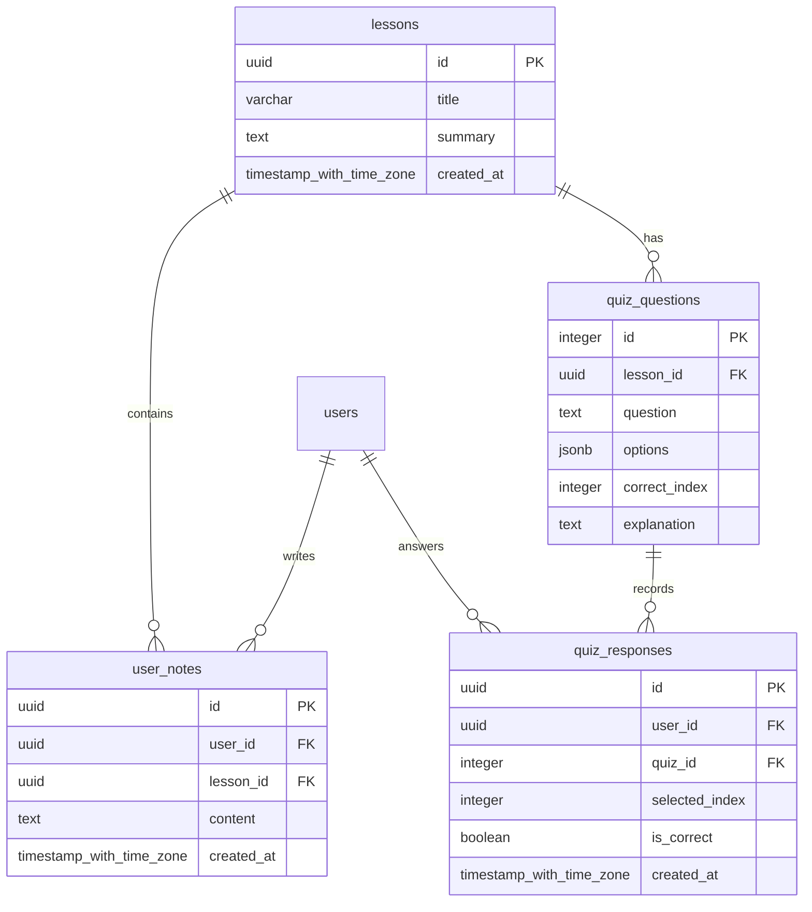

# React 학습 및 퀴즈 기능 데이터 모델 설계

본 설계는 리액트 학습 실습 페이지(`ReactBasicsLessonPage`)에서 작성하는 메모(State)와 퀴즈 응답 결과를 영구 저장하고 다중 사용자 인증 환경에서 다루기 위해 필요한 Supabase/PostgreSQL 관계형 데이터 모델 설계입니다.

---

## 1. 개요 다이어그램



---

## 2. 테이블 상세 정의

### A. `lessons` (과제 학습 기본 테이블)
각 과제 및 실습 단계에 대한 메타데이터를 보관합니다.

| 컬럼명 | 데이터 타입 | 제약 조건 | 설명 |
| --- | --- | --- | --- |
| `id` | `UUID` | `PRIMARY KEY`, `DEFAULT gen_random_uuid()` | 학습 과제 고유 식별자 |
| `title` | `VARCHAR(255)` | `NOT NULL` | 과제 제목 (예: "React 핵심 화면 만들기") |
| `summary` | `TEXT` | `NOT NULL` | 과제 요약 및 학습 목표 설명 |
| `created_at` | `TIMESTAMPTZ` | `DEFAULT now()`, `NOT NULL` | 레코드 생성 일시 |

### B. `user_notes` (사용자 실습 메모 테이블)
사용자가 직접 쓴 손코딩/실습 메모를 저장하는 테이블입니다.

| 컬럼명 | 데이터 타입 | 제약 조건 | 설명 |
| --- | --- | --- | --- |
| `id` | `UUID` | `PRIMARY KEY`, `DEFAULT gen_random_uuid()` | 메모 고유 식별자 |
| `user_id` | `UUID` | `NOT NULL`, `REFERENCES auth.users(id) ON DELETE CASCADE` | 메모 작성자 고유 ID |
| `lesson_id` | `UUID` | `NOT NULL`, `REFERENCES lessons(id) ON DELETE CASCADE` | 연동된 과제 ID |
| `content` | `TEXT` | `NOT NULL` | 메모 본문 내용 (1~2,000자 제한) |
| `created_at` | `TIMESTAMPTZ` | `DEFAULT now()`, `NOT NULL` | 레코드 생성 일시 |

* **RLS 정책 (Row Level Security)**:
  - 읽기(SELECT): 자신의 메모만 조회 가능 (`auth.uid() = user_id`)
  - 쓰기(INSERT): 인증된 사용자만 자신의 메모로 작성 가능 (`auth.uid() = user_id`)
  - 삭제(DELETE): 자신의 메모만 삭제 가능 (`auth.uid() = user_id`)

### C. `quiz_questions` (자가 진단 퀴즈 문제 은행 테이블)
학습 평가용 퀴즈의 보기와 해설을 저장하는 정적 데이터 테이블입니다.

| 컬럼명 | 데이터 타입 | 제약 조건 | 설명 |
| --- | --- | --- | --- |
| `id` | `INTEGER` | `PRIMARY KEY` | 퀴즈 문제 번호 고유 ID |
| `lesson_id` | `UUID` | `NOT NULL`, `REFERENCES lessons(id) ON DELETE CASCADE` | 연관 과제 ID |
| `question` | `TEXT` | `NOT NULL` | 퀴즈 질문 본문 |
| `options` | `JSONB` | `NOT NULL` | 퀴즈 다지선다 보기 배열 (JSON Array) |
| `correct_index`| `INTEGER` | `NOT NULL` | 정답 인덱스 (0부터 시작) |
| `explanation` | `TEXT` | `NOT NULL` | 정답 및 오답 해설 설명 문구 |

### D. `quiz_responses` (사용자 퀴즈 채점 이력 테이블)
사용자의 퀴즈 채점 결과 이력을 영구 보존하는 테이블입니다.

| 컬럼명 | 데이터 타입 | 제약 조건 | 설명 |
| --- | --- | --- | --- |
| `id` | `UUID` | `PRIMARY KEY`, `DEFAULT gen_random_uuid()` | 퀴즈 응답 식별자 |
| `user_id` | `UUID` | `NOT NULL`, `REFERENCES auth.users(id) ON DELETE CASCADE` | 퀴즈를 푼 사용자 ID |
| `quiz_id` | `INTEGER` | `NOT NULL`, `REFERENCES quiz_questions(id) ON DELETE CASCADE` | 풀이한 퀴즈 문제 ID |
| `selected_index`| `INTEGER` | `NOT NULL` | 사용자가 선택한 답안 인덱스 |
| `is_correct` | `BOOLEAN` | `NOT NULL` | 채점 결과 (정답 여부) |
| `created_at` | `TIMESTAMPTZ` | `DEFAULT now()`, `NOT NULL` | 레코드 생성 일시 |

* **RLS 정책 (Row Level Security)**:
  - 읽기(SELECT) 및 쓰기(INSERT): 인증된 본인 데이터만 CRUD 가능

---

## 3. 내일 마이그레이션(Supabase) 준비 사항

내일 Supabase 데이터베이스 구축 세션 시, 해당 설계를 바탕으로 아래의 SQL 스크립트를 작성하여 로컬 마이그레이션 파일(`supabase/migrations/...`)로 적용할 예정입니다.

```sql
-- 1. UUID 확장 모듈 확인
CREATE EXTENSION IF NOT EXISTS "uuid-ossp";

-- 2. 테이블 생성
CREATE TABLE lessons (
    id UUID PRIMARY KEY DEFAULT gen_random_uuid(),
    title VARCHAR(255) NOT NULL,
    summary TEXT NOT NULL,
    created_at TIMESTAMPTZ NOT NULL DEFAULT now()
);

CREATE TABLE user_notes (
    id UUID PRIMARY KEY DEFAULT gen_random_uuid(),
    user_id UUID NOT NULL REFERENCES auth.users(id) ON DELETE CASCADE,
    lesson_id UUID NOT NULL REFERENCES lessons(id) ON DELETE CASCADE,
    content TEXT NOT NULL,
    created_at TIMESTAMPTZ NOT NULL DEFAULT now()
);

-- RLS 활성화
ALTER TABLE user_notes ENABLE ROW LEVEL SECURITY;

-- RLS 정책 선언
CREATE POLICY "Users can manage their own notes"
ON user_notes
FOR ALL
TO authenticated
USING (auth.uid() = user_id)
WITH CHECK (auth.uid() = user_id);
```
