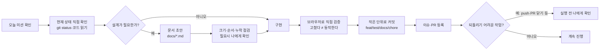

# 나만의 AI 워크플로우 정리 (3주차)

지난 3주간 "오늘 뭐부터 공부하지?"(시험 우선순위 계산기)를 만들며 AI와 어떻게 일해왔는지
실제 커밋·PR 기록을 근거로 정리한다.

## 1. 3주간 무엇을 만들었나

| 주차 | 기간 | 한 일 | 근거 PR |
|---|---|---|---|
| 1주차 | 07/06~07/09 | 기획, 디자인 시스템, Design Skill 제작, 개발환경 구성 | #60, #184, #404 |
| 2주차 | 07/14~07/16 | React 초기 구현, mock 데이터 화면 흐름, 데이터 모델 설계, API 서버 확장 | #970, #1081, #1219 |
| 3주차 | 07/20~07/23 | SQLite DB 연동, 입력 척도 개선, 아키텍처 다이어그램, TDD·Skill·Agent, 신규 기능 3종 | #1413, #1657, #1788 |

총 커밋 52개, PR 9개(그중 5개 병합)로 이어졌다.

## 2. 내가 AI와 일하는 순서

매번 정확히 같지는 않았지만, 되돌아보니 아래 순서가 반복됐다.

**핵심 습관 3가지**
1. **단정하지 않고 확인한다.** 명령이 실패하면 원인을 먼저 확인한다. (예: `git` 명령 실패 → "git이 없다"고 바로 결론 내지 않고 다른 설치 경로부터 확인)
2. **"고쳤다"와 "동작한다"를 구분한다.** 코드를 고친 뒤에는 브라우저에서 직접 클릭해보거나 curl로 API를 호출해 눈으로 확인한 뒤에야 완료로 본다.
3. **되돌리기 어려운 작업은 먼저 알린다.** push, PR 닫기/열기, 배포처럼 공개되거나 되돌리기 번거로운 작업은 실행 전에 확인을 받는다.

## 3. 사용한 Skill·Agent

| 이름 | 만든 시점 | 역할 |
|---|---|---|
| `design-skill.md` | 1주차 | 서비스 화면을 디자인할 때 따르는 절차(디자인 시스템 기준) 표준화 |
| `.claude/skills/write-test/` | 3주차 | 이 저장소의 TDD(red→green) 절차, 테스트 파일 규칙, 실행법을 표준화. "테스트 작성해줘" 요청에서 자동 트리거 |
| `.claude/agents/feature-verifier.md` | 3주차 | 코드를 고치지 않고 요구사항 대조·테스트 실행·경계 케이스 직접 확인·근거 보고만 하는 검증 전담 에이전트 |

**Agent를 실제로 써본 결과**: 오늘 만든 과목 완료 상태 함수(`subjectStatus.js`)에 검증 에이전트를 바로 실행했더니, 테스트가 놓친 경계 케이스(`completedAt`이 빈 문자열이나 `0`일 때 처리 명세가 없다는 점)를 실제로 찾아냈다. 그 지적을 반영해 명세를 테스트로 고정했다.

## 4. 실제로 겪은 시행착오

- **용어 충돌**: 기능을 하나씩 추가하다 보니 "학점"이라는 단어를 서로 다른 두 항목(성적 반영 비율, 과목 학점 수)에 그대로 써서 나중에 헷갈렸다. → "성적 반영 비율(%)" / "중요도(학점 수)"로 분리했다.
- **DB 마이그레이션**: `CREATE TABLE IF NOT EXISTS`는 이미 만들어진 DB 파일에 컬럼을 추가해주지 않는다. 새 필드를 추가할 때마다 `PRAGMA table_info`로 확인하고 `ALTER TABLE`로 채우는 걸 매번 명시적으로 처리했다.
- **공용 저장소 권한**: PR 자동 병합이 워크플로 파일 push 권한 부족으로 실패했다. SSH 원격으로 전환해 우회했다.

## 5. 다음에 이어갈 것

- 과목 완료 체크·히스토리 기능 (설계·이슈 #1524 등록 완료, 구현은 아직)
- 우선순위 계산 로직이 클라이언트·서버에 중복돼 있는 구조 정리
