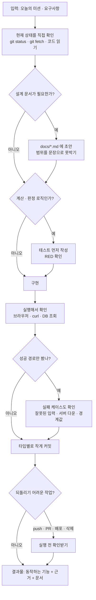

# 나만의 워크플로우 (4주 최종)

4주간 "오늘 뭐부터 공부하지?"를 만들며 반복해서 쓴 작업 순서를 정리한다.
전부 실제 커밋·PR·회고 기록에서 뽑았다. 3주차 정리본(`my-ai-workflow.md`)의
틀린 부분도 [6장](#6-3주차-정리에서-틀렸던-것)에서 바로잡았다.

- 기간: 2026-06-22 ~ 2026-07-29
- 커밋 101개 · PR 16개(11개 병합)
- 배포: https://exam-priority-calculator.vercel.app · https://exam-priority-server.onrender.com

---

## 1. 4주 동안 무엇을 했나

| 주차 | 한 일 | 근거 PR |
|---|---|---|
| 1주차 | 기획, 디자인 시스템, 개발환경 구성 | #60, #184, #267, #404 |
| 2주차 | React 구현, mock 화면 흐름, 데이터 모델, API 서버 | #717, #970, #1081, #1219 |
| 3주차 | SQLite 연동, 척도 개선, TDD·Skill·Agent 제작, 워크플로우 1차 정리 | #1413, #1657, #1788, #1920 |
| 4주차 | 과목 완료 기능, Vercel·Render 배포, UI·UX 개선, 시연 영상 | #2033, #2163, #2279 |

커밋 타입 분포: `docs` 22 · `chore` 20 · `feat` 19 · `style` 7 · `fix` 7 · `test` 6

> 문서 커밋이 기능 커밋보다 많다. 설계와 회고를 코드와 같은 저장소에 남기는 방식으로 일했다는 뜻이다.

---

## 2. 핵심 워크플로우 — 기능 하나를 만드는 순서

가장 많이 반복한 흐름이다.

### 단계별 상세

| 단계 | 입력 | 확인 기준 (이게 되면 다음으로) | 결과물 |
|---|---|---|---|
| **1. 상태 확인** | 오늘의 미션 | `git fetch` 로 원격이 앞서 있지 않음을 확인 | 지금 코드의 사실 |
| **2. 설계** | 요구사항 | 범위가 문장으로 적혀 있고, 안 할 것도 적혀 있음 | `docs/*.md` |
| **3. 테스트 먼저** | 판정 규칙 | 구현 전에 돌려서 **실패**(RED) | `*.test.js` |
| **4. 구현** | 설계 + 테스트 | 테스트 통과(GREEN) | 코드 |
| **5. 실행 확인** | 구현물 | 화면·API·DB **셋 중 최소 둘**에서 눈으로 확인 | 스크린샷·HTTP 코드·조회 결과 |
| **6. 실패 확인** | 구현물 | 잘못된 입력·서버 다운·경계값에서 의도대로 막힘 | 실패 케이스 근거 |
| **7. 커밋** | 검증된 코드 | `type: 한국어 평서형` 형식, 한 커밋에 한 가지 | 커밋 |
| **8. 공개** | 커밋 | 사람이 승인 | push · PR · 배포 |

---

## 3. 확인 기준 — "됐다"고 말할 수 있는 조건

4주간 가장 크게 바뀐 부분이다. 처음엔 "코드를 고쳤다"에서 멈췄는데, 지금은 아래를 통과해야 완료로 본다.

**1) 고쳤다 ≠ 동작한다**
화면만 바뀐 것은 저장됐다는 증거가 아니다. `PATCH → 200` → 새로고침 → 재조회 응답까지 봐야 한다.

**2) 통과했다 ≠ 의도대로 됐다**
서버 테스트가 전부 통과하면서 실제 개발 DB에 행 10개를 남긴 적이 있다.
ESM `import` 가 `process.env` 대입보다 먼저 실행돼 메모리 DB 설정이 늦게 걸렸다.
→ **테스트가 무엇을 건드렸는지도 확인한다.**

**3) 성공했다 ≠ 잠겼다**
CORS는 설정이 비어 있어도 허용 헤더가 붙는다. 허용된 주소로 성공하는 것만 보면 구분이 안 된다.
→ **일부러 실패시켜서 막히는 것까지 봐야 한다.**

**4) 안 보인다 ≠ 정상이다**
서버를 꺼도 화면이 멀쩡했다. 폴백이 잘 만들어져 있을수록 고장이 안 보인다.
→ **폴백이 있는 곳은 폴백이 돌고 있다는 사실 자체를 화면에 알린다.**

---

## 4. 문제가 생겼을 때 되돌아갈 단계

실제로 겪은 것만 적는다.

| 증상 | 먼저 의심할 것 | 되돌아갈 단계 |
|---|---|---|
| `git push` 거절 | 원격에 다른 커밋이 올라옴 | **1단계**. force 대신 백업 태그 → `git rebase origin/<브랜치>` → **5단계 검증을 다시** |
| 리베이스·머지 후 | 남의 변경이 섞임 | **5단계**. 테스트·빌드·브라우저 확인을 처음부터 다시 |
| 명령이 "없다"고 나옴 | PATH 문제일 수 있음 | **1단계**. 파일이 없다고 단정하지 말고 도구에 직접 물어보기 (`which` 대신 `--version`, `whoami`) |
| 빈 데이터 화면이 안 나옴 | 상태가 여러 곳에 있음 | **5단계**. DB만 비우면 localStorage가 되살린다. **둘 다 비우고** 페이지를 연다 |
| 배포 후 화면은 뜨는데 저장 안 됨 | CORS 또는 API 주소 | **8단계**. `CORS_ORIGIN`과 `VITE_API_BASE_URL` 확인. Vite 환경변수는 **빌드 타임**에 박히므로 재배포 필요 |
| 배포하자마자 서버가 죽음 | 런타임 버전 | **8단계**. `NODE_VERSION` 확인 (`node:sqlite`는 Node 22 미만에 없음) |
| 테스트는 통과하는데 데이터가 이상함 | 테스트가 실제 DB를 씀 | **3단계**. 테스트 격리부터 다시 |

---

## 5. 되돌리기 어려운 작업 — 실행 전 확인

아래는 AI가 임의로 하지 않고 반드시 먼저 물어본다.

- `git push`, PR 생성·닫기, force-push
- 배포 (Vercel·Render)
- 파일·DB 레코드 삭제
- 새 패키지 설치

4주간 이 규칙 덕에 실제로 막은 것: 공용 저장소에 임시 브랜치 남기기, 삭제 대상 오인
(`생리학`이 없다고 잘못 말한 것을 삭제 직전에 바로잡음).

---

## 6. 3주차 정리에서 틀렸던 것

미션의 *"실제 작업과 맞지 않는 항목은 고칩니다"* 에 해당한다.

| 3주차에 적은 것 | 실제 | 수정 |
|---|---|---|
| `design-skill.md` 를 **Skill** 로 표기 | `.claude/skills/` 에 등록되지 않은 **저장소 루트의 참고 문서**다. 자동 트리거되지 않고 `CLAUDE.md` 가 참조할 뿐이다 | Skill이 아니라 **디자인 기준 문서**로 정정 |
| "다음에 이어갈 것: 과목 완료 체크" | 4주차(#2033)에 구현 완료 | 완료 처리 |
| "다음에 이어갈 것: 중복 계산 로직 정리" | **3주 연속 미완**. `priorityCalculator.js`와 `priorityService.js`가 여전히 같은 규칙을 각자 갖고 있다 | 미완으로 명시 |
| `feature-verifier` 를 검증에 활용 | 3주차에 한 번 쓴 뒤 **4주차에는 한 번도 안 썼다** | 만든 것과 습관이 된 것은 다름을 명시 |

---

## 7. 남은 과제

- **중복 계산 로직** — 클라이언트와 서버가 같은 점수 규칙을 각자 갖고 있다. 한쪽만 고치면 같은 입력에 다른 점수가 나온다.
- **Supabase 연결** — 서버가 `node:sqlite`라 `DATABASE_URL`을 읽는 코드가 없다.
- **Render 무료 디스크 초기화** — 재배포마다 DB 파일이 사라진다. 위 항목이 그대로 해결책이다.
- **`feature-verifier` 를 순서에 고정** — 쓸지 말지 매번 판단하지 않도록 5단계에 박아둔다.
