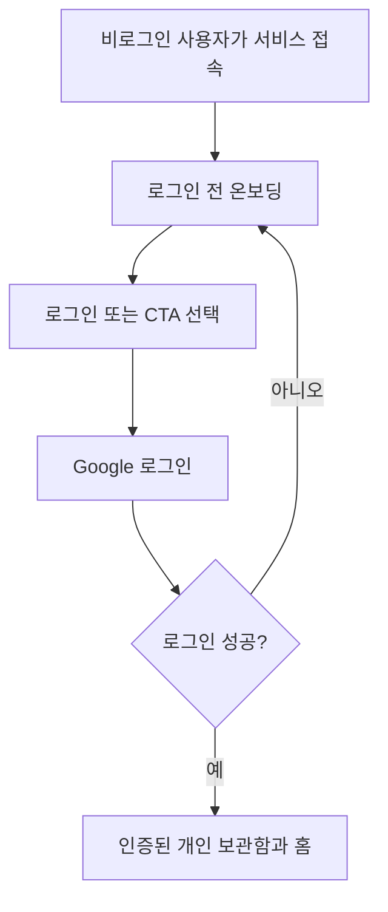

# 온보딩 기획

이 문서는 로그인 전 아맞다 온보딩의 콘텐츠 순서와 표현 범위를 정의한다. 화면 문구나 진입 흐름이 바뀌면 이 문서를 먼저 갱신한다. 시각 규칙과 접근성은 [디자인 시스템](../DESIGN.md)을 따른다.

## 온보딩의 역할

온보딩은 제품 정책을 설명하는 안내서가 아니다. 사용자가 짧은 시간 안에 아맞다의 약속과 세 가지 핵심 기능을 이해하고 직접 시작하게 만드는 진입 화면이다.

```text
링크를 저장한다 → 카테고리로 분류한다 → 필요한 순간 다시 꺼내본다
```

## 콘텐츠 순서

| 순서 | 장면         | 전달할 내용                                    |
| ---- | ------------ | ---------------------------------------------- |
| 1    | Hero         | 저장한 링크를 필요한 순간 다시 꺼내보는 서비스 |
| 2    | 핵심 기능 탭 | 저장, 분류, 꺼내보기의 실제 제품 장면          |
| 3    | 소통         | 버그와 개선 의견을 전달하는 공식 경로          |

`문제`, `장점`, `팀 소개`를 독립 섹션으로 만들지 않는다. 핵심 기능 탭에서 이미 드러나는 내용을 카드 목록과 설명 문단으로 반복하지 않는다. 마지막 소통 섹션은 제품 가치를 다시 설명하지 않고 피드백 행동만 담당한다.

## 장면별 계약

### 1. Hero

첫 화면은 다음 요소만 사용한다.

- 서비스명과 로고, `로그인` 버튼이 있는 상단바
- 핵심 문장
- `서비스 경험하기` CTA

상단바에는 페이지 내부 이동용 `저장`, `꺼내보기` 링크를 두지 않는다. 기능 탐색은 본문의 탭이 담당한다.

핵심 문장:

```text
저장한 링크를
필요한 순간 다시 꺼내보세요
```

`🔖 링크`는 Electric Blue, `🪄 다시`는 Amber 책갈피 하이라이트로 표시한다. 두 이모지는 하이라이트 안에서 텍스트 앞에만 둔다.

Hero에 보조 설명, 로그인 안내, 제품 결과 예시 박스, 감성 문구를 두지 않는다.

### 2. 핵심 기능 탭

섹션 제목은 아맞다가 제공하는 도움과 기능 범위를 한 문장으로 전달한다.

```text
발견한 링크가 필요한 순간 다시 쓰이도록,
아맞다가 저장부터 꺼내보기까지 이어드려요.
```

제목 아래에는 `01 저장`, `02 분류`, `03 꺼내보기` 탭과 하나의 공용 제품 무대를 둔다. 탭을 바꾸면 같은 위치에서 제품 장면만 전환한다. 별도의 마케팅 설명 문단을 붙이지 않는다.

#### 저장

- 링크 URL 입력
- 저장 행동
- 저장 완료 상태

#### 분류

- 보관함의 카테고리 필터
- 디자인, 개발, 프로젝트 카테고리
- 카테고리에 정리된 저장물

보관함 검색은 이 탭에 섞지 않는다. 분류 장면은 카테고리로 저장물을 묶는 기능에 집중한다.

#### 꺼내보기

- 지금 필요한 상황
- 다시 나타난 저장물
- 실제 일치 정보로 만든 연결 단서
- 원문을 여는 행동

검색 알고리즘, AI 추천, 랭킹 기준을 설명하지 않는다. 실제 제품 장면으로 작동 방식을 전달한다.

### 3. 소통

마지막 장면은 기능 설명이나 로그인 CTA를 반복하지 않는다. 다음 제목, 설명, 공식 GitHub 이슈 링크만 사용한다.

```text
쓰다가 막히거나, 더 좋은 방법이 떠올랐나요?

버그와 개선 의견을 남겨주세요.
직접 확인하고 다음 개선에 반영할게요.
```

행동 문구는 `문제·의견 남기기`이며 `https://github.com/ppre1ude/hub/issues/new`를 새 창으로 연다.

## 시각 방향

- White Canvas와 넓은 여백
- 크고 굵은 산세리프 타이포그래피
- Hero 핵심 표현에만 쓰는 책갈피 형태의 인라인 하이라이트
- Charcoal 단일 Primary CTA
- 얇은 경계와 평평한 제품 UI
- 그림자와 장식용 gradient가 없는 구성
- 마지막 소통 장면의 Electric Blue 전면 배경과 Amber, Coral, Pale Blue 책갈피 도형

기능 탭은 한 줄로 배치한다. 활성 탭은 Electric Blue 글자와 하단선으로 표시하고 `aria-selected`도 함께 제공한다. 제품 UI 안에서는 Blue, Amber, Coral을 제한적으로 사용한다. 소통 장면은 레이아웃의 전환을 분명히 하기 위해 한 번만 넓은 색면을 사용하며 그림자와 그라데이션은 넣지 않는다.

## 모션 도입 순서

먼저 클릭과 키보드로 전환되는 정적 탭을 완성한다. GSAP은 정적 구성과 반응형 검증이 끝난 뒤 별도 단계에서 적용한다.

GSAP은 각 탭 내부의 상태 변화를 보여주는 데만 사용한다.

```text
URL 저장 → 카테고리로 정리 → 현재 상황과 연결
```

모바일과 `prefers-reduced-motion` 환경에서는 정적 최종 상태를 제공한다.

## 로그인 흐름

현재 로그인 수단은 Supabase Auth의 Google OAuth다. 인증 전에는 온보딩과 로그인 화면만 보여주고, 인증이 확인된 뒤에만 사용자의 원격 보관함을 여는 앱 화면을 구성한다.



- 로그인하지 않은 사용자는 앱 내부 화면에 접근하지 못한다.
- 상단 `로그인`과 Hero `서비스 경험하기`는 같은 로그인 화면으로 이어진다.
- 로그인 화면의 `Google로 계속하기`는 Supabase OAuth를 시작하며, 돌아온 세션의 사용자 ID가 원격 보관함 경계가 된다.
- 마지막 `문제·의견 남기기`는 로그인 흐름과 분리된 공식 피드백 경로다.
- 로그인 성공 후 기본 진입 화면은 홈이다.
- 로그인 실패나 취소 시에는 온보딩 화면에 머무른다.
- 모바일 공유와 Chrome 확장도 같은 계정과 RLS 경계를 사용한다. 채널별 저장 흐름은 [#36](https://github.com/ppre1ude/hub/issues/36)에서 관리한다.

## 반응형과 접근성

- 모바일과 데스크톱에서 같은 세 장면 순서를 유지한다.
- 기능 탭은 모바일에서도 한 줄로 유지한다.
- 탭은 클릭과 좌우 방향키, Home, End로 전환할 수 있어야 한다.
- 탭, 로그인 CTA, 피드백 링크의 터치 영역은 최소 44px이다.
- 핵심 문장은 보조기기에서 자연스러운 한 문장으로 읽혀야 한다.
- 모션 없이도 각 기능의 정적 최종 상태를 이해할 수 있어야 한다.

## 제외 문구와 콘텐츠

- `기억에는 온기를, 다시 찾는 과정에는 질서를.` 같은 감성 문구
- 로그인 후 사용할 수 있는 기능 안내
- 메모가 선택 사항이라는 정책 설명
- 문제와 장점을 반복하는 카드 목록
- 상단바의 페이지 내부 기능 링크
- 팀 소개 섹션
- AI 자동화처럼 보이는 과장 문구
