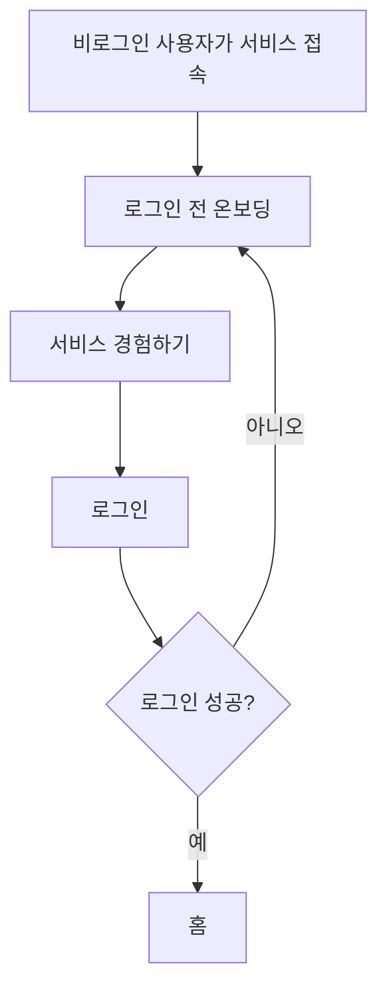

# 온보딩 기획

이 문서는 로그인 전 아맞다 온보딩의 콘텐츠 순서와 표현 범위를 정의한다. 화면 문구나 진입 흐름이 바뀌면 이 문서를 먼저 갱신한다. 시각 규칙과 접근성은 [디자인 시스템](../DESIGN.md)을 따른다.

## 온보딩의 역할

온보딩은 제품 정책과 부가 기능을 설명하는 안내서가 아니다. 사용자가 짧은 시간 안에 아맞다의 핵심 경험을 이해하고 직접 시작하게 만드는 진입 화면이다.

사용자가 이해해야 할 흐름은 하나다.

```text
링크를 저장한다 → 필요한 순간 다시 꺼내본다
```

## 콘텐츠 순서

온보딩은 다음 네 장면만 사용한다.

| 순서 | 장면     | 전달할 내용                                    |
| ---- | -------- | ---------------------------------------------- |
| 1    | Hero     | 저장한 링크를 필요한 순간 다시 꺼내보는 서비스 |
| 2    | 저장     | 링크가 보관함에 저장되는 장면                  |
| 3    | 꺼내보기 | 현재 상황과 연결된 저장물이 다시 나타나는 장면 |
| 4    | CTA      | 서비스를 직접 시작하는 행동                    |

`문제`, `장점`, `팀 소개`, `문의`를 독립 섹션으로 만들지 않는다. 저장과 꺼내보기에서 이미 드러나는 내용을 설명 문단이나 카드 목록으로 반복하지 않는다.

## 장면별 계약

### 1. Hero

첫 화면은 다음 요소만 사용한다.

- 서비스명과 로고가 있는 상단바
- 핵심 문장
- `서비스 경험하기` CTA

상단 내비게이션은 실제로 남는 장면인 `저장`, `꺼내보기`만 제공한다.

핵심 문장:

```text
저장한 링크를
필요한 순간 다시 꺼내보세요
```

`링크`는 Electric Blue, `다시`는 Amber 책갈피 하이라이트로 표시한다. 하이라이트 안에 이모지나 별도 장식 아이콘을 넣지 않는다.

Hero에 보조 설명, 로그인 안내, 제품 결과 예시 박스, 감성 문구를 두지 않는다.

### 2. 저장

저장 장면은 실제 제품 흐름을 닮은 최소 UI로 표현한다. URL이 입력되고 저장되는 과정만 보여준다.

선택 입력 여부, 카테고리 관리, 편집 정책, 저장 방식의 장점을 설명하는 마케팅 문구는 사용하지 않는다. 화면에 필요한 필드명과 상태 문구만 허용한다.

### 3. 꺼내보기

꺼내보기 장면은 현재 상황을 기준으로 저장물이 다시 나타나는 과정을 보여준다.

장면에 필요한 정보는 다음과 같다.

- 현재 상황
- 다시 나타난 저장물
- 연결 단서
- 원문을 여는 행동

검색 알고리즘, AI 추천, 랭킹 기준을 설명하지 않는다. 기능 설명 문단 대신 실제 제품 장면으로 작동 방식을 전달한다.

### 4. CTA

마지막 장면은 짧은 제목과 `서비스 경험하기` CTA만 사용한다. 로그인 후 사용할 수 있는 기능이나 인증 정책은 다음 로그인 화면에서 안내한다.

## 시각 방향

온보딩의 기존 시각 콘셉트는 유지한다.

- White Canvas와 넓은 여백
- 크고 굵은 산세리프 타이포그래피
- 문장 속 핵심 표현에만 쓰는 책갈피 형태의 인라인 하이라이트
- Charcoal 단일 Primary CTA
- 얇은 경계와 평평한 제품 UI
- 그림자와 장식용 gradient가 없는 구성

책갈피 하이라이트는 Hero에서 최대 두 곳만 사용한다. Electric Blue를 기본 색면으로 사용하고 Amber는 작은 겹침 또는 보조 책갈피에 한정한다. 초록색 대형 색면, 장식용 이모지, 별과 반짝임은 사용하지 않는다.

오른쪽 공간을 장식 박스나 대체 이미지로 채우지 않는다. 큰 제목과 여백 자체가 Hero의 시각적 중심이 된다. 제품 UI는 저장과 꺼내보기 장면에서만 보여준다.

## 모션 도입 순서

먼저 애니메이션 없이도 서사가 이해되는 정적 온보딩을 완성한다. GSAP은 정적 구성과 반응형 검증이 끝난 뒤 별도 단계에서 적용한다.

GSAP의 역할은 새로운 설명을 추가하는 것이 아니라 다음 연결을 시간 순서로 보여주는 것이다.

```text
링크 저장 → 현재 상황 등장 → 저장물이 다시 나타남
```

Hero에는 필요한 경우 짧은 진입 효과만 사용한다. 모바일과 `prefers-reduced-motion` 환경에서는 정적 최종 상태를 제공한다.

## 로그인 흐름



- 로그인하지 않은 사용자는 앱 내부 화면에 접근하지 못한다.
- 로그인 성공 후 기본 진입 화면은 홈이다.
- 로그인 실패나 취소 시에는 온보딩 화면에 머무른다.
- 인증 버튼과 약관 안내는 로그인 화면에서 제공한다.

## 반응형과 접근성

- 데스크톱과 모바일은 같은 네 장면 순서를 유지한다.
- 모바일에서도 설명 문단을 추가하지 않는다.
- CTA 터치 영역은 최소 44px이다.
- 핵심 문장은 보조기기에서 자연스러운 한 문장으로 읽혀야 한다.
- 책갈피 색면이 없어도 문장의 의미와 순서가 유지되어야 한다.
- 모션이 없어도 저장과 꺼내보기의 정적 최종 상태를 이해할 수 있어야 한다.

## 제외 문구와 콘텐츠

다음 내용은 온보딩에서 사용하지 않는다.

- `기억에는 온기를, 다시 찾는 과정에는 질서를.` 같은 감성 문구
- 로그인 후 사용할 수 있는 기능 안내
- 메모가 선택 사항이라는 정책 설명
- 카테고리, 편집, 보관함 관리 소개
- 문제와 장점을 반복하는 카드 목록
- 팀 소개와 문의 섹션
- AI 자동화처럼 보이는 과장 문구
