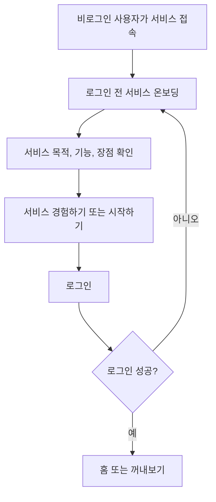

# 온보딩 기획

이 문서는 아맞다의 온보딩 흐름을 정의한다. 구현 전 기준 문서로 사용하며, 화면 문구나 진입 흐름이 바뀌면 이 문서를 먼저 갱신한다.

## 문서 역할

- 로그인 전 사용자가 서비스 목적과 핵심 기능을 빠르게 이해하도록 한다.
- 로그인 이후 홈 또는 `꺼내보기`로 진입하기 전까지의 흐름을 명확히 한다.
- 긴 소개 페이지, 개인화 질문, 첫 행동 추천을 한 화면에 섞지 않도록 범위를 분리한다.

## 온보딩 구분

### 1. 로그인 전 서비스 온보딩

첫 방문자에게 아맞다가 어떤 문제를 해결하는 서비스인지 소개하고 로그인으로 이어주는 화면이다. 현재 우선 구현 대상이다.

핵심 역할:

- 서비스 목적 소개
- 주요 기능 요약
- 사용자가 얻는 장점 전달
- 로그인 진입 CTA 제공

### 2. 로그인 후 개인화 온보딩

로그인한 사용자의 관심 분야, 기본 카테고리, 추천 상황을 설정하는 흐름이다. 서비스 소개 화면과 분리해서 다룬다.

핵심 역할:

- 관심 분야 선택
- 초기 카테고리 생성
- 추천 상황 또는 첫 저장 행동 제안

이 흐름은 인증 이후에만 제공한다. 비로그인 상태에서는 개인화 질문을 하지 않는다.

## 목표

- 사용자가 5초 안에 "저장한 링크를 나중에 다시 꺼내보는 서비스"라고 이해할 수 있어야 한다.
- 사용자가 홈이나 `꺼내보기`로 이동하기 전에 반드시 로그인 흐름을 거치게 한다.
- 첫 화면에서 목적, 기능, 장점, CTA가 한 번에 보여야 한다.
- 서비스 소개는 차분한 생산성 도구 톤을 유지한다.

## 비목표

- 세로로 긴 마케팅 랜딩 페이지를 만들지 않는다.
- 로그인 전 관심 분야 선택, 카테고리 생성, 추천 상황 설정을 하지 않는다.
- 게스트 모드로 홈이나 `꺼내보기`를 열어주지 않는다.
- AI 자동화처럼 보이는 과장 문구를 쓰지 않는다.
- 외부 서비스명이나 외부 화면 레퍼런스를 문서와 UI 문구에 남기지 않는다.

## 사용자 흐름



원칙:

- 로그인하지 않은 사용자는 앱 내부 화면에 접근하지 못한다.
- 로그인 성공 후 기본 진입 화면은 홈이다.
- 홈은 `꺼내보기`를 중심으로 구성한다.
- 로그인 실패나 취소 시에는 서비스 온보딩 화면에 머무른다.

## 화면 구조

### 데스크톱

한 화면 안에서 소개 영역과 로그인 진입 영역을 함께 보여준다.

```text
┌──────────────────────────────────────────────┐
│ 서비스 소개 영역        │ 로그인 진입 영역     │
│                         │                    │
│ 아맞다                  │ 환영합니다          │
│ 저장한 링크를           │ 짧은 안내 문구       │
│ 필요한 순간 다시...     │                    │
│                         │ [서비스 경험하기]    │
│ 핵심 기능 3~4개          │ 약관/개인정보 안내   │
└──────────────────────────────────────────────┘
```

### 모바일

세로 배치는 허용하되, 긴 스크롤형 랜딩 페이지로 만들지 않는다.

순서:

1. 서비스명
2. 핵심 문장
3. 짧은 설명
4. 기능/장점 3~4개
5. 로그인 CTA

## 권장 문구

### 핵심 문장

```text
저장한 링크를
필요한 순간 다시 꺼내보세요
```

### 설명 문구

```text
아맞다는 흩어진 링크와 메모를 한곳에 모아두고,
나중에 지금 필요한 상황에 맞게 다시 찾는 개인 인사이트 보관함입니다.
```

### 기능/장점

- 빠른 저장: URL과 짧은 메모를 바로 보관한다.
- 나중에 정리: 카테고리와 메모는 필요할 때 붙인다.
- 상황으로 찾기: 제목을 몰라도 지금 하는 일로 다시 꺼내본다.
- 작업에 연결: 과제, 팀 프로젝트, 공부, 포트폴리오 자료를 다시 활용한다.

### 로그인 영역 문구

```text
환영합니다!

로그인 후 나만의 보관함과 꺼내보기를 사용할 수 있어요.
```

### CTA 후보

1. `서비스 경험하기`
2. `시작하기`

우선 적용 문구는 `서비스 경험하기`로 한다. 실제 인증 제공자명이 필요한 버튼을 따로 둘 경우에도 사용자는 홈으로 바로 이동하지 않고 로그인 과정을 먼저 거친다.

## 화면 톤

- 밝은 배경과 얇은 구분선을 사용한다.
- 주요 CTA에는 `--color-primary`를 사용한다.
- 설명 영역은 카드 나열보다 짧은 기능 리스트를 우선한다.
- 장식용 캐릭터, 큰 일러스트, 과한 그림자는 사용하지 않는다.
- 미리보기 요소를 넣는다면 저장 카드나 `꺼내보기` 결과의 축약 형태만 사용한다.

## 접근성 기준

- CTA는 키보드로 접근 가능해야 한다.
- CTA 텍스트만으로 다음 행동이 이해되어야 한다.
- 로그인 안내와 약관 안내는 본문 대비를 유지한다.
- 모바일에서 CTA 터치 영역은 최소 44px 이상으로 둔다.

## 구현 메모

- 인증 상태 분기는 앱 진입부에서 처리한다.
- 비로그인 상태에서는 서비스 온보딩 화면을 렌더링한다.
- 로그인 성공 후 홈으로 이동한다.
- 로그인 후 개인화 온보딩을 도입할 경우, 홈 진입 전에 별도 게이트로 분리한다.
- 서비스 온보딩 완료 여부를 `localStorage`에 저장하지 않는다. 비로그인 상태의 기본 진입 화면 자체가 서비스 온보딩이다.
