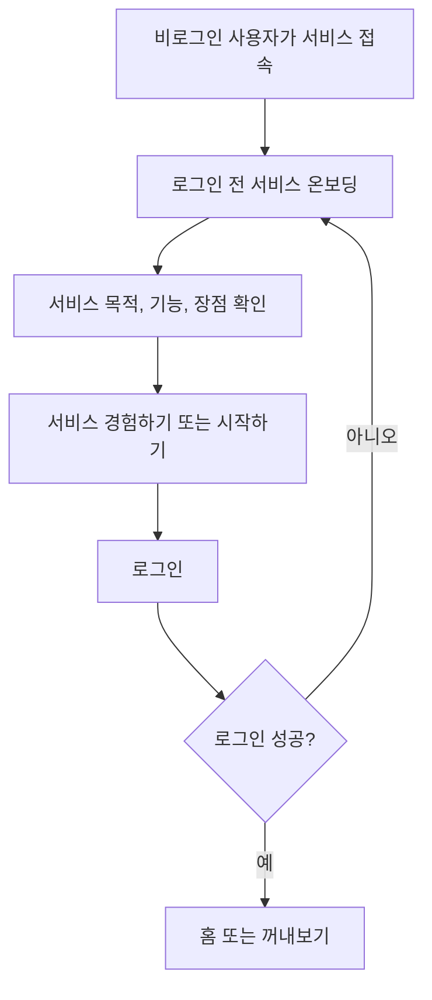

# 온보딩 기획

이 문서는 아맞다의 온보딩 흐름을 정의한다. 구현 전 기준 문서로 사용하며, 화면 문구나 진입 흐름이 바뀌면 이 문서를 먼저 갱신한다. 로그인 전 온보딩 모션과 접근성의 지속 규칙은 [디자인 시스템](../DESIGN.md)과 관련 코드 테스트를 함께 따른다.

## 문서 역할

- 로그인 전 사용자가 서비스 목적과 핵심 기능을 빠르게 이해하도록 한다.
- 로그인 이후 홈 또는 `꺼내보기`로 진입하기 전까지의 흐름을 명확히 한다.
- 로그인 전 세로형 서비스 소개와 로그인 후 개인화 질문, 첫 행동 추천의 범위를 분리한다.

## 온보딩 설계 인사이트

- 첫 화면은 서비스명, 한 문장 가치 제안, 짧은 보조 설명, 핵심 경험 미리보기, CTA만 우선한다.
- CTA는 첫 화면 안에서 즉시 보여야 하며, 세로형 온보딩 하단에도 반복 배치할 수 있다.
- 서비스 소개 화면과 실제 로그인 화면은 분리한다. 소개 화면의 CTA는 로그인 화면으로 보내고, 인증 버튼과 약관 안내는 로그인 화면에서 제공한다.
- 기능 설명은 긴 문단보다 `제목 / 짧은 부제 / 한 줄 설명` 구조의 3~4개 항목으로 제한한다.
- 핵심 시각 요소는 서비스 목적을 설명해야 한다. 장식용 이미지보다 저장물이 현재 상황과 다시 연결되는 장면을 우선한다.
- 세로형 온보딩은 `Hero / 문제 상황 / 저장 흐름 / 꺼내보기 흐름 / 장점 요약 / CTA` 순서로 구성한다.
- 온보딩 진입, CTA 클릭, 로그인 버튼 클릭은 나중에 전환율을 볼 수 있도록 서로 다른 이벤트로 구분할 수 있게 설계한다.

## 온보딩 구분

### 1. 로그인 전 서비스 온보딩

첫 방문자에게 아맞다가 어떤 문제를 해결하는 서비스인지 소개하고 로그인으로 이어주는 화면이다. 현재 우선 구현 대상이다.

핵심 역할:

- 서비스 목적 소개
- 주요 기능 요약
- 사용자가 얻는 장점 전달
- 로그인 진입 CTA 제공

### 2. 로그인 후 개인화 온보딩

로그인한 사용자의 관심 분야, 기본 카테고리, 추천 상황을 설정하는 흐름이다. 서비스 소개 화면과 분리해서 다룬다.

핵심 역할:

- 관심 분야 선택
- 초기 카테고리 생성
- 추천 상황 또는 첫 저장 행동 제안

이 흐름은 인증 이후에만 제공한다. 비로그인 상태에서는 개인화 질문을 하지 않는다.

## 목표

- 사용자가 5초 안에 "저장한 링크를 나중에 다시 꺼내보는 서비스"라고 이해할 수 있어야 한다.
- 사용자가 홈이나 `꺼내보기`로 이동하기 전에 반드시 로그인 흐름을 거치게 한다.
- 첫 화면에서 목적, 기능, 장점, CTA가 한 번에 보여야 한다.
- 로그인 전 화면에서 `꺼내보기`의 핵심 경험을 데스크톱 연결 장면 또는 모바일 정적 미리보기로 보여준다.
- 서비스 소개는 차분한 생산성 도구 톤을 유지한다.

## 비목표

- 로그인 전 관심 분야 선택, 카테고리 생성, 추천 상황 설정을 하지 않는다.
- 게스트 모드로 홈이나 `꺼내보기`를 열어주지 않는다.
- AI 자동화처럼 보이는 과장 문구를 쓰지 않는다.
- 외부 서비스명이나 외부 화면 비교 표현을 문서와 UI 문구에 남기지 않는다.

## 사용자 흐름



원칙:

- 로그인하지 않은 사용자는 앱 내부 화면에 접근하지 못한다.
- 로그인 성공 후 기본 진입 화면은 홈이다.
- 홈은 `꺼내보기`를 중심으로 구성한다.
- 로그인 실패나 취소 시에는 서비스 온보딩 화면에 머무른다.

## 화면 구조

### 데스크톱

첫 화면에서는 서비스 소개, 핵심 경험 미리보기, CTA 영역을 함께 보여준다. 이후 세로 스크롤 섹션에서 문제 상황, 저장 흐름, `꺼내보기` 흐름, 장점 요약을 차례로 설명한다. 실제 인증 버튼과 약관 안내는 CTA 이후의 로그인 화면에서 제공한다.

```text
┌────────────────────────────────────────────────────────────┐
│ Hero: 서비스 소개 + 핵심 경험 미리보기 + CTA                │
├────────────────────────────────────────────────────────────┤
│ 문제 상황: 저장해도 다시 찾기 어려운 순간                  │
├────────────────────────────────────────────────────────────┤
│ 저장 흐름: 빠르게 저장하고 정리는 나중에                   │
├────────────────────────────────────────────────────────────┤
│ 꺼내보기 흐름: 현재 상황으로 저장물을 다시 연결             │
├────────────────────────────────────────────────────────────┤
│ 장점 요약 + CTA 반복                                       │
└────────────────────────────────────────────────────────────┘
```

### 모바일

모바일에서도 같은 섹션 순서를 유지한다. 단, 각 섹션은 짧은 제목과 1~2문단 설명, 하나의 미리보기 블록만 두어 읽기 부담을 줄인다.

순서:

1. 서비스명
2. 핵심 문장
3. 짧은 설명
4. 기능/장점 3~4개
5. 핵심 경험 미리보기
6. 문제 상황
7. 저장 흐름
8. `꺼내보기` 흐름
9. 장점 요약
10. 로그인 CTA

### 로그인 화면

온보딩 CTA 이후에는 로그인 화면으로 이동한다. 이 화면은 다시 서비스 기능을 길게 설명하지 않고, 사용자가 인증을 완료해도 되는지 판단할 수 있는 정보만 제공한다.

구성:

- 환영 문구
- 로그인 후 사용할 수 있는 핵심 가치 한 줄
- 인증 제공자 버튼
- 간편 로그인 안내
- 이용약관 및 개인정보처리방침 동의 안내

원칙:

- 로그인 화면에서 홈이나 `꺼내보기`로 우회하는 게스트 진입을 제공하지 않는다.
- 인증 버튼은 하나의 주 동작으로 보이게 한다.
- 약관과 개인정보처리방침 링크는 버튼 아래에 배치하되, CTA보다 시각적으로 강하지 않게 둔다.

## 핵심 경험 애니메이션

로그인 전 서비스 온보딩에는 데스크톱에서만 GSAP 기반의 연결 장면 하나를 사용한다. 목적은 실제 `꺼내보기` 기능을 체험하게 하는 것이 아니라, "저장해둔 자료가 나중의 현재 상황과 다시 연결된다"는 핵심 경험을 직관적으로 보여주는 것이다. 모바일과 motion 감소 환경은 같은 서사의 정적 최종 상태를 보여준다.

기본 서사:

1. 사용자가 저장해둔 듯한 카드 2~3개가 흩어진 상태로 보인다.
2. `팀 프로젝트 앱 첫 화면 참고` 같은 현재 상황 문장이 한 줄로 등장한다.
3. 흩어진 카드가 상황 문장을 기준으로 모이며 작은 작업팩 형태로 재구성된다.
4. 카드 옆에는 `메모와 가까워요`, `디자인 카테고리에 저장한 자료예요`처럼 짧은 연결 단서가 붙는다.
5. CTA는 항상 시야 안에 유지하고, 애니메이션 완료 후 `서비스 경험하기`로 이어진다.

원칙:

- GSAP은 이 로그인 전 서비스 온보딩의 데스크톱 연결 장면 하나에만 사용한다.
- 데스크톱에서는 viewport 높이의 90~110% 구간을 한 번 pin하고, 스크롤 진행에 따라 흩어진 카드가 작업팩으로 연결되게 한다.
- 모바일에서는 pin과 timeline을 만들지 않고 완성된 작업팩을 정적으로 보여준다.
- 앱 내부 화면 전환, 버튼 인터랙션, 카드 등장 같은 micro interaction은 Motion 또는 CSS transition을 우선한다.
- `prefers-reduced-motion` 환경에서는 timeline을 만들지 않고 정적 최종 상태로 대체한다.
- CTA는 pin 여부와 관계없이 접근 가능하고 읽기 흐름을 방해하지 않아야 한다.
- 검색 결과처럼 실제 데이터를 조회하는 UI로 보이게 만들지 않는다.

## 권장 문구

### 핵심 문장

```text
저장한 링크를
필요한 순간 다시 꺼내보세요
```

### 설명 문구

```text
아맞다는 흩어진 링크와 메모를 한곳에 모아두고,
나중에 지금 필요한 상황에 맞게 다시 찾는 개인 인사이트 보관함입니다.
```

### 기능/장점

- 빠른 저장: URL과 짧은 메모를 바로 보관한다.
- 나중에 정리: 카테고리와 메모는 필요할 때 붙인다.
- 상황으로 찾기: 제목을 몰라도 지금 하는 일로 다시 꺼내본다.
- 작업에 연결: 과제, 팀 프로젝트, 공부, 포트폴리오 자료를 다시 활용한다.

### 로그인 화면 문구

```text
환영합니다!

로그인 후 나만의 보관함과 꺼내보기를 사용할 수 있어요.
```

### CTA 후보

1. `서비스 경험하기`
2. `시작하기`

우선 적용 문구는 `서비스 경험하기`로 한다. 실제 인증 제공자명이 필요한 버튼을 따로 둘 경우에도 사용자는 홈으로 바로 이동하지 않고 로그인 과정을 먼저 거친다.

## 화면 톤

- White Canvas를 기본으로 하고 Canvas 표면, Ash 1px 경계, Ink/Graphite 텍스트를 사용한다.
- 주요 CTA는 Charcoal 표면과 Canvas 텍스트로 한 가지 주 동작만 강조한다.
- 설명 영역은 카드 나열보다 짧은 기능 리스트와 충분한 흰 여백을 우선한다.
- 장식용 캐릭터, 큰 일러스트, gradient, 기본 그림자는 사용하지 않는다.
- 미리보기는 저장 카드가 상황 문장에 의해 작업팩으로 모이는 한 장면으로 제한한다.

## 접근성 기준

- CTA는 키보드로 접근 가능해야 한다.
- CTA 텍스트만으로 다음 행동이 이해되어야 한다.
- 로그인 안내와 약관 안내는 본문 대비를 유지한다.
- 모바일에서 CTA 터치 영역은 최소 44px 이상으로 둔다.

## 구현 메모

- 인증 상태 분기는 앱 진입부에서 처리한다.
- 비로그인 상태에서는 서비스 온보딩 화면을 렌더링한다.
- 로그인 성공 후 홈으로 이동한다.
- 로그인 후 개인화 온보딩을 도입할 경우, 홈 진입 전에 별도 게이트로 분리한다.
- 서비스 온보딩 완료 여부를 `localStorage`에 저장하지 않는다. 비로그인 상태의 기본 진입 화면 자체가 서비스 온보딩이다.
- GSAP과 `@gsap/react`는 서비스 온보딩 애니메이션 컴포넌트에서만 import한다.
- `useGSAP()`으로 desktop timeline cleanup을 처리하고, mobile 또는 reduced motion에서는 timeline을 만들지 않는다.
