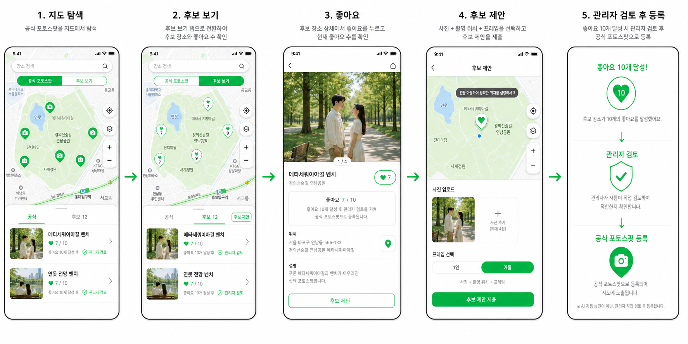

# Candidate Photo Spot Flow

## Flow

1. 사용자는 기본 지도에서 공식 포토스팟을 탐색한다.
2. `후보 보기`를 선택하면 좋아요 수가 표시된 후보 포토스팟을 본다.
3. 후보 상세에서 좋아요를 누르고, 좋아요 진행 상태를 확인한다.
4. 로그인 사용자는 촬영 위치, 사진, 1인 또는 커플 프레임을 선택해 후보를 제안한다.
5. 후보가 좋아요 10개에 도달하면 관리자 검토를 거친 뒤 공식 포토스팟으로 등록한다.

AI 자동 승인은 MVP 범위에 포함하지 않는다. 승인과 반려는 관리자만 처리한다.
