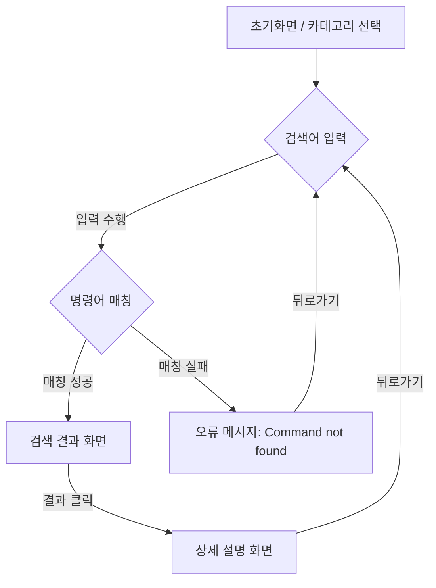

# 프로젝트 기획서: 유닉스 & Git 명령어 사전 (C-Dict)

## 1. 문제 정의 및 발견 (Problem & Observation)
*   **문제 상황:** 초심자가 터미널 환경과 파편화된 영어 매뉴얼 사이에서 학습의 연속성을 잃고, 번역과 정보 탐색 과정에서 인지적 피로를 느끼며 실습 흐름이 단절됨.
*   **관찰:** 단순 암기 위주의 환경은 비전공자에게 높은 진입장벽이 되며, 팀 내 지식 격차로 인한 소통의 병목 현상을 유발함.
*   **해결 목표:** 한국어로 정제된 정보와 직관적인 실무 예시를 제공하여 언어 장벽을 없애고, 실습 생산성을 극대화하는 웹 기반 명령어 사전 구축.

핵심 설계 방향은 다음과 같다.
- **가볍게**: 백엔드·DB·외부 API 없이 순수 프론트엔드로만 동작한다. 명령어 데이터는 정적 JS 배열(`src/data/commands.js`)에 저장한다. 배포와 유지보수가 단순해지고, 실습실 어디서든 바로 열어볼 수 있다.
- **익숙하게**: 우분투 터미널을 흉내 낸 화면(터미널 창 프레임, 컬러 프롬프트, 깜빡이는 커서) 안에서 동작한다. 실제 터미널을 쓰는 감각 그대로 명령어를 찾게 해서, "사전을 본다"기보다 "터미널을 연습한다"는 느낌을 주는 것이 목표다.
- **빠르게**: 카테고리를 고르고 → 검색어를 입력하면 즉시 필터링되고 → 클릭하면 상세 설명이 나오는 3단계 흐름으로, 원하는 명령어까지 최단 경로로 도달한다.

## 2. 사용자 시나리오 (User Scenario)
1. 사용자가 터미널에서 실습 중 낯선 명령어/옵션을 마주하여 작업이 중단됨.
2. C-Dict에 접속하여 해당 명령어를 검색함.
3. 한국어 설명과 실무 예시를 통해 원리와 활용법을 빠르게 이해함.
4. 터미널로 돌아가 실습을 재개함.

## 3. 개발 경과 요약 (타임라인)

| 날짜 | 커밋 | 내용 |
|---|---|---|
| 07-06 | `cd35a45` | React 환경설정 및 프로젝트 주제 소개 |
| 07-07 | `df5d771` | "유닉스 & Git 명령어 사전"으로 주제 확정, 핵심 기능(카테고리 목록/실시간 필터링/상세보기/터미널 콘솔 UI) 구현 |
| 07-08 10:41 | `7d61260` | Unix/Git 필수 명령어 데이터 대량 보강 |
| 07-08 10:48 | `912e61b` | 권한 관련 명령어(sudo, su) 추가 |
| 07-08 11:03 | `ffa543b` | chmod 권한 표기법(rwx/2진수/8진수) 설명 보강 및 옵션 표로 정리 |
| 07-08 11:08 | `b367e9b` | gcc 컴파일러 명령어 추가 |
| 07-08 11:12 | `32668ae` | 압축 관련 명령어(tar, gzip) 추가 |
| 07-08 11:29 | `f55344d` | 파비콘을 터미널 스타일로 변경, 카테고리 뱃지 제거 |

## 4. 핵심 기능 (Core Features)

**기능 A: 실시간 필터링 (Live Filtering)** — ✅ 구현 완료 (`df5d771`, [상세 체크리스트](./checklist.md) 참고)
*   입력 즉시 이름/요약/설명 필터링 및 결과 갱신.
*   모든 입력은 소문자로 강제 변환하여 처리.
*   매칭 실패 시 터미널 고증 에러(`command not found`) 출력.

**기능 B: 클립보드 복사 (Copy to Clipboard)** — 🚧 미완성
*   상세 페이지 내 예시 명령어 클릭 시 즉시 클립보드 복사.
*   동료 피드백 목록 항목은 아니며, 사용자 아이디어와 Agent 제안이 겹쳐 결정된 기능. 스코프는 복사 버튼 추가 정도로 작게 잡는다.

**그 외 핵심 기능**
*   **카테고리별 명령어 목록** — 첫 화면에서 Unix / Git 두 카테고리 중 하나를 골라 진입. 학습 맥락이 다르므로(쉘 조작 vs 버전 관리) 처음부터 탐색 범위를 분리.
*   **명령어 상세 보기** — 설명 + 주요 옵션 + 터미널 실행 예시 제공. chmod처럼 개념 이해가 필요한 명령어는 권한 표기법 설명과 옵션 표까지 제공(`ffa543b`).
*   **터미널 콘솔 UI** — 전체 앱이 우분투 터미널 창 프레임 안에서 렌더링. 컬러 프롬프트(`user@host:~$`)와 깜빡이는 커서로 실제 터미널 느낌 연출.

## 5. 화면 흐름 (User Flow)


```
/                → 카테고리 선택 (Unix / Git)
/unix, /git      → 검색창 표시 → 입력 즉시 실시간 필터링
/commands/:id    → 명령어 상세 (설명 + 주요 옵션 + 터미널 예시)
```

## 6. 데이터 명세 (Data Schema)
`src/data/commands.js`은 다음 구조를 준수함:

```js
{
  id: 'unix-grep',            // URL에 그대로 쓰이는 고유 id
  category: 'unix',           // 'unix' | 'git'
  name: 'grep',
  summary: '한 줄 요약',
  description: '자세한 설명',
  options: { flag: '-i', desc: '옵션 설명' },
  examples: { command: '실행 예시', desc: '예시 설명' },
}
```

**DB 전환 방향 (결정, 컬럼 상세 미정):** Supabase 이전 시 `category`는 별도 `categories` 테이블로 분리한다(현재 배열+`CATEGORY_LABELS` 이중 관리 구조 해소, 카테고리 확장 예정과도 맞음). `options`/`examples`는 항상 부모 명령어와 함께만 조회되고 독립 쿼리 요구가 없어, 정규화 대신 JSONB 컬럼으로 유지한다. 실제 컬럼 목록/타입은 아직 확정 전.

## 7. 기술 스택 (Technical Standards)

| 영역 | 사용 기술 | 상태 | 비고 |
| --- | --- | --- | --- |
| 프레임워크 | React 19 | 적용됨 | 함수형 컴포넌트 + Hooks 사용 |
| 빌드 도구 | Vite | 적용됨 | 개발 서버(HMR) 및 프로덕션 빌드 |
| 라우팅 | react-router-dom v7 | 적용됨 | `BrowserRouter` + 레이아웃 라우트(`Outlet`) |
| 스타일 | Plain CSS | 적용됨 | 별도 UI 라이브러리 없이 CSS 변수로 팔레트 관리 |
| 데이터 | 정적 JS 배열 (`src/data/commands.js`) | 적용됨 | 백엔드/DB 없이 프론트엔드에서 직접 필터링 |
| 상태 관리 | React 로컬 상태 | 적용됨 | 전역 상태 관리 라이브러리 없음 |
| 백엔드(WAS) | Node.js + Express | Phase 2 예정 | AI 챗봇 API 연동부터 도입, FE와 동일한 JS 생태계 유지 |
| 데이터베이스 | Supabase (PostgreSQL) | Phase 2 예정 | 무료 티어, 매니지드 Postgres라 서버리스 배포 환경에서도 데이터 영속성 보장 |
| 배포(FE) | Vercel 또는 Netlify | 예정 | git push 연동 자동배포 |
| 배포(BE) | Render 또는 Railway | Phase 2 예정 | Express 서버 무료 호스팅 |
| 검색엔진 | Meilisearch (Cloud) | Phase 2 예정 | 기능 A(클라이언트 단순 필터링)를 대체할 실제 검색엔진으로 확정. 오타 허용/즉시 검색 지원, Elasticsearch 대비 설정이 단순해 선택. Express가 API 키를 숨기고 검색 요청을 프록시 |

초기 기획 당시(정적 사전 스코프)에는 프로젝트 규모에 비해 과한 의존성을 들이지 않는 것이 원칙이었다 — 검색은 배열 필터링으로 충분하고, 상태도 페이지 단위 로컬 상태로 관리 가능하다고 봤다. 다만 이는 아이디어/API 선정이 아직 두루뭉술했던 기획 초기 판단이었고, 이후 기술스택 확장을 실제로 진행하면서는 유지되지 않았다. 로드맵 Phase 2(10장 5번 피드백: AI 챗봇 API 연동)부터는 브라우저에 API 키를 노출할 수 없어 BE 없이는 구현 자체가 불가능했고, 이어서 검색 기능도 단순 배열 필터링의 한계(오타 허용/실제 검색엔진 기능 부재)를 넘어서기 위해 Meilisearch 도입을 확정하면서, 이 시점부터 백엔드/DB/검색엔진을 예외가 아니라 필수 확장으로 추가한다.

**우선 API 후보:** `POST /api/chat` — 명령어 상세 페이지에서 질문을 받아 서버가 외부 LLM API를 대신 호출(API 키는 서버 환경변수로 관리)하고 답변을 가공해 반환한다.

**프로젝트 구조**
```
src/
├── App.jsx                        # 라우터 설정
├── data/commands.js                # 명령어 데이터 (유닉스/git)
├── components/
│   ├── TerminalFrame.jsx           # 터미널 창 레이아웃 (Outlet)
│   └── CommandCard.jsx             # 목록 카드
└── pages/
    ├── CategoryHomePage.jsx        # 카테고리 선택 화면
    ├── CommandListPage.jsx         # 검색 + 결과 목록 화면
    └── CommandDetailPage.jsx       # 명령어 상세 화면
```

## 8. 명령어 커버리지 현황

현재 총 **49개** 명령어를 수록하고 있다 (Unix 28개, Git 21개).

### Unix (28개)

| 분류 | 명령어 |
|---|---|
| 파일/디렉토리 탐색 | ls, cd, pwd, find |
| 파일/디렉토리 조작 | mkdir, rm, cp, mv, touch |
| 파일 내용 보기 | cat, head, tail, less, wc, grep |
| 권한 | chmod, chown, sudo, su |
| 프로세스/시스템 | ps, kill, df, history |
| 기타 유틸 | man, echo |
| 컴파일 | gcc |
| 압축 | tar, gzip |

### Git (21개)

| 분류 | 명령어 |
|---|---|
| 저장소 생성/연결 | git init, git clone, git remote, git config |
| 기본 워크플로 | git add, git commit, git status, git diff, git log |
| 브랜치 | git branch, git checkout, git merge, git rebase |
| 원격 동기화 | git push, git pull, git fetch |
| 되돌리기/임시저장 | git reset, git revert, git stash, git cherry-pick |
| 태그 | git tag |

## 9. UI/디자인 결정 사항

- **터미널 프레임 컨셉 채택** — 앱 전체를 우분투 터미널 창 안에 담는다. 대상 사용자(CS 실습 대학생)가 결국 터미널에 익숙해져야 하므로, UI 자체가 학습 맥락을 강화하도록 했다.
- **파비콘 터미널 스타일 변경** (`f55344d`) — 브라우저 탭에서도 "터미널 도구"라는 정체성이 드러나도록 파비콘을 터미널 스타일로 교체했다.
- **카테고리 뱃지 제거** (`f55344d`) — 검색 결과 목록에서 카테고리 뱃지를 제거했다. 이미 카테고리를 선택하고 진입한 화면에서는 뱃지가 중복 정보이고, 터미널 특유의 담백한 텍스트 화면을 해친다고 판단했다.
- **`command not found` 에러 연출** — 검색 결과가 없을 때 일반적인 "결과 없음" 대신 실제 터미널 에러 메시지를 흉내 냈다. 컨셉 일관성을 위한 결정.

## 10. 동료 피드백 반영 방향

**프로토타입:** [순수 HTML/CSS 프로토타입 (docs/prototype/index.html)](./prototype/index.html) — 핵심 기능(기능 A: 실시간 필터링)의 화면 흐름(카테고리 선택 → 검색/결과 → 상세보기 → 에러 상태)을 정적 HTML/CSS 4장으로 재현했다. GitHub 웹에서는 이 링크가 렌더링된 화면이 아니라 소스 코드로 보이므로, 실제 동작하는 화면을 보려면 리포지토리를 로컬로 클론한 뒤 `docs/prototype/index.html`을 브라우저로 직접 열어야 한다. GitHub에서 바로 확인 가능한 버전은 [동작 화면 PDF 리포트 (docs/prototype-report.pdf)](./prototype-report.pdf)이며, GitHub이 PDF는 자체 뷰어로 미리보기를 지원한다. 아래 동료 피드백은 이 프로토타입이 아니라 React+Vite로 구현된 실제 동작 화면을 화면 공유로 시연해 받은 것이며, 프로토타입은 산출물 형식 요건에 맞춰 사후에 별도 제작했다.

동료 피드백 6건을 받았고, 각각의 반영 상태를 아래와 같이 구분한다.

1. **상세설명 내 상황별 명령어 링크 연결** — [실행 후보]
   명령어 상세 페이지에서 "이 상황이면 이 명령어도 필요" 식으로 관련 명령어를 링크로 연결하는 기능. 데이터 구조에 관련 명령어 id 배열만 추가하면 되어 구현 부담이 작고 학습 효과가 커서 우선 실행 후보.

2. **저장소(GitHub) 링크 추가** — [확인 필요]
   앱 안에 GitHub 저장소 링크를 넣자는 제안인데, 의도가 아직 불확실하다. 제안자에게 의도를 재확인한 뒤 진행 여부를 결정한다.

3. **명령어 추가** — [논의 필요]
   더 많은 명령어를 넣자는 방향성 제안. 구체 목록이 없어 후보 목록을 먼저 정리하고 논의가 필요하다.

4. **재미요소 추가** — [아이디어 단계]
   이스터에그, 애니메이션, 게임화 등 예시만 언급된 상태로 형태가 정해지지 않았다. 구체안이 나오기 전까지는 아이디어 풀에 보관한다.

5. **AI 챗봇 API 연동** — [실행 후보]
   현재 정적인 터미널 UI에 챗봇을 연결해서, 명령어 상세 설명에 대한 추가 설명을 실시간으로 제공하는 도구/API로 활용하자는 제안.

6. **C/Python 명령어 추가** — [보류 — 스코프 아웃]
   프로젝트 본래 취지(Unix/Git 실습 명령어 사전)에서 벗어나고 작업량도 크게 늘어난다는 우려로 사용자가 직접 보류를 판단했다.

## 11. 향후 확장 로드맵 (Roadmap)

**[Phase 1] 필수 학습 환경 최적화 (기반 구축)**
* 상황별 큐레이션: 과제 제출, 권한 오류 등 실습 시나리오별 명령어 묶음(Tagging) 제공. *(→ 10장 1번 피드백과 연계)*
* 태그 기반 시스템: [필수], [기초], [과제] 등 태그 시스템을 통해 중요도 및 성격 분류.
* 중요도 시각화: 사용 빈도 및 필수성 데이터를 기반으로 한 명령어 중요도 우선순위 표기.

**[Phase 2] 지능형 학습 플랫폼 도약 (인터랙티브 기능)**
* AI 챗봇 연동: 명령어 예시 문맥을 활용한 즉각적인 질의응답 기능 도입. *(→ 10장 5번 피드백과 연계)*
* 사용자 제안 명령어: 사용자가 직접 유용한 명령어와 예시를 제안/공유하는 커뮤니티형 데이터 확장. *(→ 10장 3번 피드백과 연계 가능)*
* 학습 게이미피케이션: 명령어 숙달을 돕는 퀴즈 및 재미 요소 추가. *(→ 10장 4번 피드백과 연계)*

**[Phase 3] 실행 환경 확장 (미래 로드맵)**
* 가상 셸 연동: 클라우드 인프라를 활용한 브라우저 기반 명령어 실행 환경 및 실습 도구 구축.

## 12. 기능적/비기능적 요소 정리

11장 로드맵과 `docs/tasks.md`/`docs/checklist.md`의 백로그 항목들을 "무엇을 하는가(기능적)"와 "얼마나 잘 하는가(비기능적, 여러 기능에 공통으로 걸리는 품질 기준)"로 나눠 정리한다.

**기능적 요소 (Functional) — 후보 목록**

AI 챗봇 Q&A, 상황별 명령어 묶음(시나리오 큐레이션), 사용자 기여함(명령어 제안/제보) + 모더레이션, 로그인/계정 시스템, 즐겨찾기, 학습 진행률, 사용 데이터 기반 추천 엔진, 검색 실패 로그, 조회수 집계, 관련 명령어 링크, 셸 연동 CLI `kman`. 각 항목의 상세/우선순위/상태는 `docs/tasks.md`, `docs/checklist.md` 참고.

**비기능적 요소 (Non-functional) — 기능 전반에 적용되는 기준**

| 항목 | 이 프로젝트에서의 구체적 의미 |
|---|---|
| 보안 | API 키 서버사이드 보관(7장), 로그인 도입 시 비밀번호/세션 처리, 사용자 기여함의 악성 입력(스팸/XSS) 방지 |
| 가용성/폴백 | 백엔드(챗봇/DB)가 다운되거나 무료 티어 한도를 넘어도 핵심 기능(정적 사전 조회)은 계속 동작해야 함(graceful degradation) |
| 성능 | 실시간 필터링 응답속도(구현됨), 챗봇 API 응답 지연, 추천 엔진 집계 쿼리 성능 |
| 접근성/사용성 | 기존에 반영된 기준(aria-hidden, 한글 에러 메시지, 폰트 폴백) 유지 |
| 유지보수성 | 커밋 컨벤션, `CLAUDE.md` 문서화, `design-check` Skill로 디자인 일관성 검증 |
| 비용/운영 제약 | Supabase/Vercel/Render 무료 티어 한도 내 운영(7장에서 스택 선정 이유이기도 함) |
