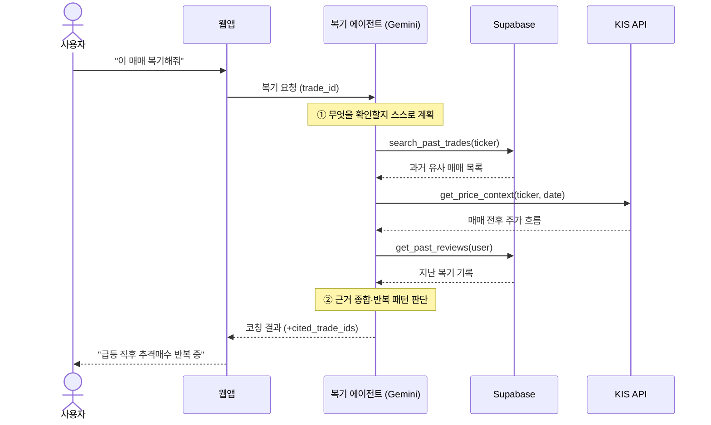
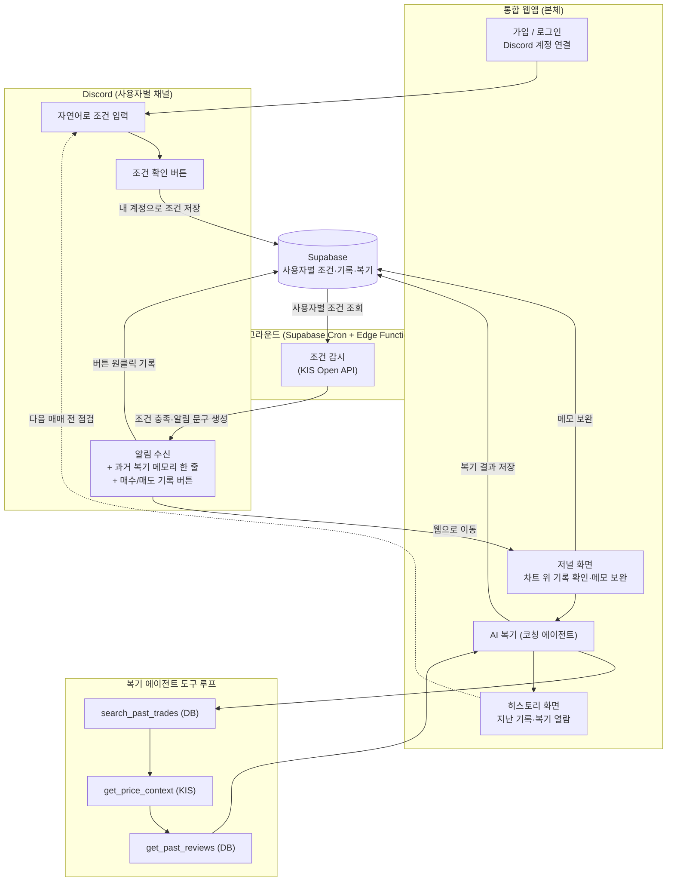
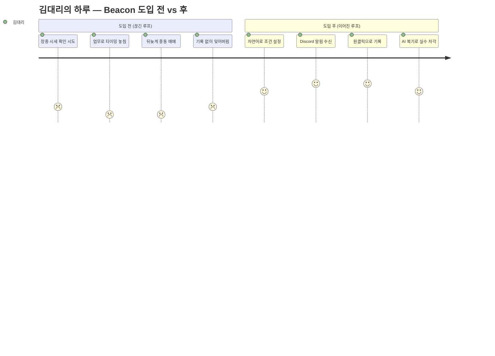
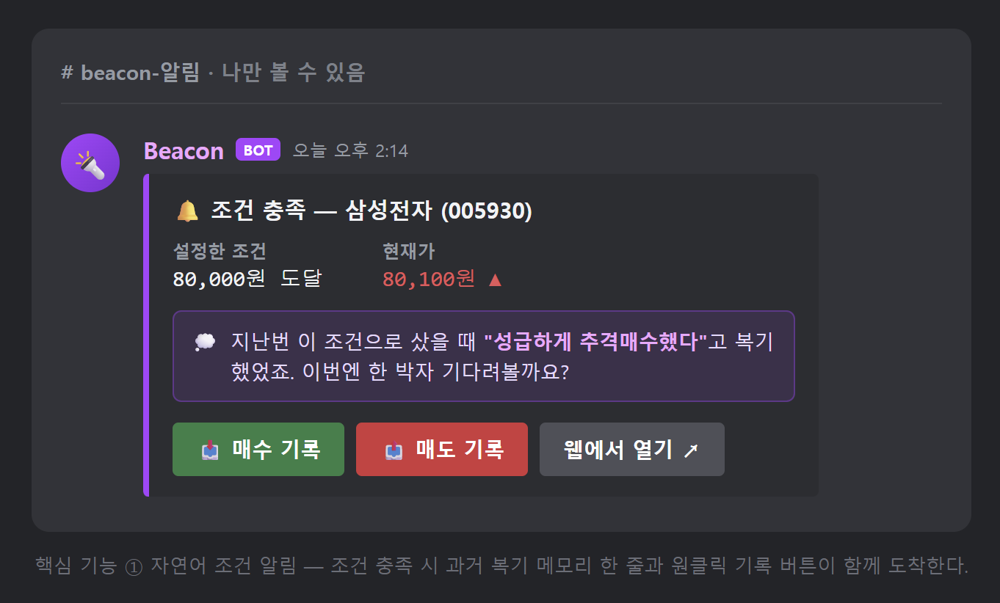
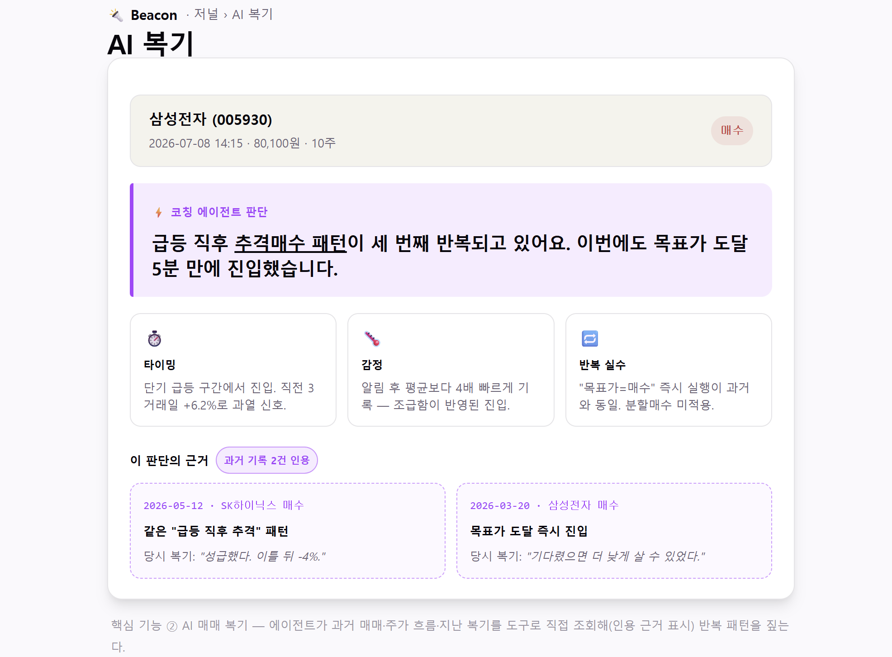
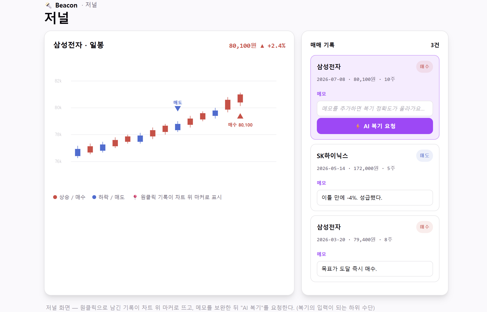

# Beacon 기획서

> 말을 걸면 지켜보고, **내 기록을 기억해 코치하는** AI 투자 에이전트

## 1. 한 줄 요약 & 문제 정의

**Beacon = 당신을 대신해 시장을 지켜보고, 매매할 때마다 당신의 과거 기록을 근거로 코치하는 에이전트.**

기존 두 프로젝트를 하나의 서비스로 결합한다.

- [KIS_openapi](https://github.com/gyuwonlee1/KIS_openapi) — 자연어로 조건을 걸면 KIS Open API로 시장을 감시해 Discord로 알려주는 알림 봇 (감시하는 눈)
- [investment_journal](https://github.com/gyuwonlee1/investment_journal) — 매매 기록을 차트 위에 남기고 AI가 리스크를 복기해 주는 저널 (복기하는 코치)

**문제**: 개인 투자자가 장중에 시세를 계속 지켜볼 수 없어 매매 타이밍을 놓치고, 매매 후에는 판단 근거를 남기지 않아 같은 실수를 반복한다.

- 알림 도구와 복기 저널은 각각 존재하지만, **신호를 받고 → 실행하고 → 되돌아보는 과정이 끊겨 있어** 매매가 학습으로 이어지지 않는다.
- 특히 "지난번에도 이랬는데"를 아무도 기억해 주지 않는다. 기록은 흩어지고, 다음 매매 순간엔 이미 잊혀 있다.

## 2. 타겟 페르소나

**낮에 업무·수업으로 장중을 못 보고, 복기 습관이 없는 20~30대 투자자.**

- **직장인 김대리(31)**: 회의·업무 중이라 장중 시세를 못 본다. 목표가를 놓치거나 뒤늦게 보고 충동 매매. 노션에 일지를 만들었지만 손이 많이 가 3일 만에 그만뒀다.
- **대학생 이OO(23)**: 수업 중 시세를 못 본다. 투자 경험이 짧아 소액·감정 매매가 잦고, 왜 샀는지 기록이 없어 같은 실수를 반복한다.

공통 고통 → 핵심 기능이 1:1로 대응:

| 고통 | 대응 기능 |
|------|-----------|
| 장중을 못 봐 타이밍을 놓친다 | ① 자연어 조건 알림 |
| 판단 근거를 안 남겨 실수를 반복한다 | ② AI 매매 복기 (코칭 에이전트) |
| 일지 앱은 손이 많이 가 버려진다 | 알림 원클릭 기록으로 마찰 제거 |

## 3. 차별점 — 왜 기존 대안으로 안 되나

**메인 헤드라인: "내 기록을 기억하는 코치."**

| 대안 | 지켜봄 | 원클릭 기록 | AI 복기 | 내 기록 기억 |
|------|:---:|:---:|:---:|:---:|
| 증권사 앱 알림 | ✅ | ❌ | ❌ | ❌ |
| 노션 / 엑셀 일지 | ❌ | ❌ | ❌ | ⚠️ 수동 |
| TradingView 알림 | ✅ | ❌ | ❌ | ❌ |
| ChatGPT로 복기 | ❌ | ❌ | ✅ | ❌ |
| **Beacon** | ✅ | ✅ | ✅ | ✅ |

- **증권사 알림**은 울리고 끝 — 복기가 없다.
- **일지 앱**은 손이 많이 가 버려진다 — 시장을 대신 봐 주지도 않는다.
- **ChatGPT 복기**는 내 매매 기록과 실시간 시세에 접근하지 못한다.

**쐐기(wedge)**: Beacon은 감시·기록·복기를 **하나의 계정·하나의 기억으로 잇고**, 알림의 원클릭 기록으로 마찰을 없애 "감시→기록→복기" 루프가 끊기지 않게 한다.

## 4. 솔루션 개요 & 에이전트다움

두 서비스를 병렬로 두지 않고 하나의 통합 웹앱으로 합친다.

- **통합 웹앱 (본체)**: 저널 차트, 매매 기록, AI 복기, 조건 관리 화면
- **Discord (채널)**: 자연어 조건 입력과 알림 수신. 알림 메시지에 **매수/매도 기록 버튼**을 달아 원클릭으로 저널에 기록 (가격·시각 자동 저장, 메모는 웹에서 보완)
- **백그라운드 감시**: KIS Open API 조건 감시는 스케줄러(Supabase Cron)가 담당
- **Supabase (공유 데이터 계층)**: 조건·매매 기록·복기 결과를 사용자별로 저장하는 단일 저장소

### 왜 "에이전트"인가

단순 LLM 호출(1-shot 변환)이나 크론이 아니라, **복기를 코칭 에이전트로** 만든다. 에이전트다움의 3요소가 여기에 들어간다:

1. **스스로 계획** — "이 매매를 복기하라"는 요청을 받으면 무엇을 확인할지 스스로 정한다.
2. **도구 사용** — DB에서 과거 유사 매매를 검색하고(`search_past_trades`), KIS로 그 매매 전후 주가 흐름을 조회하고(`get_price_context`), 지난 복기 기록을 불러온다(`get_past_reviews`).
3. **다단계 판단** — 수집한 근거를 대조해 "당신은 급등 직후 추격매수를 반복 중"처럼 패턴을 짚는다.

여기에 **얕은 메모리 연결**을 더한다: 감시는 스케줄러가 하되, **알림 문구를 에이전트가 생성**하면서 관련 과거 복기 한 줄을 붙여 능동 개입한다 — *"지난번 이 조건으로 샀을 때 성급했다고 복기했었죠. 이번엔?"*

아래는 복기 요청 한 번에 에이전트가 **여러 도구를 스스로 호출해** 근거를 모으고 판단하는 과정이다 (1-shot 호출과의 결정적 차이).



### 다중 사용자 구조

- **계정**: Supabase Auth로 가입/로그인. 모든 테이블에 Row Level Security 적용
- **Discord 연결**: 웹에서 사용자별로 자신의 Discord 계정을 연결(계정 연동 + 알림 채널 등록)
- **데이터 공유**: Discord로 건 조건 → Supabase에 내 계정으로 저장 → 감시가 사용자별 조건을 읽어 각자의 Discord로 알림 → 알림 버튼으로 남긴 매매 기록·AI 복기도 같은 계정에 쌓인다

### 구현 단계

기능 욕심을 줄이기 위해 구현은 두 단계로 나눈다. 기획은 다중 사용자 구조를 전제로 하되, 1단계에서 전체 루프를 먼저 완성한다.

- **1단계 (MVP · 1인용)**: 통합 웹앱 + 자연어 조건 알림 + 원클릭 기록 + AI 복기 코칭 에이전트. 내 계정 하나 기준으로 감시 → 기록 → 복기 루프를 끝까지 돌린다. 조건 저장소는 처음부터 Supabase를 사용해 2단계 전환 비용을 줄인다
- **2단계 (다중 사용자)**: Supabase Auth·RLS 적용, 사용자별 Discord 연결과 알림 발송으로 확장

## 5. 핵심 기능 (우선순위)

MoSCoW로 우선순위를 명시한다.

### Must — 1단계에서 반드시 (핵심 2개)

**① 자연어 조건 알림**
평소 말투로 조건을 걸면 KIS Open API로 국내·미국 시장을 감시하다 조건 충족 시 Discord로 알림.
- **필수성**: 이게 없으면 "지켜봐 주는" 서비스가 성립하지 않는다 — 시나리오의 출발점
- **적합성**: "시세를 계속 지켜볼 수 없어 타이밍을 놓친다"는 문제의 앞부분을 직접 해결

**② AI 매매 복기 (코칭 에이전트)**
차트 위에 남긴 매매 기록을 에이전트가 도구를 써서 다단계로 분석해 진입 타이밍, 감정적 판단, 반복되는 실수 패턴을 피드백.
- **필수성**: 이게 없으면 알림 봇에 그친다 — "되돌아보게 한다"는 차별점의 본체이자 에이전트성의 본체
- **적합성**: "판단 근거를 남기지 않아 같은 실수를 반복한다"는 문제의 뒷부분을 직접 해결

> 매매 기록(저널링)은 복기의 입력이 되는 하위 수단으로 ②에 포함한다. 기록이 끊기면 복기도 없으므로, Discord 알림의 매수/매도 버튼으로 원클릭 기록해 마찰을 최소화한다.

### Should — 있으면 좋음 (여유 시)

- 알림 문구에 **과거 복기 메모리 한 줄 연결** (능동 개입) — 에이전트성을 가장 잘 보여주지만, 없어도 루프는 성립
- 복기 결과를 차트 위 마커에 함께 표시

### Could — 여력 있을 때

- 조건 종류 확장 (거래량·이동평균 조합 등)
- 복기 결과 요약 리포트(주간)

### Won't (이번 범위 밖) — 9번 참고

## 6. 사용자 시나리오 & 화면 흐름

1. 웹에서 가입하고 내 Discord 계정을 연결한다
2. Discord에 "삼성전자가 8만 원이 되면 알려줘"라고 입력하고 버튼으로 조건을 확정한다
3. 목표가에 도달하면 내 Discord로 알림이 온다 (관련 과거 복기가 있으면 한 줄 함께)
4. 알림의 매수/매도 버튼을 눌러 원클릭으로 기록하고, 웹 저널에서 메모를 보완한다
5. "AI 복기"를 누르면 에이전트가 과거 매매·주가 흐름·지난 복기를 끌어와 타이밍·감정·반복 실수를 짚어준다
6. 다음 매매 전, 지난 기록과 복기를 다시 본다



### 페르소나 여정 (도입 전후)

같은 하루를 Beacon 도입 전후로 비교하면, 끊겨 있던 루프가 이어지며 만족도가 올라간다. (1=최악 … 5=최상)



### 화면 설계 (UI 목업)

초기 핵심 화면 3종의 자가완결형 HTML/CSS 목업을 제작해 브랜드 토큰([src/index.css](../src/index.css))의 기반으로 사용했다. 목업 소스는 단일 앱 구조 정리 과정에서 삭제했다.

**① Discord 알림 메시지** — 조건 충족 시 과거 복기 메모리 한 줄 + 원클릭 기록 버튼이 함께 도착.



**② AI 복기 결과** — 에이전트가 과거 매매·주가 흐름·지난 복기를 도구로 조회해(인용 근거 표시) 반복 패턴을 짚음.



**③ 저널** — 원클릭 기록이 차트 위 마커로 표시되고, 메모 보완 후 AI 복기를 요청.



> 이미지가 안 보이면 아직 스크린샷 미첨부 상태다. 캡처 방법은 [docs/images/README.md](images/README.md) 참고.

## 7. 기술 아키텍처

**스택 (전부 무료 티어 기준)**

| 층 | 선택 | 이유 |
|----|------|------|
| 웹(프론트) | **Vite + React SPA** | React 최대 활용, 가벼움. 프로토타입은 정적 HTML/CSS로 핵심 흐름 시연 |
| 백엔드 로직 | **Supabase Edge Functions (Deno)** | Discord 인터랙션(버튼), KIS 폴링, 에이전트 실행 |
| DB / Auth | **Supabase (Postgres)** | 조건·기록·복기 단일 저장소. 1단계 단일 사용자, 2단계 Auth+RLS |
| 감시 스케줄 | **Supabase Cron (pg_cron + pg_net)** | 최소 1초 주기, 지연 적음, Supabase 통합, 무료 |
| LLM | **Gemini Flash** | 무료 1,500 req/day·카드 불필요·function calling·structured output·1M 컨텍스트 |
| 외부 API | **KIS Open API, Discord** | 시세 조회 / 자연어 입력·알림 |

> **구축 방식**: 원본 두 레포(KIS_openapi, investment_journal)의 아키텍처·로직을 **참고**하되, Vite+React 기반으로 **처음부터 신규 구축**한다(코드 마이그레이션 아님).

**데이터 흐름**

```
Discord 자연어
  → 파싱 에이전트 (Gemini structured output) → 확인 버튼
  → Supabase [conditions]
Supabase Cron (주기 실행)
  → [conditions] 조회 → KIS 현재가/일봉 → 조건 평가
  → 충족 시: 알림 문구 생성(+과거 복기 1줄 메모리) → Discord 알림 + 기록 버튼
Discord 버튼 원클릭
  → Supabase [trades] (가격·시각 자동)
웹앱 "AI 복기"
  → 복기 코치 에이전트 도구 루프:
       search_past_trades(DB) → get_price_context(KIS) → get_past_reviews(DB) → 종합
  → Supabase [reviews] (cited_trade_ids 포함) → 화면 표시
```

**DB 스키마 초안**

| 테이블 | 주요 컬럼 |
|--------|-----------|
| `users` | id, … |
| `discord_links` | user_id, discord_id, 알림 채널 |
| `conditions` | user_id, ticker, 조건식, 상태 |
| `trades` | user_id, ticker, side, price, ts, memo |
| `reviews` | trade_id, 내용, cited_trade_ids |

**핵심 기술 리스크 & 대응**

1. **KIS 레이트리밋 / 장운영시간** → Cron 주기 조절, 휴장 시 skip (공휴일 캘린더 자동화는 Non-goals)
2. **자연어 파싱 오류** → 저장 전 "확인 버튼"으로 사용자 검증 + structured output 스키마 강제
3. **복기 에이전트 도구 실패 / 환각** → 도구 결과를 근거로만 코칭, 인용한 `cited_trade_ids`를 저장해 검증 가능하게
4. **에이전트 프레임워크** → 1주차는 무거운 프레임워크 없이 Gemini function-calling 루프로 단순하게

## 8. 성공 지표 (KPI)

- **⭐ North Star — 끊기지 않은 루프 수**: 감시 → 원클릭 기록 → AI 복기까지 *완주한 매매 건수*. 서비스의 존재 이유를 그대로 숫자로 만든 지표.
- **핵심 보조 — 복기의 과거기록 인용률**: 복기 중 과거 매매를 1건 이상 인용한 비율 (목표 70%+) → 에이전트가 "기억한다"는 증거.
- 기타 보조: 알림 → 기록 전환율(60%+), 자연어 조건 파싱 정확도(90%+), 기록까지 1클릭 / 5초 이내.

## 9. 범위 밖 (Non-goals)

핵심 2개에 집중하기 위해 아래는 이번 범위에서 뺀다.

- 체결 내역 연동 기반 완전 자동 기록 (지금은 알림 버튼 원클릭 기록)
- 실제 주문 실행 (알림·복기 전용 유지)
- 공휴일·휴장 캘린더 자동 반영

## 10. 일정 · 마일스톤

1주차 마감 기준, 감시→기록→복기 루프를 1인용으로 완주하는 것을 목표로 한다.

| 단계 | 목표 |
|------|------|
| Day 1–2 | 프로젝트 골격(Vite+React) + Supabase 스키마 + 자연어→조건 파싱(Gemini) |
| Day 3–4 | Supabase Cron + Edge Function 감시 → KIS 평가 → Discord 알림/기록 버튼 |
| Day 5 | 원클릭 기록 → 저널·차트 표시 → 메모 보완 |
| Day 6 | 복기 코치 에이전트(도구 루프) + (여유 시) 알림 메모리 연결 |
| Day 7 | 루프 end-to-end 점검, 프로토타입 시연 정리 |
