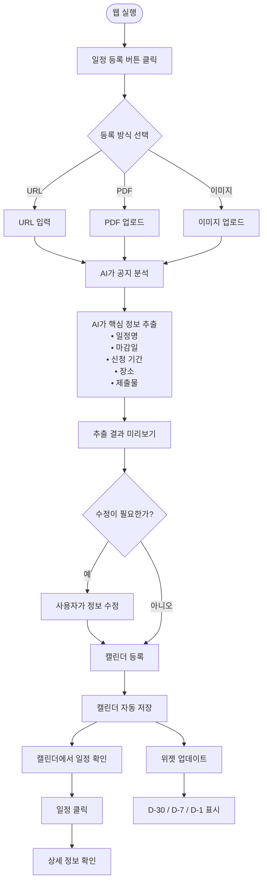

# 기획안

## 문제 정의
대학생이 여러 공지와 안내문을 확인하는 과정에서 중요한 일정과 마감일을 놓치는 불편을 겪는다.

## 사용자 시나리오
1. 사용자가 CalMe 웹사이트를 실행한다.
2. 사용자가 '일정 등록' 버튼을 클릭한다.
3. 사용자가 학교 공지, 공모전, 대외활동, 팀플 일정이 담긴 URL 또는 PDF를 업로드한다.
4. AI가 업로드된 공지를 분석하여 마감일, 신청 기간, 제출물, 일정 등 핵심 정보를 추출한다.
5. 사용자는 AI가 추출한 정보를 확인하고 '캘린더에 등록' 버튼을 누른다.
6. 일정이 앱 내 캘린더에 자동으로 등록된다.
7. 사용자가 캘린더에서 등록된 일정을 클릭하면 세부 정보와 원본 공지 요약을 확인할 수 있다.
8. 마감일이 있는 일정은 잠금화면 위젯에 D-30, D-7, D-1 등으로 표시되어 사용자가 쉽게 확인할 수 있다.

## 핵심기능 (2개)
- AI 공지 분석 및 일정 자동 추출
- AI 기반 캘린더 자동 등록

## 화면 흐름 (기획 시각화)

