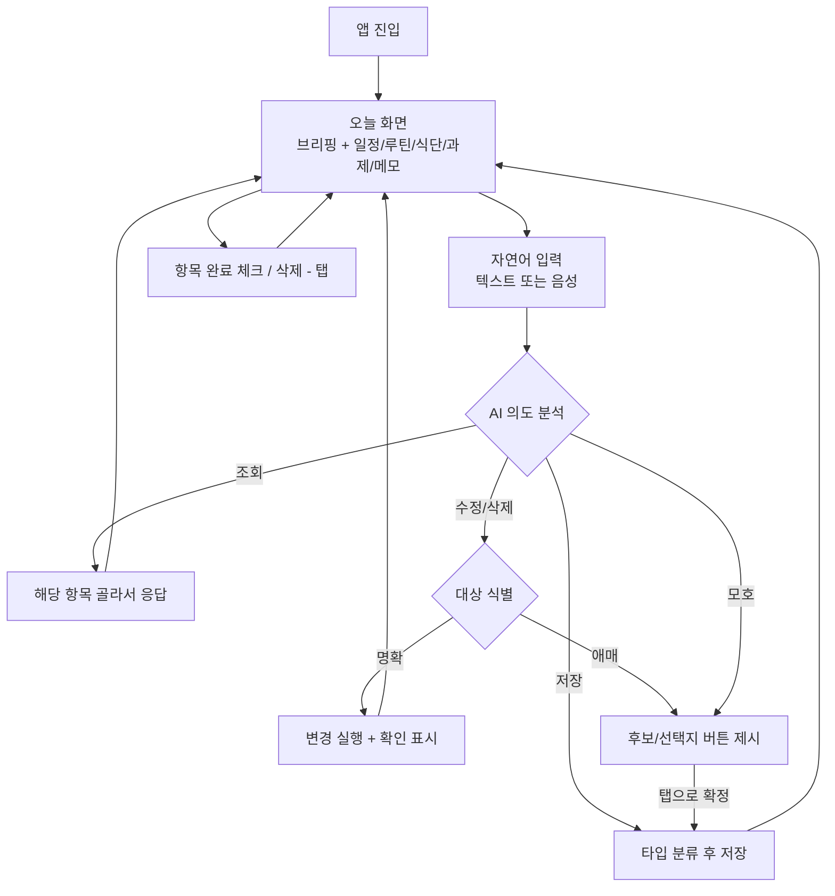

# Briefy — 자연어 라이프 매니저

> 말하듯 한 줄 적으면 정리되고, 아침이면 브리핑되는 나의 하루 관리 서비스

- **최종 목표**: 모바일 애플리케이션
- **MVP**: 모바일 화면 기준의 웹 애플리케이션 (반응형, 모바일 뷰포트 우선)

## 문제 정의

**일정·과제·루틴·식단을 관리하는 대학생이, 고정 일정은 애플 캘린더에 · 마감 과제와 메모는 리마인더에 나눠 기록하다가, 폼 입력의 번거로움과 분산 조회의 불편으로 관리 자체를 부담스러워한다.**

- 근거(본인의 실제 사용 패턴):
  - **애플 캘린더**: 고정 일정·약속을 기록하지만, 마감일·반복·알림을 폼에서 하나하나 입력해야 하는 번거로움. 운동 루틴은 시간(20:00~22:00)만 등록될 뿐 "오늘 무슨 운동(A, B)을 하는지" 내용은 조회할 수 없음
  - **애플 리마인더**: 마감일 있는 과제와 마감 없는 메모를 기록. 리마인더가 캘린더에 통합 표시되긴 하지만 결국 캘린더에서 조회해야 하고, 두 앱을 오가는 관리 자체가 번거로움
- 불편의 핵심: ① 폼 입력의 귀찮음 ② 일정/과제/루틴/식단이 흩어져 "오늘 하루"를 한눈에 볼 수 없음 ③ 루틴의 "내용"(오늘 할 운동, 오늘 식단)을 담을 곳이 없음

## 사용자 시나리오 (하루의 흐름)

1. **아침 8시**: Briefy를 열면 오늘의 브리핑이 보인다 — 오늘의 일정(오후 3시 치과), 운동 루틴(20:00~22:00 · A: 200 push-up, B: 300 squat), 영어 공부(08:00~09:00), 오늘 식단(점심: 잡곡밥과 닭가슴살 / 저녁: 삶은 달걀 3개와 샐러드), 마감 임박 과제 5개(마감일 빠른 순), 마감 없는 메모 목록. 완료 체크 전까지 하루 내내 조회할 수 있다
2. **입력할 것이 생겼을 때**: 입력창에 적거나 🎤로 말한다 — "금요일까지 팀플 자료 만들기" → AI가 마감일 있는 과제로 자동 저장 (폼 입력 없음)
3. **복합 입력**: "다음주 화요일 오후 3시 치과, 전날 알려줘" → 일정 + 리마인더가 동시에 생성된다
4. **모호한 입력**: "운동" → AI가 Claude처럼 선택지 버튼을 제시한다 — "오늘 운동 완료 기록 / 할 일 추가 / 루틴 수정" → 탭 한 번으로 확정
5. **자연어로 수정·삭제**: "치과 4시로 바꿔줘", "팀플 자료 마감 다음주로 미뤄", "샐러드 메모 지워줘" → 대상을 찾아 수정/삭제하고, 확인 메시지를 보여준다
6. **자연어로 조회**: "이번 주 마감 뭐 있어?" → 해당 항목만 골라 보여준다
7. **저녁**: 운동을 끝내고 "오늘 운동 다 함"이라고 말하면 루틴이 완료 체크된다
8. **다음 날 아침**: 새로 쌓인 항목까지 반영된 브리핑으로 하루를 시작한다

## 핵심 기능 (2개)

### 기능 A. 자연어 대화형 관리 — 저장·조회·수정·삭제(CRUD)

사람이 폼 대신 **자연어(텍스트/음성)** 로 일정을 관리한다. 생성형 AI와 대화하듯이.

- **저장**: 입력 문장에서 의도(일정/과제/메모/루틴/식단)와 속성(제목, 날짜·시간, 마감일, 반복, 리마인더)을 JSON으로 파싱해 저장. 상대 날짜("내일", "담주 금") 자동 변환
- **조회**: "이번 주 마감 뭐 있어?" 같은 질문형 입력에 해당 항목을 골라 응답
- **수정·삭제**: "치과 4시로 바꿔", "그 메모 지워줘" → 기존 항목 중 대상을 식별해 변경. 대상이 애매하면 후보를 보여주고 고르게 함
- **되묻기**: 정보가 부족하거나 모호하면 Claude처럼 선택지 버튼을 제시 (예: "운동" → 완료 기록? 할 일? 루틴 수정?)
- **음성 입력**: 🎤 버튼 → Web Speech API(STT)로 텍스트 변환 후 동일한 파이프라인

**고른 이유**: 이 기능이 없으면 평범한 투두 앱이다(필수성). "폼 입력의 번거로움"을 정면으로 해결하며, 캘린더·리마인더가 못 하는 것이 바로 이것이다(적합성).

**MVP 내 단계** (전부 자연어 파이프라인 하나 위에서 동작):
| 단계 | 내용 | 우선순위 |
|---|---|---|
| A-1 | 저장 (파싱 → 분류 → 저장) + 되묻기 | P0 |
| A-2 | 조회 (질문형 입력 응답) | P1 |
| A-3 | 수정·삭제 (대상 식별 포함) | P1 |
| A-4 | 음성 입력 (STT) | P1 |
| A-5 | 음성 대화 (AI가 음성으로 응답, TTS) | 확장 |

### 기능 B. 오늘 브리핑 대시보드 — 하루를 한 화면에

흩어져 있던 모든 것을 **오늘 화면 하나**로 모아 보여주고, AI가 한 문단 브리핑을 생성한다.

- **오늘의 일정**: 시간순 (예: 15:00 치과)
- **오늘의 루틴**: 시간대 + 내용까지 (20:00~22:00 · 운동 A: 200 push-up / 08:00~09:00 · 영어 공부) — 캘린더가 못 보여주는 "내용" 표시
- **오늘의 식단**: 끼니별 (점심: 잡곡밥과 닭가슴살 / 저녁: 삶은 달걀 3개와 샐러드)
- **마감 임박 과제**: 마감일 빠른 순 상위 5개
- **메모**: 마감 없는 항목 목록
- **AI 브리핑**: 위 데이터를 종합한 한 문단 요약 — "오늘 마감 2개, 오후 3시 치과, 저녁 8시 운동 A예요"
- 완료 체크 전까지 하루 내내 조회 가능, 체크/삭제는 탭으로도 가능

**고른 이유**: 저장만 하고 못 보면 기록은 무의미하다(필수성). "두 앱을 오가는 분산 조회"와 "루틴 내용을 볼 곳이 없음"을 해결한다(적합성).

## 데이터 모델 (항목 타입)

| 타입 | 예시 | 주요 속성 |
|---|---|---|
| 일정 | 치과, 저녁 약속 | 날짜, 시간, 리마인더 |
| 과제(할 일) | 팀플 자료 | 마감일 |
| 메모 | 나중에 살 것 | (마감 없음) |
| 루틴 | 운동 A/B, 영어 공부 | 반복 요일, 시간대, 내용, 완료 체크 |
| 식단 | 점심/저녁 메뉴 | 날짜, 끼니, 내용 |

AI 파서는 입력 문장을 이 5개 타입 중 하나로 분류한다. 분류가 애매하면 되묻는다.

## 화면 흐름

**화면 목록 (IA)**
1. **오늘 화면** — 브리핑 문단 + 섹션별 목록(일정/루틴/식단/과제 Top 5/메모) + 하단 자연어 입력 바 (메인, 사실상 유일한 화면)
2. **되묻기·응답 UI** — 입력 바 위에 말풍선/선택지 버튼으로 표시 (별도 화면 아님, 채팅형 인터랙션)

시각자료:
- 유저 플로우 (FigJam): [링크 추가]
- 와이어프레임 (Figma): https://www.figma.com/design/TUtUH2mKAznZdPoFp1AI3W

## 플랫폼 전략

- **MVP (이번 4주)**: 모바일 뷰포트 기준 반응형 웹앱. 폰 브라우저로 접속해 실사용 가능한 수준 목표. 음성 입력은 크롬 기준(Web Speech API)
- **최종 지향**: 모바일 네이티브/하이브리드 앱. MVP 검증 후 확장

## 확장 계획 (이번 범위 제외)

- 음성 **대화** (AI가 음성으로 답하는 TTS — 입력 STT는 범위 내)
- 푸시 알림 (웹 알림 인프라 — MVP에서 리마인더는 화면 내 표시까지)
- 애플 캘린더/구글 캘린더 연동 (기존 데이터 가져오기)
- 주간 리포트 (달성률 + 패턴 발견)
- 네이티브 앱 전환

## 리스크와 대비

- **범위가 커짐 (타입 5개 + CRUD)** → 전부 "자연어 파이프라인 하나 + 오늘 화면 하나" 위에 있으므로 구조는 단순함. 밀리면 A-3(수정·삭제) → 식단 → 메모 순으로 잘라내고, A-1(저장) + B(브리핑)만으로도 성립
- **수정·삭제의 대상 식별이 어려움** ("그거 지워줘") → 후보 목록을 보여주고 고르게 하는 되묻기 UX로 해결. 완벽한 식별보다 "한 번 물어보고 확정"이 안전
- **파싱 오분류** → 저장 직후 "일정으로 저장했어요 (수정하기)" 확인 표시로 즉시 정정 가능하게
- **상대 날짜 오류** → 파서 프롬프트에 오늘 날짜·요일 주입
- **음성 인식 브라우저 편차** → Web Speech API는 크롬 기준으로 시연